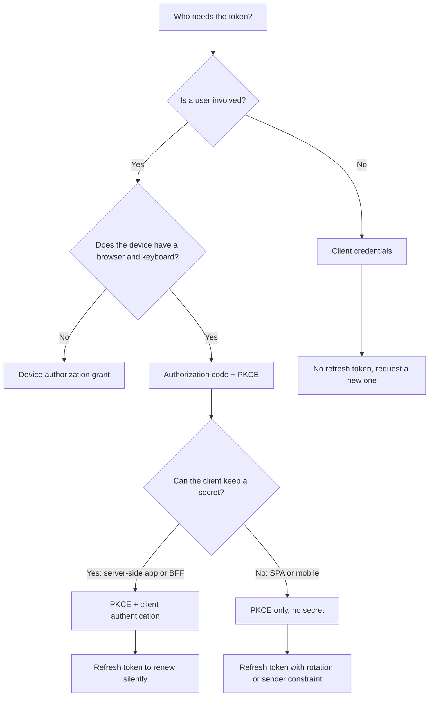
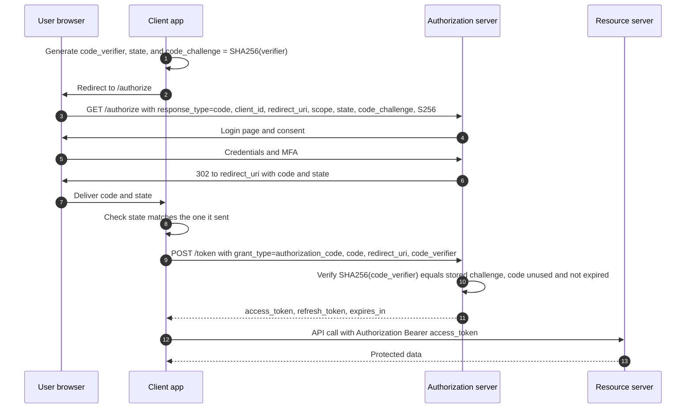
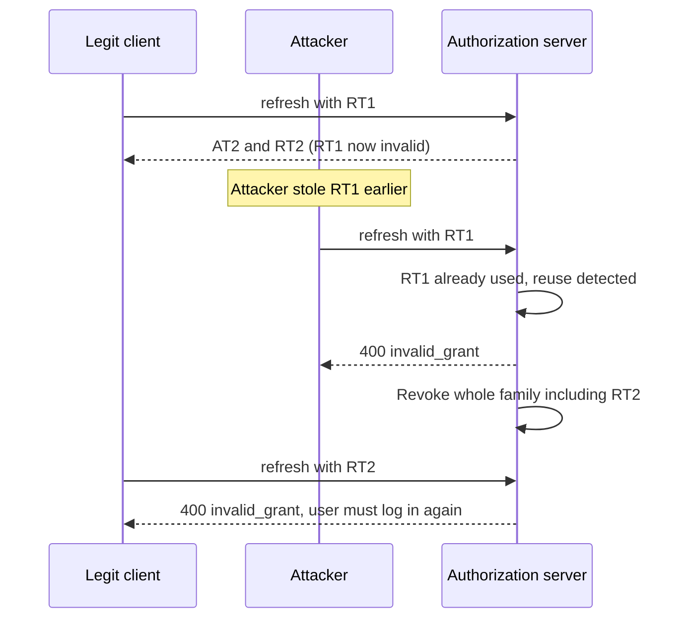

# OAuth2 Roles & Grant Types (Auth Code + PKCE, Client Credentials, Refresh Token)

!!! warning "Draft: not yet fact-checked"
    This page was written but its independent review pass has not run yet. Verify version numbers and defaults against the linked sources.


!!! abstract "TL;DR"
    - OAuth2 is a **delegated authorization** framework: a **client** gets a limited **access token** to call a **resource server** on behalf of a **resource owner**, issued by an **authorization server**. The client never sees the user's password.
    - **Authorization code + PKCE** is the grant for anything with a user (web apps, SPAs, mobile). The code travels through the browser (front channel), the tokens travel server to server (back channel), and PKCE binds the two together.
    - **Client credentials** is for machine-to-machine calls with **no user**. The token represents the application itself. There is no refresh token, the client simply asks again.
    - **Refresh tokens** let you keep access tokens short-lived (minutes) without sending the user back to log in. For public clients they must be **rotated** or **sender-constrained**.
    - **Implicit** and **password (ROPC)** grants are removed in OAuth 2.1 and forbidden by the Security BCP (RFC 9700). Saying "we used implicit for the SPA" in 2026 is a red flag.

## Why it matters

Before OAuth, a third-party app that needed your data asked for your **password** and stored it. That gave the app full access, with no expiry, no scope limit and no way to revoke one app without changing the password for everything. OAuth2 (RFC 6749, 2012) replaced the shared password with a **token** that is limited in scope, limited in time and revocable per client.

Inside an enterprise the same idea solves a different problem: dozens of microservices and UIs must trust **one** identity system (PingFederate, Entra ID, Okta, Keycloak) instead of each handling credentials. Every "secure API" on a modern Java resume is really a resource server validating tokens that some grant type produced. Interviewers therefore use grant types as the entry point: "which flow did your React app use, and why not another one?" The follow-ups then go into PKCE, token storage, refresh rotation and service-to-service calls.

OAuth2 is about **authorization** (what the client may do). It says nothing about who the user is. That is the job of OpenID Connect, covered in [06-openid-connect-id-token-userinfo-discovery.md](06-openid-connect-id-token-userinfo-discovery.md).

## Core concepts

### The four roles

| Role | What it is | Example in an enterprise healthcare app |
|---|---|---|
| **Resource owner** | The entity that owns the data and can grant access. Usually the end user. | A member or a pharmacy agent |
| **Client** | The application that wants access. It is *not* the user and *not* the browser itself. | The React SPA, a BFF, or another microservice |
| **Authorization server (AS)** | Authenticates the resource owner, gets consent, issues tokens. | PingFederate, Entra ID, Okta, Keycloak, Spring Authorization Server |
| **Resource server (RS)** | The API that holds the data and accepts access tokens. | A Spring Boot GraphQL or REST service |

Two things interviewers probe here:

- One deployable can play **two roles**. A service that receives a token (resource server) and then calls another API with its own token (client) is both.
- The AS and RS are separate roles even if one vendor ships both. The RS only needs to **validate** tokens, it never sees credentials.

### Client types: confidential vs public

This single distinction drives most grant-type decisions.

- **Confidential client:** can keep a secret. It runs on a server you control (Spring Boot app, BFF, batch job). It authenticates to the token endpoint with a client secret, a signed JWT (`private_key_jwt`) or mTLS.
- **Public client:** cannot keep a secret. A SPA's JavaScript and a mobile app binary are fully visible to the user and to an attacker. Anything "embedded" in them is not a secret.

### Endpoints and channels

- **Authorization endpoint** (`/authorize`): reached through the **browser** (front channel). The user logs in here. Output: an authorization code in a redirect.
- **Token endpoint** (`/token`): reached by a direct HTTPS `POST` from the client (back channel). Output: tokens.
- **Front channel** data passes through the browser: URL bar, history, referrer headers, extensions, proxies and logs. Treat it as observable.
- **Back channel** is a direct TLS call. It is much harder to intercept.

The whole design of the authorization code grant comes from this: **only a short-lived, single-use code goes through the front channel. Tokens only move over the back channel.**

### Tokens and scopes

- **Access token:** the credential the client presents to the resource server (`Authorization: Bearer ...`). Short-lived (typically 5 to 60 minutes). Its format is opaque to the client. It may be a JWT or a random reference string. See [04-jwt-structure-signing-validation-revocation.md](04-jwt-structure-signing-validation-revocation.md).
- **Refresh token:** a long-lived credential the client presents **only to the authorization server** to get a new access token. It is never sent to a resource server.
- **Scope:** a coarse label for what the client asked for and was granted (`claims.read`, `orders.write`). Scope limits the **client**. It does not replace per-user authorization in the API.

### Grant types at a glance

A grant type is simply "the way the client proves it deserves a token".

| Grant | Who is involved | Client type | Status |
|---|---|---|---|
| **Authorization code + PKCE** | User + client | Confidential and public | Recommended for every user-facing flow |
| **Client credentials** | Client only (no user) | Confidential only | Recommended for machine-to-machine |
| **Refresh token** | Client only (user consented earlier) | Both | Recommended, with rotation for public clients |
| **Device authorization** (RFC 8628) | User on a second device | TVs, CLIs, IoT | Valid for input-constrained devices |
| **Token exchange** (RFC 8693) | Service swapping one token for another | Confidential | Used for delegation between services, see 09-service-to-service-auth.md |
| **Implicit** | User + browser client | Public | Removed in OAuth 2.1, forbidden by RFC 9700 |
| **Resource owner password (ROPC)** | User gives password to client | Any | Removed in OAuth 2.1, forbidden by RFC 9700 |


*Notice that the first question is always "is there a user?". Every user flow ends at authorization code + PKCE. The only thing that changes is whether the client also authenticates itself.*

### Authorization code grant with PKCE

The plain authorization code grant has a weak point: the **code** comes back through the front channel. If an attacker steals it (a malicious mobile app registered on the same custom URL scheme, a leaked URL in a log, a browser extension), and the client is public with no secret, the attacker can redeem the code for tokens.

**PKCE** (Proof Key for Code Exchange, RFC 7636, pronounced "pixy") closes this gap without needing a client secret:

1. The client generates a random **`code_verifier`** (43 to 128 characters, high entropy) and keeps it in memory or session.
2. It sends **`code_challenge = BASE64URL(SHA256(code_verifier))`** with `code_challenge_method=S256` in the authorization request.
3. The AS stores the challenge with the code it issues.
4. On the token request the client sends the original `code_verifier`.
5. The AS hashes it and compares with the stored challenge. No match, no tokens.

An attacker who steals the code does not have the verifier, and cannot derive it from the challenge because SHA-256 is one-way. PKCE is therefore a **per-request, dynamic secret**: it proves the party redeeming the code is the same party that started the flow.


*Notice that the browser only ever carries the code and the challenge. The verifier and the tokens travel on the direct client-to-AS call, so stealing the redirect alone is useless.*

Parameters worth knowing by heart:

| Parameter | Purpose |
|---|---|
| `response_type=code` | Ask for an authorization code (not a token) |
| `client_id` | Public identifier of the client |
| `redirect_uri` | Where to send the code. Must match a pre-registered URI by **exact string comparison** |
| `scope` | What access is requested |
| `state` | Random value tied to the user's session. Protects the client's redirect endpoint against CSRF and carries app state |
| `code_challenge`, `code_challenge_method=S256` | PKCE |
| `code_verifier` | PKCE proof, sent only to the token endpoint |

The code itself must be **single use** and **short-lived** (RFC 6749 recommends a maximum of 10 minutes, most servers use 30 to 60 seconds). If a code is presented twice, the AS should reject it and revoke tokens already issued from it.

**PKCE is not only for public clients.** RFC 9700 and OAuth 2.1 require it for public clients and recommend it for confidential clients too, because it also stops **authorization code injection**: an attacker pasting a stolen code into their *own* legitimate session with the confidential client. The client secret does not help there, because the honest client is the one redeeming the code.

### Client credentials grant

No user, no browser, no redirect. The client authenticates as itself and receives a token that represents **the application**.

```http
POST /as/token.oauth2 HTTP/1.1
Host: idp.example.com
Authorization: Basic base64(client_id:client_secret)
Content-Type: application/x-www-form-urlencoded

grant_type=client_credentials&scope=inventory.read
```

Key properties:

- Only for **confidential** clients. A SPA must never use it.
- The token has **no user**. In a JWT, `sub` is typically the client ID, and there are no user claims. Any "act as user X" logic based on such a token is a design bug.
- **No refresh token** is issued (RFC 6749 section 4.4.3 says it should not be). The client already holds long-lived credentials, so it just requests a new token when the old one is close to expiry.
- Client authentication options, weakest to strongest: `client_secret_post`, `client_secret_basic`, `client_secret_jwt`, `private_key_jwt`, `tls_client_auth` (mTLS, RFC 8705). Banking profiles (FAPI) require the asymmetric ones.
- **Cache the token** until shortly before it expires. Requesting a new token per outbound call adds latency and can get the client rate-limited by the IdP.

### Refresh token grant

Access tokens are short-lived on purpose: a leaked JWT cannot usually be revoked before it expires. Refresh tokens make that practical.

```http
POST /as/token.oauth2 HTTP/1.1
Content-Type: application/x-www-form-urlencoded

grant_type=refresh_token&refresh_token=8xLOxBtZp8&client_id=meteor-ui
```

Rules:

- The refresh token is bound to the **client** it was issued to. A confidential client must authenticate when using it.
- The client may request the same or a **narrower** scope, never a wider one.
- For **public clients**, RFC 9700 requires refresh tokens to be either **sender-constrained** (DPoP or mTLS) or **rotated**.
- **Rotation:** each use returns a new refresh token and invalidates the old one. The tokens form a "family". If an old (already used) token shows up again, the AS cannot tell whether the attacker or the real client is replaying it, so it revokes the **whole family** and the user must log in again. This is reuse detection.
- Refresh tokens should have an **absolute lifetime** and often an **idle timeout**, and should be revoked on logout, password change or admin action (RFC 7009 revocation endpoint).


*Notice that rotation does not prevent theft, it makes theft detectable. The price is that the legitimate user is logged out too, which is the correct fail-safe.*

### Why implicit and password grants are gone

- **Implicit** (`response_type=token`) returned the access token in the URL fragment, straight through the front channel. It existed because in 2012 browsers could not make cross-origin `POST` calls to the token endpoint. CORS solved that, so SPAs now use authorization code + PKCE. Implicit leaks tokens via history and referrers, has no client authentication and cannot bind the token to the requester.
- **Password / ROPC** makes the client collect the user's password. That defeats the purpose of OAuth, trains users to type credentials into apps, and cannot support MFA, passkeys or federated SSO.

Both are omitted from the OAuth 2.1 draft, and RFC 9700 says they must not be used.

## In practice: code & configuration

### User login from a Spring Boot web app or BFF (authorization code + PKCE)

```yaml
spring:
  security:
    oauth2:
      client:
        registration:
          ping:
            client-id: meteor-bff
            client-secret: ${PING_CLIENT_SECRET}          # from a secret manager, never in git
            authorization-grant-type: authorization_code
            redirect-uri: "{baseUrl}/login/oauth2/code/{registrationId}"
            scope: openid, profile, claims.read
        provider:
          ping:
            issuer-uri: https://idp.example.com          # discovery fills in authorize, token and JWKS URIs
```

=== "❌ Common mistake"
    ```java
    // A React SPA holding a "secret" and using the implicit grant (or a hand-rolled code flow).
    // 1. The secret is in the JS bundle, so anyone can read it. It protects nothing.
    // 2. response_type=token puts the access token in the URL fragment and browser history.
    // 3. Tokens end up in localStorage, where any XSS payload can read them.
    const url = `${idp}/authorize?response_type=token&client_id=${id}&redirect_uri=${cb}`;
    window.location.href = url;                                  // no state, no PKCE
    localStorage.setItem("access_token", parseFragment().token); // XSS = account takeover
    ```

    ```java
    // Server side: confidential client relying on the secret alone, no PKCE.
    // A stolen code can still be injected into the attacker's own session.
    http.oauth2Login(Customizer.withDefaults());   // on Spring Security 6.x: no PKCE for confidential clients
    ```

=== "✅ Correct approach"
    ```java
    @Configuration
    @EnableWebSecurity
    class SecurityConfig {

        @Bean
        SecurityFilterChain web(HttpSecurity http, ClientRegistrationRepository repo) throws Exception {
            // Spring Security 6.x applies PKCE automatically only for public clients
            // (client-authentication-method: none). Turn it on explicitly for confidential clients.
            var resolver = new DefaultOAuth2AuthorizationRequestResolver(repo, "/oauth2/authorization");
            resolver.setAuthorizationRequestCustomizer(OAuth2AuthorizationRequestCustomizers.withPkce());

            http
                .authorizeHttpRequests(a -> a.anyRequest().authenticated())
                .oauth2Login(l -> l.authorizationEndpoint(e -> e.authorizationRequestResolver(resolver)))
                .oauth2Client(Customizer.withDefaults());   // keeps tokens server-side, handles refresh
            return http.build();
        }
    }
    // The browser gets only an HttpOnly, Secure, SameSite session cookie.
    // state is generated and checked by the framework. Tokens never reach JavaScript.
    ```

!!! tip "Version note"
    Spring Security 7 changes the default so that PKCE is applied to the authorization code grant for confidential clients as well, and it drops support for the password grant. On 6.x you opt in with `withPkce()` as shown. Check the "What's New" page for the exact version you are on before quoting defaults in an interview.

### Service-to-service call (client credentials)

```yaml
spring:
  security:
    oauth2:
      client:
        registration:
          inventory-client:
            provider: ping
            client-id: meteor-consumer-svc
            client-secret: ${INVENTORY_CLIENT_SECRET}
            authorization-grant-type: client_credentials
            scope: inventory.read
```

```java
@Configuration
class OAuthClientConfig {

    // Use the *service-based* manager: it works outside an HTTP request
    // (Kafka listeners, @Scheduled jobs), where there is no HttpServletRequest.
    @Bean
    OAuth2AuthorizedClientManager authorizedClientManager(
            ClientRegistrationRepository registrations,
            OAuth2AuthorizedClientService clientService) {

        var provider = OAuth2AuthorizedClientProviderBuilder.builder()
                .clientCredentials(c -> c.clockSkew(Duration.ofSeconds(60))) // renew 60s before expiry
                .build();

        var manager = new AuthorizedClientServiceOAuth2AuthorizedClientManager(registrations, clientService);
        manager.setAuthorizedClientProvider(provider);
        return manager;
    }

    @Bean
    RestClient inventoryRestClient(RestClient.Builder builder, OAuth2AuthorizedClientManager manager) {
        // Spring Security 6.4+: interceptor fetches, caches and attaches the bearer token.
        var interceptor = new OAuth2ClientHttpRequestInterceptor(manager);
        interceptor.setClientRegistrationIdResolver(request -> "inventory-client");
        return builder.baseUrl("https://inventory.internal").requestInterceptor(interceptor).build();
    }
}
```

The manager stores the `OAuth2AuthorizedClient` and reuses its access token until it is about to expire, so the token endpoint is hit roughly once per token lifetime per instance, not once per call. Before 6.4, the same result came from `ServletOAuth2AuthorizedClientExchangeFilterFunction` on a `WebClient`.

### Refresh in a user flow

```java
var provider = OAuth2AuthorizedClientProviderBuilder.builder()
        .authorizationCode()
        .refreshToken()          // on an expired access token, silently use the refresh token
        .build();
```

With `oauth2Client()` and a registration that includes the `offline_access` scope (or whatever the IdP requires to issue refresh tokens), the framework swaps an expired access token for a new one and stores the rotated refresh token. If the refresh fails with `invalid_grant`, the correct behaviour is to clear the authorized client and send the user through login again, not to retry.

Resource-server validation of the tokens these flows produce is covered in 07-resource-server-and-client-configuration-in-spring.md.

## Real-world usage

- **"Sign in with Google / Microsoft / GitHub"** are all authorization code flows. Google and Microsoft document PKCE for native and single-page apps, and Microsoft's MSAL.js 2.x moved from implicit to authorization code + PKCE.
- **Enterprise IdPs** such as PingFederate, Entra ID and Okta expose the same grant types behind configuration. Each "OAuth client" there is registered with allowed grant types, redirect URIs and scopes. Enabling only the grants a client needs is a real hardening step.
- **Banking:** the UK and other Open Banking programmes and the FAPI profiles build on authorization code with PKCE, pushed authorization requests (PAR), `private_key_jwt` or mTLS client authentication and sender-constrained tokens. Plain bearer tokens and client secrets are not accepted there.
- **Healthcare:** SMART on FHIR, which US health APIs use under the ONC rules, is an OAuth2 profile. User-facing apps use authorization code (with PKCE in SMART App Launch 2.x) and backend systems use client credentials with a signed JWT assertion.
- **Known failure pattern, redirect URI validation:** many published OAuth account-takeover bugs come from loose `redirect_uri` matching (wildcards, prefix matching, open redirects on the allowed domain) that let attackers receive the code. This is why RFC 9700 requires exact string matching.
- **Known failure pattern, long-lived tokens in third-party integrations:** in the April 2022 incident disclosed by GitHub, OAuth user tokens issued to Heroku and Travis CI integrations were stolen and used to download private repositories. The lesson is that an OAuth token stored by a client is a credential: scope it narrowly, keep it short-lived and be able to revoke it in bulk.
- **BFF pattern:** the IETF "OAuth 2.0 for Browser-Based Applications" draft describes the backend-for-frontend as the most secure architecture for SPAs, because tokens stay on the server and the browser holds only a cookie. See [03-sessions-vs-tokens-csrf-and-cors-in-spring.md](03-sessions-vs-tokens-csrf-and-cors-in-spring.md) for the CSRF side of that trade.

## Trade-offs & production gotchas

| Option | Pros | Cons | Use when |
|---|---|---|---|
| Auth code + PKCE in a **BFF** (confidential) | Tokens never reach the browser, client is authenticated, refresh is safe | Needs a server component and session store, CSRF protection required | Default for sensitive web apps (healthcare, banking) |
| Auth code + PKCE **in the SPA** (public) | No backend session, simple hosting | Tokens exposed to XSS, refresh needs rotation, third-party cookie limits break silent renew | Lower-risk apps, or when a BFF is not possible |
| **Client credentials** with secret | Simple, widely supported | Shared static secret must be stored and rotated, token carries no user | Internal service calls where the callee does not need user identity |
| Client credentials with **private_key_jwt / mTLS** | No shared secret, key stays with the client, satisfies FAPI | Key and certificate lifecycle to manage | Regulated or cross-organisation integrations |
| **Refresh token rotation** | Detects theft, works for public clients | Race conditions with parallel refresh, false positives log users out | SPAs and mobile apps |
| **Token exchange** (RFC 8693) | Downstream sees user identity with narrowed audience | More IdP round trips and configuration | User context must flow across services |

!!! warning "Gotchas"
    - **`redirect_uri` must match exactly.** A trailing slash, `http` vs `https` or a different port gives `redirect_uri_mismatch`. Behind a load balancer, Spring builds `{baseUrl}` from forwarded headers, so set `server.forward-headers-strategy` or you will send `http://internal-host/...`.
    - **Parallel refresh with rotation.** Two tabs or two threads refresh with the same token at once. The second call looks like reuse and the family is revoked. Serialise refresh per session (single-flight) or rely on the IdP's short grace window if it has one.
    - **Client credentials token per request.** Forgetting to cache means one token call per outbound call. Under load the IdP throttles you and your service fails. Reuse the token until near expiry.
    - **Treating a client credentials token as a user.** There is no user. Code that reads `sub` and looks up a member record will either fail or, worse, match something.
    - **`state` is not optional and PKCE does not replace validation of it** in every client library. Spring handles both. Hand-rolled clients often skip one.
    - **`code_challenge_method=plain`** defeats the purpose if the authorization request is observed. Always use `S256`, and configure the AS to reject `plain`.
    - **Scopes are not roles.** `scope=claims.read` says the client may read claims on the user's behalf. Whether *this user* may read *this claim* is still your API's decision. See [02-authentication-vs-authorization-method-security.md](02-authentication-vs-authorization-method-security.md).
    - **Access tokens are for the resource server, ID tokens are for the client.** Sending an ID token to an API as a bearer token is a common and wrong shortcut.
    - **Secrets in config.** A client secret in `application.yml` committed to git is the most common real-world OAuth leak. Load it from a secret manager and rotate it.

## How this connects to my experience

- **Where I used it:**
    - **Publicis Sapient, OptumRx Meteor:** "Built secure enterprise APIs using OAuth2, PingFederate, and Active Directory integration." PingFederate was the authorization server, Active Directory the user store behind it, and the Spring Boot services (including the GraphQL Consumer Service) were resource servers. I also built the ReactJS application, which is the OAuth client side of the same flow.
    - **Johnson Controls, Metasys:** "Owned JWT-based authentication and SSO implementation end-to-end." That is the pre-OAuth version of the same problem (issue a signed token after login, validate it on each service), which gives a good "what I would do differently today" story.
- **Talking points:**
    - The React app signed users in through PingFederate with **authorization code + PKCE**, and the APIs validated the resulting access token (signature via JWKS, issuer, audience, expiry). *[confirm: whether the code exchange happened in the SPA or in a backend/BFF, and where tokens were stored]*
    - The GraphQL Consumer Service called 5 upstream systems. Calls made on behalf of a user propagated the user's token, and system calls (for example Kafka-driven workflows with no user) used **client credentials** with a cached token. *[confirm which upstreams used which approach]*
    - Active Directory groups were mapped by PingFederate into token claims, and the services mapped those claims to authorities for method-level checks. *[confirm claim name and mapping]*
    - Access token and refresh token lifetimes, and whether refresh rotation was enabled in PingFederate. *[confirm actual values]*
- **Likely follow-up chain:**
    - "Which grant type did the UI use?" → Authorization code + PKCE, because a SPA cannot keep a secret and implicit is deprecated.
    - "What does PKCE actually protect against?" → Code interception and code injection. Explain verifier, challenge and S256.
    - "Where did you keep the tokens?" → State the real answer *[confirm]*, then give the trade-off: memory or BFF session beats localStorage because of XSS.
    - "How did service A call service B?" → Client credentials for system calls, token propagation or token exchange when user identity is needed. Mention token caching.
    - "What happens when the access token expires mid-session?" → Refresh token grant, rotation, reuse detection, fall back to re-login on `invalid_grant`.
    - "How would you revoke a user's access right now?" → Revoke the refresh token at PingFederate, keep access tokens short, and for immediate cut-off use introspection or a deny list (link to the JWT revocation page).

## Interview questions

### Fundamentals

??? question "Q1. What are the four roles in OAuth2?"
    **Answer:** Resource owner (the user who owns the data), client (the application requesting access), authorization server (authenticates the user and issues tokens) and resource server (the API that accepts tokens). The client and the user are different parties: the whole point is that the user delegates limited access to the client without sharing a password.

    **Interviewer listens for:** That the client is the *application*, not the person, and that one service can be both a resource server and a client.

    **Common wrong answer:** "The client is the user's browser" or mixing up the authorization server and the resource server.

??? question "Q2. Is OAuth2 an authentication protocol?"
    **Answer:** No. OAuth2 is a delegated **authorization** framework. An access token says "the bearer may do X". It does not tell the client who the user is, and its format is not even defined for the client to read. OpenID Connect adds authentication on top with an ID token, a `userinfo` endpoint and a `nonce`. Using a bare access token as proof of login is how "login with X" bugs happened before OIDC.

    **Interviewer listens for:** Clear separation: access token for the API, ID token for the client.

    **Common wrong answer:** "OAuth2 is how users log in."

??? question "Q3. What is the difference between a confidential and a public client?"
    **Answer:** A confidential client can hold a credential securely because it runs on a server (Spring Boot app, BFF, batch job). A public client cannot, because its code runs on a device the user controls (SPA, mobile app, desktop app). Public clients have no client secret, so they must use PKCE and must not use client credentials.

    **Interviewer listens for:** "A secret in a JavaScript bundle or APK is not a secret."

??? question "Q4. Walk me through the authorization code flow."
    **Answer:** The client redirects the browser to the authorization endpoint with `response_type=code`, `client_id`, `redirect_uri`, `scope`, `state` and a PKCE `code_challenge`. The user authenticates and consents at the authorization server. The server redirects back to the registered `redirect_uri` with a short-lived, single-use `code` and the `state`. The client checks `state`, then makes a back-channel `POST` to the token endpoint with the code, the `redirect_uri`, the `code_verifier` and (if confidential) its client authentication. The server verifies everything and returns an access token, usually a refresh token, and an ID token if OIDC was requested.

    **Interviewer listens for:** Front channel vs back channel, and why tokens are never in the redirect.

    **Common wrong answer:** Saying the access token comes back in the redirect URL. That is the implicit flow.

??? question "Q5. Why does the client credentials grant not return a refresh token?"
    **Answer:** A refresh token exists so the client can get new access tokens without bothering the **user** again. In client credentials there is no user, and the client already holds a long-lived credential (secret, key or certificate). It can simply repeat the request. A refresh token would be a second long-lived secret with no benefit.

### Intermediate

??? question "Q6. What exactly does PKCE protect against, and how?"
    **Answer:** It protects the authorization code. The client creates a random `code_verifier`, sends its SHA-256 hash as `code_challenge` in the authorization request, and sends the verifier itself only on the back-channel token request. The server recomputes the hash and compares. Someone who intercepts the code (malicious app on the same custom scheme, leaked URL, extension) cannot redeem it without the verifier. It also blocks **code injection**, where an attacker feeds a stolen code into their own session with the legitimate client: the verifier in that session does not match the challenge the code was issued for.

    **Interviewer listens for:** One-way hash, verifier never on the front channel, relevant for confidential clients too.

    **Common wrong answer:** "PKCE is a replacement for the client secret and only matters for mobile apps."

??? question "Q7. What is the `state` parameter for? Does PKCE make it redundant?"
    **Answer:** `state` is a random value the client binds to the user's session before redirecting, and checks when the callback arrives. It stops CSRF against the client's redirect endpoint, where an attacker makes the victim's browser complete a flow with the attacker's code and so links the victim's session to the attacker's account. RFC 9700 allows PKCE (or the OIDC `nonce`) to provide this CSRF protection, but `state` is still commonly used, also to carry application state such as the page to return to. In practice keep both. Spring Security generates and validates `state` automatically.

    **Interviewer listens for:** The login-CSRF attack, not just "it prevents CSRF".

??? question "Q8. A token comes from client credentials. What does `sub` contain, and why does it matter?"
    **Answer:** There is no end user, so `sub` typically identifies the client itself (often equal to `client_id`, depending on the IdP). User claims such as `email` or groups are absent. It matters because resource servers that assume every token has a user will break or make wrong decisions. The API should authorize such calls by scope or client identity, and distinguish user tokens from service tokens explicitly.

    **Common wrong answer:** "It is the user who triggered the job."

??? question "Q9. Why were the implicit and password grants removed?"
    **Answer:** Implicit returned the access token in the URL fragment through the front channel, where it leaks through history, referrers and scripts, with no client authentication and no way to bind the token to the requester. It only existed because browsers once could not call the token endpoint cross-origin. CORS removed that reason. The password grant hands the user's credentials to the client, which is exactly what OAuth was created to avoid, and it cannot support MFA, passkeys or federation. OAuth 2.1 omits both and RFC 9700 says they must not be used.

??? question "Q10. What is refresh token rotation and reuse detection?"
    **Answer:** With rotation every refresh request returns a new refresh token and invalidates the previous one. If a previously used token is presented again, the server knows two parties hold tokens from the same family and cannot tell which one is legitimate, so it revokes the entire family and forces a new login. It turns silent theft into a detectable event. RFC 9700 requires rotation or sender-constraining (DPoP, mTLS) for refresh tokens issued to public clients.

    **Interviewer listens for:** Family revocation, and awareness of the concurrent-refresh race.

### Senior

??? question "Q11. Your team wants the React SPA to handle tokens itself. What do you recommend and why?"
    **Answer:** Both options use authorization code + PKCE. The question is where the tokens live. In a pure SPA they live in the browser, so any XSS can use or exfiltrate them, and refresh tokens need rotation. In a **BFF**, a server-side confidential client runs the flow, stores tokens in a server session, and the browser holds only an `HttpOnly`, `Secure`, `SameSite` cookie. XSS can still make requests while the page is open but cannot steal tokens for use elsewhere. For healthcare or banking data I recommend the BFF, and accept the cost: a stateful component, CSRF protection and session scaling (Redis-backed sessions). For a low-risk internal tool, tokens in memory with rotation are acceptable. Never localStorage.

    **Interviewer listens for:** A trade-off, not a slogan. Mention of CSRF coming back with cookies.

    **Common wrong answer:** "Store the JWT in localStorage, it is simpler."

??? question "Q12. How do you design service-to-service authorization when the downstream service needs to know the end user?"
    **Answer:** Three options. (1) **Forward the user's access token**: simple, but the token's audience must include the downstream service and a wide-audience token is a bigger prize if leaked. (2) **Client credentials plus a user ID in a header or body**: the downstream must fully trust the caller, so the user context is unauthenticated. Acceptable only inside a tight trust boundary. (3) **Token exchange (RFC 8693)**: the caller swaps the user's token for a new one with the downstream as audience, narrower scope and an `act` claim identifying the calling service. This keeps least privilege and an audit trail at the cost of an extra IdP call, which you cache. I pick (3) for crossing trust boundaries and (1) for a small set of services owned by one team. Details are in 09-service-to-service-auth.md.

??? question "Q13. How would you make client credentials stronger than a shared secret?"
    **Answer:** Use asymmetric client authentication. With `private_key_jwt` the client signs a short-lived JWT assertion (`iss` and `sub` = client ID, `aud` = token endpoint, `jti`, `exp`) with a private key, and the IdP verifies with the registered public key or JWKS URL. Nothing secret is shared or sent over the wire. With mTLS (RFC 8705) the client proves possession of a certificate key at the TLS layer, and the access token can be **bound** to that certificate so a stolen token is useless without the key. DPoP (RFC 9449) gives the same binding at the application layer. Add key rotation, per-environment clients and narrow scopes.

    **Interviewer listens for:** Sender-constrained vs bearer tokens, and that FAPI mandates this for banking.

??? question "Q14. What changes in OAuth 2.1 compared to OAuth 2.0?"
    **Answer:** OAuth 2.1 is a consolidation draft, not a new protocol. It folds in the security best practice: PKCE required for the authorization code grant, implicit and password grants removed, redirect URIs compared by exact string match, bearer tokens not allowed in query strings, and refresh tokens for public clients either sender-constrained or one-time use. If you already follow RFC 9700, you are effectively doing OAuth 2.1.

    **Common wrong answer:** Treating 2.1 as a published RFC with new grant types. At the time of writing it is still an IETF draft.

### Scenario-based

??? question "Q15. After enabling refresh token rotation, users with multiple tabs are randomly logged out. What is happening?"
    **Answer:** Two tabs (or two parallel requests) notice the expired access token and both call the token endpoint with the same refresh token. The first succeeds and rotates it. The second presents a token that is now "used", so the server treats it as reuse and revokes the family. Fixes: make refresh **single-flight** (one in-flight refresh promise per app, shared across tabs with a `BroadcastChannel` or lock, or done centrally in a BFF), refresh proactively before expiry rather than on a 401 storm, and check whether the IdP offers a short reuse grace period. Do not "fix" it by disabling rotation.

    **Interviewer listens for:** Diagnosing the race rather than blaming the IdP.

??? question "Q16. A Kafka consumer in your service must call a protected REST API. There is no HTTP request and no user. How do you get a token in Spring?"
    **Answer:** Use the client credentials grant with a client registration, and an `AuthorizedClientServiceOAuth2AuthorizedClientManager`, which works outside a servlet request. The default `DefaultOAuth2AuthorizedClientManager` needs an `HttpServletRequest` and fails in a listener or scheduled thread. Attach the manager to the `RestClient` (interceptor) or `WebClient` (filter function) so the token is fetched, cached and renewed shortly before expiry. Handle a 401 by evicting the cached client and retrying once.

    **Common wrong answer:** Storing the user's token in the Kafka message and replaying it later. It will be expired, and it puts credentials in a topic.

??? question "Q17. Output prediction: the client sends the token request below. The original authorization request used `code_challenge_method=S256`. What does the server return?"
    ```http
    POST /token
    grant_type=authorization_code&code=abc123&redirect_uri=https://app/cb
    &client_id=web&client_secret=s3cret
    ```

    **Answer:** `400 Bad Request` with `{"error":"invalid_grant"}`. The code was issued with a challenge, so the server requires a matching `code_verifier`. A valid client secret does not substitute for it. The same error comes back if the code was already used, has expired, or the `redirect_uri` differs from the one in the authorization request. Note it is `invalid_grant`, not `invalid_client`: the client authenticated fine, the grant is what failed.

    **Interviewer listens for:** Knowing the error codes: `invalid_client` (client authentication failed, 401), `invalid_grant` (bad code, verifier or refresh token), `invalid_scope`, `unauthorized_client` (grant not allowed for this client).

??? question "Q18. Security asks you to cut off a compromised user immediately. Access tokens are 30-minute JWTs. What do you do?"
    **Answer:** Revoke the user's refresh tokens and sessions at the authorization server so no new access tokens are issued. That alone leaves up to 30 minutes of exposure because resource servers validate JWTs locally. For an immediate cut-off add one of: a short-lived deny list of `jti` or user IDs checked by the gateway or resource servers (for example in Redis with TTL equal to the remaining token life), token introspection (RFC 7662) on sensitive operations, or a shorter access token lifetime. Then state the trade-off: every one of these puts back some of the central lookup that JWTs were meant to remove.

    **Interviewer listens for:** Refresh revocation is necessary but not sufficient.

## Cheat sheet

| Concept | Remember |
|---|---|
| Roles | Resource owner, client, authorization server, resource server |
| Client types | Confidential (can keep a secret) vs public (SPA, mobile: cannot) |
| Front vs back channel | Browser redirect is observable, direct TLS call is not. Tokens only on the back channel |
| Auth code + PKCE | Every user flow. `code_challenge = BASE64URL(SHA256(code_verifier))`, method `S256` |
| PKCE stops | Code interception and code injection. Recommended for confidential clients too |
| `state` | Random, session-bound. Stops login CSRF on the redirect endpoint |
| `redirect_uri` | Pre-registered, exact string match |
| Authorization code | Single use, very short-lived (10 minutes maximum per RFC 6749) |
| Client credentials | No user, confidential only, no refresh token, cache the access token |
| Refresh token | Sent only to the AS. Same or narrower scope. Rotate or sender-constrain for public clients |
| Reuse detection | Old refresh token replayed means revoke the whole family |
| Removed grants | Implicit and password (ROPC): gone in OAuth 2.1, forbidden by RFC 9700 |
| Stronger client auth | `private_key_jwt`, mTLS (RFC 8705). Sender-constrained tokens via mTLS or DPoP (RFC 9449) |
| Error codes | `invalid_client` = who you are, `invalid_grant` = what you presented |
| Spring user login | `oauth2Login()` + `withPkce()` (default for confidential clients from Spring Security 7) |
| Spring machine calls | `client_credentials` registration + `AuthorizedClientServiceOAuth2AuthorizedClientManager` |
| Scopes | Limit the client, not the user. Still do per-user authorization in the API |

## Sources

1. [RFC 6749: The OAuth 2.0 Authorization Framework](https://datatracker.ietf.org/doc/html/rfc6749): roles, client types, grant types, endpoints, error codes, code lifetime and refresh rules.
2. [RFC 7636: Proof Key for Code Exchange (PKCE)](https://datatracker.ietf.org/doc/html/rfc7636): verifier and challenge definitions, `S256` vs `plain`, the interception attack.
3. [RFC 9700: Best Current Practice for OAuth 2.0 Security](https://datatracker.ietf.org/doc/html/rfc9700): PKCE requirements, exact redirect URI matching, no implicit or password grant, refresh token rotation or sender-constraining.
4. [The OAuth 2.1 Authorization Framework (IETF draft)](https://datatracker.ietf.org/doc/draft-ietf-oauth-v2-1/): the consolidated changes relative to OAuth 2.0.
5. [OAuth 2.0 for Browser-Based Applications (IETF draft)](https://datatracker.ietf.org/doc/draft-ietf-oauth-browser-based-apps/): BFF vs token-mediating backend vs in-browser tokens.
6. [Spring Security Reference: OAuth 2.0 Client, Authorization Grant Support](https://docs.spring.io/spring-security/reference/servlet/oauth2/client/authorization-grants.html): authorization code, PKCE, refresh token and client credentials support and customisation.
7. [Spring Security Reference: Authorized Clients](https://docs.spring.io/spring-security/reference/servlet/oauth2/client/authorized-clients.html): `OAuth2AuthorizedClientManager` variants and `RestClient` / `WebClient` integration.
8. [GitHub Blog: Security alert, stolen OAuth user tokens (April 2022)](https://github.blog/news-insights/company-news/security-alert-stolen-oauth-user-tokens/): the Heroku and Travis CI token theft incident.
