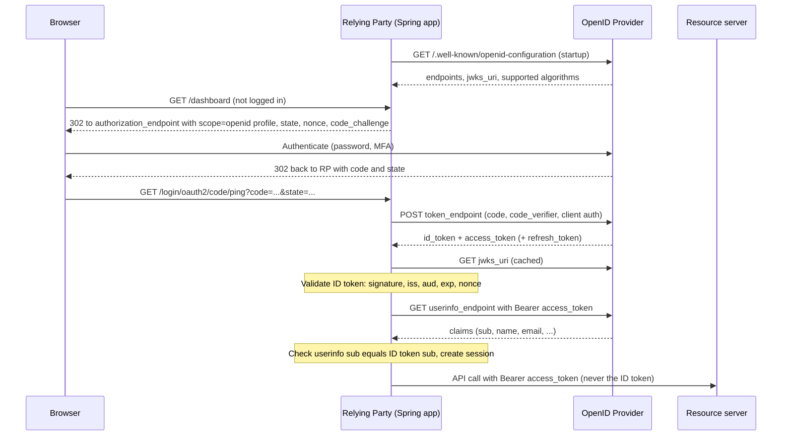
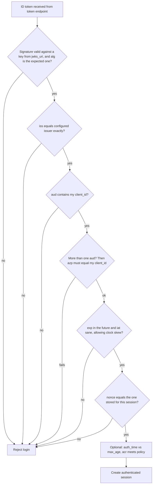

# OpenID Connect: ID Token, UserInfo & Discovery

!!! abstract "Key takeaways"
    - **OAuth2 answers "what may this app do?" OIDC answers "who just logged in?"** OIDC is a thin identity layer on top of OAuth2, switched on by the `openid` scope.
    - The **ID token** is a signed JWT *for the client*. Its audience is the `client_id`. It proves an authentication event (`iss`, `sub`, `aud`, `exp`, `iat`, plus `nonce`, `auth_time`, `acr`, `amr`). It is **not** an API credential.
    - The **access token** is for the resource server. The client should treat it as opaque. Never swap the two.
    - **UserInfo** is an OAuth2-protected endpoint that returns claims about the user when called with the access token. Its `sub` must equal the ID token's `sub`.
    - **Discovery** (`{issuer}/.well-known/openid-configuration`) publishes endpoints, `jwks_uri` and supported algorithms. In Spring, one `issuer-uri` property configures everything. The stable user key is **`iss` + `sub`**, never email.

## Why it matters

OAuth2 was designed for **delegated authorization**: let an app call an API on a user's behalf. It says nothing about who the user is. Around 2010-2012, teams used it for login anyway ("call `/me` with the access token and trust the answer"). Every provider did it differently, and the pattern had a real hole: an access token is not bound to the app that receives it, so a token issued to a malicious app could be replayed into another app to log in as the victim (the "confused deputy" problem).

OpenID Connect (OIDC, finalised in 2014) fixed this with three standard pieces:

1. An **ID token**: a signed statement addressed to one specific client.
2. A **UserInfo endpoint**: a standard place and format for profile claims.
3. **Discovery** and **JWKS**: a standard way for clients to configure themselves and find signing keys.

It shows up everywhere: "Sign in with Google", Microsoft Entra ID, Okta, Keycloak, PingFederate, AWS Cognito. In interviews, "what is the difference between OAuth2 and OIDC?" and "ID token vs access token?" are almost guaranteed for anyone with OAuth2 on the resume.

The grant flows themselves are covered in [OAuth2 roles & grant types](05-oauth2-roles-and-grant-types.md), and JWT signing internals in [JWT: structure, signing, validation, revocation](04-jwt-structure-signing-validation-revocation.md). This page covers what OIDC adds.

## Core concepts

### OIDC = OAuth2 + an identity contract

OIDC renames the roles but keeps the flows:

| OAuth2 term | OIDC term | Example |
|---|---|---|
| Authorization server | **OpenID Provider (OP)** | PingFederate, Entra ID, Keycloak |
| Client | **Relying Party (RP)** | Spring Boot BFF, React SPA |
| Resource owner | **End-User** | The member logging in |

A request becomes an OIDC request when the `scope` contains `openid`. The token response then includes an `id_token` next to the `access_token`.


*Notice that the ID token stops at the Relying Party. Only the access token travels onward to the UserInfo endpoint and to APIs.*

### The ID token

The ID token is a JWT (almost always a signed JWS, default algorithm **RS256**). Its payload describes an **authentication event**:

```json
{
  "iss": "https://sso.example.com",
  "sub": "a81f3c0e-77b2-4f0e-9c1d-2f6b0d1e5a44",
  "aud": "member-portal",
  "exp": 1790000300,
  "iat": 1790000000,
  "auth_time": 1789999990,
  "nonce": "n-0S6_WzA2Mj",
  "acr": "urn:mfa",
  "amr": ["pwd", "otp"],
  "azp": "member-portal",
  "at_hash": "77QmUPtjPfzWtF2AnpK9RQ"
}
```

| Claim | Required? | Meaning |
|---|---|---|
| `iss` | Yes | Issuer URL. Must exactly match the issuer the client trusts. |
| `sub` | Yes | Stable, never-reassigned user identifier, unique **within this issuer**. |
| `aud` | Yes | Must contain the client's `client_id`. |
| `exp` / `iat` | Yes | Expiry and issue time. |
| `nonce` | If sent in the request | Echo of the value the client sent. Binds the token to this browser session and stops replay. |
| `auth_time` | If `max_age` was requested | When the user actually authenticated. Used for "re-authenticate if older than N minutes". |
| `acr` / `amr` | Optional | Assurance level and methods used (for example `pwd`, `otp`, `mfa`). Basis for step-up authentication. |
| `azp` | Optional | Authorized party. Check it when `aud` has more than one value. |
| `at_hash` / `c_hash` | Flow dependent | Hash of the access token or code. Binds them to this ID token in hybrid and implicit flows. |

Three ideas matter more than the claim list:

- **Audience is the difference.** The ID token says "to client `member-portal`: user X logged in". The access token says "to API `claims-api`: the bearer may do Y". An API that accepts an ID token is accepting a token that was never meant for it.
- **The user key is `iss` + `sub`.** `sub` is only unique per issuer. `email` can change, can be unverified, and can be reused.
- **It is a one-time proof, not a session.** The client validates it once at login and then creates its own session. Its `exp` is short (minutes) and does not define how long the app session lasts.

{ loading=lazy }
*Watch the last step: the ID token is a genuine, validly signed token, and the API still rejects it, because its audience is the client.*

### ID token validation

The spec lists the checks. Spring Security performs them in the JWT decoder (signature, algorithm) and `OidcIdTokenValidator` (`iss`, `sub`, `aud`, `azp`, `exp`, `iat`). The nonce comparison is done separately by `OidcAuthorizationCodeAuthenticationProvider`. Spring does not check `auth_time` or `acr` for you.


*Notice that every check before the nonce stops a forged or misdirected token, while the nonce check stops a genuine token being replayed into a different session.*

Two details interviewers like:

- **Pin the algorithm.** The client decides which `alg` it expects (from registration), not the token header. This prevents `alg: none` and RS256-to-HS256 confusion attacks.
- **Key rotation works through `kid`.** The header's `kid` selects a key from the JWKS. If the `kid` is unknown, the client refetches the JWKS once. This is how providers rotate keys with no client deployment.

### Scopes and claims

Scopes in OIDC are shortcuts that request groups of claims:

| Scope | Claims |
|---|---|
| `openid` | `sub` (and turns OIDC on) |
| `profile` | `name`, `given_name`, `family_name`, `preferred_username`, `picture`, `locale`, `updated_at`, ... |
| `email` | `email`, `email_verified` |
| `address` | `address` |
| `phone` | `phone_number`, `phone_number_verified` |
| `offline_access` | Requests a refresh token |

Where those claims arrive depends on the provider. By the spec, with the authorization code flow, profile claims are returned from **UserInfo**, and the ID token stays small. Many providers (Entra ID, Keycloak, PingFederate) can be configured to put them directly into the ID token.

### The UserInfo endpoint

UserInfo is a normal OAuth2 protected resource hosted by the provider:

```http
GET /userinfo HTTP/1.1
Host: sso.example.com
Authorization: Bearer <access_token>
```

```json
{ "sub": "a81f3c0e-...", "name": "Asha Rao", "email": "asha@example.com", "email_verified": true }
```

Rules worth knowing:

- It is called with the **access token**, not the ID token.
- The response always contains `sub`, and the client **must** verify it equals the ID token's `sub`. Otherwise an attacker could substitute another user's access token and change who the session belongs to.
- The response is JSON by default. It can be a signed (or encrypted) JWT if the client registered for it.
- It returns current data. The ID token is a snapshot from login time.

Why have both? The ID token is the **proof** (signed, audience-bound, replay-protected). UserInfo is the **profile lookup** (larger, fresher, fetched on demand). Keeping profile data out of the ID token also keeps personal data out of browser redirects and logs in front-channel flows.

### Discovery and JWKS

Every provider publishes a JSON document at:

```
{issuer}/.well-known/openid-configuration
```

Key fields:

| Field | Purpose |
|---|---|
| `issuer` | Must be **identical** to the issuer URL the client used to build the discovery URL (the part before `/.well-known/...`), and to `iss` in tokens. |
| `authorization_endpoint`, `token_endpoint` | The OAuth2 endpoints. |
| `userinfo_endpoint` | UserInfo URL. |
| `jwks_uri` | Public signing keys as a JWK Set. |
| `end_session_endpoint` | RP-initiated logout. |
| `scopes_supported`, `claims_supported`, `response_types_supported` | Capabilities. |
| `id_token_signing_alg_values_supported` | Algorithms the provider may sign with. |
| `code_challenge_methods_supported` | PKCE support (`S256`). |

The issuer equality rule is a security control. If a client accepted metadata whose `issuer` differs from what it asked for, an attacker who can influence the URL could point it at endpoints they control and impersonate the real provider (the spec calls this out as an impersonation risk, and it is closely related to "mix-up" attacks).

{ loading=lazy }
*Notice the order: the issuer check comes first. Only a document that names exactly the configured issuer is allowed to supply the endpoints.*

RFC 8414 defines the same idea for plain OAuth2 at `/.well-known/oauth-authorization-server`. Spring Security tries the OIDC path first and then the RFC 8414 forms when you give it an `issuer-uri`.

### Sessions and logout (brief)

OIDC also standardises logout, which plain OAuth2 never did:

- **RP-initiated logout:** the app redirects the browser to `end_session_endpoint` with `id_token_hint` and `post_logout_redirect_uri`. This is the one legitimate case of sending the ID token back to the provider.
- **Back-channel logout:** the provider POSTs a signed `logout_token` to each app so they can end local sessions without a browser.

Single sign-on across apps is covered in [SSO, SAML vs OIDC, enterprise IdPs](08-sso-saml-vs-oidc-enterprise-idps.md).

## In practice: code & configuration

### Client (Relying Party) configuration

```yaml
spring:
  security:
    oauth2:
      client:
        registration:
          ping:
            client-id: member-portal
            client-secret: ${PING_CLIENT_SECRET}
            scope: openid, profile, email        # "openid" is what makes this OIDC
            authorization-grant-type: authorization_code
        provider:
          ping:
            issuer-uri: https://sso.example.com  # discovery fills in every endpoint and jwks_uri
```

With `issuer-uri`, Spring calls the discovery document at startup and builds the `ClientRegistration`. You do not write `authorization-uri`, `token-uri`, `user-info-uri` or `jwk-set-uri` by hand.

!!! warning "Startup dependency"
    Discovery through `issuer-uri` happens when the registration bean is created. If the provider is unreachable, the application fails to start. For resilience, set the endpoints explicitly, or make sure the provider is treated as a hard startup dependency in your readiness and rollout plan.

```java
@Configuration
@EnableWebSecurity
class SecurityConfig {

    @Bean
    SecurityFilterChain web(HttpSecurity http, ClientRegistrationRepository clients) throws Exception {
        http
            .authorizeHttpRequests(a -> a
                .requestMatchers("/", "/actuator/health").permitAll()
                .anyRequest().authenticated())
            .oauth2Login(o -> o
                .userInfoEndpoint(u -> u.oidcUserService(oidcUserService())))   // customise the principal
            .logout(l -> l.logoutSuccessHandler(oidcLogout(clients)));          // RP-initiated logout
        return http.build();
    }

    // Wrap the default service: it validates sub equality and calls UserInfo when needed.
    private OAuth2UserService<OidcUserRequest, OidcUser> oidcUserService() {
        var delegate = new OidcUserService();
        return request -> {
            OidcUser user = delegate.loadUser(request);
            Set<GrantedAuthority> authorities = new HashSet<>(user.getAuthorities());
            // Map an IdP group claim to application roles (claim name depends on the provider).
            List<String> groups = user.getClaimAsStringList("groups");
            if (groups != null) {
                groups.forEach(g -> authorities.add(new SimpleGrantedAuthority("ROLE_" + g.toUpperCase())));
            }
            return new DefaultOidcUser(authorities, user.getIdToken(), user.getUserInfo(), "sub");
        };
    }

    private LogoutSuccessHandler oidcLogout(ClientRegistrationRepository clients) {
        var handler = new OidcClientInitiatedLogoutSuccessHandler(clients);     // uses end_session_endpoint
        handler.setPostLogoutRedirectUri("{baseUrl}/");
        return handler;
    }
}
```

What Spring does for you during `oauth2Login()` when the scope contains `openid`:

- Generates `state` and a `nonce`. It stores the raw nonce in the saved authorization request and sends its SHA-256 hash to the provider.
- Exchanges the code, then `OidcAuthorizationCodeAuthenticationProvider` validates the ID token: signature (via `jwks_uri`), `iss`, `aud`, `azp`, `exp`, `iat` (with a default clock skew of 60 seconds) and `nonce`.
- `OidcUserService` calls UserInfo with the access token if a UserInfo URI exists and profile-type scopes were granted, and rejects the login if the `sub` values differ.
- Builds an `OidcUser` with authorities `OIDC_USER` plus one `SCOPE_x` per granted scope.

By default the expected ID token algorithm is RS256. If your provider signs with something else, tell Spring explicitly:

```java
@Bean
JwtDecoderFactory<ClientRegistration> idTokenDecoderFactory() {
    var factory = new OidcIdTokenDecoderFactory();
    factory.setJwsAlgorithmResolver(reg -> SignatureAlgorithm.ES256);   // pin the algorithm per client
    return factory;
}
```

### Using identity correctly

=== "❌ Common mistake"
    ```java
    @RestController
    class ProfileController {

        @GetMapping("/me")
        Profile me(@RequestHeader("Authorization") String header) {
            // 1. An API accepting the ID token as a bearer credential (audience is the client, not this API).
            String idToken = header.substring("Bearer ".length());
            // 2. Base64-decoding the payload with no signature, issuer, audience or expiry check.
            String json = new String(Base64.getUrlDecoder().decode(idToken.split("\\.")[1]));
            String email = JsonPath.read(json, "$.email");
            // 3. Using email as the primary key: mutable, sometimes unverified, not unique across issuers.
            return profiles.findByEmail(email);
        }
    }
    ```

=== "✅ Correct approach"
    ```java
    @RestController
    class ProfileController {

        // In the Relying Party: the principal comes from the validated ID token held in the session.
        @GetMapping("/me")
        Profile me(@AuthenticationPrincipal OidcUser user) {
            String issuer  = user.getIssuer().toString();   // which IdP
            String subject = user.getSubject();             // stable id within that IdP
            return profiles.findByIssuerAndSubject(issuer, subject)   // key = iss + sub
                           .orElseGet(() -> profiles.provision(issuer, subject, user.getEmail()));
        }

        // Step-up check for a sensitive action: was MFA used, and was the login recent?
        @PostMapping("/payment-methods")
        ResponseEntity<Void> add(@AuthenticationPrincipal OidcUser user, @RequestBody Card card) {
            List<String> amr = user.getIdToken().getClaimAsStringList("amr");
            Instant authTime = user.getIdToken().getAuthenticatedAt();
            boolean recentMfa = amr != null && amr.contains("mfa")
                    && authTime != null && authTime.isAfter(Instant.now().minus(Duration.ofMinutes(5)));
            if (!recentMfa) {
                return ResponseEntity.status(HttpStatus.FORBIDDEN).build();   // or redirect to re-authenticate
            }
            cards.add(user.getSubject(), card);
            return ResponseEntity.noContent().build();
        }
    }
    ```

Downstream APIs are resource servers. They validate the **access token** (audience = the API) as described in [Resource server & client configuration in Spring](07-resource-server-and-client-configuration-in-spring.md).

### React side

For a browser app, the common production pattern is a backend-for-frontend: the Spring app above is the Relying Party, tokens stay server-side, and React only holds a session cookie. If the SPA itself is the Relying Party, it is a public client using authorization code + PKCE, and it still must not send the ID token to APIs. See [Sessions vs tokens; CSRF & CORS](03-sessions-vs-tokens-csrf-and-cors-in-spring.md).

## Real-world usage

- **Consumer login:** "Sign in with Google" and Microsoft accounts are OIDC. Apple's sign-in is OIDC-based as well.
- **Enterprise:** Entra ID, Okta, PingFederate and Keycloak all expose discovery documents, so onboarding a new application is mostly "register a client, set the issuer URL".
- **Healthcare:** SMART on FHIR, the standard for apps connecting to electronic health record systems, uses OIDC for user identity (the `openid` and `fhirUser` scopes) on top of OAuth2.
- **Banking:** the OpenID Foundation's FAPI security profiles, used by open-banking ecosystems, are built on OIDC and tighten it (stronger signing algorithms, sender-constrained tokens, signed requests).
- **A real incident class, "nOAuth" (reported by Descope in 2023):** some applications using Entra ID identified users by the `email` claim. In multi-tenant apps an attacker could set an arbitrary, unverified email on an account in their own tenant and take over the victim's account in the application. The fix is exactly the rule above: identify users by issuer and subject, and do not trust an email that is not verified.
- **Multi-tenant issuers:** Entra ID's shared `common` and `organizations` endpoints publish an issuer containing a `{tenantid}` placeholder, which breaks the strict issuer-equality check. Multi-tenant apps need custom issuer validation that checks the tenant ID against an allow-list.

## Trade-offs & production gotchas

| Option | Pros | Cons | Use when |
|---|---|---|---|
| Claims in the ID token | No extra network call, everything available at login | Bigger token, personal data in a token that may be logged, snapshot goes stale | Few claims, confidential client, code flow |
| Claims from UserInfo | Small ID token, fresh data, personal data stays on the back channel | Extra round trip per login, depends on provider availability | Many or sensitive claims |
| `issuer-uri` discovery | One property, picks up endpoint changes, key rotation via JWKS | Startup fails if provider is down, needs outbound network access | Default choice |
| Explicit endpoint configuration | No startup dependency, works in locked-down networks | Manual upkeep, easy to drift from the provider | Air-gapped or strict-egress environments |
| Short app session tied to IdP | Faster revocation, policy changes apply quickly | More redirects | Regulated domains (PHI, payments) |
| Long local session | Smooth user experience | User disabled at the IdP keeps access until the local session ends | Low-risk apps, or combined with back-channel logout |

!!! warning "Gotchas"
    - **ID token sent to an API.** The audience is the client. A resource server that validates audience correctly will reject it, and one that does not validate audience has a bigger problem.
    - **Trailing slash in the issuer.** `https://sso.example.com` and `https://sso.example.com/` are different strings. The issuer in configuration, in the discovery document and in the `iss` claim must match exactly.
    - **Logging in does not mean the profile is fresh.** Spring stores the `OidcUser` in the session. Group or role changes at the provider are not visible until the next login.
    - **Fat tokens.** Entra ID omits group claims above a size limit and emits a "groups overage" indicator instead, which forces a Graph API call. Large tokens also break cookie-based sessions and header size limits.
    - **Clock skew.** A node with a drifting clock rejects valid ID tokens with "expired" or "issued in the future". Spring allows 60 seconds by default.
    - **UserInfo is not for resource servers.** Calling UserInfo on every API request to "validate" a token adds latency and a provider dependency. Validate the JWT locally, or use token introspection if tokens are opaque.
    - **ID token expiry is not session expiry.** The app session outlives the ID token. If you need provider-driven session end, implement back-channel logout or re-check with `prompt=none`.

## How this connects to my experience

- **Where I used it:**
    - **OptumRx Meteor (Publicis Sapient):** "Built secure enterprise APIs using OAuth2, PingFederate, and Active Directory integration." PingFederate is an OpenID Provider, with Active Directory as the user store behind it. The React application I built from the ground up is the natural Relying Party side of that login. *[confirm: whether login used OIDC with an ID token or OAuth2 access tokens only, and whether the React app or a backend held the tokens]*
    - **Metasys (Johnson Controls):** "Built user management microservices and owned JWT-based authentication and SSO implementation end-to-end." This is the same problem OIDC standardises: a signed token proving who logged in. *[confirm: whether SSO was a custom JWT scheme or a standard protocol]*
- **Talking points:**
    - Explain the split clearly: PingFederate authenticates against Active Directory, issues an ID token for the web application and an access token for the APIs, and the Spring services validate the access token as resource servers. *[confirm this matches the actual OptumRx setup before presenting it as what we built]*
    - How AD group membership became application roles (a `groups`-style claim mapped to authorities). *[confirm the actual claim name and mapping]*
    - How services found the signing keys (JWKS through the issuer's discovery document) and what happened during key rotation. *[confirm]*
    - Healthcare angle: keeping personal data out of tokens and logs, and using `iss` + `sub` rather than email as the member key.
    - Honest contrast: at Johnson Controls I built token issuance and validation myself, so I understand what an identity provider does internally. *[confirm: the resume says I owned JWT authentication and SSO, check that this included issuing tokens]* At OptumRx we delegated that to an enterprise provider, which is the right choice at scale.
- **Likely follow-up chain:**
    - "You used OAuth2 with PingFederate. Was that OIDC?" → Say what the `openid` scope adds and which tokens came back.
    - "What is in the ID token and who consumes it?" → Claims, audience = client, validated once at login.
    - "Why not send it to your GraphQL service?" → Wrong audience. APIs get the access token.
    - "How did the service know which keys to trust?" → Discovery, `jwks_uri`, `kid`, cached with refetch on unknown `kid`.
    - "A user was removed from an AD group. When does your app notice?" → Next token issuance, so keep access tokens short-lived. Mention back-channel logout for hard cut-off.

## Interview questions

### Fundamentals

??? question "Q1. What is the difference between OAuth2 and OpenID Connect?"
    **Answer:** OAuth2 is an authorization framework. It gives a client an access token to call an API on someone's behalf, and says nothing standard about who the user is. OIDC is an identity layer on top of OAuth2. When the client adds the `openid` scope, the provider also returns an ID token (a signed JWT about the authentication event) and offers a UserInfo endpoint and discovery metadata. OAuth2 = delegated access. OIDC = login.

    **Interviewer listens for:** "authorization vs authentication", the `openid` scope, the ID token as the new artifact, same flows underneath.

    **Common wrong answer:** "OIDC is a newer version of OAuth2" or "OAuth2 is for authentication".

??? question "Q2. ID token vs access token: what is each for?"
    **Answer:** The ID token is for the client. Its `aud` is the `client_id`, it is always a JWT, and it proves who logged in, when and how. The client validates it once and creates a session. The access token is for the resource server. Its audience is the API, it carries scopes, its format is up to the provider (JWT or opaque), and the client should not parse it. The ID token is never sent to APIs, and the access token is not proof of identity for the client.

    **Interviewer listens for:** audience as the deciding factor, "client should treat the access token as opaque".

    **Common wrong answer:** "They are the same JWT with different claims, either can be used as the bearer token."

??? question "Q3. Which claims are mandatory in an ID token?"
    **Answer:** `iss`, `sub`, `aud`, `exp` and `iat`. `nonce` is required when the client sent one in the request. `auth_time` is required when `max_age` was requested. `acr`, `amr` and `azp` are optional. `at_hash` and `c_hash` depend on the flow.

    **Interviewer listens for:** knowing `sub` is the identifier and that `email` and `name` are not guaranteed.

    **Common wrong answer:** "email and name are mandatory." Only identity and timing claims are required.

??? question "Q4. What is the UserInfo endpoint and how do you call it?"
    **Answer:** A protected resource on the provider that returns claims about the authenticated user. The client sends `GET` (or `POST`) with `Authorization: Bearer <access_token>`. Which claims come back depends on the granted scopes (`profile`, `email`, ...). The response always includes `sub`, and the client must check it matches the ID token's `sub`.

    **Common wrong answer:** "You call it with the ID token."

    **Interviewer listens for:** access token as bearer, profile claims, consistency of sub with the ID token.

??? question "Q5. What is OIDC discovery?"
    **Answer:** A JSON metadata document at `{issuer}/.well-known/openid-configuration` listing the provider's endpoints, `jwks_uri`, supported scopes, response types and signing algorithms. Clients use it to configure themselves from a single issuer URL. The `issuer` value inside must exactly equal the issuer URL the client started from (the prefix before `/.well-known/openid-configuration`) and the `iss` claim in tokens.

    **Interviewer listens for:** `jwks_uri` for keys, the exact-match rule, Spring's `issuer-uri`.

    **Common wrong answer:** "Discovery is optional decoration." Spring uses it to configure endpoints and keys.

### Intermediate

??? question "Q6. Walk through how a client validates an ID token."
    **Answer:** (1) Verify the signature using the key identified by `kid` from the provider's JWKS, with the algorithm the client expects. (2) `iss` equals the configured issuer. (3) `aud` contains my `client_id`, and if there are several audiences, `azp` is my `client_id`. (4) `exp` is in the future and `iat` is reasonable, with a small clock skew. (5) `nonce` matches the one bound to this browser session. (6) Optionally check `auth_time` against `max_age` and `acr` against policy. In Spring this is the JWT decoder plus `OidcIdTokenValidator`, with the nonce compared in `OidcAuthorizationCodeAuthenticationProvider`. Step (6) is application code.

    **Interviewer listens for:** audience and nonce, not just "check the signature and expiry".

    **Common wrong answer:** Trusting the `alg` from the token header, or skipping `aud`.

??? question "Q7. What is the nonce for, and how is it different from state and PKCE?"
    **Answer:** All three bind a response to the original request, at different layers. `state` protects the redirect back to the client against CSRF. PKCE binds the authorization code to the client instance that started the flow, so a stolen code is useless. `nonce` is embedded inside the signed ID token, so the client can prove this ID token was minted for this session and is not a replay. Spring generates a nonce automatically for `openid` requests and sends its SHA-256 hash.

    **Interviewer listens for:** nonce lives inside the token and is verified by the client. PKCE is verified by the provider.

    **Common wrong answer:** "nonce and state are the same thing." They protect different steps.

??? question "Q8. Why should you key users on iss + sub and not on email?"
    **Answer:** `sub` is defined as a stable, never-reassigned identifier, but only unique within one issuer, so the pair is the globally unique key. Email is mutable, may be unverified (`email_verified: false`), may be recycled to a different person, and in multi-tenant providers can be set by a tenant admin. The nOAuth issue with Entra ID was account takeover caused by matching on email.

    **Common wrong answer:** "Email is unique so it is fine as a primary key."

    **Interviewer listens for:** sub is stable per issuer, email is mutable and can be reassigned or unverified.

??? question "Q9. (Gotcha) A resource server is configured with the same issuer-uri as the client. A developer sends the ID token as the Bearer token. What happens?"
    **Answer:** With only default validation, it may well be **accepted**. Spring's resource server by default checks signature, expiry and issuer. The ID token is signed by the same provider with the same keys, so those all pass. Audience is not validated unless you configure it. That is why you must add an audience validator (or the `audiences` property) on the resource server, so that only tokens minted for this API are accepted. Details in [Resource server & client configuration in Spring](07-resource-server-and-client-configuration-in-spring.md).

    **Interviewer listens for:** knowing that audience validation is not on by default in the resource server, and that the fix is server-side, not "tell developers not to do it".

    **Common wrong answer:** "It is rejected automatically because it is an ID token."

??? question "Q10. What does Spring Security do when you set only issuer-uri for a client registration?"
    **Answer:** At startup it fetches the discovery document (trying the OIDC well-known path, then the RFC 8414 forms), checks the `issuer` matches, and builds the `ClientRegistration` with authorization, token, UserInfo and JWKS URIs plus the user-name attribute `sub`. At login, `oauth2Login()` uses those to run the code flow, validate the ID token and load the `OidcUser`. If the provider is down at startup, the context fails to start.

    **Interviewer listens for:** discovery fetch at startup, issuer check, endpoints and JWKS filled in, startup dependency.

    **Common wrong answer:** "Nothing happens until the first login."

### Senior

??? question "Q11. When should claims go in the ID token versus be fetched from UserInfo?"
    **Answer:** Keep the ID token minimal: identity and authentication context. Put profile and entitlement data behind UserInfo (or a provider API) when it is large, sensitive or changes often. Reasons: tokens end up in logs, browser history (front-channel flows) and session stores, so personal data in them widens exposure, which matters under HIPAA and similar rules. Large tokens hit header and cookie limits. And a token is a snapshot, while UserInfo is current. Embedding claims is fine for a confidential client on the code flow with a handful of claims, where it saves a round trip.

    **Interviewer listens for:** privacy, size and freshness as the three axes, not just "performance".

    **Common wrong answer:** "Put everything in the ID token to save a call." Large tokens leak data and break header limits.

??? question "Q12. How do you handle signing key rotation at the provider without redeploying clients?"
    **Answer:** Clients never hard-code keys. They read `jwks_uri` from discovery, cache the key set, and select the key by the `kid` header. The provider publishes the new key in the JWKS ahead of time, starts signing with it, and removes the old key after the longest token lifetime has passed. On an unknown `kid` the client refetches the JWKS once (rate-limited, to avoid a denial of service by tokens with random `kid` values). Spring's Nimbus-based decoders do this caching and refetch.

    **Interviewer listens for:** overlap window, `kid`, refetch on miss, rate-limiting the refetch.

    **Common wrong answer:** "Redeploy all clients with the new public key."

??? question "Q13. Your app supports customers from many Entra ID tenants. What changes in ID token validation?"
    **Answer:** The shared endpoint's discovery document has an issuer with a tenant placeholder, so the fixed issuer-equality check cannot be used as is. I would validate that `iss` matches the expected pattern for the token's `tid`, and that `tid` is in an allow-list of onboarded tenants, while still verifying signature, audience, expiry and nonce. The user key becomes tenant plus the stable object identifier, never email. In Spring this means a custom issuer validator or a per-tenant registration resolved dynamically.

    **Interviewer listens for:** awareness that "accept any issuer from this provider" equals "accept any tenant in the world", and a tenant allow-list.

    **Common wrong answer:** "Disable issuer validation for multi-tenant apps." Validate the tenant-specific issuer instead.

??? question "Q14. How does OIDC support step-up authentication for a sensitive action?"
    **Answer:** The client inspects `acr`, `amr` and `auth_time` in the ID token. If the assurance is too low or the login is too old, it sends the user back to the authorization endpoint with `acr_values` (requesting a stronger method), `max_age` (forcing a recent login) or `prompt=login`. The new ID token must then be validated for exactly those values, because the request parameters are only requests. The client must check the result and not assume the provider complied.

    **Common wrong answer:** "Send `prompt=login` and assume MFA happened."

    **Interviewer listens for:** acr/amr/auth_time inspection, re-authentication with max_age or acr_values.

### Scenario-based

??? question "Q15. After a provider upgrade, every login fails with an issuer mismatch error. How do you debug it?"
    **Answer:** Compare three strings: the configured `issuer-uri`, the `issuer` field in the discovery document, and the `iss` claim in a fresh ID token. Typical causes are a trailing slash, a changed host name (internal vs public URL behind a proxy), a changed path segment for realm or tenant, or `http` vs `https` when the provider sits behind a TLS-terminating load balancer. Fix the source of truth at the provider or update the configuration. Do not disable issuer validation.

    **Interviewer listens for:** a concrete comparison method and refusing to turn the check off.

    **Common wrong answer:** "Turn off issuer validation." The mismatch is a configuration or proxy issue to fix.

??? question "Q16. A user's access was revoked in Active Directory, but they can still use the application for hours. Why, and how do you fix it?"
    **Answer:** The application validated the ID token once and created its own session, which lives independently of the provider. The fixes, in order of strength: shorten the local session and access-token lifetime so refresh fails at the provider. Implement OIDC back-channel logout so the provider can end the session actively (Spring Security supports this through `oidcLogout().backChannel()` since 6.2). For the highest-risk operations, re-check with the provider at the time of the action. State the trade-off: tighter revocation costs more round trips.

    **Interviewer listens for:** understanding that the ID token is a point-in-time proof and that the session is the thing to control.

    **Common wrong answer:** "The ID token is still valid, so nothing can be done." Session lifetime and back-channel logout fix it.

??? question "Q17. The team wants the React SPA to read roles from the token to show or hide menus. Which token, and what are the risks?"
    **Answer:** Use the ID token or UserInfo claims, because those are meant for the client. Do not parse the access token in the client, since its format belongs to the API and the provider and may change or be opaque. Make clear this is user-experience only: every API must enforce authorization from the access token it validates. With a backend-for-frontend, the cleaner option is a `/me` endpoint that returns the roles from the server-side `OidcUser`, so no token reaches the browser.

    **Common wrong answer:** "Decode the access token in the browser and trust the roles for security."

    **Interviewer listens for:** ID token or UserInfo for UI decisions, server still enforces, access token is opaque to the client.

??? question "Q18. Your service starts failing to boot in one region during a provider outage, while already-running pods are fine. Explain and propose a fix."
    **Answer:** Running pods already have the client registration and cached JWKS, so they keep working for existing sessions and can validate tokens. New pods call the discovery endpoint during bean creation and fail. Options: configure endpoints explicitly so startup has no network dependency. Resource servers behave differently: Spring Boot's auto-configured decoder for `issuer-uri` is lazy (a `SupplierJwtDecoder` that runs discovery on the first request), so they boot but fail requests until the provider is back. Setting `jwk-set-uri` (with `issuer-uri` kept for `iss` validation) removes the discovery call entirely, so only the JWKS fetch remains. Keep enough capacity and avoid restarts during the incident. Longer term, ensure the provider is multi-region and included in dependency health planning.

    **Interviewer listens for:** distinguishing startup-time discovery from request-time validation.

    **Common wrong answer:** "The provider outage is not our problem." Startup dependence on discovery needs a fallback.

## Cheat sheet

| Concept | Remember |
|---|---|
| OIDC | Identity layer on OAuth2, enabled by `scope=openid` |
| ID token | Signed JWT for the **client**. `aud` = `client_id`. Validate once, then create a session |
| Access token | For the **API**. Client treats it as opaque |
| Required ID token claims | `iss`, `sub`, `aud`, `exp`, `iat` (+ `nonce` if sent) |
| User key | `iss` + `sub`. Never email |
| Validation order | signature and pinned `alg` → `iss` → `aud`/`azp` → `exp`/`iat` → `nonce` → `auth_time`/`acr` |
| `nonce` vs `state` vs PKCE | Token replay vs redirect CSRF vs code interception |
| UserInfo | `GET` with Bearer **access token**. `sub` must match the ID token |
| Standard scopes | `openid`, `profile`, `email`, `address`, `phone`, `offline_access` |
| Discovery | `{issuer}/.well-known/openid-configuration`. `issuer` must match exactly |
| JWKS | Public keys at `jwks_uri`, selected by `kid`, refetched on unknown `kid` |
| Spring client | `issuer-uri` + `oauth2Login()` → `OidcUser`, authorities `OIDC_USER` + `SCOPE_*` |
| Spring validation | `OidcIdTokenValidator`, 60 s clock skew, RS256 expected by default |
| Step-up | Check `acr`, `amr`, `auth_time`. Request with `acr_values`, `max_age`, `prompt=login` |
| Logout | `end_session_endpoint` with `id_token_hint`. Back-channel logout for server-side cut-off |

## Sources

1. [OpenID Connect Core 1.0](https://openid.net/specs/openid-connect-core-1_0.html): ID token claims, validation rules, standard scopes and claims, UserInfo endpoint and the `sub` match requirement.
2. [OpenID Connect Discovery 1.0](https://openid.net/specs/openid-connect-discovery-1_0.html): the well-known document, metadata fields and the issuer equality rule.
3. [RFC 8414: OAuth 2.0 Authorization Server Metadata](https://datatracker.ietf.org/doc/html/rfc8414): the OAuth2 equivalent of discovery that Spring also tries.
4. [Spring Security reference: OAuth 2.0 Login, core configuration](https://docs.spring.io/spring-security/reference/servlet/oauth2/login/core.html): `issuer-uri` based client configuration.
5. [Spring Security reference: OAuth 2.0 Login, advanced configuration](https://docs.spring.io/spring-security/reference/servlet/oauth2/login/advanced.html): `OidcUserService`, authority mapping, ID token signature algorithm and clock skew, OIDC logout.
6. [OpenID Connect RP-Initiated Logout 1.0](https://openid.net/specs/openid-connect-rpinitiated-1_0.html) and [Back-Channel Logout 1.0](https://openid.net/specs/openid-connect-backchannel-1_0.html): logout mechanisms.
7. [Descope: nOAuth, how Microsoft OAuth misconfiguration can lead to full account takeover](https://www.descope.com/blog/post/noauth): the email-claim account takeover incident.
8. [Microsoft identity platform: ID token claims reference](https://learn.microsoft.com/en-us/entra/identity-platform/id-token-claims-reference): Entra ID specifics such as `tid`, multi-tenant issuers and groups overage.
