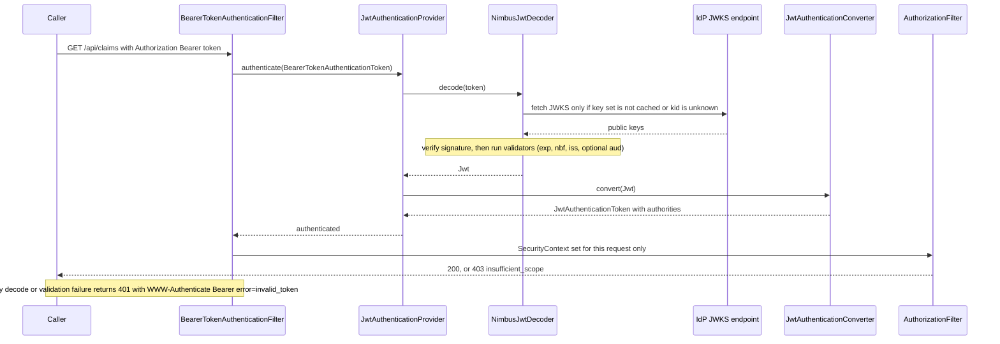
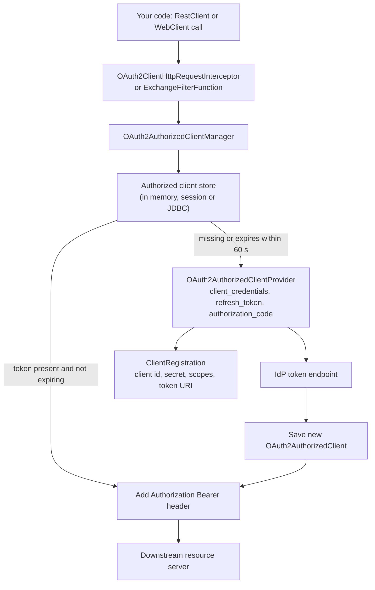

# Resource Server & Client Configuration in Spring

!!! abstract "TL;DR"
    - **Two different jobs, two different starters.** A **resource server** *validates* tokens on incoming requests (`oauth2ResourceServer`). An **OAuth2 client** *obtains* tokens, either to log a user in (`oauth2Login`) or to call another API (`oauth2Client`). One app is often both.
    - Resource server pipeline: `BearerTokenAuthenticationFilter` → `JwtAuthenticationProvider` → `JwtDecoder` (signature + validators) → `JwtAuthenticationConverter` (claims → authorities) → `JwtAuthenticationToken`.
    - With only `issuer-uri` set you get signature, `exp`/`nbf` (60 s clock skew) and `iss` checks. **Audience is not checked** unless you set `audiences` or add a validator. Authorities come from `scope`/`scp` with the prefix `SCOPE_`; roles and groups need a custom converter.
    - Client side: a `ClientRegistration` describes *how* to get a token, an `OAuth2AuthorizedClientManager` gets, caches and refreshes it, and an interceptor or filter function attaches it to `RestClient`/`WebClient` calls.
    - Outside an HTTP request (Kafka listeners, schedulers) use `AuthorizedClientServiceOAuth2AuthorizedClientManager`. The default manager needs a servlet request and fails without one.

## Why it matters

Every microservice in an OAuth2 system plays one or both of these roles. The API that receives `Authorization: Bearer ...` is a resource server. The same API, when it calls a downstream service, is a client. Getting the split wrong produces the classic mistakes: an API that redirects `curl` to a login page, a service that accepts tokens issued for a different API, or a batch job that fails with "servletRequest cannot be null".

Before Spring Security 5, this lived in the separate *Spring Security OAuth* project (`@EnableResourceServer`, `@EnableOAuth2Sso`). That project is end-of-life. Everything is now in Spring Security itself, configured through the `SecurityFilterChain` lambda DSL, and the authorization server is a separate project (Spring Authorization Server) or an external IdP such as PingFederate, Entra ID, Okta or Keycloak.

This page covers the Spring configuration. The protocol itself lives in [OAuth2 roles & grant types](05-oauth2-roles-and-grant-types.md), token internals in [JWT](04-jwt-structure-signing-validation-revocation.md), and the filter chain in [Spring Security architecture](01-spring-security-architecture-filter-chain-securitycontext-au.md).

## Core concepts

### Which role is my application?

| Question | Role | Starter (Boot 3.x) | DSL |
|---|---|---|---|
| Do I receive bearer tokens and decide whether to serve the request? | Resource server | `spring-boot-starter-oauth2-resource-server` | `oauth2ResourceServer(...)` |
| Do I send users to an IdP to log in, then keep a session? | Client (login) | `spring-boot-starter-oauth2-client` | `oauth2Login(...)` |
| Do I need an access token to call another API? | Client (API calls) | `spring-boot-starter-oauth2-client` | `oauth2Client(...)` + authorized client manager |

Spring Boot 4 renames the starters to `spring-boot-starter-security-oauth2-resource-server` and `spring-boot-starter-security-oauth2-client`. The property names (`spring.security.oauth2.*`) stay the same.

### Resource server: what happens to a request


*Notice that the IdP is contacted only for keys, not per request. Validation is local, which is why JWT resource servers scale well and why revocation is hard.*

The pieces, in order:

1. **`BearerTokenAuthenticationFilter`** pulls the token from the `Authorization` header using a `BearerTokenResolver`. Tokens in query parameters or form bodies are disabled by default (they leak into logs).
2. **`JwtAuthenticationProvider`** delegates to the `JwtDecoder`.
3. **`NimbusJwtDecoder`** parses the JWT, selects the key by `kid` from the cached JWK set, verifies the signature, and runs an `OAuth2TokenValidator<Jwt>`.
4. **`JwtAuthenticationConverter`** turns the `Jwt` into a `JwtAuthenticationToken`. The principal is the `Jwt` itself and the name is the `sub` claim.
5. **`AuthorizationFilter`** and method security then apply your rules. See [authentication vs authorization](02-authentication-vs-authorization-method-security.md).

### What `issuer-uri` gives you (and what it doesn't)

```yaml
spring.security.oauth2.resourceserver.jwt.issuer-uri: https://sso.example.com
```

With this one property, Boot creates a `JwtDecoder` that:

- Discovers the provider metadata (`/.well-known/openid-configuration`, falling back to the OAuth2 authorization server metadata paths) and reads `jwks_uri`. See [OIDC discovery](06-openid-connect-id-token-userinfo-discovery.md).
- Does the discovery **lazily on the first request** (Boot wraps the decoder in a `SupplierJwtDecoder`), so the app can start while the IdP is down.
- Validates signature, `exp` and `nbf` (default **60 seconds** clock skew), and that `iss` equals the configured issuer exactly.
- Trusts only **RS256** unless you configure `jws-algorithms`.

What it does **not** do:

- **No audience check.** A valid token from the same IdP that was issued for *another* API is accepted. Set `spring.security.oauth2.resourceserver.jwt.audiences` or add a validator.
- **No role mapping.** Only `scope` (space-separated string) or `scp` is read, and each value becomes `SCOPE_<value>`.
- **No revocation check.** A JWT is valid until `exp`.

If you set `jwk-set-uri` *instead of* `issuer-uri`, you skip discovery but also lose the issuer check. Setting both is common: keys come from `jwk-set-uri`, and the `iss` claim is still validated.

### Authorities: why `hasRole('ADMIN')` returns 403

A token with `"scope": "claims.read claims.write"` yields the authorities `SCOPE_claims.read` and `SCOPE_claims.write`. `hasRole("ADMIN")` looks for `ROLE_ADMIN`, which is never there. Enterprise IdPs usually put roles in a custom claim (`groups`, `roles`, `memberOf`, Keycloak's nested `realm_access.roles`). You map those with a `JwtAuthenticationConverter`, shown in the code section.

### JWT vs opaque tokens

| | JWT (`.jwt(...)`) | Opaque (`.opaqueToken(...)`) |
|---|---|---|
| Validation | Local, with cached public keys | Network call to the introspection endpoint (RFC 7662) per request |
| Revocation | Only at expiry, unless you add a deny-list | Immediate |
| Latency / availability | No IdP dependency per request | IdP is on the hot path, cache carefully |
| Spring types | `JwtDecoder`, `JwtAuthenticationToken` | `OpaqueTokenIntrospector`, `BearerTokenAuthentication` |

You pick one per filter chain. To support both, or several issuers, plug in an `AuthenticationManagerResolver` (for multi-issuer JWT, `JwtIssuerAuthenticationManagerResolver.fromTrustedIssuers(...)`).

### Statelessness and CSRF

The bearer filter stores the `SecurityContext` in a request attribute, not the HTTP session, so authentication is re-done on every request. The resource server configurer also tells the CSRF filter to **ignore requests that carry a bearer token**, because a browser cannot attach an `Authorization` header by itself. Most pure APIs still set `SessionCreationPolicy.STATELESS` and disable CSRF to make the intent explicit. The reasoning is in [sessions vs tokens, CSRF & CORS](03-sessions-vs-tokens-csrf-and-cors-in-spring.md).

### Client: the moving parts


*Notice that your code never calls the token endpoint. The manager decides whether to reuse, refresh or fetch a token, and the registration is static configuration while the authorized client is runtime state.*

| Type | What it is |
|---|---|
| `ClientRegistration` | Static config for one client at one provider: client id/secret, grant type, scopes, redirect URI, endpoints. Held in a `ClientRegistrationRepository`. |
| `OAuth2AuthorizedClient` | Runtime result: registration + principal name + access token (+ refresh token). |
| `OAuth2AuthorizedClientService` / `Repository` | Where authorized clients are stored. Default is in memory. `JdbcOAuth2AuthorizedClientService` exists for multi-instance apps. |
| `OAuth2AuthorizedClientProvider` | One strategy per grant: authorization code, refresh token, client credentials, JWT bearer, token exchange. |
| `OAuth2AuthorizedClientManager` | Orchestrates the above. Two implementations, see below. |

**Two managers, and picking the wrong one is a classic bug:**

- `DefaultOAuth2AuthorizedClientManager` works **inside a servlet request**. It loads and saves tokens through an `OAuth2AuthorizedClientRepository`, whose API takes the `HttpServletRequest` (by default: the `OAuth2AuthorizedClientService` for authenticated users, the HTTP session for anonymous ones), so it fails when there is no request.
- `AuthorizedClientServiceOAuth2AuthorizedClientManager` works **anywhere**: Kafka listeners, `@Scheduled` jobs, startup code. Use it for client credentials in backend services.

### `oauth2Login` vs `oauth2Client`

- **`oauth2Login()`** is authentication. It adds `OAuth2AuthorizationRequestRedirectFilter` (handles `/oauth2/authorization/{registrationId}` and redirects to the IdP) and `OAuth2LoginAuthenticationFilter` (handles the callback `/login/oauth2/code/{registrationId}`, swaps the code for tokens, validates the ID token, creates an `OidcUser` and a **session**).
- **`oauth2Client()`** only gets access tokens for calling APIs. It does not log anyone in.

A server-rendered app or a backend-for-frontend (BFF) uses `oauth2Login`. A headless microservice calling another service uses client credentials and needs neither a login page nor a session.

PKCE is applied automatically for public clients (`client-authentication-method: none`, no secret). For confidential clients on Spring Security 6.x, enable it with `OAuth2AuthorizationRequestCustomizers.withPkce()` on the authorization request resolver. Spring Security 7 turns PKCE on by default for the authorization code grant, so check the release notes for your version.

## In practice: code & configuration

### Resource server

```yaml
spring:
  security:
    oauth2:
      resourceserver:
        jwt:
          issuer-uri: https://sso.example.com          # discovery + iss validation
          audiences: claims-api                        # aud must contain this value
```

=== "❌ Common mistake"
    ```java
    @Configuration
    @EnableWebSecurity
    class SecurityConfig {

        @Bean
        SecurityFilterChain api(HttpSecurity http) throws Exception {
            http
                .authorizeHttpRequests(a -> a
                    .requestMatchers("/api/admin/**").hasRole("ADMIN")   // token has no ROLE_ADMIN -> always 403
                    .anyRequest().authenticated())
                .oauth2ResourceServer(o -> o.jwt(Customizer.withDefaults()));
            return http.build();
        }

        @Bean
        JwtDecoder jwtDecoder() {
            // Only a JWK set URI: signature and expiry are checked,
            // but NOT issuer and NOT audience. Any token signed by this IdP gets in.
            return NimbusJwtDecoder.withJwkSetUri("https://sso.example.com/pf/JWKS").build();
        }
    }
    ```

=== "✅ Correct approach"
    ```java
    @Configuration
    @EnableWebSecurity
    @EnableMethodSecurity
    class SecurityConfig {

        @Bean
        SecurityFilterChain api(HttpSecurity http) throws Exception {
            http
                .securityMatcher("/api/**", "/graphql")                  // this chain owns only API paths
                .authorizeHttpRequests(a -> a
                    .requestMatchers(HttpMethod.GET, "/api/claims/**").hasAuthority("SCOPE_claims.read")
                    .requestMatchers("/api/admin/**").hasRole("ADMIN")   // works: converter adds ROLE_*
                    .anyRequest().authenticated())
                .sessionManagement(s -> s.sessionCreationPolicy(SessionCreationPolicy.STATELESS))
                .csrf(AbstractHttpConfigurer::disable)                   // no cookies, so no CSRF surface
                .oauth2ResourceServer(o -> o
                    .jwt(j -> j.jwtAuthenticationConverter(jwtAuthenticationConverter())));
            return http.build();
        }

        // Keep SCOPE_* authorities AND map the IdP "groups" claim to ROLE_*.
        @Bean
        JwtAuthenticationConverter jwtAuthenticationConverter() {
            var scopes = new JwtGrantedAuthoritiesConverter();           // scope/scp -> SCOPE_x

            var converter = new JwtAuthenticationConverter();
            converter.setJwtGrantedAuthoritiesConverter(jwt -> {
                List<String> groups = jwt.getClaimAsStringList("groups");
                Stream<GrantedAuthority> roles = (groups == null ? List.<String>of() : groups).stream()
                    .map(g -> new SimpleGrantedAuthority("ROLE_" + g.toUpperCase()));
                return Stream.concat(scopes.convert(jwt).stream(), roles).toList();
            });
            converter.setPrincipalClaimName("preferred_username");       // default is "sub"
            return converter;
        }
    }
    ```

If you build the decoder yourself (for example to add custom validators), re-add the defaults. A custom `JwtDecoder` bean **replaces** Boot's, including the `audiences` property handling.

```java
@Bean
JwtDecoder jwtDecoder(@Value("${app.security.issuer}") String issuer,
                      @Value("${app.security.audience}") String audience) {
    NimbusJwtDecoder decoder = NimbusJwtDecoder.withIssuerLocation(issuer).build(); // discovery at startup here

    OAuth2TokenValidator<Jwt> defaults = JwtValidators.createDefaultWithIssuer(issuer); // exp, nbf, iss
    OAuth2TokenValidator<Jwt> aud = new JwtClaimValidator<List<String>>(
        JwtClaimNames.AUD, list -> list != null && list.contains(audience));           // this API only

    decoder.setJwtValidator(new DelegatingOAuth2TokenValidator<>(defaults, aud));
    return decoder;
}
```

Reading the token in a controller or GraphQL resolver:

```java
@GetMapping("/api/me")
Map<String, Object> me(@AuthenticationPrincipal Jwt jwt) {               // principal IS the Jwt
    String scopes = jwt.getClaimAsString("scope");                       // null if the IdP uses "scp"
    return Map.of("user", jwt.getSubject(), "scopes", scopes == null ? "" : scopes); // Map.of rejects nulls
}

@PreAuthorize("hasAuthority('SCOPE_claims.write')")
void submitClaim(ClaimRequest request) { /* ... */ }
```

### Client: service-to-service with client credentials

```yaml
spring:
  security:
    oauth2:
      client:
        registration:
          pharmacy-api:                                # registrationId
            provider: sso
            client-id: claims-service
            client-secret: ${PHARMACY_CLIENT_SECRET}   # from a secret store, never in git
            authorization-grant-type: client_credentials
            scope: pharmacy.read
        provider:
          sso:
            issuer-uri: https://sso.example.com        # or set token-uri explicitly
```

```java
@Configuration
class PharmacyClientConfig {

    // Works without an HttpServletRequest: safe in Kafka listeners and schedulers.
    @Bean
    OAuth2AuthorizedClientManager authorizedClientManager(
            ClientRegistrationRepository registrations,
            OAuth2AuthorizedClientService clientService) {
        var manager = new AuthorizedClientServiceOAuth2AuthorizedClientManager(registrations, clientService);
        manager.setAuthorizedClientProvider(
            OAuth2AuthorizedClientProviderBuilder.builder().clientCredentials().build());
        return manager;
    }

    @Bean
    RestClient pharmacyRestClient(RestClient.Builder builder, OAuth2AuthorizedClientManager manager) {
        var oauth2 = new OAuth2ClientHttpRequestInterceptor(manager);    // Spring Security 6.4+
        oauth2.setClientRegistrationIdResolver(request -> "pharmacy-api"); // always use this registration
        return builder
            .baseUrl("https://pharmacy.internal.example.com")
            .requestInterceptor(oauth2)                                  // adds Authorization: Bearer <token>
            .build();
    }
}
```

The token is fetched on the first call, cached in the `OAuth2AuthorizedClientService`, and replaced when it is within the clock-skew window (60 s by default) of expiry. For `WebClient`, the equivalent is `ServletOAuth2AuthorizedClientExchangeFilterFunction`.

### Client: user login (BFF or server-rendered app)

```java
@Bean
@Order(2)                                                                // API chain above is @Order(1)
SecurityFilterChain web(HttpSecurity http) throws Exception {
    http
        .authorizeHttpRequests(a -> a.anyRequest().authenticated())
        .oauth2Login(Customizer.withDefaults())                          // redirect to IdP, session on return
        .oauth2Client(Customizer.withDefaults())                         // tokens for downstream calls
        .logout(l -> l.logoutSuccessHandler(oidcLogoutHandler));         // RP-initiated logout at the IdP
    return http.build();
}
```

Here `oidcLogoutHandler` is an `OidcClientInitiatedLogoutSuccessHandler` built from the `ClientRegistrationRepository` (inject it as a field or method parameter). It redirects to the IdP's `end_session_endpoint` after the local session is cleared.

With `authorization-grant-type: authorization_code` and `scope: openid, profile` on the registration, the redirect URI defaults to `{baseUrl}/login/oauth2/code/{registrationId}` and must match what is registered at the IdP exactly.

### Propagating the caller's token

To pass the *incoming* user token on to a downstream API unchanged, you don't need the client module at all:

```java
RestClient downstream = builder.requestInterceptor((request, body, execution) -> {
    if (SecurityContextHolder.getContext().getAuthentication() instanceof JwtAuthenticationToken auth) {
        request.getHeaders().setBearerAuth(auth.getToken().getTokenValue());   // relay as-is
    }
    return execution.execute(request, body);
}).build();
```

`WebClient` has `ServletBearerExchangeFilterFunction` for the same job. Whether to relay, exchange or replace the token is a design decision covered in [service-to-service auth](09-service-to-service-auth.md).

### Testing

```java
@Test
void adminEndpointNeedsRole() throws Exception {
    mockMvc.perform(get("/api/admin/audit")
            .with(jwt().authorities(new SimpleGrantedAuthority("ROLE_ADMIN"))))  // spring-security-test
        .andExpect(status().isOk());
}
```

`jwt()` builds the `JwtAuthenticationToken` directly. It bypasses your `JwtDecoder` and, unless you pass your converter to it, your claim mapping too. Add one integration test with a real signed token (a test RSA key and a `NimbusJwtDecoder.withPublicKey(...)` decoder, or a mock JWKS endpoint) so that validators and the converter are exercised.

## Real-world usage

- **Enterprise IdPs.** In large organisations the authorization server is PingFederate, Entra ID, Okta or Keycloak, and every Spring service is a resource server pointing at its issuer. Each IdP names its role claim differently, so the custom `JwtAuthenticationConverter` is the most common piece of hand-written security code. More in [SSO, SAML vs OIDC, enterprise IdPs](08-sso-saml-vs-oidc-enterprise-idps.md).
- **Gateways and BFFs.** Spring Cloud Gateway often acts as the OAuth2 client (`oauth2Login` + the `TokenRelay` filter) while services behind it are pure resource servers. Tokens stay server-side and the browser only holds a session cookie, which is the pattern recommended in the IETF "OAuth 2.0 for Browser-Based Apps" guidance.
- **Healthcare.** SMART on FHIR, the standard way apps access health records, is OAuth2 with scopes like `patient/Observation.read`. A FHIR API is a resource server mapping those scopes to authorization rules.
- **Banking.** Open-banking profiles (FAPI) require sender-constrained tokens (mTLS-bound or DPoP), which go beyond plain bearer validation. Spring Security supports mTLS-bound token checks and added DPoP support in 6.5.
- **Typical failure modes.** Key rotation at the IdP that the resource server does not pick up, APIs accepting tokens meant for another audience, and thundering herds on the token endpoint when many pods start at once. None of these need an exotic attacker, only a missing line of configuration.

## Trade-offs & production gotchas

| Option | Pros | Cons | Use when |
|---|---|---|---|
| JWT + `issuer-uri` | Least config, key rotation handled, issuer validated | Needs IdP reachable at first request | Default choice |
| JWT + `jwk-set-uri` only | No discovery call | No `iss` validation unless you add it | IdP has no discovery endpoint |
| JWT + static public key | No network at all | Manual key rotation means a redeploy | Tests, air-gapped systems |
| Opaque + introspection | Instant revocation, no token content exposed | IdP on every request, latency | High-risk operations, short revocation SLA |
| In-memory authorized clients | Zero setup | Each pod fetches its own token, lost on restart | Client credentials in most services |
| JDBC authorized clients | Shared across pods, survives restart | Tokens at rest need protection | User refresh tokens in a multi-instance BFF |

!!! warning "Gotcha: audience is not validated by default"
    If several APIs trust the same IdP, a token issued for a low-privilege API is accepted by yours. Always set `audiences` or a `JwtClaimValidator` on `aud`. This is the single most asked follow-up on resource servers.

!!! warning "Gotcha: issuer must match exactly"
    `https://sso.example.com` and `https://sso.example.com/` are different strings. The `iss` claim, the `issuer` field in the discovery document and your `issuer-uri` must be identical, otherwise startup or every request fails with an issuer mismatch.

!!! warning "Gotcha: a custom `JwtDecoder` or `SecurityFilterChain` bean switches off Boot's defaults"
    Defining your own `JwtDecoder` discards the `audiences` and `jws-algorithms` property handling. Calling `setJwtValidator` with only your validator drops the timestamp and issuer checks. Always compose with `JwtValidators.createDefaultWithIssuer(...)`.

!!! warning "Gotcha: one chain with both `oauth2Login` and `oauth2ResourceServer`"
    Unauthenticated API calls may get a 302 redirect to the IdP instead of a 401. Split into two `SecurityFilterChain` beans with `securityMatcher` and `@Order`, or set an explicit entry point per request type.

!!! warning "Gotcha: JWKS and clock"
    `NimbusJwtDecoder` caches the JWK set (for minutes, roughly 5 by default; the exact value depends on the Nimbus version) and refetches when it sees an unknown `kid`, so normal rotation works. It breaks when the IdP reuses a `kid` for a new key, or when egress to the JWKS URL is blocked from the pod. Clock drift beyond 60 s between IdP and pod causes random "Jwt expired" or "Jwt used before" errors.

!!! tip "401 vs 403"
    401 with `WWW-Authenticate: Bearer error="invalid_token"` means the token is missing, malformed, expired or failed validation. 403 with `error="insufficient_scope"` means the token is fine but lacks authority. Reading that header is the fastest way to debug.

## How this connects to my experience

- **Where I used it:**
    - **Publicis Sapient, OptumRx Meteor:** "Built secure enterprise APIs using OAuth2, PingFederate, and Active Directory integration." The GraphQL Consumer Service I owned sits between 5 upstream systems and downstream consumers, so it is naturally both a resource server (validating tokens from the React micro-frontends and other consumers) and a client (calling upstreams). *[confirm: the service validated PingFederate-issued JWTs via `oauth2ResourceServer`, and whether tokens were JWT or opaque]*
    - **Johnson Controls, Metasys:** "Owned JWT-based authentication and SSO implementation end-to-end" and "Implemented Spring Security authorization controls". This was 2017-18, before the built-in resource server support matured, so it was likely a custom filter that validated JWTs. *[confirm]* That makes a good "then vs now" story: what I hand-wrote is now `BearerTokenAuthenticationFilter` + `JwtDecoder`.
- **Talking points:**
    - "PingFederate was the authorization server and Active Directory the user store. Our services only trusted the issuer and its JWKS, they never talked to AD directly." *[confirm]*
    - "AD group membership arrived as a claim in the token and I mapped it to Spring authorities with a custom `JwtAuthenticationConverter`, so `@PreAuthorize` rules stayed readable." *[confirm: claim name and whether groups or scopes drove authorization]*
    - "For upstream calls we used client credentials through an authorized client manager so the token was cached and refreshed centrally, not fetched per call." *[confirm: client credentials vs relaying the user token to each of the 5 upstreams]*
    - "Kafka consumers have no HTTP request, so they need the service-based manager. That is a detail people miss." *[confirm it applied on Meteor]*
- **Likely follow-up chain:**
    1. *"How did your service validate the token?"* → Walk the pipeline: bearer filter, decoder with cached JWKS, validators (signature, `exp`, `iss`, `aud`), converter, authorities.
    2. *"What happens when PingFederate rotates its signing key?"* → New tokens carry a new `kid`, the decoder misses its cache and refetches the JWKS, no restart needed. The IdP should publish the new key before signing with it.
    3. *"How did GraphQL field-level authorization use it?"* → URL rules can only protect `/graphql` as a whole, so fine-grained checks are `@PreAuthorize` on resolvers or service methods using the mapped authorities.
    4. *"How did you call the upstream systems securely?"* → Explain relay vs client credentials vs token exchange, which one was used and why, and how identity of the end user was carried for audit. *[confirm]*
    5. *"What would you change today?"* → Enforce audience everywhere, short token lifetimes, and sender-constrained tokens for the most sensitive healthcare data.

## Interview questions

### Fundamentals

??? question "Q1. What is the difference between an OAuth2 resource server and an OAuth2 client in Spring Security?"
    **Answer:** A resource server receives access tokens and validates them before serving a request. It never issues or requests tokens. A client obtains tokens from the authorization server, either to authenticate a user (`oauth2Login`) or to call a protected API (`oauth2Client`). They are separate modules and starters, and one application can be both: validate the incoming token, then get its own token to call downstream.

    **Interviewer listens for:** validate vs obtain, the three DSL entries, "one app can be both".

    **Common wrong answer:** "The client is the browser / React app and the resource server is the backend." In OAuth2 terms a backend that calls another API is also a client.

??? question "Q2. With only `issuer-uri` configured, what exactly is validated on each request?"
    **Answer:** The signature (using keys from the discovered `jwks_uri`, RS256 by default), `exp` and `nbf` with 60 seconds of clock skew, and that `iss` equals the configured issuer. Audience is not validated, and there is no revocation check.

    **Interviewer listens for:** naming the missing audience check without being prompted.

    **Common wrong answer:** "Spring calls the IdP to check the token on every request." That is introspection for opaque tokens, not JWT.

??? question "Q3. A token contains `\"scope\": \"read write\"`. Which authorities does the `Authentication` have, and does `hasRole('read')` pass?"
    **Answer:** `SCOPE_read` and `SCOPE_write`. `hasRole('read')` checks for `ROLE_read`, so it fails with 403. Use `hasAuthority('SCOPE_read')`, or change the prefix and claim through `JwtGrantedAuthoritiesConverter`.

    **Interviewer listens for:** the `SCOPE_` prefix and the `ROLE_` prefix that `hasRole` adds.

??? question "Q4. What is the difference between `oauth2Login()` and `oauth2Client()`?"
    **Answer:** `oauth2Login` authenticates the user with the authorization code flow, validates the ID token, creates an `OidcUser` and establishes a session. `oauth2Client` only provides the machinery to obtain and store access tokens for outgoing API calls and does not authenticate anyone. `oauth2Login` is built on the same client infrastructure, so the user's tokens are also available as an authorized client.

    **Interviewer listens for:** login = authentication + session, client = authorization for outbound calls.

??? question "Q5. What does a resource server return for a missing token, an expired token and a token without the required scope?"
    **Answer:** Missing: 401 with `WWW-Authenticate: Bearer`. Expired or otherwise invalid: 401 with `error="invalid_token"` and a description. Valid but insufficient authority: 403 with `error="insufficient_scope"`. These come from `BearerTokenAuthenticationEntryPoint` and `BearerTokenAccessDeniedHandler` and follow RFC 6750.

    **Common wrong answer:** "It redirects to the login page." That only happens if `oauth2Login` or form login shares the same chain.

### Intermediate

??? question "Q6. How do you map IdP groups or roles to Spring authorities?"
    **Answer:** Provide a `JwtAuthenticationConverter` and set its granted-authorities converter. For a flat claim, configure `JwtGrantedAuthoritiesConverter` with `setAuthoritiesClaimName("groups")` and `setAuthorityPrefix("ROLE_")`. For nested claims or to combine scopes and roles, write a lambda that reads the claim and returns a collection of `GrantedAuthority`. Register it with `.jwt(j -> j.jwtAuthenticationConverter(...))` or expose it as a bean.

    **Interviewer listens for:** keeping both scopes (what the client may do) and roles (what the user may do), and normalising names in one place.

??? question "Q7. How do you add audience validation, and why does it matter?"
    **Answer:** Simplest: `spring.security.oauth2.resourceserver.jwt.audiences`. Programmatically: a `JwtClaimValidator` on `aud` combined with `JwtValidators.createDefaultWithIssuer(issuer)` in a `DelegatingOAuth2TokenValidator`, set on the `NimbusJwtDecoder`. Without it, any token from the same issuer is accepted, so a token obtained for a low-value API can be replayed against a high-value one.

    **Interviewer listens for:** the "combine with defaults" detail and the cross-API replay risk.

    **Common wrong answer:** Calling `setJwtValidator(audValidator)` alone, which silently removes expiry and issuer validation.

??? question "Q8. Gotcha: you define your own `JwtDecoder` bean with `NimbusJwtDecoder.withJwkSetUri(...)` and keep `issuer-uri` and `audiences` in `application.yml`. What is validated?"
    **Answer:** Signature and timestamps only. Boot's auto-configured decoder backs off when you define your own bean, so the `issuer-uri` and `audiences` properties are ignored for validation. `withJwkSetUri` has no issuer to check against. You must set the validators yourself.

    **Interviewer listens for:** understanding that auto-configuration is conditional on a missing bean.

??? question "Q9. How does a Spring service get and reuse a client-credentials token?"
    **Answer:** A `ClientRegistration` with `authorization-grant-type: client_credentials` describes the client. An `OAuth2AuthorizedClientManager` with a client-credentials provider is asked to authorize for that registration id. It looks up the stored `OAuth2AuthorizedClient`, and if there is none or the token is about to expire, it calls the token endpoint and saves the result. An interceptor (`OAuth2ClientHttpRequestInterceptor` for `RestClient`, `ServletOAuth2AuthorizedClientExchangeFilterFunction` for `WebClient`) does this on each outgoing call and sets the header. There is no refresh token in this grant, the client simply asks again.

    **Interviewer listens for:** caching and reuse, expiry with clock skew, no hand-written token call.

    **Common wrong answer:** "I call the token endpoint with `RestTemplate` before each request", which hammers the IdP and adds latency.

??? question "Q10. Why can't you authorize a request to `/graphql` per operation with `requestMatchers`?"
    **Answer:** All GraphQL operations go to one URL with POST, so URL rules can only say "authenticated". Per-operation and per-field rules need method security (`@PreAuthorize` on controller methods or services) using the authorities produced by the JWT converter, or checks inside the data layer.

    **Interviewer listens for:** connecting the resource server output (authorities) to method security.

### Senior

??? question "Q11. Your service consumes Kafka messages and must call a protected API. Calls fail with `servletRequest cannot be null`. Why, and what is the fix?"
    **Answer:** The injected manager is `DefaultOAuth2AuthorizedClientManager`, which resolves and stores authorized clients through the current `HttpServletRequest`. A Kafka listener thread has none. Define an `AuthorizedClientServiceOAuth2AuthorizedClientManager` backed by an `OAuth2AuthorizedClientService`, configured for client credentials, and use it in the interceptor. Also make sure the principal is a fixed service name, since there is no user in context.

    **Interviewer listens for:** knowing both managers and which contexts each fits.

??? question "Q12. How do you support tokens from more than one issuer, for example during an IdP migration?"
    **Answer:** Use `oauth2ResourceServer(o -> o.authenticationManagerResolver(JwtIssuerAuthenticationManagerResolver.fromTrustedIssuers(a, b)))`. It reads the unverified `iss` claim, checks it against the allow-list, then validates the token with that issuer's decoder (created lazily and cached). The allow-list is the security boundary: never build a decoder from an arbitrary `iss` value, or an attacker hosts their own issuer and JWKS. Authority mapping may differ per issuer, so configure a converter per issuer if claims differ.

    **Interviewer listens for:** allow-list of issuers, per-issuer key sets, the attack if you trust `iss` blindly.

??? question "Q13. What happens when the IdP rotates signing keys, and how can it go wrong?"
    **Answer:** Tokens carry a `kid`. The decoder caches the JWK set and, on an unknown `kid`, refetches it, so rotation is transparent if the IdP publishes the new key and keeps the old one until old tokens expire. It goes wrong when the IdP reuses a `kid`, removes the old key too early, the JWKS endpoint is unreachable from the cluster, or a static public key was configured. Attackers can also send random `kid` values to try to force refetches. Whether refetches are rate-limited depends on the Nimbus JWK source in your Spring Security version, so verify it for your version rather than assume, and rate-limit unauthenticated traffic at the gateway. Mitigations: `issuer-uri`/`jwk-set-uri` instead of static keys, alerts on 401 rate, and a tested rotation runbook.

    **Interviewer listens for:** `kid`-driven refetch, overlap period, operational monitoring.

??? question "Q14. JWT or opaque tokens for a healthcare API? How would you configure Spring for each?"
    **Answer:** JWT: local validation, no IdP dependency per request, but a stolen token works until expiry, so keep lifetimes short (minutes) and consider a deny-list for logout. Opaque: `opaqueToken(...)` with `introspection-uri` and client credentials, giving immediate revocation and no PHI-adjacent claims leaking in the token, at the cost of a network call per request (cache introspection results for a few seconds). A common compromise is JWT inside the trusted network and opaque or reference tokens at the edge, with the gateway exchanging them. Whichever is chosen, validate audience and log `sub` and client id for audit.

    **Interviewer listens for:** a reasoned trade-off, not a slogan, plus revocation and audit needs.

??? question "Q15. In a chain of services A → B → C, should B relay the user's token, use client credentials, or do a token exchange?"
    **Answer:** Relay is simple and keeps user identity, but the token must list C as an audience, which widens its blast radius, and it may expire mid-flow. Client credentials gives B its own least-privilege token, but C no longer knows the user unless identity is passed separately, and C must trust B's claim about it. Token exchange (RFC 8693) lets B swap the user token for a new one scoped to C that still carries the user and records B as the actor. Spring Security has a token-exchange authorized client provider since 6.3. Choose by what C needs for authorization and audit. Details in [service-to-service auth](09-service-to-service-auth.md).

    **Interviewer listens for:** audience scoping, confused-deputy awareness, user identity for audit.

### Scenario-based

??? question "Q16. After deploying to a new environment every request returns 401 and the log says `The iss claim is not valid`. How do you debug?"
    **Answer:** Decode a token and compare its `iss` with `issuer-uri` and with the `issuer` in the discovery document. Usual causes: a trailing slash, `http` vs `https`, an internal hostname in config while the token carries the public one, or pointing at the wrong IdP environment or tenant. Fix the configuration so all three match. If the service must reach the IdP through an internal URL, set `jwk-set-uri` to the internal address and keep `issuer-uri` as the public issuer so the claim is still validated.

    **Interviewer listens for:** a methodical comparison, not disabling validation.

    **Common wrong answer:** "Remove the issuer validator."

??? question "Q17. One application serves a server-rendered admin UI and a REST API. API clients calling without a token get a 302 to the IdP. Fix it."
    **Answer:** Both mechanisms are in one filter chain, and the login entry point wins for unauthenticated requests. Create two `SecurityFilterChain` beans: `@Order(1)` with `securityMatcher("/api/**")`, stateless, `oauth2ResourceServer`, CSRF disabled, and `@Order(2)` for everything else with `oauth2Login` and sessions with CSRF enabled. Each request is handled by exactly the first chain whose matcher fits.

    **Interviewer listens for:** `securityMatcher` vs `requestMatchers`, ordering, different session and CSRF policy per chain.

??? question "Q18. The IdP team reports your service requests a new token thousands of times per minute. What do you check?"
    **Answer:** Whether tokens are being cached at all: a hand-rolled token call per request, a new `OAuth2AuthorizedClientManager` or in-memory service created per call, or a different principal name on every call (the authorized client is keyed by registration id and principal, so a random principal never hits the cache). Then check token lifetime versus the clock-skew window: a 60-second token with a 60-second skew is always "expired". Finally consider scale: with in-memory storage each pod has its own token, so 200 pods restarting together cause a burst. Fixes: one shared manager bean, a stable principal, sensible token lifetime, and jittered startup or a shared store if the IdP rate-limits.

    **Interviewer listens for:** knowledge of the cache key and the expiry-skew interaction.

??? question "Q19. Your `@WebMvcTest` passes with `jwt().authorities(...)`, but in production users with the right AD group get 403. Why did the test not catch it?"
    **Answer:** The `jwt()` post-processor creates a `JwtAuthenticationToken` directly with the authorities you gave it. It never runs the real `JwtDecoder` or your `JwtAuthenticationConverter`, so a bug in claim mapping (wrong claim name, case mismatch, missing `ROLE_` prefix) is invisible. Add a unit test for the converter with a realistic claim set, and at least one integration test that sends a really signed token through the full chain.

    **Interviewer listens for:** knowing what the test helper skips, and testing the converter separately.

## Cheat sheet

| Concept | Remember |
|---|---|
| Resource server DSL | `http.oauth2ResourceServer(o -> o.jwt(...))` or `.opaqueToken(...)` |
| Minimal config | `spring.security.oauth2.resourceserver.jwt.issuer-uri` |
| Default validation | Signature (RS256), `exp`/`nbf` with 60 s skew, `iss`. **Not `aud`** |
| Audience | `...jwt.audiences` property or `JwtClaimValidator` + `JwtValidators.createDefaultWithIssuer` |
| Default authorities | `scope`/`scp` → `SCOPE_x`. Roles need `JwtAuthenticationConverter` |
| Principal | `Jwt`, name = `sub`. Inject with `@AuthenticationPrincipal Jwt` |
| Errors | 401 `invalid_token`, 403 `insufficient_scope` in `WWW-Authenticate` |
| Multi-issuer | `JwtIssuerAuthenticationManagerResolver.fromTrustedIssuers(...)` |
| Opaque tokens | `introspection-uri` + client id/secret, one call per request |
| Client config | `spring.security.oauth2.client.registration.<id>` + `.provider.<id>` |
| Login endpoints | `/oauth2/authorization/{id}` starts, `/login/oauth2/code/{id}` is the callback |
| Managers | `Default...` needs a servlet request, `AuthorizedClientService...` works anywhere |
| Attach token | `OAuth2ClientHttpRequestInterceptor` (RestClient), `ServletOAuth2AuthorizedClientExchangeFilterFunction` (WebClient) |
| Relay token | `ServletBearerExchangeFilterFunction` or a small interceptor |
| Mixed app | Two chains: `securityMatcher` + `@Order`, API stateless, UI with session |
| Testing | `jwt()` skips decoder and converter, test those separately |

## Sources

1. [Spring Security Reference: OAuth 2.0 Resource Server JWT](https://docs.spring.io/spring-security/reference/servlet/oauth2/resource-server/jwt.html): filter and provider pipeline, `issuer-uri` behaviour, default validators and clock skew, authority mapping, audience validation.
2. [Spring Security Reference: OAuth 2.0 Resource Server Opaque Token](https://docs.spring.io/spring-security/reference/servlet/oauth2/resource-server/opaque-token.html): introspection configuration and `OpaqueTokenIntrospector`.
3. [Spring Security Reference: Resource Server Multi-tenancy](https://docs.spring.io/spring-security/reference/servlet/oauth2/resource-server/multitenancy.html): `JwtIssuerAuthenticationManagerResolver` and trusted issuers.
4. [Spring Security Reference: OAuth 2.0 Client](https://docs.spring.io/spring-security/reference/servlet/oauth2/client/index.html): `ClientRegistration`, authorized client managers and providers, `RestClient`/`WebClient` integration, PKCE.
5. [Spring Security Reference: OAuth 2.0 Login](https://docs.spring.io/spring-security/reference/servlet/oauth2/login/index.html): login filters, default redirect URI, OIDC logout.
6. [Spring Boot Reference: Security, OAuth2](https://docs.spring.io/spring-boot/reference/web/spring-security.html): auto-configuration properties for client and resource server, including `audiences`.
7. [RFC 6750: Bearer Token Usage](https://datatracker.ietf.org/doc/html/rfc6750): `Authorization: Bearer` header, `invalid_token` and `insufficient_scope` errors.
8. [RFC 9700: Best Current Practice for OAuth 2.0 Security](https://datatracker.ietf.org/doc/html/rfc9700): audience restriction, sender-constrained tokens, PKCE recommendations.
