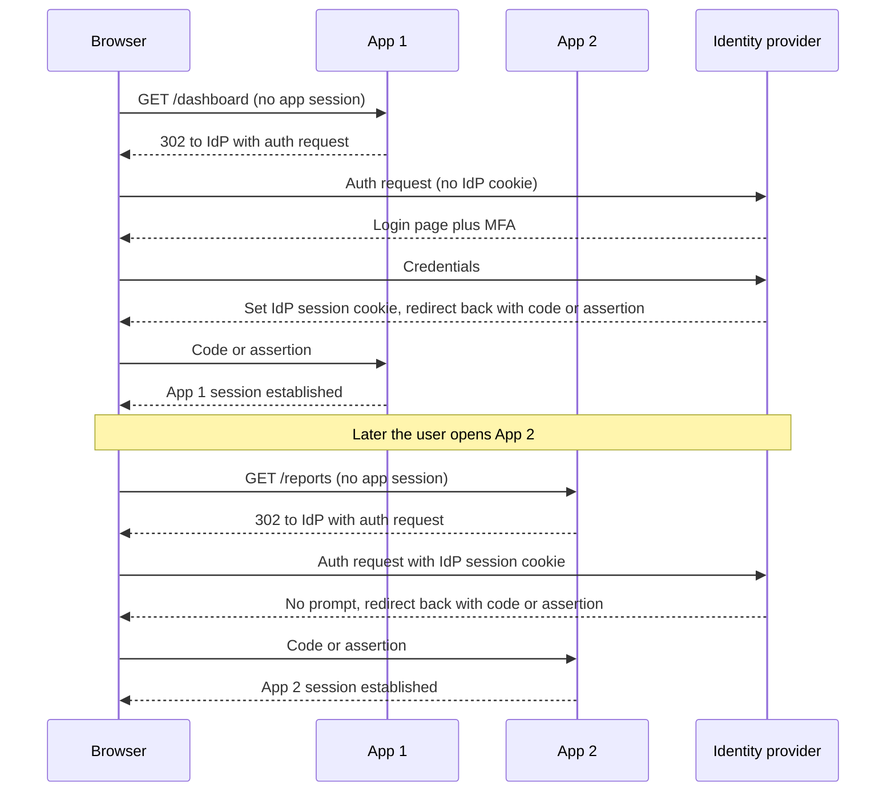
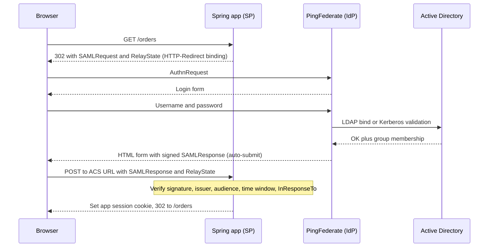
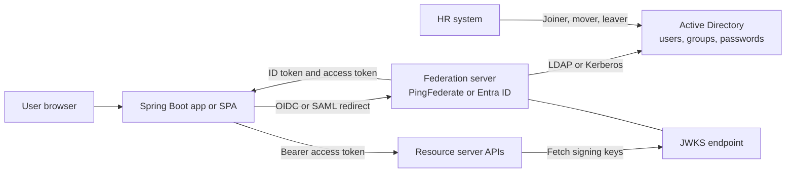

# SSO, SAML vs OIDC & Enterprise IdPs (PingFederate, Active Directory/Entra ID)

!!! abstract "TL;DR"
    - **SSO is a session at the identity provider (IdP).** Each application still has its own session or token. The second app logs you in silently because the browser already carries the IdP's session cookie.
    - **SAML 2.0** = signed **XML assertions** delivered through the browser (usually an auto-submitted form POST). **OIDC** = an identity layer on OAuth2: a signed **JWT ID token** obtained through the back channel with the authorization code flow.
    - SAML only solves **browser login**. OIDC/OAuth2 also solves **API access, SPAs, mobile apps and service-to-service calls**, which is why new work defaults to OIDC and SAML stays for legacy and vendor (SaaS) integrations.
    - **Active Directory** is the user directory (LDAP/Kerberos). **PingFederate** and **Entra ID** are federation servers that authenticate against a directory and then speak SAML, OIDC and OAuth2 to applications.
    - Trust comes from **pre-exchanged metadata**: issuer/entity ID, signing keys, endpoints. An application must validate **signature, issuer, audience, time window and replay/nonce**, and must authorise on a **stable identifier**, never on email.

## Why it matters

Before federation every application kept its own user table and password. Users had many passwords, offboarding meant deleting accounts in many places, and each application was a separate place to steal credentials from.

Federation moves authentication to one trusted system. The application stops handling passwords and only verifies a signed statement: "the IdP says this is user X, authenticated at time T, for audience A". This gives one place for MFA, password policy, conditional access, audit and offboarding.

In interviews this topic separates people who "added the starter and it worked" from people who understand the trust model. The resume says OAuth2 with PingFederate and Active Directory, plus an SSO implementation owned end-to-end, so expect questions such as "walk me through what happens when a user opens your app", "why OIDC and not SAML?" and "how did AD groups become permissions in your service?".

Related pages: OAuth2 flows are in [OAuth2 roles & grant types](05-oauth2-roles-and-grant-types.md), the ID token in [OpenID Connect](06-openid-connect-id-token-userinfo-discovery.md), JWT validation in [JWT](04-jwt-structure-signing-validation-revocation.md), and Spring configuration details in [Resource server & client configuration](07-resource-server-and-client-configuration-in-spring.md).

## Core concepts

### What SSO actually is

Three terms get mixed up:

| Term | Meaning |
|---|---|
| **Single sign-on (SSO)** | Log in once at the IdP, then reach many applications without typing credentials again |
| **Federation** | Trust between separate security domains, so an identity issued by one organisation or system is accepted by another |
| **Directory** | The store of users, groups and credentials (Active Directory, LDAP) |

The mechanism behind SSO is simple. After the first login the IdP sets **its own session cookie on its own domain**. When a second application redirects the browser to the IdP, the browser sends that cookie, the IdP sees a valid session, skips the login page and immediately issues a new assertion or code for the second application.

So there are always **two layers of session**:

1. The **IdP session** (cookie on `sso.company.com`).
2. One **application session** per app (a session cookie or the app's tokens).

This explains most logout bugs: ending the application session does not end the IdP session, so the user clicks "Login" and is back in without a prompt.


*Notice that App 2 never talks to App 1. The only shared thing is the IdP session cookie, and each app still builds its own session.*

### SAML 2.0 in one page

SAML 2.0 (OASIS, 2005) was designed for browser-based web applications in enterprises. Its vocabulary:

| SAML term | Meaning | OIDC equivalent |
|---|---|---|
| Identity Provider (IdP) / asserting party | Authenticates the user, signs assertions | OpenID Provider (OP) |
| Service Provider (SP) / relying party | The application | Relying Party (client) |
| Assertion | Signed XML statement about the user | ID token (JWT) |
| Entity ID | Unique name of an IdP or SP | Issuer / `client_id` |
| Assertion Consumer Service (ACS) URL | Where the SP receives the response | `redirect_uri` |
| Metadata XML | Endpoints, certificates, entity ID | Discovery document + JWKS |
| `RelayState` | Opaque value round-tripped through the IdP | `state` |
| `InResponseTo` | Binds the response to the request | `nonce` / `state` |
| NameID + attributes | User identifier and profile data | `sub` + claims |

An assertion contains:

- **Issuer**: the IdP entity ID.
- **Signature**: XML Digital Signature over the assertion, the response, or both.
- **Subject / NameID**: who the user is, plus `SubjectConfirmationData` with `Recipient`, `NotOnOrAfter` and `InResponseTo`.
- **Conditions**: `NotBefore`, `NotOnOrAfter` and `AudienceRestriction` (the SP entity ID).
- **AuthnStatement**: when and how the user authenticated, and `SessionIndex` used for logout.
- **AttributeStatement**: email, groups, department and so on.

**Bindings** describe how messages travel. The two that matter: **HTTP-Redirect** (deflated and base64-encoded message in the query string, used for the small `AuthnRequest`) and **HTTP-POST** (base64 in a hidden form field that the browser auto-submits, used for the large `Response`).


*Notice that the signed assertion travels through the browser (front channel) and there is no direct SP-to-IdP call. Security rests entirely on the XML signature and the validation checks in the note.*

**SP-initiated vs IdP-initiated.** In SP-initiated login the user starts at the application, which sends an `AuthnRequest`, so the response can be tied to a request (`InResponseTo`). In IdP-initiated login the user clicks a tile on the IdP portal and the IdP posts an **unsolicited** response. There is no request to match, so the SP cannot detect an injected or replayed response as easily. Prefer SP-initiated. If a portal tile is required, make the tile simply link to the application's login URL, which then starts an SP-initiated flow.

### OIDC in comparison

OIDC puts identity on top of the OAuth2 authorization code flow (details in [page 5](05-oauth2-roles-and-grant-types.md) and [page 6](06-openid-connect-id-token-userinfo-discovery.md)). The differences that matter for this comparison:

- The browser carries only a short-lived, one-time **authorization code**. The application exchanges it for tokens on the **back channel** (server to IdP over TLS), authenticating itself with a client secret or a private key (confidential clients), while PKCE's code verifier proves that the same party that started the flow is finishing it (the only protection a public client has, and recommended for confidential clients too).
- The identity statement is a **JWT** (compact, JSON, JWS signature), not XML.
- Keys rotate automatically through the **JWKS** endpoint found by discovery. SAML certificates are rotated by updating metadata, often manually.
- The same flow returns an **access token** for calling APIs. SAML has nothing equivalent that works well for APIs.

| | SAML 2.0 | OIDC |
|---|---|---|
| Year / body | 2005, OASIS | 2014, OpenID Foundation |
| Format | XML assertion, XML-DSig | JWT (JWS, optional JWE) |
| Transport | Browser front channel (Redirect/POST bindings) | Front channel for the code, back channel for tokens |
| Solves | Browser web SSO | Web SSO, SPAs, mobile, plus API authorisation through OAuth2 |
| Trust setup | Exchange metadata XML and certificates | Client registration, discovery document, JWKS |
| Key rotation | Metadata update, often a coordinated change | Automatic through JWKS `kid` lookup |
| Request/response binding | `InResponseTo`, `RelayState` | `state`, `nonce`, PKCE |
| Logout | Single Logout (SLO) through front or back channel, fragile | RP-initiated, back-channel and front-channel logout specs |
| Mobile/SPA fit | Poor (form POST, XML parsing) | Good (code + PKCE) |
| Typical risk | XML signature wrapping, parser differences | Missing audience/issuer checks, redirect URI mistakes |

### When each one is the right answer

- **New application you build, with APIs behind it**: OIDC for login, OAuth2 access tokens for APIs.
- **Buying a SaaS product that only supports SAML**, or an enterprise customer whose IdP team only offers SAML: use SAML. Many B2B products must support both.
- **Legacy internal web applications** already on SAML: leave them. Migration brings risk and little value unless you need tokens for APIs.
- **Both at once** is normal. A federation server can issue a SAML assertion to one application and OIDC tokens to another from the same user session.

### Enterprise IdPs: who does what


*Notice that Active Directory never talks to the application. The federation server is the translator between directory protocols and web protocols, and the APIs only need its public keys.*

**Active Directory Domain Services (AD DS)** is the on-premises directory. It stores users, groups and password hashes and speaks **LDAP** (lookup), **Kerberos** and **NTLM** (authentication inside the corporate network). Kerberos gives desktop SSO: logging in to Windows yields a ticket-granting ticket, and services are accessed with service tickets without retyping the password. These protocols were not designed for the internet or for third-party SaaS, which is why a federation layer exists.

**AD FS** is Microsoft's on-premises federation server in front of AD (SAML, WS-Federation, OIDC). **Microsoft Entra ID** (formerly Azure AD) is a separate cloud identity service, not "AD in the cloud". It speaks OIDC, OAuth2 and SAML, has no LDAP or Kerberos interface for applications by default, and is usually kept in sync with on-premises AD through Entra Connect.

**PingFederate** is a federation server from Ping Identity, common in large healthcare, banking and insurance companies. Its building blocks are useful vocabulary in an interview:

| PingFederate concept | Role |
|---|---|
| IdP adapter (HTML Form, Kerberos) | How the user authenticates to PingFederate |
| Password credential validator | Checks the password against LDAP/AD |
| Data store | LDAP/JDBC source for attribute lookup |
| SP connection | A SAML trust with one application |
| OAuth client | A registered OIDC/OAuth2 application |
| Access token manager | Decides the access token format: signed **JWT** or opaque **reference token** validated by introspection |
| OIDC policy | Maps directory attributes into ID token and userinfo claims |
| Authentication policy | Chains adapters, for example Kerberos first, then form plus MFA |

PingFederate publishes standard discovery at `/.well-known/openid-configuration`. Its endpoint paths are recognisable: `/as/authorization.oauth2`, `/as/token.oauth2`, `/as/introspect.oauth2` and the key set at `/pf/JWKS`.

A typical enterprise chain: a user on a corporate laptop is authenticated to PingFederate silently with **Kerberos** (no prompt), PingFederate looks up **AD groups** over LDAP, the OIDC policy maps them into a claim, and the application receives tokens. From outside the network the same policy falls back to a form plus MFA.

### Identity brokering

Often there are two IdPs in a row: the application trusts PingFederate over OIDC, and PingFederate trusts a partner's or parent company's IdP over SAML. PingFederate then acts as an SP on one side and an IdP on the other. This keeps applications simple: they integrate with one issuer and one claim format, while the broker handles each upstream protocol.

## In practice: code & configuration

### OIDC login plus resource server against an enterprise IdP

```yaml
spring:
  security:
    oauth2:
      client:
        registration:
          ping:
            client-id: orders-web
            client-secret: ${PING_CLIENT_SECRET}        # from a secret manager, never in git
            scope: openid, profile, email
            authorization-grant-type: authorization_code
        provider:
          ping:
            issuer-uri: https://sso.example.com          # discovery fills in all endpoints and the JWKS URI
      resourceserver:
        jwt:
          issuer-uri: https://sso.example.com
          audiences: orders-api                          # reject tokens minted for other APIs
```

The `audiences` property (Spring Boot 2.7+) is applied only to the `JwtDecoder` that Boot auto-configures. As soon as you declare your own `JwtDecoder` bean, as in the "correct" tab below, Boot backs off and the property is ignored, so the audience check must be in the bean. Use one approach or the other, and know which one is active.

The key part is how identity and groups become Spring authorities.

=== "❌ Common mistake"
    ```java
    @Bean
    JwtDecoder jwtDecoder() {
        // Signature is checked, but no issuer and no audience validation:
        // any token signed by this IdP for ANY application is accepted.
        return NimbusJwtDecoder.withJwkSetUri("https://sso.example.com/pf/JWKS").build();
    }

    @GetMapping("/admin/refunds")
    List<Refund> refunds(@AuthenticationPrincipal Jwt jwt) {
        // Authorising on a mutable, sometimes unverified attribute.
        if (!jwt.getClaimAsString("email").endsWith("@example.com")) {
            throw new AccessDeniedException("no");
        }
        return refundService.findAll();
    }
    ```

=== "✅ Correct approach"
    ```java
    @Configuration
    @EnableMethodSecurity
    class SecurityConfig {

        @Bean
        SecurityFilterChain api(HttpSecurity http) throws Exception {
            return http
                .authorizeHttpRequests(a -> a.anyRequest().authenticated())
                .oauth2ResourceServer(o -> o.jwt(j -> j.jwtAuthenticationConverter(authConverter())))
                .build();
        }

        @Bean
        JwtDecoder jwtDecoder() {
            NimbusJwtDecoder decoder = JwtDecoders.fromIssuerLocation("https://sso.example.com");
            OAuth2TokenValidator<Jwt> audience = new JwtClaimValidator<List<String>>(
                    "aud", aud -> aud != null && aud.contains("orders-api"));   // token must be meant for us
            decoder.setJwtValidator(new DelegatingOAuth2TokenValidator<>(
                    JwtValidators.createDefaultWithIssuer("https://sso.example.com"), // iss + exp/nbf
                    audience));
            return decoder;
        }

        // Map directory groups (a claim filled by the IdP's OIDC policy) to application roles.
        private JwtAuthenticationConverter authConverter() {
            Map<String, String> groupToRole = Map.of(
                    "CN=Orders-Admins,OU=Groups,DC=example,DC=com", "ROLE_ORDERS_ADMIN",
                    "CN=Orders-Users,OU=Groups,DC=example,DC=com", "ROLE_ORDERS_USER");

            var converter = new JwtAuthenticationConverter();
            converter.setPrincipalClaimName("sub");                 // stable identifier, not email
            converter.setJwtGrantedAuthoritiesConverter(jwt -> {
                List<String> groups = jwt.getClaimAsStringList("groups");
                if (groups == null) return List.of();               // deny by default when the claim is missing
                return groups.stream()
                        .map(groupToRole::get)
                        .filter(Objects::nonNull)                   // unknown groups grant nothing
                        .<GrantedAuthority>map(SimpleGrantedAuthority::new)
                        .toList();
            });
            return converter;
        }
    }

    @PreAuthorize("hasRole('ORDERS_ADMIN')")
    @GetMapping("/admin/refunds")
    List<Refund> refunds() { return refundService.findAll(); }
    ```

Keeping the group-to-role mapping in the application (or in configuration) means directory group names do not leak into `@PreAuthorize` expressions, and a renamed AD group is a one-line change.

### SAML 2.0 login in Spring Security

Spring Security's SAML support (`spring-security-saml2-service-provider`) is built on **OpenSAML**. Spring Security 6 uses OpenSAML 4 by default and added OpenSAML 5 support in 6.4, and Spring Security 7 builds on OpenSAML 5. OpenSAML artifacts come from the Shibboleth Maven repository, which catches teams out when a corporate proxy only mirrors Maven Central.

```yaml
spring:
  security:
    saml2:
      relyingparty:
        registration:
          ping:
            entity-id: https://orders.example.com/saml2/sp          # our SP entity ID = the audience
            assertingparty:
              metadata-uri: https://sso.example.com/pf/federation_metadata.ping?PartnerSpId=orders
            signing:
              credentials:                                          # used to sign AuthnRequests and logout messages
                - private-key-location: file:/etc/secrets/sp-key.pem
                  certificate-location: file:/etc/secrets/sp-cert.pem
```

```java
@Bean
SecurityFilterChain web(HttpSecurity http) throws Exception {
    return http
        .authorizeHttpRequests(a -> a.anyRequest().authenticated())
        .saml2Login(Customizer.withDefaults())      // SP-initiated login + ACS endpoint
        .saml2Logout(Customizer.withDefaults())     // Single Logout, needs signing credentials
        .saml2Metadata(Customizer.withDefaults())   // publishes SP metadata for the IdP team
        .build();
}
```

Default endpoints to remember: login starts at `/saml2/authenticate/{registrationId}`, the ACS is `/login/saml2/sso/{registrationId}`, and the OIDC equivalent redirect URI is `/login/oauth2/code/{registrationId}`. After login the principal is a `Saml2AuthenticatedPrincipal` with `getName()` (the NameID) and `getAttribute("groups")`, which returns a `List` because SAML attributes are multi-valued (`getFirstAttribute` returns a single value). Spring Security 7 deprecates this type in favour of `Saml2ResponseAssertionAccessor`, so check which version the project is on.

### Logging out of the IdP as well (OIDC)

```java
@Bean
SecurityFilterChain web(HttpSecurity http, ClientRegistrationRepository clients) throws Exception {
    var idpLogout = new OidcClientInitiatedLogoutSuccessHandler(clients);
    idpLogout.setPostLogoutRedirectUri("{baseUrl}/signed-out");     // must be registered at the IdP

    return http
        .authorizeHttpRequests(a -> a.anyRequest().authenticated())
        .oauth2Login(Customizer.withDefaults())
        .logout(l -> l.logoutSuccessHandler(idpLogout))            // RP-initiated logout: end the IdP session too
        .oidcLogout(l -> l.backChannel(Customizer.withDefaults())) // IdP can end OUR session via a logout token
        .build();
}
```

Back-channel logout support arrived in Spring Security 6.2. The IdP sends a signed logout token directly to the application, which invalidates the matching session. It needs a session store that can find sessions by the IdP session ID, which matters when the application runs on several pods.

### Entra ID specifics

```java
// Multi-tenant API: each tenant has its own issuer, so resolve the validator per issuer.
@Bean
SecurityFilterChain api(HttpSecurity http) throws Exception {
    var resolver = JwtIssuerAuthenticationManagerResolver.fromTrustedIssuers(
            "https://login.microsoftonline.com/11111111-aaaa-bbbb-cccc-000000000001/v2.0",
            "https://login.microsoftonline.com/11111111-aaaa-bbbb-cccc-000000000002/v2.0");
    return http
        .authorizeHttpRequests(a -> a.anyRequest().authenticated())
        .oauth2ResourceServer(o -> o.authenticationManagerResolver(resolver)) // unknown issuer = rejected
        .build();
}
```

Things interviewers probe on Entra ID:

- The issuer contains the **tenant ID**. With a multi-tenant app registration you must check the tenant (`tid`) against an allow list, otherwise any Entra tenant in the world can sign in.
- Identify users by **`oid` + `tid`** (or `sub`, which is unique per application). Microsoft's guidance is not to use `email` or `upn` for authorisation because they can change and may be unverified.
- **App roles** arrive in the `roles` claim and are usually a better fit than raw groups.
- **Group overage**: when a user is in too many groups (more than 200 for a JWT, 150 for a SAML token), Entra ID omits the `groups` claim and sends a pointer instead, and the application must call Microsoft Graph. Code that treats "no groups claim" as "no restrictions" becomes a security bug. Code that treats it as "no access" becomes a production incident for senior staff who are in many groups.

## Real-world usage

- **Healthcare and banking** enterprises typically run PingFederate, Entra ID, Okta or ForgeRock in front of Active Directory. Internal staff applications use Kerberos-backed silent SSO. Member or customer applications use a separate customer identity system. Audit requirements (HIPAA, PCI DSS, SOX) favour one central place for MFA, access reviews and offboarding.
- **SMART on FHIR**, the standard for healthcare applications launching against EHR systems, is built on OAuth2 and OIDC, not SAML. Open-banking profiles (FAPI) are also OAuth2/OIDC based. This is a concrete reason to say "OIDC for anything API-shaped".
- **SaaS vendors** nearly all support SAML for enterprise customers because the customers' IdP teams have a mature SAML onboarding process. If you build a B2B product you will be asked for SAML.

Known incidents worth being able to describe:

- **Golden SAML (SolarWinds campaign, 2020).** Attackers who had compromised on-premises AD FS stole the token-signing key and forged SAML assertions for any user, including into cloud services. Lesson: the IdP signing key is the crown jewel. Protect it with an HSM, monitor for tokens the IdP has no record of issuing, and rotate after any compromise.
- **Storm-0558 (2023).** A stolen Microsoft consumer signing key was used to forge tokens accepted by enterprise mailboxes because of a validation flaw in which keys were accepted for which issuer. Lesson: validating a signature is not enough. The key must belong to the expected issuer and the token must be for your audience.
- **XML signature wrapping.** The 2012 paper "On Breaking SAML: Be Whoever You Want to Be" showed many SAML libraries verified the signature on one XML element and then read identity from a different one. The same class of bug returned in 2024 in ruby-saml (CVE-2024-45409), affecting products such as GitLab. Lesson: never hand-roll SAML parsing, keep the library patched, and require a signed assertion.
- **"nOAuth" (2023).** Researchers showed that applications using the mutable `email` claim from multi-tenant Entra ID apps as the user key could be taken over. Lesson: key on `sub`/`oid`.

## Trade-offs & production gotchas

| Option | Pros | Cons | Use when |
|---|---|---|---|
| OIDC (code flow + PKCE) | Works for web, SPA, mobile and APIs; JWKS rotation; simple JSON | Younger enterprise tooling in some companies; easy to skip audience checks | Default for anything you build |
| SAML 2.0 | Universal in enterprise and SaaS; rich attribute statements; mature IdP processes | XML complexity and attack surface; browser only; manual certificate rotation; weak logout | Legacy apps, vendor integrations, customer IdPs that only offer SAML |
| IdP as broker (app speaks OIDC, IdP speaks SAML upstream) | Apps stay simple, one integration | One more hop and one more thing to operate; claim mapping lives in the IdP | Many partners or mixed protocols |
| JWT access tokens | Local validation, no call to the IdP per request | Hard to revoke before expiry; token size grows with groups | High-throughput APIs, short lifetimes |
| Reference (opaque) tokens + introspection | Instant revocation, nothing readable in the token | Network call per request (cache it), IdP becomes a runtime dependency | High-sensitivity operations, external clients |
| Groups in the token | No extra lookup | Token bloat, overage, stale until token expiry | Few, coarse groups |
| Roles looked up in the application | Fine-grained, immediate changes | Extra store and admin UI to maintain | Complex or fast-changing permissions |

!!! warning "Gotcha: SSO does not mean single logout"
    Clearing the application session leaves the IdP session alive. The next redirect logs the user straight back in. Decide explicitly: local logout only, RP-initiated logout (end the IdP session), or back-channel logout so other applications are told as well. On shared workstations, which are common in pharmacies and hospitals, this is a real privacy issue.

!!! warning "Gotcha: SAML responses and `SameSite` cookies"
    The SAML response arrives as a **cross-site POST** from the IdP. A session cookie with `SameSite=Lax` is not sent on that POST, so the application cannot find the saved `AuthnRequest` and `InResponseTo` validation fails, or the user loops back to login. Options: mark the session cookie `SameSite=None; Secure`, or store the request somewhere that does not depend on that cookie.

!!! warning "Gotcha: certificate and key rotation"
    SAML signing certificates expire and the application often holds a static copy. Expiry on a weekend is a classic outage. Load metadata from the IdP's metadata URL so new certificates are picked up, and alert on expiry dates. With OIDC, never pin a single key: resolve by `kid` from the JWKS and let the library refresh on an unknown `kid`.

!!! warning "Gotcha: clock skew and assertion lifetime"
    Assertions are valid for a few minutes (`NotBefore` / `NotOnOrAfter`). A drifting server clock produces intermittent login failures on only some pods. Keep NTP healthy and allow a small skew (Spring's default for JWT timestamps is 60 seconds, and its OpenSAML-based assertion validation allows 5 minutes by default). Do not "fix" it with a large tolerance.

!!! warning "Gotcha: behind a load balancer the URLs do not match"
    The ACS URL or `redirect_uri` the application computes (`http://pod-ip:8080/...`) must equal what is registered at the IdP (`https://orders.example.com/...`). Configure forwarded headers (`server.forward-headers-strategy`) so Spring builds the external URL. For SAML the `Destination` and `Recipient` checks fail otherwise.

!!! tip "Just-in-time provisioning vs SCIM"
    SSO only authenticates. Creating the local user record on first login is **just-in-time provisioning**. It never tells you when someone leaves. **SCIM** is the standard for the IdP to push create, update and deactivate events to the application. Without it, deprovisioned users keep any long-lived tokens or local data until something expires.

## How this connects to my experience

- **Where I used it:**
    - **Publicis Sapient, OptumRx Meteor:** "Built secure enterprise APIs using OAuth2, PingFederate, and Active Directory integration." PingFederate as the authorization server and OIDC provider, Active Directory as the user store, Spring Boot services (including the GraphQL Consumer Service) as resource servers, and the ReactJS application as the client. *[confirm this architecture: the resume bullet only names OAuth2, PingFederate and Active Directory, so verify that PingFederate was the token issuer, that OIDC (not SAML) was used for login, and which component was the registered OAuth client]*
    - **Johnson Controls, Metasys:** "Built user management microservices and owned JWT-based authentication and SSO implementation end-to-end."
- **Talking points:**
    - The login path end to end: React app redirects to PingFederate, the user is authenticated against Active Directory, the app receives tokens through authorization code flow, and the GraphQL service validates the JWT (issuer, audience, expiry, signature through JWKS) on every request. *[confirm: code flow with PKCE in the SPA, or a backend-for-frontend holding the tokens]*
    - How AD groups became permissions: a groups or roles claim mapped in a PingFederate OIDC policy and converted to Spring authorities with a `JwtAuthenticationConverter`. *[confirm the claim name and whether roles came from AD groups or from an application store]*
    - Token format and lifetime: JWT access tokens validated locally versus reference tokens with introspection, and the access token lifetime agreed with the identity team. *[confirm]*
    - Calls from the GraphQL service to the 5 upstream systems: user token relayed, or a client-credentials token per upstream. *[confirm]* See [service-to-service auth](09-service-to-service-auth.md).
    - Working with a separate identity team: requesting client registrations per environment, redirect URIs, scopes and claim mappings, and how long that lead time was. This is an honest leadership point about cross-team dependencies. *[confirm]*
    - At Johnson Controls: what "SSO" meant in Metasys, for example one login shared across several Metasys web applications with a JWT issued by the user management service, or federation to a customer's directory. *[confirm protocol and whether an external IdP was involved]*
- **Likely follow-up chain:**
    1. "Walk me through login in your application." Answer with the redirect sequence above, naming front channel and back channel.
    2. "Where does Active Directory come in?" PingFederate validates credentials against AD (LDAP or Kerberos) and reads attributes. The application never touches AD.
    3. "How does your API trust the token?" Signature through JWKS, issuer, audience, expiry, then group-to-role mapping.
    4. "Why OIDC and not SAML?" There are APIs and an SPA. SAML gives no access token and does not fit non-browser clients.
    5. "What happens when a user is disabled in AD?" New logins and refreshes fail immediately. Existing access tokens live until expiry, so keep them short, or use introspection for sensitive operations.
    6. "What happens when PingFederate rotates its signing key?" The decoder sees an unknown `kid`, refetches the JWKS and carries on. No deployment needed.

    Be ready to say clearly which parts you configured yourself (Spring resource server, client settings, claim mapping in code) and which parts the identity team owned (PingFederate policies, adapters, AD). Interviewers respect a precise boundary more than a vague claim of owning everything.

## Interview questions

### Fundamentals

??? question "Q1. What is SSO, and how does the second application know who you are without a password prompt?"
    **Answer:** SSO means the user authenticates once at a central identity provider and then accesses several applications. The first login creates a session at the IdP, stored as a cookie on the IdP's domain. When the second application redirects the browser to the IdP, the browser sends that cookie, the IdP recognises the session and immediately returns a fresh assertion or authorization code for the second application. Applications never share cookies or sessions with each other.

    **Interviewer listens for:** IdP session cookie, redirect-based flow, separate application sessions.

    **Common wrong answer:** "The applications share a cookie or a token." A shared cookie only works on one parent domain and is not how federated SSO works.

??? question "Q2. Compare SAML and OIDC."
    **Answer:** Both let an application delegate login to an IdP and receive a signed statement about the user. SAML 2.0 uses XML assertions signed with XML-DSig, delivered through the browser by redirect and form POST, and was designed for browser web applications. OIDC is an identity layer on OAuth2: the browser carries only a code, the application exchanges it on the back channel for a JWT ID token and an access token. OIDC is lighter, fits SPAs, mobile apps and APIs, and has automatic key rotation through JWKS. SAML remains dominant for legacy enterprise and SaaS integrations.

    **Interviewer listens for:** format (XML vs JWT), channel (front vs back), use cases (browser only vs APIs too), and a balanced view rather than "SAML is bad".

??? question "Q3. What is the difference between Active Directory, AD FS and Entra ID?"
    **Answer:** Active Directory Domain Services is an on-premises directory that stores users and groups and authenticates with Kerberos, NTLM and LDAP inside the network. AD FS is an on-premises federation server that sits in front of AD and issues SAML, WS-Federation or OIDC tokens to web applications. Entra ID is Microsoft's cloud identity service that natively speaks OIDC, OAuth2 and SAML. It is a different product from AD, commonly synchronised with it through Entra Connect.

    **Common wrong answer:** "Entra ID is Active Directory hosted in Azure." It has no domain controllers, Kerberos or group policy in the classic sense.

??? question "Q4. What does a federation server such as PingFederate do, and why not let the application talk to AD directly over LDAP?"
    **Answer:** It authenticates the user against the directory and then issues standard web tokens (SAML assertions, OIDC ID tokens, OAuth2 access tokens) to applications. Talking to LDAP directly means the application collects the password, every application needs network access and a service account in the directory, there is no SSO, and MFA or conditional access has to be rebuilt in every application. Federation keeps credentials in one place and gives each application only a signed, audience-restricted statement.

    **Interviewer listens for:** the application never sees the password, central MFA and policy, reduced blast radius.

### Intermediate

??? question "Q5. What must a service provider validate in a SAML response?"
    **Answer:** (1) The XML signature, using a certificate from trusted IdP metadata, and that the signature covers the assertion actually being read. (2) Issuer equals the expected IdP entity ID. (3) Audience restriction contains the SP's entity ID. (4) `Destination` and `Recipient` equal the SP's ACS URL. (5) `NotBefore` and `NotOnOrAfter` with small clock skew. (6) `InResponseTo` matches a request this session actually sent. (7) The assertion ID has not been seen before, to stop replay. Use a maintained library (OpenSAML through Spring Security) and do not parse XML by hand.

    **Interviewer listens for:** audience and recipient, replay protection, "signature covers what you read".

    **Common wrong answer:** "Check the signature." A valid signature on an assertion meant for a different service provider is still an attack.

??? question "Q6. SP-initiated vs IdP-initiated SSO. Which is safer and why?"
    **Answer:** SP-initiated: the application sends an `AuthnRequest` and later checks that the response's `InResponseTo` matches it, so unsolicited or stolen responses are rejected. IdP-initiated: the IdP sends a response with no prior request, so there is nothing to correlate. A stolen assertion can be injected into a victim's or attacker's browser, similar to login CSRF. SP-initiated is safer. If the business wants a portal tile, point the tile at the application's own login URL so it starts an SP-initiated flow.

??? question "Q7. A user logs out of your application, clicks Login and is signed in again without a prompt. Why, and is it a bug?"
    **Answer:** Logout ended only the application session. The IdP session cookie is still valid, so the next redirect returns a new code or assertion silently. Whether it is a bug depends on requirements. To really sign out, use RP-initiated logout in OIDC (redirect to the IdP's `end_session_endpoint` with an `id_token_hint`, which Spring does with `OidcClientInitiatedLogoutSuccessHandler`) or SAML Single Logout. To also end sessions in other applications, the IdP needs back-channel or front-channel logout to each of them. To force a prompt for one sensitive action without logging out, request `prompt=login` or use `max_age` and verify the `auth_time` claim.

    **Interviewer listens for:** two session layers, named logout mechanisms, and awareness that single logout is best effort.

??? question "Q8. Your Spring resource server validates JWTs from PingFederate. PingFederate rotates its signing key at 2 a.m. What happens?"
    **Answer:** Nothing visible, if configured from the issuer or JWKS URI. Each JWT header carries a `kid`. The Nimbus decoder caches the JWK set, and when it sees a `kid` that is not in the cache it refetches the JWKS and finds the new key. Good IdPs also publish the new key before they start signing with it and keep the old one until old tokens expire. It breaks only if someone pinned a single public key in configuration, or if the services cannot reach the JWKS endpoint.

    **Common wrong answer:** "We redeploy with the new certificate." That is the SAML-with-static-certificate habit carried over.

??? question "Q9. Gotcha: the access token from Entra ID has no `groups` claim for one senior user, but it does for everyone else. What is going on?"
    **Answer:** Group overage. When the user belongs to more groups than fit in the token (over 200 for JWTs, 150 for SAML tokens), Entra ID leaves out `groups` and includes a pointer telling the application to query Microsoft Graph. The application must handle it: call Graph for membership, or avoid the problem by using app roles, or by configuring the token to include only groups assigned to the application. The code must fail closed: missing claim means no roles, not all roles.

### Senior

??? question "Q10. You are designing auth for a new platform: a React SPA, Spring Boot APIs and one legacy vendor tool that only supports SAML. The company IdP is PingFederate backed by AD. What do you propose?"
    **Answer:** One IdP session, two protocols. The SPA uses OIDC authorization code flow with PKCE, ideally through a backend-for-frontend so tokens stay server side and the browser holds only a `SameSite` session cookie. APIs are OAuth2 resource servers validating JWT access tokens with issuer and audience checks, and a distinct audience per API or API group. The vendor tool gets a SAML SP connection in PingFederate. Because both hang off the same PingFederate session, the user gets SSO across all three. Authorisation: coarse roles from AD groups mapped to claims in the OIDC policy, fine-grained permissions in the application. Short access tokens, refresh tokens with rotation, RP-initiated logout, and SCIM or a leaver feed for deprovisioning.

    **Interviewer listens for:** not forcing one protocol everywhere, audience separation, where tokens live in the browser, deprovisioning.

??? question "Q11. JWT access tokens or reference tokens with introspection? PingFederate supports both."
    **Answer:** JWTs are validated locally with a cached public key, so they add no latency and no runtime dependency on the IdP, but they cannot be revoked before expiry without extra machinery, and they expose claims to anyone who holds them. Reference tokens are random strings. The resource server calls the introspection endpoint, so revocation is immediate and nothing leaks, at the cost of a network call (cache results for a short time) and a hard dependency on IdP availability. A common split: reference tokens for external or third-party clients, exchanged at the gateway for short-lived internal JWTs, and JWTs between internal services. Details are in [JWT](04-jwt-structure-signing-validation-revocation.md).

??? question "Q12. What is XML signature wrapping and how do you defend against it?"
    **Answer:** XML-DSig signs a referenced element, not the whole document. In a wrapping attack the attacker keeps the original signed assertion somewhere in the document so the signature still verifies, and adds a second, forged assertion in the place where the application logic reads the user identity. The verifier and the consumer look at different elements. Defences: use a hardened, current library that reads identity only from the element whose signature it verified, validate against the SAML schema, reject documents with more than one assertion or with duplicate IDs, require signed assertions, and patch quickly (this bug class reappeared in ruby-saml in 2024). JWT avoids it structurally because the signature covers the exact bytes of header and payload.

    **Interviewer listens for:** "signed element is not the element that was read", and reliance on libraries rather than custom parsing.

??? question "Q13. Why should you not use `email` as the user key, and what do you use instead?"
    **Answer:** Email is mutable (marriage, rebranding, domain migration), can be reassigned to a new employee, and in some IdPs it is user-editable or unverified. In multi-tenant setups an attacker can set the email attribute in their own tenant to the victim's address (the nOAuth issue). Key on the pair **issuer + `sub`**, which OIDC guarantees to be stable and unique within the issuer. With Entra ID, use `tid` + `oid`. In SAML ask the IdP for a persistent NameID or an immutable attribute such as an employee ID or object GUID. Store email only as a display attribute.

??? question "Q14. A partner company wants their employees to log in to your application with their own IdP. How do you design it?"
    **Answer:** Do not integrate each partner into the application. Make your IdP (PingFederate or similar) a **broker**: it has one inbound trust per partner (SAML or OIDC, whatever they offer) and one outbound OIDC contract to your application. Add home-realm discovery (pick the partner by email domain or a tenant-specific URL). Normalise claims in the broker so the application always sees the same shape. Namespace identities by issuer so `sub=123` from partner A never collides with partner B. Never trust partner-asserted roles blindly: map them to your roles and cap what any partner can grant. Add just-in-time provisioning plus a deprovisioning story, and a certificate rotation process per partner.

### Scenario-based

??? question "Q15. After a release, SAML login works locally but in Kubernetes users loop between the application and the IdP. How do you debug it?"
    **Answer:** A loop means the application received the response but did not end up with an authenticated session. Check in this order. (1) **Session affinity or shared sessions:** the `AuthnRequest` was saved in the session on pod A and the response landed on pod B. Use Spring Session with Redis or store the request outside the pod-local session. (2) **`SameSite`:** the cross-site POST to the ACS did not carry the session cookie. (3) **URL mismatch behind the ingress:** `Destination`/`Recipient` is `https://...` but the application thinks it is `http://...`, so configure forwarded headers. (4) **Clock skew** on some nodes. (5) **Certificate changed** on the IdP. Turn on `org.springframework.security.saml2` debug logging: Spring reports the exact validation error, such as an invalid `InResponseTo` or an invalid destination. A SAML tracer browser extension shows the decoded request and response.

    **Interviewer listens for:** a systematic list, knowledge of where the request state is stored, reading the actual validation error.

??? question "Q16. An employee is terminated at 10:00 and disabled in AD. At 10:20 they can still call your API. Explain, and reduce the window."
    **Answer:** Disabling the account stops new logins and, if the IdP checks the directory on refresh, new access tokens. But a JWT access token issued at 09:50 with a one-hour lifetime is self-contained and stays valid until 10:50 because resource servers validate it locally. Options: shorten the access token lifetime (5 to 15 minutes) and make sure refresh re-checks account status. Use reference tokens with introspection for sensitive APIs. Have the IdP send back-channel logout or a revocation event, and keep a small deny list of `sub` or `jti` values in Redis, with a TTL equal to the token lifetime, checked by the gateway. Kill the application session too, since a server-side session can outlive the tokens. The trade-off is latency and IdP dependency versus revocation speed.

??? question "Q17. Your API suddenly accepts tokens that were issued for a different application in the same company. What went wrong?"
    **Answer:** The API validates signature and issuer but not **audience**. Every application at the company gets tokens signed by the same IdP key, so signature and issuer alone only prove "issued by our IdP", not "issued for me". A token for a low-privilege application can then be replayed against a high-privilege API (the confused deputy problem). Fix: configure the expected audience (`spring.security.oauth2.resourceserver.jwt.audiences` or a `JwtClaimValidator` on `aud`), have the IdP issue distinct audiences per API, and check scopes as well. Note that Spring's default validator built from the issuer checks timestamps and issuer only. Audience has to be configured explicitly.

    **Common wrong answer:** "The signing key was leaked." Nothing was leaked. The validation was incomplete.

??? question "Q18. The identity team announces a migration from PingFederate to Entra ID. What changes in your Spring services and what would you check first?"
    **Answer:** If the services are standards based, mostly configuration: new issuer URI, new JWKS, new client IDs and secrets, new redirect URIs registered. The risky part is **claims**. `sub` values will be different (in Entra ID `sub` is pairwise per application), so any data keyed by the old subject needs a mapping through a stable attribute such as employee ID. Group claims change format (object IDs instead of DNs or names) and may hit overage, so the group-to-role map must be rebuilt. Scope and audience formats differ (`api://...`). The token version (v1 vs v2) changes the issuer string. Plan: put claim mapping behind one converter class, run both issuers in parallel with `JwtIssuerAuthenticationManagerResolver` during the cut-over, test with real users who are in many groups, and migrate client by client.

    **Interviewer listens for:** identity key continuity, dual-issuer transition, claim differences rather than "just change the URL".

## Cheat sheet

| Concept | Remember |
|---|---|
| SSO mechanism | IdP session cookie on the IdP domain, plus a separate session per application |
| SAML | XML assertion, XML-DSig, browser POST to the ACS URL, 2005, browser only |
| OIDC | OAuth2 code flow plus JWT ID token, back-channel exchange, works for APIs, SPAs, mobile |
| Term mapping | IdP = OP, SP = RP, assertion = ID token, ACS = redirect URI, RelayState = state, metadata = discovery + JWKS |
| SAML validation | Signature, issuer, audience, recipient/destination, time window, InResponseTo, replay |
| JWT validation | Signature by `kid` from JWKS, `iss`, `aud`, `exp`/`nbf`, then scopes and roles |
| SP- vs IdP-initiated | Prefer SP-initiated because the response is tied to a request |
| AD vs Entra ID | AD = on-premises directory (LDAP, Kerberos). Entra ID = cloud IdP (OIDC, OAuth2, SAML) |
| PingFederate | Federation server: adapters, credential validators, SP connections, OAuth clients, access token managers |
| Ping endpoints | `/as/authorization.oauth2`, `/as/token.oauth2`, `/as/introspect.oauth2`, `/pf/JWKS` |
| Spring SAML | `saml2Login()`, ACS `/login/saml2/sso/{id}`, built on OpenSAML |
| Spring OIDC | `oauth2Login()`, redirect `/login/oauth2/code/{id}`, `issuer-uri` drives discovery |
| User key | `iss` + `sub` (Entra: `tid` + `oid`). Never email |
| Entra groups | Overage above 200 (JWT) or 150 (SAML): call Graph or use app roles. Fail closed |
| Logout | Local, RP-initiated, back-channel. SSO does not imply single logout |
| Deprovisioning | SSO authenticates only. Use SCIM or a leaver feed, and short token lifetimes |
| Incidents | Golden SAML (stolen signing key), signature wrapping, Storm-0558, nOAuth |

## Sources

1. [Spring Security Reference: SAML 2.0 Login](https://docs.spring.io/spring-security/reference/servlet/saml2/login/index.html): relying party configuration, default endpoints, OpenSAML dependency and response validation.
2. [Spring Security Reference: OAuth 2.0 Resource Server JWT](https://docs.spring.io/spring-security/reference/servlet/oauth2/resource-server/jwt.html): issuer-based configuration, JWKS key lookup, validators, audience and clock skew.
3. [Spring Security Reference: OIDC Logout](https://docs.spring.io/spring-security/reference/servlet/oauth2/login/logout.html): RP-initiated logout and back-channel logout support.
4. [OASIS: SAML 2.0 Technical Overview](https://docs.oasis-open.org/security/saml/Post2.0/sstc-saml-tech-overview-2.0.html): assertions, bindings, profiles, SP-initiated and IdP-initiated flows.
5. [OpenID Connect Core 1.0](https://openid.net/specs/openid-connect-core-1_0.html): ID token claims and validation, `sub` stability, `nonce`, `prompt` and `max_age`.
6. [OWASP SAML Security Cheat Sheet](https://cheatsheetseries.owasp.org/cheatsheets/SAML_Security_Cheat_Sheet.html): validation checklist, signature wrapping and IdP-initiated risks.
7. [Microsoft identity platform: access token and ID token claims reference](https://learn.microsoft.com/en-us/entra/identity-platform/access-token-claims-reference): `oid`, `tid`, `sub`, `roles`, groups overage and guidance against using email for authorisation.
8. [PingFederate documentation: OAuth 2.0 and OpenID Connect endpoints](https://docs.pingidentity.com/pingfederate/latest/developers_reference_guide/pf_oauth_20_endpoints.html): authorization, token, introspection and JWKS endpoints, access token management.
