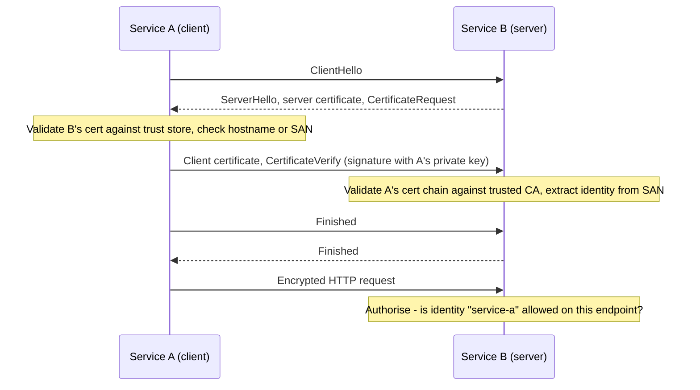
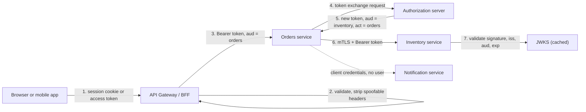

# Service-to-Service Auth: mTLS, Token Exchange & Propagation Through Gateways

!!! abstract "Key takeaways"
    - Every internal call carries up to **two identities**: the **calling service** (workload identity) and the **end user** it acts for. Decide how each one is proven. They are different problems.
    - **mTLS** proves the *service* at the transport layer: both sides present X.509 certificates. It says nothing about the user and only covers one hop.
    - **Client credentials** gives a service its own token (no user). **Token relay** forwards the user's token unchanged. **Token exchange (RFC 8693)** swaps the incoming token for a new one that is scoped down and has the right **audience** for the next hop.
    - A **gateway** authenticates at the edge, but downstream services must still **validate a token themselves**. Never trust plain headers like `X-User-Id` unless the network path guarantees only the gateway could have set them.
    - Senior answer: **layer them**. mTLS (often via a service mesh) for "which workload is calling", plus a JWT for "which user and which permissions", with **audience checks** on every service.

## Why it matters

In a monolith, a method call needs no authentication. Split it into 30 services and each of those calls becomes a network request that anyone on the network could forge.

The old answer was the **perimeter model**: authenticate at the edge, then trust everything inside the VPC. It fails because one compromised pod, one SSRF bug or one leaked internal URL gives an attacker the same trust as your own services. **Zero trust** (NIST SP 800-207) replaces it with one rule: every request is authenticated and authorised, wherever it comes from.

This topic shows up in interviews as "how do your microservices talk to each other securely?" It is a favourite for lead roles because there is no single right answer. The interviewer wants to hear you separate the problems and justify the trade-offs.

## Core concepts

### Two identities, three questions

| Question | Identity | Typical proof |
|---|---|---|
| Which **workload** is calling me? | Service identity | mTLS client certificate, or a client-credentials token |
| Which **user** is this on behalf of? | End-user identity | A JWT access token that travels with the request |
| Is this call **allowed**? | Both | Policy: "service A may call `/claims`" and "user has scope `claims.read`" |

A request with only a service identity is fine for batch jobs and Kafka consumers. A request triggered by a user should carry both, so the downstream service can enforce per-user rules and write a correct audit log.

{ loading=lazy }
*Notice the two layers: the certificate answers "which workload", the token answers "which user and which permissions". Neither replaces the other.*

### mTLS: service identity at the transport layer

In normal TLS only the server shows a certificate. In **mutual TLS** the server also sends a `CertificateRequest`, and the client must present its own certificate and prove it holds the private key (by signing the handshake transcript in `CertificateVerify`).


*Notice that the handshake only proves who A is. B must still make a separate authorisation decision, otherwise any service with a valid certificate from your CA can call anything. The message order is simplified and follows TLS 1.2; in TLS 1.3 the server sends its `Finished` before the client sends its certificate, but the proof is the same.*

Key points:

- **Identity lives in the certificate**, usually the Subject Alternative Name. SPIFFE standardises this as a URI such as `spiffe://prod.example.com/ns/pharmacy/sa/claims-service`.
- **Trust comes from a private CA**, not a public one. Whoever can get a certificate from that CA is "inside". Protect the CA and its issuance policy.
- **Certificates should be short-lived** (hours to days) and rotated automatically. Short lifetimes replace revocation lists, which rarely work well in practice.
- **Who does the TLS?** Either the application (Spring Boot with SSL bundles) or a **sidecar/mesh** (Istio, Linkerd), which does mTLS transparently and gives the app plain HTTP on localhost.
- **Limits:** it covers one hop only, carries no user, and is broken by any Layer 7 proxy that terminates TLS (the next hop sees the proxy's certificate, not the original caller's).

### Tokens: client credentials for the service itself

When there is no user (a scheduled job, a Kafka consumer, a cache warm-up), the service authenticates to the authorization server as an OAuth2 **client** and gets its own access token. The grant is covered in [OAuth2 roles & grant types](05-oauth2-roles-and-grant-types.md).

How the service proves itself to the authorization server matters:

| Client authentication | How | Note |
|---|---|---|
| `client_secret_basic` / `client_secret_post` | Shared secret | Simple. The secret must be stored, distributed and rotated |
| `private_key_jwt` (RFC 7523) | Client signs a short-lived JWT assertion | No shared secret. The server only holds the public key |
| `tls_client_auth` (RFC 8705) | mTLS to the token endpoint | Can also **bind** the issued token to the certificate |
| Platform identity | Kubernetes service account token, AWS IAM role, Entra managed identity | No secret to manage at all. Preferred where available |

### Propagating the user: three options

**1. Token relay (pass-through).** Service A forwards the exact access token it received. Easy, and the user identity is preserved. The problems:

- The token must be valid for **every** service in the chain, so its audience and scopes become very broad.
- Any service in the chain can replay that token against any other service. One compromised service is a compromise of everything the token can reach.
- A token that came from a browser-facing client now flows deep inside the system and into its logs.

**2. Service token plus user context in headers.** A calls B with its own client-credentials token and adds `X-User-Id: 42`. B can verify the service, but the user claim is just a string A typed. This is acceptable only when B fully trusts A, and it loses the cryptographic link to the user's login.

**3. Token exchange (RFC 8693).** A sends the incoming token to the authorization server and asks for a **new** token for B. The request uses:

- `grant_type=urn:ietf:params:oauth:grant-type:token-exchange`
- `subject_token` + `subject_token_type`: the token representing the user
- optional `actor_token`: the token representing the service doing the acting
- `audience` / `resource` / `scope`: where the new token will be used and with what rights

The authorization server applies policy ("may `orders-service` exchange for audience `inventory`?") and issues a narrowed token. RFC 8693 describes two semantics:

- **Impersonation:** the new token looks like the user. B cannot tell A was in the middle.
- **Delegation:** the new token has `sub` = user **and** an `act` claim naming the acting service. Chains nest (`act` inside `act`), so you keep a full audit trail.

```json
{
  "iss": "https://idp.example.com",
  "sub": "user-42",
  "aud": "inventory-service",
  "scope": "inventory.read",
  "act": { "sub": "orders-service" }
}
```

Microsoft Entra ID's **on-behalf-of (OBO)** flow solves the same problem with a different grant type (`jwt-bearer`). PingFederate and Keycloak support RFC 8693 token exchange directly.

{ loading=lazy }
*Watch the replay to billing in each lane: the relayed token works there, the exchanged one does not, because its audience is only the next service.*

### Propagation through a gateway


*Notice that every service validates a token itself and each hop gets a token whose audience is only the next service. The gateway is the first check, not the only one.*

What the gateway should do:

- **Authenticate** the caller (validate the JWT, or map a session cookie to a token in a BFF).
- **Strip identity headers** that came from outside (`X-User-Id`, `X-Forwarded-User`, internal debug headers) before adding its own.
- **Pass or translate the token.** Some companies translate any external credential into one internal signed identity token at the edge (Netflix calls theirs a "Passport"), so internal services only understand one format.
- **Coarse authorisation** only (is this route allowed for this scope?). Fine-grained rules stay with the service that owns the data. See [authentication vs authorization](02-authentication-vs-authorization-method-security.md).

### Sender-constrained tokens

A bearer token works for whoever holds it. To stop replay of a stolen token, bind it to a key:

- **Certificate-bound tokens (RFC 8705):** the token carries `cnf: { "x5t#S256": "<cert thumbprint>" }`. The resource server compares it with the client certificate on the mTLS connection.
- **DPoP (RFC 9449):** the same idea at the application layer with a signed proof header, for clients that cannot do mTLS.

This is required by financial-grade profiles (FAPI, used in open banking).

## In practice: code & configuration

Versions: Spring Boot 3.1+ (SSL bundles), 3.2+ (`RestClient`, `RestClientSsl`, `reload-on-update`), Spring Security 6.3+ (token exchange client support, ships with Boot 3.3), 6.4+ (`OAuth2ClientHttpRequestInterceptor`, ships with Boot 3.4). The code below as written therefore needs Boot 3.4 or later. Resource server basics are in [resource server & client configuration](07-resource-server-and-client-configuration-in-spring.md).

### Calling as the service: client credentials

```yaml
spring:
  security:
    oauth2:
      client:
        registration:
          notification:                      # registration id used in code
            provider: idp
            client-id: orders-service
            client-secret: ${ORDERS_CLIENT_SECRET}   # from a secret manager, never in git
            authorization-grant-type: client_credentials
            scope: notifications.send
        provider:
          idp:
            token-uri: https://idp.example.com/oauth2/token
```

=== "❌ Common mistake"
    ```java
    @Service
    class NotificationClient {
        private final RestClient idp = RestClient.create("https://idp.example.com");
        private final RestClient api = RestClient.create("https://notification.internal");

        void send(Notification n) {
            // A new token for EVERY call: doubles latency and can get the client rate limited
            String token = idp.post().uri("/oauth2/token")
                .body("grant_type=client_credentials&client_id=orders&client_secret=hardcoded")
                .retrieve().body(TokenResponse.class).accessToken();

            api.post().uri("/notifications")
                .header("Authorization", "Bearer " + token)
                .body(n).retrieve().toBodilessEntity();
        }
    }
    ```

=== "✅ Correct approach"
    ```java
    @Configuration
    class ServiceClientConfig {

        // Works OUTSIDE an HTTP request (schedulers, Kafka listeners).
        // The default DefaultOAuth2AuthorizedClientManager needs a servlet request.
        @Bean
        OAuth2AuthorizedClientManager serviceClientManager(
                ClientRegistrationRepository registrations,
                OAuth2AuthorizedClientService clients) {
            var manager = new AuthorizedClientServiceOAuth2AuthorizedClientManager(registrations, clients);
            manager.setAuthorizedClientProvider(
                OAuth2AuthorizedClientProviderBuilder.builder().clientCredentials().build());
            return manager;                  // caches the token and refetches it shortly before expiry
        }

        @Bean
        RestClient notificationRestClient(RestClient.Builder builder,
                                          OAuth2AuthorizedClientManager serviceClientManager) {
            var oauth = new OAuth2ClientHttpRequestInterceptor(serviceClientManager);
            oauth.setClientRegistrationIdResolver(request -> "notification");  // which registration to use
            return builder.baseUrl("https://notification.internal")
                          .requestInterceptor(oauth)   // adds Authorization: Bearer <cached token>
                          .build();
        }
    }
    ```

### Propagating the user: token exchange

```yaml
spring:
  security:
    oauth2:
      client:
        registration:
          inventory:
            provider: idp
            client-id: orders-service
            client-secret: ${ORDERS_CLIENT_SECRET}
            authorization-grant-type: urn:ietf:params:oauth:grant-type:token-exchange
            scope: inventory.read
```

```java
@Configuration
class TokenExchangeConfig {

    // Spring Security 6.3+: publishing this bean enables the token-exchange grant.
    // By default the subject token is the bearer token of the current authenticated request.
    @Bean
    OAuth2AuthorizedClientProvider tokenExchange() {
        return new TokenExchangeOAuth2AuthorizedClientProvider();
    }

    @Bean
    RestClient inventoryRestClient(RestClient.Builder builder,
                                   OAuth2AuthorizedClientManager authorizedClientManager) {
        var oauth = new OAuth2ClientHttpRequestInterceptor(authorizedClientManager);
        oauth.setClientRegistrationIdResolver(request -> "inventory");
        return builder.baseUrl("https://inventory.internal").requestInterceptor(oauth).build();
    }
}
```

Two things to know about this example:

- **Spring does not send `audience` or `resource` by default.** The default token-exchange request contains the grant type, `subject_token`, `subject_token_type`, `requested_token_type` and `scope` (plus the actor token if you configure an actor token resolver). If your IdP selects the target from `audience`/`resource`, add the parameter yourself with a parameters converter on the token response client (`RestClientTokenExchangeTokenResponseClient.addParametersConverter(...)` in 6.4+). Otherwise the narrowing comes only from `scope` and from the IdP's policy for this client.
- **Manager beans can collide.** Spring Security registers its default `OAuth2AuthorizedClientManager` (which picks up the `TokenExchangeOAuth2AuthorizedClientProvider` bean) only when the application defines no manager bean of its own. If the same application also declares the `serviceClientManager` bean from the previous section, that bean is the one injected here and it only supports client credentials, so no exchange happens. In that case build one manager with both providers (`OAuth2AuthorizedClientProviderBuilder.builder().clientCredentials().provider(new TokenExchangeOAuth2AuthorizedClientProvider()).build()`) or keep the two managers apart with qualifiers.

If you only need plain relay (same token, next hop), read the incoming `Jwt` from the `SecurityContext` and copy it to the outgoing `Authorization` header. Do this knowingly: it is the weakest option. In Spring Cloud Gateway the `TokenRelay` filter does the equivalent for a gateway that logged the user in as an OAuth2 client.

### The receiving side: always check the audience

```java
@Configuration
@EnableMethodSecurity
class ResourceServerConfig {

    @Bean
    SecurityFilterChain api(HttpSecurity http) throws Exception {
        return http
            .authorizeHttpRequests(a -> a
                .requestMatchers("/actuator/health/**").permitAll()
                .anyRequest().authenticated())
            .oauth2ResourceServer(o -> o.jwt(Customizer.withDefaults()))
            .sessionManagement(s -> s.sessionCreationPolicy(SessionCreationPolicy.STATELESS))
            .build();
    }

    @Bean
    JwtDecoder jwtDecoder(@Value("${idp.issuer}") String issuer) {
        NimbusJwtDecoder decoder = JwtDecoders.fromIssuerLocation(issuer);
        // The decoder verifies the signature; the default validators check exp/nbf and iss. Nothing checks aud.
        OAuth2TokenValidator<Jwt> audience = new JwtClaimValidator<List<String>>(
            JwtClaimNames.AUD, aud -> aud != null && aud.contains("inventory-service"));
        decoder.setJwtValidator(new DelegatingOAuth2TokenValidator<>(
            JwtValidators.createDefaultWithIssuer(issuer), audience));
        return decoder;
    }
}
```

Boot can also do this from configuration with `spring.security.oauth2.resourceserver.jwt.audiences`.

### mTLS in the application (when there is no mesh)

```yaml
server:
  ssl:
    bundle: server
    client-auth: need                 # reject connections without a valid client certificate
spring:
  ssl:
    bundle:
      pem:
        server:
          reload-on-update: true      # pick up rotated certificates without a restart
          keystore:
            certificate: file:/certs/tls.crt
            private-key: file:/certs/tls.key
          truststore:
            certificate: file:/certs/ca.crt     # the internal CA, not the public trust store
```

```java
@Bean
SecurityFilterChain mtls(HttpSecurity http) throws Exception {
    return http
        .x509(x -> x
            .subjectPrincipalRegex("CN=(.*?)(?:,|$)")          // certificate CN becomes the principal name
            .userDetailsService(cn -> switch (cn) {            // allow-list, not "any cert from our CA"
                case "orders-service"  -> User.withUsername(cn).password("").roles("ORDERS").build();
                case "billing-service" -> User.withUsername(cn).password("").roles("BILLING").build();
                default -> throw new UsernameNotFoundException(cn);
            }))
        .authorizeHttpRequests(a -> a
            .requestMatchers("/internal/stock/**").hasAnyRole("ORDERS", "BILLING")
            .anyRequest().denyAll())
        .build();
}

// Client side: present our certificate using the same bundle mechanism.
// "client" is a second bundle (spring.ssl.bundle.pem.client) defined in the CALLING service's config,
// with its own keystore (client cert + key) and the internal CA as truststore.
@Bean
RestClient inventoryMtlsClient(RestClient.Builder builder, RestClientSsl ssl) {
    return builder.baseUrl("https://inventory.internal:8443")
                  .apply(ssl.fromBundle("client"))
                  .build();
}
```

With a mesh, the same policy is declared outside the code. In Istio: `PeerAuthentication` with `mtls.mode: STRICT` enforces mTLS, `RequestAuthentication` validates the JWT, and `AuthorizationPolicy` combines both (`principals` for the workload identity, `requestPrincipals` or claims for the user).

## Real-world usage

- **Google** describes its internal model in the BeyondProd paper: no trust based on network location, every service has a cryptographic identity, and RPCs are mutually authenticated (ALTS). End-user context travels as a separate ticket.
- **Netflix** authenticates at the edge and converts external tokens into one internal, signed identity structure (the "Passport") that is propagated to downstream services, so services do not need to understand every external token type.
- **Service meshes** (Istio, Linkerd) made mTLS practical for ordinary teams by automating certificate issuance and rotation. SPIFFE/SPIRE is the vendor-neutral standard for workload identity.
- **Cloud platforms** offer workload identity without secrets: AWS IAM roles with SigV4-signed requests, Kubernetes projected service account tokens, Entra managed identities.
- **Failure mode: certificate expiry.** Expired certificates are a classic cause of large outages (for example the Ericsson software certificate expiry that took down O2's mobile data network in December 2018, and the Microsoft Teams outage in February 2020). Automated rotation and expiry alerts are not optional.
- **Regulated domains.** In healthcare, HIPAA's transmission-security and audit-control rules mean PHI should be encrypted in transit inside the network too, and logs must show *which user* accessed a record, not just which service. That needs user identity propagation, not only mTLS. In banking, open-banking profiles (FAPI) require mTLS or `private_key_jwt` client authentication and sender-constrained tokens.

## Trade-offs & production gotchas

| Option | Pros | Cons | Use when |
|---|---|---|---|
| **Network trust only** (VPC, NetworkPolicy) | No code, no latency | One compromised workload owns everything, no audit identity | Never as the only control |
| **mTLS (app-managed)** | Strong service identity, encryption | Certificate lifecycle in every service, no user identity | Few services, no mesh, or calls to external partners |
| **mTLS (service mesh)** | Transparent, auto-rotation, central policy | Mesh complexity and cost, identity stops at Layer 7 proxies | Kubernetes at scale |
| **Client credentials** | Standard, scoped, works across networks | No user, a secret to manage (unless `private_key_jwt` or platform identity) | Batch jobs, events, service-owned operations |
| **Token relay** | Simplest way to keep user identity | Over-broad audience, replay by any hop, long chains outlive token expiry | Short chains inside one trust boundary |
| **Token exchange** | Least privilege per hop, `act` audit trail, crosses trust domains | Extra call to the IdP per audience, more IdP policy to manage | Sensitive data, long chains, multiple trust domains |
| **Edge-issued internal token** | One internal format, edge absorbs external complexity | You run a token-issuing component, key distribution | Many external credential types |

!!! warning "Gotchas"
    - **mTLS is authentication, not authorisation.** "Has a certificate from our CA" must not mean "may call everything".
    - **Missing audience validation.** Spring's default JWT validation checks signature, time and issuer, not `aud`. Without it, a token minted for service X is accepted by service Y (the **confused deputy** problem).
    - **Trusting forwarded headers.** `X-User-Id` or `X-Forwarded-Client-Cert` is only trustworthy if the gateway strips the inbound value and nothing can bypass the gateway.
    - **Token expiry in async flows.** A user token placed in a Kafka message will be expired when the consumer runs. Carry the user id as data and call with the consumer's own service identity, or exchange at processing time.
    - **Lost SecurityContext.** `SecurityContextHolder` is thread-local. `@Async`, `CompletableFuture` and custom executors lose the token unless you use `DelegatingSecurityContextExecutor` or pass the token explicitly.
    - **Fetching a token per request.** Cache until shortly before expiry. Cache exchanged tokens per (user token, audience).
    - **IdP as a single point of failure.** Token exchange puts the IdP on the hot path. Local JWT validation with cached JWKS keeps existing tokens working during a short IdP outage, but new exchanges fail.
    - **Clock skew.** Spring allows 60 seconds by default. Very short-lived tokens plus drifting clocks cause random 401s.
    - **Logging tokens.** Never log the `Authorization` header. Propagate a correlation id for tracing instead.

## How this connects to my experience

- **Where I used it:**
    - **OptumRx Meteor (Publicis Sapient):** "Built secure enterprise APIs using OAuth2, PingFederate, and Active Directory integration" and "Owned the GraphQL Consumer Service end-to-end, acting as the integration layer between 5 upstream systems and multiple downstream consumers." An integration layer in front of five upstreams is exactly a service-to-service auth problem: it receives a user token and must call each upstream with a credential that upstream accepts.
    - **CipherTrust Cloud Key Management (Coriolis):** key management, automated key rotation and HSM integration. This is key-lifecycle background that transfers to the certificate lifecycle behind mTLS. *[confirm whether CCKM work involved X.509 certificates or mTLS directly; the resume only supports keys, rotation and HSMs]*
    - **ConvergeHealth (Deloitte):** "Implemented security controls using IAM, KMS, and Secrets Manager" on AWS: platform workload identity and secret handling. *[confirm whether services called each other with IAM roles / SigV4]*
    - **Metasys (Johnson Controls):** JWT-based authentication and SSO for user management microservices.
- **Talking points:**
    - How the GraphQL Consumer Service authenticated to each of the 5 upstreams: relay of the PingFederate user token, client credentials per upstream, or a mix. *[confirm which upstream used which]*
    - Whether user identity reached the upstreams, and how: forwarded token, token exchange through PingFederate, or user id in a header over a trusted channel. *[confirm]*
    - Whether transport security was mTLS via a mesh or gateway, or one-way TLS inside the cluster. *[confirm; if a platform team owned it, say so and explain what you would expect it to do]*
    - Where secrets and client credentials were stored and how they were rotated. *[confirm]*
    - A healthcare angle that is safe to state as design reasoning: PHI access must be auditable per user, so a service-only identity is not enough for user-triggered reads.
    - From CCKM: why automated key rotation matters and what breaks when it is manual, and how the same reasoning applies to certificate rotation. *[confirm any hands-on certificate rotation before claiming it]*
- **Likely follow-up chain:**
    1. "How did the GraphQL service authenticate to upstreams?" → State the mechanism per upstream and why.
    2. "Why not just forward the user's token?" → Audience and replay risk, and that upstreams owned by other teams may trust a different audience.
    3. "How does the upstream know the user?" → Token exchange with `act`, or relayed JWT validated by the upstream, and what you logged for audit.
    4. "What happens when PingFederate is slow or down?" → Token caching, cached JWKS, timeouts, and which calls fail.
    5. "Would you add mTLS? Who manages the certificates?" → Mesh with automatic rotation, plus authorisation policy on top.

!!! tip "If the honest answer is 'the platform team did it'"
    Say so, then show you understand the design: what the gateway validated, what your service validated again, and what you would change. Owning the reasoning matters more than having written the YAML.

## Interview questions

### Fundamentals

??? question "Q1. What is the difference between TLS and mutual TLS?"
    **Answer:** In TLS only the server presents a certificate, so the client knows who the server is but the server knows nothing about the client. In mTLS the server also requests a client certificate. The client sends it and proves possession of the private key by signing the handshake. Both sides are authenticated and the channel is encrypted.

    **Interviewer listens for:** Proof of possession of the private key, trust anchored in a CA, identity taken from the certificate (SAN).

    **Common wrong answer:** "mTLS is TLS with stronger encryption." The encryption is the same. Only the authentication changes.

??? question "Q2. A request arrives at an internal service. Which identities might you need to know?"
    **Answer:** Two. The **workload** that is calling (service identity) and the **end user** the call is made for. Service identity answers "is this caller allowed to use this API at all?". User identity answers "may this person see this record?" and feeds the audit log. Background jobs have only the first.

    **Interviewer listens for:** Clear separation of the two, and that they are proven by different mechanisms.

    **Common wrong answer:** "Only the user matters." The calling service's identity matters for authorisation too.

??? question "Q3. When do you use the client credentials grant between services?"
    **Answer:** When the service acts as itself with no user involved: schedulers, Kafka consumers, cache refresh, service-owned reference data. The service authenticates to the authorization server and gets a token whose subject is the client. It is the wrong choice when a user triggered the call and the downstream needs per-user authorisation, because the user is lost.

    **Common wrong answer:** Using client credentials everywhere and passing the user id in a header, then calling it "secure".

    **Interviewer listens for:** the service acts as itself, no user, scheduled and async work.

??? question "Q4. What is token relay?"
    **Answer:** Forwarding the access token you received, unchanged, on your outgoing call. Spring Cloud Gateway's `TokenRelay` filter does this at the edge. It keeps the user identity and is simple, but the token must be accepted by every service on the path, so it ends up with a wide audience and can be replayed by any service that sees it.

    **Interviewer listens for:** forward unchanged, keeps user identity, audience widening risk.

    **Common wrong answer:** "Token relay creates a new token for the downstream."

### Intermediate

??? question "Q5. Explain OAuth2 token exchange (RFC 8693)."
    **Answer:** A service sends a token it holds (`subject_token`) to the authorization server's token endpoint with grant type `urn:ietf:params:oauth:grant-type:token-exchange`, plus the `audience`/`resource` and `scope` it needs. The server checks policy and returns a new token for that target. Optionally the service adds an `actor_token` identifying itself. The result is either impersonation (the token looks like the user) or delegation (the token has `sub` = user and an `act` claim naming the service).

    **Interviewer listens for:** New token per hop, narrower audience and scope, `act` claim, policy lives at the IdP.

    **Common wrong answer:** Confusing it with the refresh token grant. Refresh gives the *same client* a fresh token. Exchange produces a token for a *different audience or actor*.

??? question "Q6. Impersonation vs delegation: what is the difference and why does it matter?"
    **Answer:** With impersonation the downstream service sees only the user, as if the user called directly. With delegation the token records both: the user in `sub` and the acting service in `act` (nested for longer chains). Delegation is better for audit and for policies like "this user, but only via the orders service". Impersonation is simpler but hides the intermediary.

    **Interviewer listens for:** who appears as the caller, act claim, audit and authorisation differences.

    **Common wrong answer:** "They are the same."

??? question "Q7. Why is audience validation important, and does Spring do it by default?"
    **Answer:** The `aud` claim says which service a token is meant for. If a service does not check it, a token issued for a low-value service can be replayed against a high-value one that trusts the same issuer. Spring Security's default JWT validators check the signature, timestamps and (when configured) the issuer, but not the audience. You add a `JwtClaimValidator` on `aud` or set `spring.security.oauth2.resourceserver.jwt.audiences`.

    **Interviewer listens for:** The phrase "confused deputy" or the replay scenario, and knowing the default.

    **Common wrong answer:** "Spring checks audience by default." You must configure it.

??? question "Q8. Your `@Scheduled` job calls another service with an OAuth2 `RestClient` and fails with an error about a missing servlet request. Why?"
    **Answer:** The default `OAuth2AuthorizedClientManager` (`DefaultOAuth2AuthorizedClientManager`) is designed to run inside an HTTP request and stores authorized clients against the request. A scheduler thread has no request. Use `AuthorizedClientServiceOAuth2AuthorizedClientManager`, which works outside a request context and stores tokens in an `OAuth2AuthorizedClientService`.

    **Interviewer listens for:** That you have actually hit this. It is a very common real-world bug.

    **Common wrong answer:** "OAuth2 does not work in scheduled jobs."

??? question "Q9. A gateway validates the JWT. Should downstream services validate it again?"
    **Answer:** Yes. Validation is cheap (local signature check with cached JWKS) and it removes the assumption that nothing can reach the service except through the gateway. Internal callers, misconfigured network policies, SSRF and other services all bypass the gateway. The gateway is a first line of defence and a place for cross-cutting concerns, not the only check.

    **Common wrong answer:** "No, the gateway already did it, validating again is wasted latency."

    **Interviewer listens for:** cheap local validation, zero-trust assumption, bypass risk.

### Senior

??? question "Q10. mTLS or JWT for service-to-service auth?"
    **Answer:** They solve different problems, so use both. mTLS authenticates the workload and encrypts the hop, at the transport layer, with no user information. A JWT carries user identity, scopes and audience end to end at the application layer and survives proxies. A good setup has mesh mTLS with a policy on which workloads may talk, plus a JWT validated by each service for user-level authorisation. If forced to pick one: JWT when user context matters, mTLS when it is pure machine-to-machine.

    **Interviewer listens for:** Refusing the false choice, naming the layer each works at, and the limits of each.

    **Common wrong answer:** "mTLS replaces JWT." mTLS has no user identity.

??? question "Q11. What are the risks of forwarding the same user token through a chain of six services?"
    **Answer:**

    1. The token needs an audience and scopes that cover all six, which breaks least privilege.
    2. Any one of the six, if compromised or simply buggy, can use the token against the others.
    3. The token may expire mid-chain, especially with retries or queues.
    4. An external-facing token is now in internal logs and traces.
    5. Downstream services cannot tell which service called them.

    Mitigations: token exchange per hop with a narrow audience, or an internal token minted at the edge, combined with mTLS so service identity is known.

    **Interviewer listens for:** broad audience, blast radius, expiry mid-chain, confused deputy, token exchange as fix.

    **Common wrong answer:** "There is no risk if all services are internal."

??? question "Q12. How do you manage certificates for mTLS across hundreds of services?"
    **Answer:** Automate everything. A private CA (or mesh CA / SPIRE) issues short-lived certificates to workloads based on an attested identity such as the Kubernetes service account. Rotation happens well before expiry without restarts (mesh sidecars do it, Spring Boot SSL bundles support reload). Trust bundles are distributed centrally so the CA itself can be rotated with an overlap period. Monitor days-to-expiry and alert. Short lifetimes mean you do not rely on revocation lists.

    **Interviewer listens for:** Short-lived certs, automated rotation, CA rotation with overlap, expiry monitoring, and awareness that expired certs cause outages.

    **Common wrong answer:** "Generate certificates manually with a one-year expiry."

??? question "Q13. What is a sender-constrained token and when would you need one?"
    **Answer:** A token bound to a key held by the client, so a stolen token is useless without that key. RFC 8705 binds the token to the client's mTLS certificate through a `cnf` claim holding the certificate thumbprint (`x5t#S256`). The resource server compares it with the certificate on the connection. DPoP (RFC 9449) does the same with a signed proof header. You need it for high-value APIs such as payments and open banking (FAPI requires it), and it is a strong answer to "what if a token leaks?".

    **Interviewer listens for:** token bound to a key (mTLS or DPoP), stolen token useless alone.

    **Common wrong answer:** "It is a token encrypted for one service."

??? question "Q14. How do you propagate identity across an asynchronous boundary such as Kafka?"
    **Answer:** Do not put the user's access token in the message. It will expire before consumption, and it becomes a long-lived secret stored in the log. Instead, put the user id (and tenant, correlation id) in the event as data. The producer was authorised when it published. The consumer acts with its own service identity (client credentials) and applies its own rules. Protect the topic with ACLs so only authorised producers can write, because the consumer is trusting the event content. If a downstream truly needs a user-scoped token, the consumer obtains one at processing time through a grant designed for it.

    **Common wrong answer:** "Put the JWT in a Kafka header and validate it in the consumer."

    **Interviewer listens for:** no raw access tokens in messages, user id/claims in signed context, service identity for the consumer.

### Scenario-based

??? question "Q15. Design auth for a GraphQL aggregation service that calls five upstream systems owned by different teams."
    **Answer:** Start by classifying each upstream: does it need the user identity, and which credential does it accept? At the edge, the gateway or the GraphQL service validates the user's JWT (signature, issuer, audience, expiry). For upstreams that enforce per-user rules, exchange the user token for one with that upstream's audience, cached per user token and audience. For upstreams that return shared reference data, use a client-credentials token for the GraphQL service, cached until near expiry. Use mTLS (mesh) between all of them for workload identity. Because GraphQL fans out, obtain tokens once per request per upstream, not per field resolver. Keep field-level authorisation in the GraphQL layer but let each upstream stay the final authority on its own data. Add timeouts and a clear failure mode when the IdP is unavailable.

    **Interviewer listens for:** Per-upstream reasoning instead of one mechanism for all, token caching, fan-out awareness, defence in depth.

    **Common wrong answer:** "Use one service account token for all five upstreams." That loses user identity and least privilege.

??? question "Q16. A partner reports that calling your internal service directly with the header `X-User-Id: admin` returns admin data. What went wrong and how do you fix it?"
    **Answer:** The service trusts a plain header that the gateway normally sets, and the service is reachable without going through the gateway (or the gateway does not strip the inbound header). Immediate fix: block direct access with network policy and make the gateway remove client-supplied identity headers. Proper fix: the service must derive identity from something it can verify, a signed JWT it validates itself, and require mTLS so only known workloads can connect. Then review every service for the same pattern and add a test that sends spoofed headers.

    **Interviewer listens for:** Root cause (unverifiable identity), both the quick containment and the structural fix.

    **Common wrong answer:** "Ask partners not to send that header." The service must not trust unauthenticated headers.

??? question "Q17. Internal calls fail with intermittent 401s only for long-running requests. How do you debug?"
    **Answer:** Suspect token expiry inside the chain. Check the token's `exp` against the request duration, including retries and queue time. Other candidates: clock skew between nodes (compare with the 60-second default tolerance), JWKS key rotation where one instance has a stale key cache, or a cached client token that is reused after it expired because the cache does not refresh early. Fixes: refresh or exchange tokens shortly before expiry, keep clocks in sync, make sure the JWKS cache refetches on an unknown `kid`, and avoid holding a user token across slow async work.

    **Interviewer listens for:** token expiry during long chains, clock skew, refresh or exchange per hop.

    **Common wrong answer:** "The IdP is flaky."

??? question "Q18. You must move 40 services from 'trusted network' to zero trust without downtime. What is your plan?"
    **Answer:** Do it in phases with a permissive step first:

    1. Inventory who calls whom.
    2. Turn on mesh mTLS in **permissive** mode so services accept both plain and mTLS traffic, and watch metrics until all traffic is mTLS.
    3. Switch to **strict** namespace by namespace.
    4. Add resource-server JWT validation to each service in log-only mode, fix callers that send no token, then enforce.
    5. Add audience checks and workload authorisation policies, starting with the most sensitive services.
    6. Introduce token exchange where relay gives too much privilege.

    Throughout: dashboards for rejected requests, a fast rollback switch, and certificate expiry alerts.

    **Interviewer listens for:** Incremental rollout, observe-then-enforce, rollback, prioritising by data sensitivity. This is a leadership question as much as a technical one.

    **Common wrong answer:** "Flip all services to strict mTLS on one day."

## Cheat sheet

| Concept | Remember |
|---|---|
| Two identities | Workload (who is calling) and user (on whose behalf). Prove each separately |
| mTLS | Both sides present certificates. Transport layer, one hop, no user. Still needs authorisation |
| SPIFFE ID | `spiffe://trust-domain/path` in the certificate SAN: a standard workload identity |
| Client credentials | Service acts as itself. Cache the token. Prefer `private_key_jwt` or platform identity over shared secrets |
| Token relay | Same token forwarded. Simple, but broad audience and replay risk |
| Token exchange | RFC 8693. `subject_token` in, new token out with narrower `aud` and scope |
| `act` claim | Delegation: `sub` = user, `act.sub` = acting service. Nested for chains |
| On-behalf-of | Entra ID's equivalent of token exchange (uses the `jwt-bearer` grant) |
| Audience check | Not on by default in Spring. Add a validator or `jwt.audiences` |
| Confused deputy | A service accepts a token meant for another service |
| Gateway | Validates and strips spoofable headers. Downstream services validate again |
| Certificate-bound token | RFC 8705, `cnf.x5t#S256` must match the mTLS client certificate |
| DPoP | RFC 9449, sender-constraining without mTLS |
| Outside a request | Use `AuthorizedClientServiceOAuth2AuthorizedClientManager` |
| Spring versions | Token exchange client support: Security 6.3. `OAuth2ClientHttpRequestInterceptor` for `RestClient`: 6.4. SSL bundles: Boot 3.1 |
| Async / Kafka | Send user id as data, call with the consumer's own identity. Never ship the user token |
| Mesh policy (Istio) | `PeerAuthentication` STRICT + `RequestAuthentication` + `AuthorizationPolicy` |

## Sources

1. [RFC 8693: OAuth 2.0 Token Exchange](https://datatracker.ietf.org/doc/html/rfc8693): grant type, `subject_token`/`actor_token`, impersonation vs delegation, the `act` claim.
2. [RFC 8705: OAuth 2.0 Mutual-TLS Client Authentication and Certificate-Bound Access Tokens](https://datatracker.ietf.org/doc/html/rfc8705): `tls_client_auth` and the `cnf`/`x5t#S256` binding.
3. [Spring Security Reference: OAuth2 Client authorization grants](https://docs.spring.io/spring-security/reference/servlet/oauth2/client/authorization-grants.html): client credentials and token exchange support, `TokenExchangeOAuth2AuthorizedClientProvider`.
4. [Spring Security Reference: OAuth2 Resource Server JWT](https://docs.spring.io/spring-security/reference/servlet/oauth2/resource-server/jwt.html): default validators, adding audience validation, clock skew.
5. [Spring Security Reference: X.509 Authentication](https://docs.spring.io/spring-security/reference/servlet/authentication/x509.html): `x509()` configuration and principal extraction.
6. [Spring Boot Reference: SSL bundles](https://docs.spring.io/spring-boot/reference/features/ssl.html): PEM bundles, reload on update, applying bundles to `RestClient`.
7. [NIST SP 800-207: Zero Trust Architecture](https://csrc.nist.gov/pubs/sp/800/207/final): why network location must not imply trust.
8. [Netflix Tech Blog: Edge Authentication and Token-Agnostic Identity Propagation](https://netflixtechblog.com/edge-authentication-and-token-agnostic-identity-propagation-514e47e0b602): edge authentication and the internal "Passport" identity.
