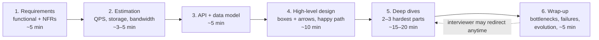
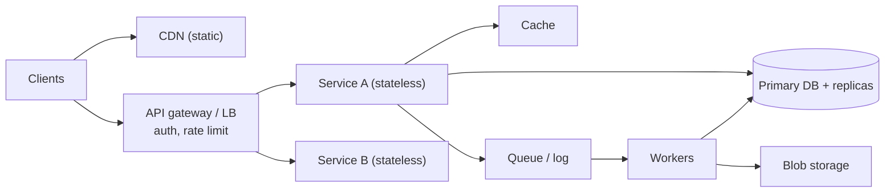

# Approach & Framework for the Design Interview

!!! abstract "TL;DR"
    - A design interview tests **judgement under ambiguity**, not memorised diagrams. The interviewer scores how you **scope**, **reason about scale**, **make and justify trade-offs**, **find bottlenecks** and **communicate**.
    - Use a fixed framework and say it out loud:
        1. **Requirements** (functional + non-functional), ~5 min
        2. **Estimation** (QPS, storage, bandwidth), ~3–5 min
        3. **API + data model**, ~5 min
        4. **High-level design**, ~10 min
        5. **Deep dives** on 2–3 hard parts, ~15–20 min
        6. **Wrap-up**: bottlenecks, failure modes, evolution, ~5 min
    - **Non-functional requirements drive the architecture**: scale, latency (p99), availability (SLO), consistency, durability, security/compliance, cost. Ask for numbers. If you don't get them, **state assumptions**.
    - **Start simple, then evolve.** Draw a design that works at modest scale, then say what breaks at 10× and 100× and fix it. Don't open with Kafka, sharding and five caches.
    - Every component needs a **why** and a **trade-off**: "Cassandra because writes dominate and we can accept eventual consistency; the cost is no ad-hoc queries."

## Why it matters

For Senior and Lead roles, the system design round often decides the level you're offered. Many strong engineers fail it because they **jump to solutions**, **never quantify**, **ignore failure** or **monologue**. A framework fixes all four: it makes you ask before designing, compute before choosing, and check in with the interviewer at each step.

## Core concepts

### The framework on a timeline


*Notice that **deep dives get the most time**. That's where senior signal comes from. The early steps should be quick and deliberate, not skipped.*

### Step 1: Requirements

**Functional:** what users can do. Pick **3–5 core use cases** and explicitly park the rest ("out of scope: admin dashboard, analytics").

**Non-functional:** turn adjectives into numbers.

| NFR | Question to ask | Why it changes the design |
|---|---|---|
| Scale | DAU/MAU? Peak vs average? Growth? | Single node vs distributed, sharding |
| Read/write ratio | 100:1 reads? Write-heavy? | Caching, replicas vs write-optimised stores |
| Latency | p99 target for key paths? | Caching, precomputation, async |
| Availability | SLO (99.9 vs 99.99)? | Redundancy, multi-AZ/Region, degradation |
| Consistency | Can users see stale data? For how long? | Strong vs eventual, transactions |
| Durability | Can we ever lose data? | Replication, backups, write acknowledgement |
| Security/compliance | PII/PHI? Residency? Audit? | Encryption, isolation, Region choice |
| Cost | Budget constraints? | Managed vs self-run, storage tiers |

### Step 2: Estimation

This is just enough maths to choose technologies (see [Back-of-the-envelope estimation](02-back-of-the-envelope-estimation.md)):

- 10M DAU × 10 requests/day = 100M/day ≈ **1,200 QPS** average, **~3–5k** peak.
- Storage per year, bandwidth, cache size (the 80/20 rule: cache the hot 20%).

Round aggressively and **say what the number implies** ("1,200 writes per second fits one well-tuned Postgres primary; 50k doesn't").

### Step 3: API and data model

- **APIs:** the 3–5 endpoints or events for the core use cases, with request and response shapes, pagination and idempotency keys for writes. REST, GraphQL or gRPC, with a reason.
- **Data model:** entities, relationships, **access patterns**, and the storage choice that follows (relational for transactions and joins, key-value for high-scale lookups, wide-column for writes, search index for text, blob storage for media).

### Step 4: High-level design

Draw the **happy path end to end**: client → CDN/edge → load balancer/API gateway → services → cache → database → async workers/queue → blob storage. Walk one request through it. Keep it simple enough to fit a working version on one screen.


*Notice that this generic skeleton covers most problems. The deep dives are where you specialise it: what's in the cache, how the DB is partitioned, what goes async, and why.*

### Step 5: Deep dives

Pick (or let the interviewer pick) the **2–3 hardest parts**:

- **Hot spots:** a celebrity user, a hot key, a thundering herd.
- **Data at scale:** sharding key, rebalancing, secondary indexes.
- **Consistency:** double-booking, payments, counters, ordering.
- **Fan-out:** feeds, notifications.
- **Failure:** what happens when X is down. Retries, idempotency, timeouts, DLQs.
- **Latency:** caching layers, precomputation, geo-distribution.

For each, give **2 options, the trade-off, and your choice**. That's the senior pattern.

### Step 6: Wrap-up

- **Bottlenecks** and the next scaling step (10× → 100×).
- **Failure modes:** single points of failure, dependency outages, data loss scenarios.
- **Operations:** observability (SLIs), deployments, on-call.
- **Security and compliance.**
- **What you'd do differently** with more time.

### What interviewers score

| Signal | Weak | Strong |
|---|---|---|
| Problem exploration | Starts drawing immediately | Clarifies scope and NFRs, states assumptions |
| Quantitative reasoning | No numbers | Estimates and uses them to choose components |
| Design | Buzzword soup | Simple working design that evolves with clear reasons |
| Depth | Shallow everywhere | Deep on the hard parts (data, consistency, hot spots) |
| Trade-offs | "X is best" | "A vs B. I choose A because… The cost is…" |
| Failure thinking | Happy path only | Timeouts, retries, idempotency, degradation, DR |
| Communication | Monologue | Checkpoints: "Does this match what you want to explore?" |
| Leadership (Lead+) | n/a | Phasing, team/ownership boundaries, build vs buy, migration plan |

## In practice: code & configuration

The "code" for a design interview is your **opening**. Compare:

=== "❌ Common mistake"
    ```text
    Interviewer: "Design a prescription refill reminder system."
    Candidate:   "OK, we'll use Kafka, a microservice per entity, Cassandra,
                  Redis, Kubernetes... [draws 15 boxes for 10 minutes]"
    (No users, no scale, no SLAs, no reason for any component.)
    ```

=== "✅ Correct approach"
    ```text
    1. Requirements: "Core: patients get reminders N days before a refill is due,
       by SMS/email/push; they can opt out; pharmacists see delivery status.
       Out of scope: payments, prescribing. NFRs? Assume 5M patients,
       ~1M reminders/day, delivery within 15 min of schedule, no duplicates,
       PHI compliant, 99.9% availability."
    2. Estimate: "1M/day ≈ 12/s average, but batch-scheduled at 9am local → peaks
       of ~1–2k/s. Storage tiny; delivery log ~1M rows/day."
    3. API/data: "POST /reminders/preferences, GET /reminders?patientId=…;
       Reminder(patientId, rxId, dueAt, channel, status, idempotencyKey)."
    4. HLD: "Scheduler finds due reminders → queue → channel workers →
       providers (SMS/email/push); status back to DB."
    5. Deep dives: "Exactly-once-ish delivery (idempotency keys + outbox),
       time-zone peaks (spread + rate limits per provider), provider outage
       (retry with backoff, failover provider, DLQ), PHI (no drug names in SMS)."
    6. Wrap-up: "Bottleneck = provider rate limits; at 10× shard scheduler by
       patientId hash; observability: delivery SLI, DLQ alarms."
    ```

A one-slide **requirements template** worth memorising:

```yaml
functional:      [3–5 core use cases, explicit out-of-scope list]
scale:           {DAU: ?, peak_factor: ?, read_write_ratio: ?, growth: ?}
latency_p99:     {read: ?, write: ?}
availability:    {slo: "99.9%", degraded_modes: ?}
consistency:     {strong_for: [...], eventual_ok_for: [...]}
durability:      {data_loss_tolerance: ?, retention: ?}
security:        {pii_phi: ?, residency: ?, audit: ?}
constraints:     {cloud: ?, team_size: ?, existing_systems: ?}
```

## Real-world usage

- **Real design reviews follow the same shape:** a design doc with context, goals and non-goals, requirements, alternatives considered, the chosen design, failure modes, rollout and an open questions list. Google, Amazon (6-pagers) and Uber (RFCs) all use variants of this.
- **ADRs (Architecture Decision Records)** capture the trade-off reasoning interviewers want to hear: context → decision → consequences.
- **Common failure in real projects** is the same as in interviews: designing for imagined scale (premature microservices or sharding) or ignoring NFRs until production (compliance, latency, cost).

## Trade-offs & production gotchas

| Approach | Pros | Cons | Use when |
|---|---|---|---|
| Breadth-first (sketch everything, then deepen) | Shows the full picture early | Risk of staying shallow | Most interviews |
| Depth-first on the interviewer's hint | Matches their interest | May miss end-to-end flow | When they steer you |
| Start monolith/simple, then evolve | Demonstrates judgement | Must clearly show the evolution | Almost always |
| Start "web-scale" | Sounds impressive | Signals poor judgement | Never as an opening |

!!! warning "Gotchas"
    - **Don't spend 15 minutes on estimation.** Round, use powers of 10, move on.
    - **Don't hide uncertainty.** Say "I'd validate this with a load test" or "I'm assuming eventual consistency is acceptable here. Is it?"
    - **Don't ignore the interviewer's hints.** If they ask "what about hot users?", that's the deep dive they want.
    - **Don't name products without properties.** "Kafka" alone is weak. "A durable, partitioned, replayable log so consumers can rebuild state" is strong.

!!! question "Interview angle"
    For **Lead** roles, add a layer: **phasing** (MVP → v2), **team topology** (which team owns which service), **migration** from the current system, **build vs buy**, and **cost**. Those signals separate Senior from Lead.

## How this connects to my experience

- **Where I used it:** "Collaborated with senior architects on platform architecture and enterprise system design", "design scalable service architecture, API strategies, and data integration patterns" (OptumRx), and "conducted technical interviews" (from the interviewer's side).
- **Talking points:**
    - "On Meteor, design discussions started from NFRs: 750K+ users, PHI, availability for pharmacy workflows. They drove choices like GraphQL aggregation over 5 upstreams with caching and partial-failure handling."
    - "As an interviewer, I look for scoping, numbers and trade-offs over diagrams." *[confirm: you ran design rounds, or only coding rounds?]*
    - "We captured decisions as ADRs or design docs reviewed with architects." *[confirm: format used]*
- **Likely follow-up chain:** "Walk me through a system you designed." → "What were the NFRs?" → "What would you change now?" → "How did you get buy-in?" Use the same framework to tell the story of the GraphQL Consumer Service: requirements → scale → API (schema) → HLD (gateway over 5 upstreams) → deep dives (N+1/DataLoader, caching, timeouts) → lessons.

## Interview questions

### Fundamentals

??? question "Q1. How do you start a system design interview?"
    **Answer:**
    1. Clarify the **core use cases** (3–5) and what's out of scope.
    2. Ask for **NFRs as numbers**: users, peak, read/write ratio, latency, availability, consistency, compliance.
    3. State assumptions where you get no answer.
    4. Lay out the plan: "estimate, API, high-level design, then deep-dive on X and Y."

    **Interviewer listens for:** asking before drawing.

    **Common wrong answer:** naming technologies in the first minute.

??? question "Q2. Functional vs non-functional requirements?"
    **Answer:** Functional requirements are what the system does (use cases). Non-functional requirements are how well it does them: scale, latency, availability, consistency, durability, security, cost. NFRs drive most architectural choices.

    **Interviewer listens for:** that NFRs drive architecture.

    **Common wrong answer:** treating NFRs as an afterthought.

??? question "Q3. Why estimate at all?"
    **Answer:** To choose components with reasons. Is it one database or sharded? Can it be cached in memory? Is bandwidth or storage the bottleneck? Rough orders of magnitude are enough.

    **Interviewer listens for:** using the numbers in later decisions.

    **Common wrong answer:** computing numbers and never referring to them again.

??? question "Q4. What makes a good high-level design?"
    **Answer:** A simple end-to-end design that handles the core use cases at the stated scale, with each component justified. You can walk one request through it. It shows where state lives and what's synchronous vs asynchronous.

    **Interviewer listens for:** simplicity plus a walkthrough.

    **Common wrong answer:** maximum boxes.

### Intermediate

??? question "Q5. How do you choose what to deep-dive on?"
    **Answer:** The parts that are **hard for this problem**: the scaling bottleneck (hot keys, fan-out), correctness (double-spend, ordering), or failure handling. Follow the interviewer's hints. For each, present 2 options, the trade-off and your choice.

    **Interviewer listens for:** prioritisation.

    **Common wrong answer:** deep-diving on the load balancer.

??? question "Q6. How do you present a trade-off?"
    **Answer:** "Option A gives X but costs Y; option B gives Y but costs X. Given our requirement Z, I pick A. If Z changes, B becomes better." Tie it back to the NFRs.

    **Interviewer listens for:** a conditional, requirement-linked choice.

    **Common wrong answer:** "A is best practice".

??? question "Q7. What should the wrap-up include?"
    **Answer:**
    - Bottlenecks and the next scaling steps.
    - Single points of failure.
    - Failure modes and degradation.
    - Observability (SLIs and alerts).
    - Security and compliance.
    - Cost.
    - What you'd do with more time.

    **Interviewer listens for:** an operational mindset.

    **Common wrong answer:** "that's it".

### Senior

??? question "Q8. What changes for a Lead/Principal-level design round?"
    **Answer:** In addition to the technical design:
    - **Phasing** (MVP, then scale).
    - **Migration** from the existing system (strangler fig, dual-write risks).
    - **Team and ownership boundaries** (Conway's law).
    - **Build vs buy.**
    - **Cost.**
    - **Risk management.**
    - **Stakeholder alignment** (ADRs, reviews).

    **Interviewer listens for:** organisational and delivery thinking.

    **Common wrong answer:** just a bigger diagram.

??? question "Q9. The interviewer gives no numbers. What do you do?"
    **Answer:** Propose reasonable assumptions with orders of magnitude ("assume 10M DAU, 10:1 read/write, p99 200 ms, 99.9%"), confirm them quickly, and design for them. Show how the design changes if the numbers are 10× bigger or smaller.

    **Interviewer listens for:** being comfortable with ambiguity.

    **Common wrong answer:** refusing to proceed, or ignoring scale.

??? question "Q10. How do you avoid over-engineering in an interview?"
    **Answer:** Start with the simplest design that meets the NFRs (often one service plus a relational database plus a cache). Add complexity only when a requirement or an estimate forces it, and say which one. Show the evolution path instead of starting at the end state.

    **Interviewer listens for:** a justified evolution.

    **Common wrong answer:** microservices and Kafka by default.

### Scenario-based

??? question "Q11. Halfway through, the interviewer says 'now it needs to work in 5 countries with data residency'. What do you do?"
    **Answer:**
    1. Re-check the NFRs: per-country data stores, routing users to their home Region, global vs local data (catalogue vs PHI), and cross-border analytics using anonymised aggregates.
    2. Show what changes: partition by country, a regional deployment stamp per country, a global control plane for non-sensitive config.
    3. Show what stays the same.

    **Interviewer listens for:** adapting calmly and partitioning by residency.

    **Common wrong answer:** "add a CDN".

??? question "Q12. You realise mid-way that your database choice won't handle the write rate. What now?"
    **Answer:** Say it explicitly: "At 50k writes/s, a single Postgres primary is a bottleneck." Then give options: shard by key, switch to a write-optimised store (Cassandra/DynamoDB) for that data, or buffer writes through a log and batch them. Pick one and explain the consistency or query trade-off.

    **Interviewer listens for:** self-correction, which is a positive signal.

    **Common wrong answer:** hoping they didn't notice.

## Cheat sheet

| Step | Remember |
|---|---|
| 1. Requirements | 3–5 use cases, out-of-scope list, NFRs as numbers, state assumptions |
| 2. Estimate | QPS (avg + peak), storage/yr, bandwidth, cache size. Round. Use the numbers |
| 3. API + data | Core endpoints/events, idempotency keys, access patterns → storage choice |
| 4. HLD | Simple, end to end, walk one request, sync vs async, where state lives |
| 5. Deep dives | 2–3 hardest parts. 2 options → trade-off → choice |
| 6. Wrap-up | Bottlenecks, failures, observability, security, cost, evolution |
| Phrases | "Given requirement X, I choose A over B because… The cost is…" |
| Lead+ | Phasing, migration, team ownership, build vs buy, cost |
| Avoid | Buzzwords without properties, monologue, no numbers, happy path only |

## Sources
1. Alex Xu, *System Design Interview: An Insider's Guide*, Vol. 1 (ch. 3 "A framework for system design interviews") and Vol. 2: the 4-step framework.
2. Martin Kleppmann, *Designing Data-Intensive Applications* (O'Reilly): reliability, scalability, maintainability as NFR lenses.
3. [Google SRE Book: Service Level Objectives](https://sre.google/sre-book/service-level-objectives/): turning availability and latency into SLOs.
4. [AWS Well-Architected Framework](https://docs.aws.amazon.com/wellarchitected/latest/framework/welcome.html): pillars as a trade-off checklist.
5. [Michael Nygard: Documenting Architecture Decisions (ADRs)](https://cognitect.com/blog/2011/11/15/documenting-architecture-decisions): context → decision → consequences.
6. [Hello Interview: System Design in a Hurry, delivery framework](https://www.hellointerview.com/learn/system-design/in-a-hurry/delivery): interview pacing and scoring.
