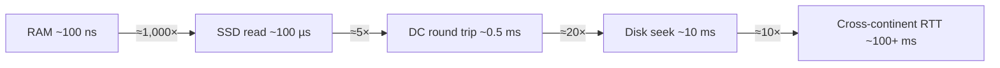
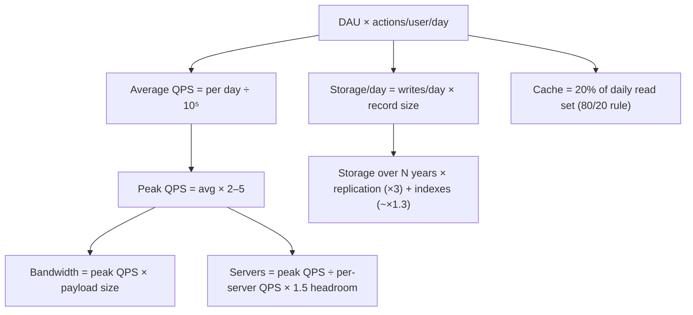

# Back-of-the-Envelope Estimation

!!! abstract "Key takeaways"
    - **Goal:** an **order of magnitude** that drives decisions (one DB or sharded? cache fits in RAM? CDN needed?), not precision. Round hard and say what each number **implies**.
    - **Shortcuts:**
        - 1 day ≈ **10⁵ s** (86,400), so **1M requests/day ≈ 12 QPS** and **100M/day ≈ 1,200 QPS**.
        - Peak ≈ **2–5× average**. Spiky products (sales, 9am logins) go higher.
        - 1 year ≈ **3×10⁷ s**, roughly 400 days to keep the maths easy.
    - **Sizes:** KB 10³, MB 10⁶, GB 10⁹, TB 10¹², PB 10¹⁵. An ASCII char is 1 byte, a UUID 16 B (36 as text), a timestamp 8 B, a typical JSON record 0.5–2 KB, a photo 200 KB–2 MB, a minute of 1080p video ~ 50–100 MB.
    - **Latency ladder** (rough orders):
        - memory reference ~100 ns
        - SSD random read ~0.1 ms
        - same-datacentre round trip ~0.5 ms
        - disk seek ~10 ms
        - cross-continent round trip ~100–150 ms

        **Memory ≫ SSD ≫ network ≫ disk seek**, and the speed of light sets cross-Region latency.
    - **Formulae:**
        - storage/yr = writes/day × size × 365 × replication
        - bandwidth = QPS × response size
        - cache = 20% of the daily hot set
        - servers = peak QPS ÷ QPS per server, plus headroom

## Why it matters

Interviewers ask for estimates to see whether your design choices are **grounded**. "We need sharding" is only convincing if you showed that 40 TB/year or 50k writes/s won't fit on one node. Estimation is also an everyday senior skill: sizing clusters, predicting cost, and spotting "this will fall over at 3× traffic" before it happens.

## Core concepts

### Powers of ten and time

| Quantity | Value | Shortcut |
|---|---|---|
| Seconds per day | 86,400 | ≈ 10⁵ |
| Seconds per month | 2.6 M | ≈ 2.5 × 10⁶ |
| Seconds per year | 31.5 M | ≈ 3 × 10⁷ |
| 1M / day | 11.6 /s | ≈ 12 QPS |
| 1B / day | 11,600 /s | ≈ 12k QPS |
| 2¹⁰ / 2²⁰ / 2³⁰ / 2⁴⁰ | 1 K / 1 M / 1 G / 1 T | KiB ≈ KB at this precision |

### Latency numbers every engineer should know

The orders of magnitude matter more than exact values, and modern NVMe and networks are faster than the original 2010-era list.

| Operation | Approx. latency | Relative |
|---|---|---|
| L1 cache reference | ~1 ns | — |
| Main memory reference | ~100 ns | 100× L1 |
| Compress 1 KB (fast codec) | ~2–10 µs | |
| Read 1 MB sequentially from memory | ~10–250 µs | |
| SSD random 4 KB read | ~20–150 µs | ~1,000× memory |
| Round trip within a datacentre / AZ | ~0.5 ms | |
| Read 1 MB sequentially from SSD | ~0.2–1 ms | |
| Cross-AZ round trip | ~1–2 ms | |
| HDD seek | ~5–10 ms | |
| Read 1 MB sequentially from HDD | ~5–20 ms | |
| Round trip US East ↔ Europe | ~70–100 ms | speed of light in fibre ≈ 200,000 km/s |
| Round trip US ↔ India / Australia | ~150–250 ms | |


*Notice the implications: **cache in memory** for hot reads, **avoid sequential cross-service calls** (each hop adds ~1 ms or more), and **geography dominates** for global users. No optimisation beats the speed of light, so you replicate data closer instead.*

{ loading=lazy }
*On a log scale each grid line is 10×. Scaled up so memory takes 1 second, a cross-continent round trip takes about 12 days.*

### Availability nines

| SLO | Downtime / year | Downtime / month | Downtime / day |
|---|---|---|---|
| 99% | 3.65 days | 7.2 h | 14.4 min |
| 99.9% | 8.76 h | 43.8 min | 1.44 min |
| 99.95% | 4.38 h | 21.9 min | 43 s |
| 99.99% | 52.6 min | 4.38 min | 8.6 s |
| 99.999% | 5.26 min | 26 s | 0.86 s |

Serial dependencies multiply: a service that depends on 4 components at 99.9% each gives at most 0.999⁴ ≈ **99.6%**.

### Rough capacity per node

These are heuristics for sanity checks. **Always say "to be validated by a load test."**

| Component | Rough capacity (single node, simple ops) |
|---|---|
| Stateless app server (Java/Go, simple JSON API) | 1k–10k RPS |
| PostgreSQL/MySQL primary | Thousands to low tens of thousands of simple TPS. Reads scale with replicas |
| Redis | ~100k+ simple ops/s per node (single-threaded command execution) |
| Kafka partition | ~10 MB/s per partition as a planning number (brokers handle hundreds of MB/s) |
| DynamoDB partition | 1,000 WCU / 3,000 RCU per partition |
| 1 Gbps NIC | ~125 MB/s |
| 10 Gbps NIC | ~1.25 GB/s |

### The four standard calculations


*Notice that every estimate starts from the same two inputs: **users** and **actions per user**. Get those right and state them; everything else follows.*

## In practice: code & configuration

=== "❌ Common mistake"
    ```text
    "10M users × 20 requests = 200M requests... divided by 86,400 is
     2,314.8148 QPS... storage is 200M × 1.2 KB = 240 GB..."
    - Spends 10 minutes on long division
    - Uses average only (no peak)
    - Forgets replication, indexes, retention period
    - Never says what the number MEANS for the design
    ```

=== "✅ Correct approach"
    ```text
    "10M DAU × 20 reads + 2 writes per day.
     Reads: 200M/day ÷ 10⁵ ≈ 2k QPS avg, ~10k peak. Writes: 20M/day ≈ 200 QPS, ~1k peak.
     → Writes fit one relational primary; reads need a cache plus a few replicas.
     Storage: 20M writes × 1 KB = 20 GB/day ≈ 7 TB/yr; ×3 replicas ≈ 20 TB/yr.
     → After ~2 years, single-node storage gets uncomfortable: plan partitioning/archival.
     Cache: 20% of 200M × 1 KB ≈ 40 GB → fits in a small Redis cluster.
     Bandwidth: 10k peak × 5 KB ≈ 50 MB/s → fine, but static media goes via CDN."
    ```

A tiny estimator you can do in your head or in a notebook:

```java
// Planning helper: orders of magnitude, not precision.
record Estimate(long dau, double readsPerUser, double writesPerUser, int recordBytes, double peakFactor) {
    static final double SECONDS_PER_DAY = 1e5;              // 86,400 rounded up
    double avgReadQps()  { return dau * readsPerUser  / SECONDS_PER_DAY; }
    double avgWriteQps() { return dau * writesPerUser / SECONDS_PER_DAY; }
    double peakReadQps() { return avgReadQps() * peakFactor; }
    double storagePerYearTB(int replicas) {
        return dau * writesPerUser * recordBytes * 365 * replicas / 1e12;
    }
    double cacheGB(int responseBytes) {                      // 80/20: cache hot 20% of daily reads
        return 0.2 * dau * readsPerUser * responseBytes / 1e9;
    }
}
// new Estimate(10_000_000, 20, 2, 1_000, 5): ~2k avg / 10k peak read QPS, ~22 TB/yr (×3), ~40 GB cache
```

### Worked example: prescription platform

**Assumptions:**

- 5M patients; 1M DAU (patients, pharmacists, prescribers).
- Each DAU: 10 reads (status, history), 1 write (refill request, update).
- Each prescription event is 2 KB. Attachments (scanned Rx): 300 KB for 5% of writes.
- Peak factor 4 (morning pharmacy hours).

| Metric | Calculation | Result | Design implication |
|---|---|---|---|
| Read QPS | 1M × 10 / 10⁵ = 100 avg, × 4 | **~400 peak** | One primary + cache is ample |
| Write QPS | 1M × 1 / 10⁵ = 10 avg, × 4 | **~40 peak** | Relational DB, ACID for prescriptions |
| Event storage | 1M × 2 KB = 2 GB/day → 0.7 TB/yr, × 3 | **~2 TB/yr** | Fine on managed Postgres/Aurora. Partition audit tables by month |
| Attachments | 50k × 300 KB = 15 GB/day | **~5.5 TB/yr** | Object storage (S3) with lifecycle to Glacier IR |
| Cache | 0.2 × 10M reads × 1 KB | **~2 GB** | Single small Redis (Multi-AZ) |
| Notifications | 1M reminders/day, batched at 9am local | **~1–2k/s bursts** | Queue + rate-limited workers |

**Conclusion:** this is not a "big data" system. The hard parts are **correctness, compliance and integrations**, not raw scale. Saying that out loud is a strong senior signal.

## Real-world usage

- **Capacity planning:** teams estimate peak (Black Friday, open enrolment in healthcare, month-end in banking) from growth curves and past peaks, then **load test** at 1.5–2× the estimate.
- **Cost estimation:** the same maths gives the AWS bill: storage TB × price, requests × price, egress GB × price. Many architecture choices (CDN, compression, tiering) are justified only by the cost estimate.
- **Jeff Dean's latency numbers** (Google) popularised this way of thinking. Updated versions with SSD and modern network numbers are widely shared. The **ratios** have stayed roughly stable even as absolute numbers improved.

## Trade-offs & production gotchas

| Mistake | Effect | Fix |
|---|---|---|
| Average instead of peak | Under-provisioned at peak | Apply a peak factor (2–5×, more for events) |
| Forgetting replication and indexes | Storage 3–5× under-estimated | ×3 replicas, ×1.3 indexes, plus backups |
| Ignoring retention | Wrong storage growth | Ask how long data must be kept (healthcare: years) |
| Precision theatre | Wasted interview time | Round to 1 significant figure |
| Not stating implications | Numbers look disconnected | "…therefore one primary suffices" |
| Ignoring fan-out | Read amplification missed | Multiply by fan-out (followers, recipients) |

!!! warning "Gotcha: fan-out and amplification"
    One user action can trigger many internal operations. A post fans out to 500 followers' feeds, and one GraphQL query fans out to 5 upstream calls. Estimate **internal** QPS, not just external, or you'll under-size the downstream systems.

{ loading=lazy }
*Watch one request become five. Size each upstream for the internal number, not the external one.*

## How this connects to my experience

- **Where I used it:** OptumRx Meteor, "enterprise healthcare applications serving **750K+ users**", with the GraphQL Consumer Service aggregating **5 upstream systems** (a fan-out multiplier) and Redis caching for frequent queries.
- **Talking points:**
    - "With 750K+ users and 5 upstreams per aggregate query, the internal call volume is a multiple of user QPS. That's why DataLoader batching and Redis caching mattered more than raw app-server capacity." *[confirm: actual peak QPS, cache hit ratio, upstream latency budgets]*
    - "We sized the cache from the reference-data set (small, hot, rarely changing), so it fits comfortably in memory." *[confirm: size]*
- **Likely follow-up chain:** "What was your peak traffic?" → "How did you size the cache or pods?" → "What happened at peak?" If you don't know the exact numbers, give the method and a range, and say how you'd measure (APM, load tests). Don't invent precise figures.

## Interview questions

### Fundamentals

??? question "Q1. 100M requests/day: what QPS?"
    **Answer:** 100M ÷ 10⁵ ≈ **1,000–1,200 QPS average**. Peak at 3–5× is about **3–6k QPS**.

    **Interviewer listens for:** the 10⁵ shortcut plus a peak factor.

    **Common wrong answer:** stopping at the average.

??? question "Q2. Order these: SSD random read, memory reference, cross-continent RTT, datacentre RTT, disk seek."
    **Answer:** Memory (~100 ns) < SSD (~0.1 ms) < datacentre RTT (~0.5 ms) < disk seek (~10 ms) < cross-continent (~100+ ms).

    **Interviewer listens for:** orders of magnitude, and what they imply for design.

    **Common wrong answer:** putting network before SSD.

??? question "Q3. How much downtime does 99.99% allow per month?"
    **Answer:** About **4.4 minutes** (52.6 min/year).

    **Interviewer listens for:** fluency with the nines.

    **Common wrong answer:** "43 minutes" (that's 99.9%).

??? question "Q4. How do you estimate storage?"
    **Answer:** Writes/day × record size × retention days × replication factor (×3) × index/overhead factor (~1.3), plus blobs separately. State the retention requirement.

    **Interviewer listens for:** replication plus retention.

    **Common wrong answer:** a single day's data.

### Intermediate

??? question "Q5. Estimate the cache size for a read-heavy API."
    **Answer:** Daily reads × response size × 20% (80/20 rule: 20% of keys serve 80% of reads), adjusted for TTL and the unique-key distribution. For example, 200M reads × 1 KB × 0.2 ≈ 40 GB, which is a small Redis cluster.

    **Interviewer listens for:** the hot-set reasoning.

    **Common wrong answer:** caching the whole database.

??? question "Q6. How many app servers for 20k peak RPS?"
    **Answer:** If a load-tested server does ~2k RPS at target latency, 20k ÷ 2k = 10. Add N+1/AZ headroom (×1.3–1.5), so 13–15, spread across 3 AZs. Validate with a load test.

    **Interviewer listens for:** headroom, AZ spread and validation.

    **Common wrong answer:** exactly 10.

??? question "Q7. Why does fan-out matter in estimates?"
    **Answer:** Internal operations multiply: feed fan-out-on-write (posts × followers), notification broadcasts, aggregate queries over N upstreams. Downstream systems see QPS × fan-out, which often dominates capacity.

    **Interviewer listens for:** amplification awareness.

    **Common wrong answer:** sizing only from external QPS.

### Senior

??? question "Q8. Estimate bandwidth and storage for a photo-sharing app: 10M DAU, 1 upload per 10 users/day, 2 MB photos, 50 views per user/day."
    **Answer:**
    - **Uploads:** 1M/day × 2 MB = 2 TB/day, ~730 TB/yr raw. With 3 sizes and replication, PB scale, so use object storage with lifecycle.
    - **Upload bandwidth:** 2 TB ÷ 10⁵ s ≈ 20 MB/s average, ~100 MB/s peak.
    - **Views:** 500M/day ≈ 5k/s average. At ~200 KB per thumbnail that's ~1 GB/s average, so a **CDN is mandatory**.

    **Interviewer listens for:** the CDN conclusion and multiple renditions.

    **Common wrong answer:** serving from app servers.

??? question "Q9. How do you sanity-check an estimate?"
    **Answer:**
    - Compare it with known systems (for example, Twitter-scale write rates).
    - Check per-user numbers (does 50 views/day per user make sense?).
    - Bound it from both sides.
    - Check units (bits vs bytes, KB vs KiB rarely matters).
    - Validate the plan with load tests and production metrics (p99 under peak).

    **Interviewer listens for:** humility plus a method.

    **Common wrong answer:** trusting one calculation.

??? question "Q10. When does latency, not throughput, drive the design?"
    **Answer:** When the request path has many **sequential** hops or crosses Regions. 5 sequential service calls at 20 ms p99 each already use 100 ms. Fixes: parallelise calls, precompute, cache, co-locate, reduce hops, use async for non-critical work.

    **Interviewer listens for:** latency budgets per hop.

    **Common wrong answer:** "add servers".

### Scenario-based

??? question "Q11. Product says 'we'll have 1 billion users'. How do you respond in the interview?"
    **Answer:** Separate total users from **DAU and peak concurrency**, and check the per-user activity. Design for the next 10× from realistic current numbers, with a clear evolution path (partitioning keys chosen now, stateless services, async boundaries) rather than building for 1B on day one.

    **Interviewer listens for:** grounding plus an evolution path.

    **Common wrong answer:** designing for 1B concurrent users immediately.

??? question "Q12. Your estimate says one Postgres instance handles the load, but the interviewer pushes for sharding. What do you say?"
    **Answer:** Show the numbers (for example 400 write QPS, 2 TB/year) and that vertical scaling plus read replicas covers years of growth. Choose a **partition-friendly key** now (tenant or patient ID) so sharding stays possible later. Name the trigger points (write QPS, storage, vacuum times) that would justify sharding.

    **Interviewer listens for:** defending simplicity with data.

    **Common wrong answer:** caving and over-engineering.

## Cheat sheet

| Concept | Remember |
|---|---|
| Day / year | ≈ 10⁵ s / ≈ 3×10⁷ s |
| QPS | 1M/day ≈ 12/s. 100M/day ≈ 1.2k/s. 1B/day ≈ 12k/s. Peak 2–5× |
| Sizes | KB 10³ … PB 10¹⁵. Record ~1 KB. Photo ~200 KB–2 MB |
| Latency | RAM 100 ns, SSD 0.1 ms, DC RTT 0.5 ms, seek 10 ms, intercontinental 100+ ms |
| Nines | 99.9% = 43 min/mo. 99.99% = 4.4 min/mo. Serial dependencies multiply |
| Storage | writes × size × retention × 3 replicas × 1.3 overhead |
| Cache | ~20% of the daily hot read set |
| Servers | peak ÷ per-node (load-tested) × 1.3–1.5 headroom, across AZs |
| Per node | App 1k–10k RPS, Redis ~100k ops/s, Kafka ~10 MB/s per partition (planning) |
| Always | Round, state assumptions, **say the implication** |

## Sources
1. Alex Xu, *System Design Interview*, Vol. 1, ch. 2 "Back-of-the-envelope estimation": powers of two, latency numbers, availability.
2. [Jeff Dean: "Numbers Everyone Should Know" (Designs, Lessons and Advice from Building Large Distributed Systems, LADIS 2009)](https://www.cs.cornell.edu/projects/ladis2009/talks/dean-keynote-ladis2009.pdf).
3. [Colin Scott: Latency numbers every programmer should know (interactive, by year)](https://colin-scott.github.io/personal_website/research/interactive_latency.html): updated values.
4. [Google SRE Book: Embracing Risk](https://sre.google/sre-book/embracing-risk/): availability and error budgets.
5. [Amazon DynamoDB partition limits](https://docs.aws.amazon.com/amazondynamodb/latest/developerguide/bp-partition-key-design.html) and [Redis benchmarks](https://redis.io/docs/latest/operate/oss_and_stack/management/optimization/benchmarks/): per-node capacity references.
6. Martin Kleppmann, *Designing Data-Intensive Applications*, ch. 1: describing load and performance (percentiles, fan-out).
