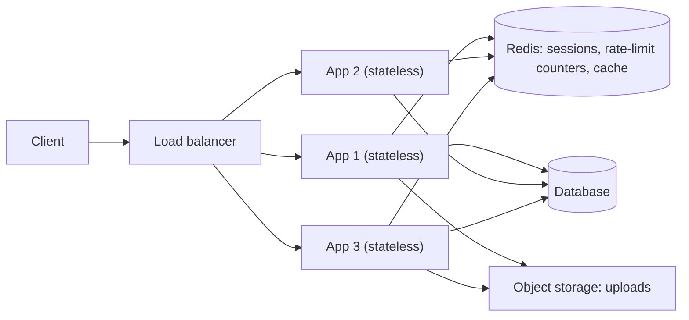
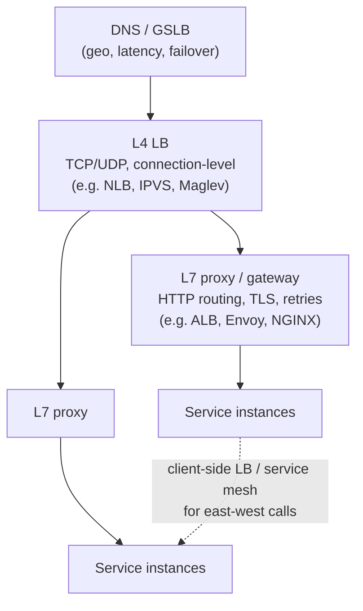
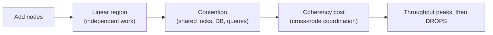
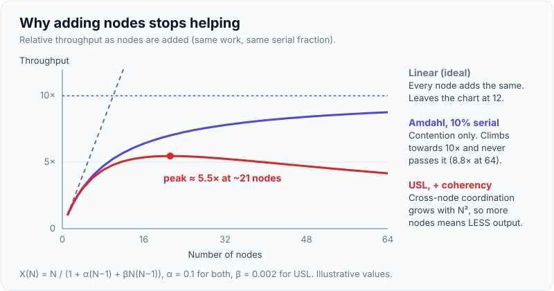

# Scalability: Vertical vs Horizontal, Stateless Services, Load Balancing

!!! abstract "Key takeaways"
    - **Vertical scaling (scale up):** a bigger machine. It's simple, needs no code changes and keeps strong consistency, but it has a **ceiling**, a **single point of failure** and **step-function cost**. **Horizontal scaling (scale out):** more machines. It's practically unlimited and fault tolerant, but it needs **stateless services** or **partitioned state**, plus load balancing.
    - **Stateless services** keep no client-specific state in memory between requests. Sessions go in tokens (JWT) or a shared store (Redis), files in object storage, and data in databases. Any instance can serve any request, so you can add, remove and replace instances freely.
    - **Load balancers:**
        - **L4** forwards TCP/UDP connections: fast, protocol-agnostic.
        - **L7** routes on HTTP content: path, host, headers, retries, TLS termination.
        - Algorithms: round robin, least connections/requests, **power of two random choices**, weighted, consistent hashing (for affinity or caches).
    - **Health checks + connection draining + autoscaling** turn a pool of instances into an elastic, self-healing service. Use readiness (can serve) vs liveness (is alive), and scale on a metric that tracks load (RPS, queue depth, latency).
    - **Scaling has limits:** shared resources (DB, locks), coordination and contention. **Amdahl's law** (the serial fraction caps speed-up) and the **Universal Scalability Law** (contention + coherency make throughput *drop* past a point). Scale the bottleneck, not everything.

## Why it matters

"How would you scale this to 10× traffic?" is part of every design interview. The weak answer is "add more servers". The strong answer finds **where state lives**, **what the bottleneck is** (usually the database or a hot key, not the app tier), and **how traffic is distributed**. Statelessness is also why containers, autoscaling and blue/green deployments work.

## Core concepts

### Vertical vs horizontal

| | Vertical (up) | Horizontal (out) |
|---|---|---|
| How | Bigger CPU/RAM/disk | More nodes behind a load balancer |
| Code changes | None | Stateless design, partitioning |
| Limit | Largest instance (hundreds of vCPUs, TBs of RAM) | Coordination and shared-resource limits |
| Availability | Single point of failure (unless replicated) | N+1 redundancy, rolling deploys |
| Cost curve | Steep at the top end | Linear-ish, commodity |
| Downtime to scale | Often a restart | None (add nodes) |
| Best for | Databases early on, stateful legacy, quick wins | Stateless tiers, large scale, HA |

**Real systems do both:** scale up the database first (it's the hardest to scale out), and scale the stateless app tier out from day one.

### Making services stateless


*Notice that the app instances are interchangeable. **State moved out** to systems built to hold it (Redis, the DB, object storage). That's what lets the load balancer send any request anywhere, and lets autoscaling kill any instance.*

Where state usually hides:

- **HTTP sessions** in server memory → JWT/opaque tokens + Redis-backed sessions (Spring Session).
- **Local file uploads** → object storage (S3) through pre-signed URLs.
- **In-memory caches** → fine as an *L1* cache if it's acceptable for it to be inconsistent and lost. A shared Redis is the L2.
- **Scheduled jobs** running on every instance → a leader election or distributed lock (ShedLock), or an external scheduler.
- **WebSocket connections** → sticky by nature. Keep a connection registry (Redis) and fan out messages via pub/sub.
- **In-flight work** → queues with acknowledgements, so a killed instance's work is redelivered.

### Load balancing: layers and algorithms


*Notice the **layered** balancing in large systems: DNS spreads across Regions, L4 spreads connections across proxies, L7 routes requests to services, and client-side balancers or meshes handle service-to-service (east-west) calls.*

| Algorithm | How | Good for | Watch out |
|---|---|---|---|
| Round robin | Rotate through targets | Homogeneous, short requests | Ignores load differences |
| Weighted round robin | Proportional to weights | Mixed instance sizes, canaries | Static weights |
| Least connections / outstanding requests | Pick the least busy | Long or variable requests | Needs accurate counts |
| **Power of two choices** | Pick 2 at random, choose the less loaded | Large fleets, distributed LBs | Near-optimal with little coordination |
| Consistent hashing | Key → target on a ring | Cache affinity, sticky partitions | Hot keys, rebalancing on change |
| Latency-aware (EWMA) | Prefer faster targets | Heterogeneous latency | Can overload a fast-but-recovering node |

{ loading=lazy }
*Watch each request compare only two random servers. It never needs the global "least loaded" answer, yet it avoids the busiest servers most of the time.*

**Health checks:**

- **Readiness:** remove a target from rotation if it can't serve (warming up, dependency down for *its* functionality).
- **Liveness:** restart if it's stuck.
- **Outlier detection:** eject targets with high error rates (Envoy).
- **Draining:** stop new requests, let in-flight ones finish, then terminate.

**Sticky sessions** (affinity by cookie or IP hash) are a crutch for stateful apps. They cause uneven load, lose sessions on failure, and make scale-in painful. Prefer stateless designs.

### Autoscaling

- **Reactive:** target tracking on CPU, RPS per instance, latency or **queue backlog per worker**.
- **Scheduled / predictive:** for known cycles.
- **Scale-out speed** depends on start-up time: JVM warm-up, image pull, cache warm-up. Mitigate with warm pools, smaller images, CRaC/SnapStart, pre-warming.
- **Scale-in safely:** draining, cooldowns, and protecting instances doing long work.
- **Scale the bottleneck:** autoscaling the app tier in front of a saturated DB makes things **worse** (more connections, more contention). Cap concurrency and protect downstream systems.

### Why scaling flattens: Amdahl and USL


*Notice the **Universal Scalability Law**: throughput(N) = N / (1 + α(N−1) + βN(N−1)). α is contention and β is coherency (crosstalk). With any β > 0, adding nodes eventually **reduces** throughput. That's why you remove shared bottlenecks (partition data, avoid global locks, reduce chatty coordination) instead of just adding nodes.*

**Amdahl's law:** if 10% of the work is serial, the maximum speed-up is 10×, no matter how many nodes you add.

{ loading=lazy }
*Notice that Amdahl only flattens, while USL turns down. Past the peak, every node you add makes the system slower.*

### The scaling journey

1. **Single server:** app + DB on one box.
2. **Separate DB**, then scale the DB **vertically**.
3. **Stateless app tier** behind a **load balancer**, autoscaling.
4. **Cache** (Redis) + **CDN** for static content and hot reads.
5. **Read replicas** for read scaling.
6. **Async processing** with queues for slow or non-critical work.
7. **Partition/shard** the data by a key (see [database scaling](05-database-scaling-replication-sharding-partitioning-consisten.md)).
8. **Split services** by domain where teams or scaling needs differ.
9. **Multi-Region** for latency, residency and DR.

## In practice: code & configuration

=== "❌ Common mistake"
    ```java
    // State in instance memory: breaks behind a load balancer and on scale-in.
    @RestController
    class CartController {
        private final Map<String, Cart> carts = new ConcurrentHashMap<>();   // per-instance
        @PostMapping("/cart/items")
        void add(HttpSession session, @RequestBody Item item) {             // in-memory session
            carts.computeIfAbsent(session.getId(), id -> new Cart()).add(item);
        }
        @Scheduled(cron = "0 0 * * * *")
        void hourlyReport() { /* runs on EVERY instance → N duplicate reports */ }
    }
    ```

=== "✅ Correct approach"
    ```java
    // State externalised: any instance can serve any request.
    @RestController
    class CartController {
        private final CartRepository carts;   // Redis or DB, keyed by user id from the token
        @PostMapping("/cart/items")
        void add(@AuthenticationPrincipal Jwt user, @RequestBody Item item) {
            carts.addItem(user.getSubject(), item);   // idempotent with item.id
        }
        @Scheduled(cron = "0 0 * * * *")
        @SchedulerLock(name = "hourlyReport", lockAtMostFor = "PT50M")   // ShedLock: one instance runs it
        void hourlyReport() { /* ... */ }
    }
    ```

```yaml
# Spring Boot: sessions in Redis (if server sessions are needed), graceful shutdown, probes
# (Boot 3: adding spring-session-data-redis auto-configures the Redis session store)
spring:
  session:
    redis:
      namespace: "app:sessions"
  lifecycle:
    timeout-per-shutdown-phase: 20s
server:
  shutdown: graceful
management:
  endpoint.health.probes.enabled: true   # /actuator/health/readiness and /liveness
---
# Kubernetes HPA scaling on RPS per pod (custom metric) rather than CPU
apiVersion: autoscaling/v2
kind: HorizontalPodAutoscaler
metadata: { name: orders }
spec:
  scaleTargetRef: { apiVersion: apps/v1, kind: Deployment, name: orders }
  minReplicas: 3
  maxReplicas: 30
  metrics:
    - type: Pods
      pods:
        metric: { name: http_requests_per_second }
        target: { type: AverageValue, averageValue: "800" }
  behavior:
    scaleDown: { stabilizationWindowSeconds: 300 }   # avoid flapping
```

## Real-world usage

- **Google's Maglev** and **Facebook's Katran** are software L4 load balancers using consistent hashing for connection stability across a fleet. **Envoy** popularised L7 features (outlier detection, retries, circuit breaking) in service meshes.
- **Power of two choices** is used in Envoy ("least request"), NGINX ("random two least_conn") and many RPC frameworks, because it avoids the herd behaviour of pure least-connections across many balancers.
- **Classic failure:** autoscaling the web tier during a DB slowdown multiplies connections and kills the DB. Fixes: connection pools, RDS Proxy/PgBouncer, bulkheads, load shedding.
- **Healthcare and banking:** stateless services make **zero-downtime deployments** and **patching** routine, which is important for availability SLAs and security patch windows.

## Trade-offs & production gotchas

| Option | Pros | Cons | Use when |
|---|---|---|---|
| Scale up first | Simple, fast | Ceiling, SPOF, expensive at top | Databases, early stage |
| Scale out | Elastic, HA | Needs stateless design, LB, ops | App tiers, at scale |
| JWT (stateless auth) | No session store lookup | Revocation is hard, token size | APIs, microservices |
| Server sessions in Redis | Easy revocation | Redis dependency, latency | Web apps needing server sessions |
| Sticky sessions | Quick fix for legacy apps | Uneven load, lost sessions | Temporary migration step only |
| L4 LB | Fast, any protocol | No HTTP routing | TCP, gRPC passthrough, edge |
| L7 LB | Routing, retries, TLS, auth | More CPU/latency | HTTP APIs, microservices |

!!! warning "Gotchas"
    - **Retries at every layer** (client, LB, mesh, service) multiply load during an incident. Budget retries, use jitter, and retry only idempotent operations.
    - **Health checks that test dependencies** take the whole fleet out when the DB blips. Keep readiness local, and degrade gracefully instead.
    - **Long-lived connections** (HTTP/2, gRPC, WebSockets) defeat per-request balancing. Use L7 balancing that understands streams, or recycle connections periodically.
    - **Uneven AZ capacity** plus zonal balancing causes hot spots. Watch per-AZ target counts.

## How this connects to my experience

- **Where I used it:**
    - OptumRx Meteor: microservices (Spring Boot) for 750K+ users, Redis caching, Kubernetes/EKS from the skills list.
    - Johnson Controls: "migration of a legacy monolithic application to microservices".
    - JWT-based auth (Johnson Controls, Optum OAuth2/PingFederate) supports stateless services.
- **Talking points:**
    - "Services were stateless. Identity came from OAuth2/JWT tokens and shared data from Redis, so pods could scale and roll freely." *[confirm: HPA metrics used]*
    - "In the monolith-to-microservices migration, the first step was removing in-memory session state so the app could run more than one instance behind a load balancer." *[confirm]*
    - "Our GraphQL service fanned out to 5 upstreams, so scaling our pods without protecting upstreams (timeouts, bulkheads, caching) would have just moved the bottleneck." *[confirm]*
- **Likely follow-up chain:** "How did you scale the GraphQL service?" → "What was the bottleneck?" → "How did you avoid overwhelming upstream systems?" → "How do you handle sessions?" Answer: stateless pods + HPA → upstream latency and fan-out → caching, DataLoader, timeouts, circuit breakers, concurrency limits → JWT from PingFederate, no server sessions.

## Interview questions

### Fundamentals

??? question "Q1. Vertical vs horizontal scaling?"
    **Answer:** Vertical adds resources to one machine: simple, but it has a ceiling and a single point of failure. Horizontal adds machines behind a load balancer: elastic and fault tolerant, but it needs stateless services or partitioned data.

    **Interviewer listens for:** the trade-offs, and that databases usually scale up first.

    **Common wrong answer:** "horizontal is always better".

??? question "Q2. What makes a service stateless, and why does it matter?"
    **Answer:** It keeps no per-client state in memory between requests. Sessions, files and data live in external stores, so any instance can handle any request. That enables load balancing, autoscaling, rolling deploys and instance replacement without losing user state.

    **Interviewer listens for:** where the state goes.

    **Common wrong answer:** "stateless means no database".

??? question "Q3. L4 vs L7 load balancing?"
    **Answer:** L4 balances TCP/UDP connections by IP and port: fast, but blind to HTTP. L7 understands HTTP and can route by path, host or header, terminate TLS, retry, rewrite and authenticate, at the cost of more processing.

    **Interviewer listens for:** use cases for each.

    **Common wrong answer:** "L7 is just slower L4".

??? question "Q4. Name load-balancing algorithms and when to use them."
    **Answer:**
    - **Round robin:** uniform requests.
    - **Weighted:** mixed capacity or canaries.
    - **Least connections/requests:** variable request durations.
    - **Power of two choices:** large fleets with many balancers.
    - **Consistent hashing:** cache affinity.
    - **Latency-aware:** heterogeneous backends.

    **Interviewer listens for:** matching each to a workload.

    **Common wrong answer:** only round robin.

### Intermediate

??? question "Q5. Why avoid sticky sessions?"
    **Answer:** Uneven load (heavy users pinned to one node), lost sessions when a node dies, harder scale-in and deployments, and the stateful design they hide. Use externalised sessions or tokens instead. Stickiness is acceptable as a temporary migration step or for WebSockets with a registry.

    **Interviewer listens for:** the failure and load effects.

    **Common wrong answer:** "needed for login".

??? question "Q6. Readiness vs liveness checks?"
    **Answer:** **Readiness:** can this instance serve traffic now? If not, the LB or Kubernetes removes it from rotation. **Liveness:** is the process healthy? If not, restart it. Don't make liveness depend on downstream systems, or a DB blip restarts the whole fleet.

    **Interviewer listens for:** the different actions each triggers.

    **Common wrong answer:** "the same endpoint for both".

??? question "Q7. What is 'power of two random choices'?"
    **Answer:** For each request, pick two backends at random and send to the one with fewer outstanding requests. It gives near-optimal balance with very little shared state, and avoids herding (many balancers all picking the same "least loaded" node).

    **Interviewer listens for:** why it beats pure least-connections at scale.

    **Common wrong answer:** "randomly pick one".

??? question "Q8. How do you run scheduled jobs in a horizontally scaled service?"
    **Answer:** Make sure only one instance runs each job: a distributed lock (ShedLock with DB/Redis), leader election (Kubernetes Lease, ZooKeeper), or move jobs to an external scheduler (Kubernetes CronJob, EventBridge Scheduler) that triggers a single execution or queue message. Make jobs idempotent.

    **Interviewer listens for:** duplicate execution awareness.

    **Common wrong answer:** "`@Scheduled` works fine".

### Senior

??? question "Q9. Traffic grows 10×. Walk through how you'd scale a typical web app."
    **Answer:**
    1. Measure to find the bottleneck. Usually it's the DB.
    2. App tier: stateless + autoscaling.
    3. Caching (Redis) for hot reads, CDN for static content.
    4. Read replicas.
    5. Async processing with queues for heavy writes and side effects.
    6. Connection pooling.
    7. Optimise queries and indexes.
    8. If writes or storage still exceed one primary, **partition** by a key.
    9. Load test at each step.

    **Interviewer listens for:** bottleneck-driven order.

    **Common wrong answer:** "microservices + Kubernetes".

??? question "Q10. Why can adding nodes reduce throughput?"
    **Answer:** Contention and coherency costs. Shared locks, a single DB and cross-node coordination grow with N (quadratically for coherency), as described by the Universal Scalability Law. Retries and connection storms make it worse. Fix by removing shared bottlenecks: partition data, avoid global locks, batch, cache.

    **Interviewer listens for:** USL/Amdahl reasoning.

    **Common wrong answer:** "it can't".

??? question "Q11. How do you handle WebSockets when scaling horizontally?"
    **Answer:**
    - Connections are sticky to one node.
    - Keep a **connection registry** (userId → node) in Redis.
    - Fan out messages through pub/sub (Redis, Kafka) to the node holding the connection.
    - Drain on deploy (tell clients to reconnect), reconnect with backoff.
    - Balance by connection count. Use L7 balancers that support upgrades.

    **Interviewer listens for:** a registry plus pub/sub.

    **Common wrong answer:** "sticky sessions solve it".

### Scenario-based

??? question "Q12. During a traffic spike, autoscaling added 3× pods and the system got slower. Why?"
    **Answer:** The bottleneck was downstream (DB or upstream API). More pods meant more connections, more contention and more retries, which made it worse. Fixes:
    - Cap concurrency per pod and in total.
    - Connection pooling or a proxy.
    - Circuit breakers and load shedding.
    - Cache.
    - Scale on a downstream-aware metric.
    - Fix the actual bottleneck (queries, partitioning).

    **Interviewer listens for:** knowing what the bottleneck was.

    **Common wrong answer:** "add even more pods".

??? question "Q13. A legacy app keeps the user session in memory and must run on 3 instances tomorrow. What's your plan?"
    **Answer:**
    - **Short term:** sticky sessions at the LB, accepting session loss on failure, plus a communication plan.
    - **Proper fix:** externalise sessions (Spring Session + Redis), move uploads to object storage, make scheduled jobs single-run with locks, then remove stickiness.
    - Test failover by killing an instance.

    **Interviewer listens for:** pragmatic phasing.

    **Common wrong answer:** "rewrite as microservices".

## Cheat sheet

| Concept | Remember |
|---|---|
| Up vs out | Simple + ceiling + SPOF vs elastic + HA + needs statelessness |
| Stateless | Sessions → token/Redis, files → object store, jobs → lock/scheduler, work → queue |
| L4 vs L7 | Connections (fast, any protocol) vs HTTP-aware routing, TLS, retries |
| Algorithms | RR, weighted, least-request, **P2C**, consistent hashing, EWMA latency |
| Health | Readiness (rotate out) vs liveness (restart). Don't check dependencies in liveness |
| Draining | Stop new, finish in-flight, then terminate (graceful shutdown) |
| Autoscale on | RPS/target, latency, queue backlog per worker. Protect downstream |
| Limits | Amdahl (serial fraction), USL (contention α + coherency β → throughput falls) |
| Sticky | A crutch, avoid. WebSockets: registry + pub/sub |
| Retries | Budgeted, jittered, idempotent only, one layer |

## Sources
1. Martin Kleppmann, *Designing Data-Intensive Applications*, ch. 1 (scalability, describing load) and ch. 6 (partitioning).
2. Alex Xu, *System Design Interview*, Vol. 1, ch. 1 "Scale from zero to millions of users".
3. [Neil Gunther: Universal Scalability Law](http://www.perfdynamics.com/Manifesto/USLscalability.html): contention and coherency model.
4. [Mitzenmacher: The Power of Two Choices in Randomized Load Balancing](https://www.eecs.harvard.edu/~michaelm/postscripts/mythesis.pdf).
5. [Envoy load balancing docs](https://www.envoyproxy.io/docs/envoy/latest/intro/arch_overview/upstream/load_balancing/load_balancers): least request (P2C), ring hash, Maglev, outlier detection.
6. [Google: Maglev, a fast and reliable software network load balancer (NSDI 2016)](https://research.google/pubs/maglev-a-fast-and-reliable-software-network-load-balancer/).
7. [Kubernetes: liveness, readiness and startup probes](https://kubernetes.io/docs/tasks/configure-pod-container/configure-liveness-readiness-startup-probes/) and [HPA](https://kubernetes.io/docs/tasks/run-application/horizontal-pod-autoscale/).
8. [Amazon Builders' Library: Timeouts, retries, and backoff with jitter](https://aws.amazon.com/builders-library/timeouts-retries-and-backoff-with-jitter/).
