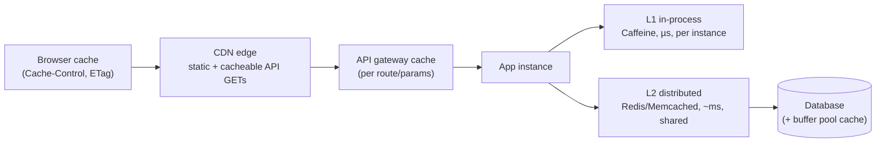
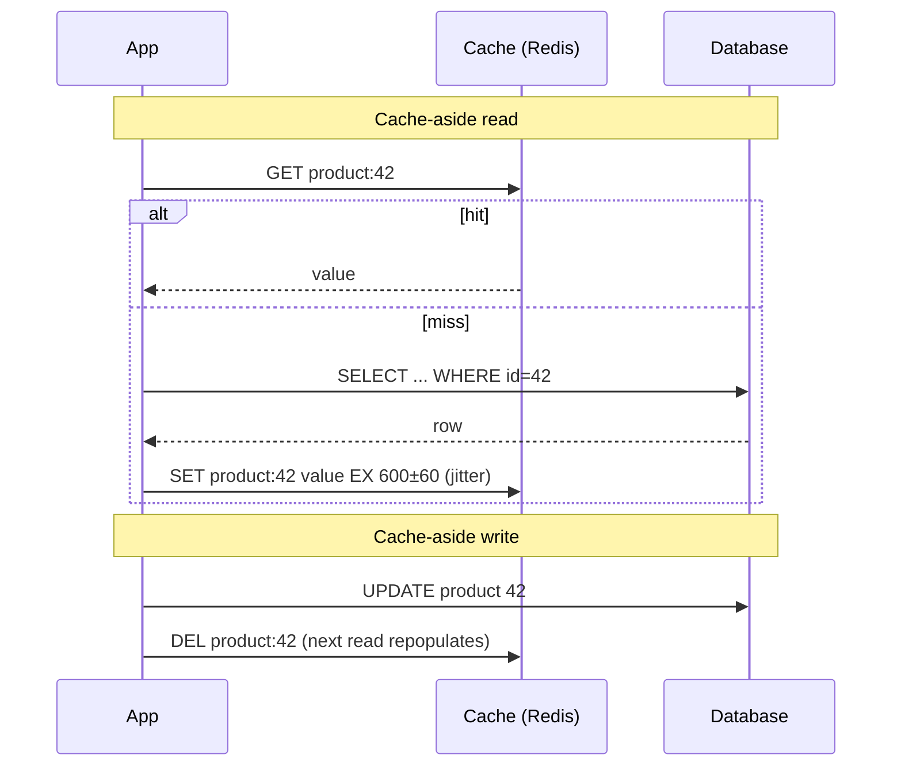

# Caching Strategies & CDN

!!! abstract "Key takeaways"
    - **Cache to cut latency and offload the source of truth.** Cache data that is **read often, changes rarely, and is expensive to compute or fetch**, and where **some staleness is acceptable**. Measure the **hit ratio**: a cache with a 30% hit ratio mostly adds complexity.
    - **Layers:** browser → CDN/edge → API gateway → **in-process (L1, e.g. Caffeine)** → **distributed (L2, e.g. Redis)** → DB buffer pool. Each layer closer to the user is faster but harder to invalidate.
    - **Patterns:**
        - **Cache-aside** (app reads the cache, on a miss loads from the DB and populates; on write updates the DB, then **deletes** the key) is the default.
        - Read-through and write-through put the cache in charge of loading and writing.
        - **Write-behind** is fast but risks data loss.
        - Write-around skips the cache on writes.
    - **Invalidation is the hard part:** TTL (with **jitter**) as a safety net, delete-on-write, event or CDC-driven invalidation, versioned keys.
    - **Failure modes:**
        - **stampede** (many misses at once): use single-flight, locks, early refresh, or stale-while-revalidate
        - **penetration** (lookups for keys that don't exist): cache negative results, or use a Bloom filter
        - **avalanche** (many keys expire together): add TTL jitter
        - **hot keys**: use a local cache or replicate the key
    - **CDN:** caches at the edge, driven by `Cache-Control` (`max-age`, `s-maxage`, `stale-while-revalidate`), the cache key and **versioned asset URLs**. Use long TTLs for immutable assets and short or none for HTML and personalised responses.

## Why it matters

Caching is the most common answer to "how would you make this faster or handle more reads?", and also the most common source of **stale-data bugs** and **cascading failures** (a cache outage or stampede that takes down the database). Interviewers want to hear *which* pattern, *where*, *how it's invalidated*, and *what happens when the cache is cold or down*.

## Core concepts

### Where to cache


*Notice the trade-off along the chain: each step left is **faster and cheaper per hit**, but you **control it less** (you can't purge a user's browser cache) and the data may be **staler**. Choose the layer by how fresh the data must be.*

| Layer | Latency | Shared? | Invalidation | Good for |
|---|---|---|---|---|
| Browser | 0 network | Per user | Only via TTL / versioned URL | Static assets, user's own data |
| CDN | ~10–50 ms (near user) | Global | Purge API, TTL, versioned URLs | Static files, public GET APIs, media |
| Gateway | ~ms | Per gateway | TTL, flush | Public, parameterised responses |
| L1 in-process | ~µs | **No**, per instance | TTL, pub/sub eviction | Reference data, config, very hot keys |
| L2 distributed | ~0.5–1 ms | Yes | Delete/update, TTL | Sessions, computed views, query results |

### Read and write patterns


*Notice that on writes we **delete**, not update, the cached value. Updating the cache from two concurrent writers can leave the older value in the cache. Deleting lets the next read load the fresh value.*

| Pattern | Read path | Write path | Pros | Cons |
|---|---|---|---|---|
| **Cache-aside (lazy)** | App checks cache → DB on miss → populate | Write DB, delete key | Simple, only caches what's read, cache failure ≠ outage | Miss penalty, race windows |
| Read-through | Cache library loads from DB on miss | (with write-through) | Cleaner app code | Cache must know the loader |
| **Write-through** | Read from cache | Write cache **and** DB synchronously | Cache always warm and consistent-ish | Write latency, caches unread data |
| **Write-behind (write-back)** | Read from cache | Write cache, flush to DB **asynchronously** | Very fast writes, batching | **Data loss** if the cache dies, complex |
| Write-around | Cache-aside reads | Write DB only | No cache churn for write-once data | First read always misses |
| Refresh-ahead | Refresh before expiry | n/a | No miss latency for hot keys | Wasted refreshes for cold keys |

### Eviction policies

- **LRU** (least recently used): the default in many caches. It's vulnerable to scans (a one-off full scan evicts the hot set).
- **LFU** (least frequently used): keeps popular items, but adapts slowly.
- **W-TinyLFU** (Caffeine): admission plus frequency sketch. Excellent hit ratios in practice.
- **TTL:** time-based expiry as the safety net for invalidation bugs.
- **Redis `maxmemory-policy`:** `allkeys-lru` / `allkeys-lfu` for pure caches. `volatile-*` evicts only keys with a TTL. `noeviction` returns errors when full, which is right for data you can't lose (but then it's not just a cache).

### The classic cache failure modes

```mermaid
flowchart TB
    subgraph ST["Stampede (thundering herd)"]
        S1["Hot key expires"] --> S2["1,000 concurrent misses"] --> S3["1,000 DB queries → DB overload"]
    end
    subgraph PE["Penetration"]
        P1["Requests for non-existent ids"] --> P2["Always miss"] --> P3["Every request hits DB"]
    end
    subgraph AV["Avalanche"]
        A1["Many keys same TTL / cache restart"] --> A2["Mass expiry"] --> A3["DB flooded"]
    end
    subgraph HK["Hot key"]
        H1["One key gets most of the traffic"] --> H2["One Redis shard saturated"]
    end
```


*Notice that every one of these turns the cache from **protecting** the database into **amplifying load** on it. Design for cold-cache and cache-down scenarios, not just the steady state.*

| Problem | Fixes |
|---|---|
| **Stampede** | **Single-flight / request coalescing** (one loader per key, others wait), a distributed lock around reload, **probabilistic early expiration** (XFetch), **stale-while-revalidate** (serve stale, refresh in the background), refresh-ahead |
| **Penetration** | Cache **negative results** (short TTL), **Bloom filter** of valid IDs, input validation, rate limiting |
| **Avalanche** | **TTL jitter** (±10–20%), warm the cache before traffic, staggered restarts, circuit breaker + fallback to protect the DB |
| **Hot keys** | **L1 local cache** in front of Redis, replicate the hot key (`key#1..N`, read a random copy), Redis client-side caching (tracking), read from replicas |
| **Big keys** | Split values, compress, avoid multi-MB values (they block Redis's single thread) |

{ loading=lazy }
*Watch the database in each panel: six identical queries on the left, one on the right. Coalescing turns a burst of misses into a single load.*

### Cache consistency

Cache-aside has unavoidable race windows. A classic one:

1. Reader A misses and loads the old value from the DB.
2. Writer B updates the DB and deletes the key.
3. A writes the **old** value into the cache, which is now stale until the TTL expires.

{ loading=lazy }
*Notice that the writer's delete happens before the reader's set, so it deletes nothing. The TTL is what finally ends the stale period.*

Mitigations:

- **Short TTLs** as a bound on staleness.
- **Delayed double delete:** delete again after ~1 s.
- **Versioned writes:** only set if the version is newer (Lua script / `SET` with a compare).
- **CDC-driven invalidation:** Debezium reads the DB log → invalidation events. Ordered, and catches writes from every source.
- For data that must be **strongly consistent** (balances, inventory decrements), **don't serve it from a cache**, or make the cache the system of record with proper durability.

### CDNs and HTTP caching

- **Pull CDN:** fetches from the origin on a miss. The common choice. **Push CDN:** you upload content ahead of time (large static libraries).
- **Headers:**
    - `Cache-Control: public, max-age=31536000, immutable` for fingerprinted assets.
    - `Cache-Control: no-cache` (revalidate every time) or `no-store` (never store) for sensitive data.
    - `s-maxage` sets the shared-cache (CDN) TTL separately from browsers.
    - `stale-while-revalidate=60` serves stale content while refreshing.
    - `ETag` / `Last-Modified` with `If-None-Match` gives **304 Not Modified**, which saves bandwidth.
    - `Vary` controls which request headers split the cache.
- **Cache key:** include only what changes the response (path, a few query parameters, `Accept-Encoding`). Cookies and auth headers in the key kill the hit ratio, and **personalised responses must not be shared-cached**.
- **Invalidation:** **versioned file names** (`app.3f9a1c.js`) instead of purges. Use purge APIs for emergencies, and tag-based purges (surrogate keys) for content systems.
- **Beyond caching:** TLS termination near users, connection reuse to the origin, DDoS absorption, WAF, edge compute (header rewrites, A/B testing, auth checks).

## In practice: code & configuration

=== "❌ Common mistake"
    ```java
    // Same TTL for everything (avalanche), no negative caching (penetration),
    // no coalescing (stampede), and the cache is updated on write (race → stale data).
    public Drug getDrug(String ndc) {
        Drug d = redis.get("drug:" + ndc);
        if (d == null) {
            d = repo.findByNdc(ndc);                 // 1,000 concurrent misses → 1,000 queries
            redis.setex("drug:" + ndc, 3600, d);     // null for unknown codes → NPE or always miss
        }
        return d;
    }
    public void updateDrug(Drug d) {
        repo.save(d);
        redis.setex("drug:" + d.ndc(), 3600, d);     // concurrent writers can leave the older value
    }
    ```

=== "✅ Correct approach"
    ```java
    // Two-level cache: Caffeine L1 (coalesces loads per key, µs hits) + Redis L2 (shared), jittered TTLs,
    // negative caching, delete-on-write with an event to evict L1 on all instances.
    private final LoadingCache<String, Optional<Drug>> l1 = Caffeine.newBuilder()
            .maximumSize(50_000)
            .expireAfterWrite(Duration.ofMinutes(5))
            .refreshAfterWrite(Duration.ofMinutes(4))   // refresh-ahead: serve old value while reloading
            .build(this::loadFromL2OrDb);               // one load per key at a time (single-flight)

    public Optional<Drug> getDrug(String ndc) { return l1.get(ndc); }

    private Optional<Drug> loadFromL2OrDb(String ndc) {
        String key = "drug:v2:" + ndc;                  // versioned key prefix: easy global invalidation
        CachedValue<Drug> cached = redis.get(key);
        if (cached != null) return cached.toOptional(); // includes cached "not found"
        Optional<Drug> fromDb = repo.findByNdc(ndc);
        Duration ttl = fromDb.isPresent()
                ? jitter(Duration.ofHours(1), 0.15)     // ±15% to prevent avalanche
                : Duration.ofMinutes(2);                // negative cache, short
        redis.set(key, CachedValue.of(fromDb), ttl);
        return fromDb;
    }

    @Transactional
    public void updateDrug(Drug d) {
        repo.save(d);
        // after commit: delete L2, broadcast L1 eviction (Redis pub/sub or Kafka)
        afterCommit(() -> {
            redis.delete("drug:v2:" + d.ndc());
            events.publish(new CacheEvict("drug", d.ndc()));
        });
    }
    ```

```yaml
# Spring Boot: Redis cache defaults (cache abstraction) + safe Redis eviction for a pure cache
spring:
  cache:
    type: redis
    redis:
      time-to-live: 10m
      cache-null-values: true      # negative caching via the abstraction
      key-prefix: "app:v2:"
# redis.conf (or ElastiCache parameter group)
# maxmemory-policy allkeys-lfu
```

```http
# CDN/browser headers
# Fingerprinted JS/CSS (built by Vite/webpack):
Cache-Control: public, max-age=31536000, immutable
# index.html (the SPA shell): always revalidate so new deploys are picked up
Cache-Control: no-cache
ETag: "c3f1a9"
# Public reference-data API (shared cache 5 min, serve stale up to 60 s while refreshing):
Cache-Control: public, max-age=60, s-maxage=300, stale-while-revalidate=60
# Personalised / PHI responses:
Cache-Control: private, no-store
```

## Real-world usage

- **Facebook's memcache paper** (NSDI 2013) describes lease-based fixes for stale sets and thundering herds, regional invalidation through the MySQL commit log (the precursor of CDC-based invalidation), and "gutter" pools for failed cache servers.
- **Netflix EVCache** replicates the cache across AZs so an AZ loss doesn't cause a miss storm.
- **Twitter/X timelines** are precomputed and cached (fan-out on write) for most users. Celebrities are handled by merging at read time (a hot-key strategy).
- **CDNs** (CloudFront, Akamai, Fastly, Cloudflare) serve most web bytes. Fastly-style **surrogate keys** let CMSs purge all pages that reference an updated item.
- **Healthcare:** cache **reference data** (drug catalogues, pharmacy lists, UI config), never PHI in shared caches. If PHI must be cached for performance, use per-user keys in an encrypted, access-controlled cache with short TTLs, and never at the CDN.

## Trade-offs & production gotchas

| Choice | Pros | Cons | Use when |
|---|---|---|---|
| Cache-aside | Simple, resilient to cache failure | Miss latency, races | Default for read-heavy data |
| Write-through | Warm cache, fewer stale reads | Slower writes | Read-after-write heavy, small datasets |
| Write-behind | Fastest writes, batching | Data-loss risk | Counters, analytics, with durable queues |
| L1 only (Caffeine) | µs, no network | Per-instance inconsistency | Reference data, config |
| L1 + L2 | Speed + sharing | Two invalidation paths | Hot reference data at scale |
| Redis | Data structures, persistence, pub/sub, Lua | Single-threaded command execution per shard | Most distributed caching |
| Memcached | Simple, multi-threaded | No persistence or data structures | Pure key-value caching |

!!! warning "Gotchas"
    - **The cache is not a database** unless you designed it as one (persistence, replication, eviction off). Plan for **Redis being down**: fall back to the DB with circuit breakers and rate limiting, or serve stale data.
    - **Cache warm-up after deploys or failover** is when stampedes happen. Pre-warm hot keys.
    - **Serialisation format changes** break caches during rolling deploys. Version the key prefix (`v2:`).
    - **Never cache errors** for long, or one upstream blip becomes a long outage.
    - **Shared-cache privacy:** a `Cache-Control: public` on a personalised response can leak one user's data to another through the CDN.

## How this connects to my experience

- **Where I used it:**
    - OptumRx Meteor: "Implemented **Redis-based caching** for frequently accessed queries and UI reference data", with a GraphQL Consumer Service in front of 5 upstream systems.
    - "Built the ReactJS application from the ground up" (CDN, browser caching of assets).
- **Talking points:**
    - "We cached UI reference data (slow-changing, read on every page) and frequently repeated query results from upstreams, using cache-aside with TTLs. That reduced upstream calls and p99 latency." *[confirm: hit ratio, latency or load reduction numbers, TTLs]*
    - "Invalidation: TTLs as the safety net, explicit eviction when reference data changed." *[confirm: how invalidation was triggered (admin action, event, schedule)]*
    - "PHI wasn't stored in shared caches, or was keyed per user with short TTLs." *[confirm]*
    - "In GraphQL, DataLoader is per-request batching and caching. Redis is the cross-request cache. They solve different problems."
- **Likely follow-up chain:** "What did you cache and why?" → "How did you invalidate?" → "What happens when Redis is down?" → "How do you avoid a stampede?" Answer: reference data + hot queries → TTL + evict on change → fall back to upstream with circuit breaker and timeouts → single-flight, jitter, refresh-ahead.

## Interview questions

### Fundamentals

??? question "Q1. What should you cache?"
    **Answer:** Data that is read frequently, changes infrequently, is expensive to compute or fetch, and tolerates some staleness. Measure the hit ratio and latency gain. Don't cache rarely-read data, or data that must be strongly consistent (balances, inventory decrements) without careful design.

    **Interviewer listens for:** criteria plus measurement.

    **Common wrong answer:** "cache everything".

??? question "Q2. Explain cache-aside."
    **Answer:** On reads, check the cache. On a miss, load from the DB and populate the cache with a TTL. On writes, update the DB and **delete** the cache key so the next read reloads. The app controls the logic. A cache failure degrades performance but doesn't break correctness.

    **Interviewer listens for:** delete rather than update on write.

    **Common wrong answer:** "write to the cache first, then the DB".

??? question "Q3. Write-through vs write-behind?"
    **Answer:** Write-through writes the cache and the DB synchronously: consistent and warm, but slower writes. Write-behind writes the cache and flushes to the DB asynchronously: fast and batched, but it **risks data loss** and complicates consistency.

    **Interviewer listens for:** the data-loss risk.

    **Common wrong answer:** "write-behind is always better".

??? question "Q4. LRU vs LFU?"
    **Answer:** LRU evicts the least recently used item: simple, but a large scan can flush the hot set. LFU evicts the least frequently used item: it keeps popular items but adapts slowly to change. W-TinyLFU (Caffeine) combines frequency-based admission with recency and gets high hit ratios.

    **Interviewer listens for:** scan resistance.

    **Common wrong answer:** "they're the same".

### Intermediate

??? question "Q5. What is a cache stampede and how do you prevent it?"
    **Answer:** A hot key expires and many concurrent requests miss and hit the DB at once. Prevent it with:
    - request coalescing / single-flight (one loader per key)
    - a mutex or lease around the reload
    - probabilistic early refresh or refresh-ahead
    - stale-while-revalidate
    - TTL jitter

    **Interviewer listens for:** coalescing, plus serving stale.

    **Common wrong answer:** "longer TTL".

??? question "Q6. Cache penetration vs avalanche?"
    **Answer:** **Penetration:** requests for non-existent keys always miss and hit the DB (often malicious). Fix with negative caching, a Bloom filter or validation. **Avalanche:** many keys expire at once or the cache restarts, so the DB is flooded. Fix with TTL jitter, warm-up, circuit breakers and replicated caches.

    **Interviewer listens for:** distinct causes and fixes.

    **Common wrong answer:** mixing them up.

??? question "Q7. How do you keep a cache consistent with the database?"
    **Answer:** Delete on write after commit. Use TTLs as a staleness bound. Use versioned or compare-and-set writes to avoid an old value overwriting a new one. Use CDC-driven invalidation for writes from any source. Use pub/sub for L1 eviction across instances. Accept bounded staleness, or don't cache strongly consistent data.

    **Interviewer listens for:** knowing the race window, and using TTL as the bound.

    **Common wrong answer:** "update the cache in the same transaction".

??? question "Q8. How do CDN caching headers work for an SPA?"
    **Answer:**
    - Fingerprinted assets: `public, max-age=1y, immutable`.
    - `index.html`: `no-cache` with an ETag, so new deploys are picked up immediately.
    - API GETs: `s-maxage` + `stale-while-revalidate` if public.
    - Personalised data: `private, no-store`.
    - Keep the cache key minimal.

    **Interviewer listens for:** versioned assets vs the HTML shell.

    **Common wrong answer:** "invalidate the CDN on every deploy".

### Senior

??? question "Q9. How do you handle a hot key that saturates one Redis shard?"
    **Answer:**
    - An L1 in-process cache with a short TTL in front of Redis.
    - Replicate the key into N copies (`key#0..N`) and read a random one.
    - Read from replicas.
    - Redis client-side caching with invalidation messages.
    - Precompute and push the data to the edge or CDN if it's public.

    Detect hot keys with `redis-cli --hotkeys`, monitoring or Contributor Insights.

    **Interviewer listens for:** local caching plus replication.

    **Common wrong answer:** "bigger Redis node".

??? question "Q10. Redis is down. What happens to your system?"
    **Answer:** It should **degrade, not fail**:
    - Short timeouts on cache calls.
    - A circuit breaker so you stop trying.
    - Fall back to the source with **rate limiting/bulkheads** to protect the DB.
    - Serve L1 or stale data.
    - Return reduced functionality for non-critical features.

    Use a Multi-AZ replicated Redis, test the failure, and alarm on hit ratio and latency.

    **Interviewer listens for:** protecting the DB during cache loss.

    **Common wrong answer:** "everything goes to the DB, which is fine".

??? question "Q11. When would you use write-behind, and how do you make it safe?"
    **Answer:** For high-rate writes where eventual persistence is acceptable: counters, view counts, rate-limit buckets, analytics. Make it safe with a **durable log** (Kafka/Redis Streams) instead of a volatile cache, idempotent batched flushes, replay on failure, and bounded lag monitoring. Never use it for money or PHI records.

    **Interviewer listens for:** durability via a log.

    **Common wrong answer:** "Redis AOF makes it safe".

### Scenario-based

??? question "Q12. Users sometimes see an old drug price after an update. Diagnose and fix."
    **Answer:**
    - **Causes:** the cache-aside race (old value written back after the delete), L1 caches on other instances not evicted, CDN/browser caching of the API, or a missing invalidation for writes from another system (batch job).
    - **Fixes:** delete after commit (plus delayed double delete or versioned set), broadcast L1 eviction, `private`/short `s-maxage` on the API, CDC-based invalidation for all writers, a shorter TTL as the bound.
    - Add a staleness SLI.

    **Interviewer listens for:** checking every cache layer.

    **Common wrong answer:** "turn off caching".

??? question "Q13. Design caching for a GraphQL aggregation service over 5 slow upstreams."
    **Answer:**
    - **Per request:** DataLoader batching and deduplication.
    - **Cross-request:** Redis cache-aside per upstream entity (not per GraphQL query, so different queries share entries), with TTLs matched to each upstream's change rate, jitter and negative caching.
    - **Edge:** persisted queries plus CDN caching for public, non-personalised queries.
    - **Protection:** stale-while-revalidate for slow upstreams, circuit breakers with cached fallbacks, and no PHI in shared caches.
    - Measure hit ratios per upstream.

    **Interviewer listens for:** entity-level caching and layers.

    **Common wrong answer:** "cache the whole GraphQL response by query string".

## Cheat sheet

| Concept | Remember |
|---|---|
| Cache when | Read-heavy, rarely changes, expensive, staleness OK. Measure hit ratio |
| Layers | Browser → CDN → gateway → L1 (Caffeine) → L2 (Redis) → DB |
| Default | Cache-aside: miss → load → set (TTL+jitter). Write → DB → **delete** |
| Writes | Write-through (sync, warm) vs write-behind (async, loss risk) vs write-around |
| Eviction | LRU, LFU, W-TinyLFU, TTL. Redis `allkeys-lfu` for caches |
| Stampede | Single-flight, lock/lease, early refresh, stale-while-revalidate |
| Penetration | Negative caching, Bloom filter |
| Avalanche | TTL jitter, warm-up, breaker |
| Hot key | L1, key replicas, read replicas, client-side caching |
| Consistency | Race windows exist. TTL bounds staleness. CDC invalidation. Versioned keys |
| CDN | `immutable` for hashed assets, `no-cache` for HTML, `s-maxage`, `stale-while-revalidate`, `private, no-store` for PHI |

## Sources
1. [Scaling Memcache at Facebook (NSDI 2013)](https://www.usenix.org/conference/nsdi13/technical-sessions/presentation/nishtala): leases, thundering herds, invalidation via commit log.
2. [AWS whitepaper: Database caching strategies using Redis](https://docs.aws.amazon.com/whitepapers/latest/database-caching-strategies-using-redis/welcome.html): cache-aside, write-through, TTLs.
3. [Caffeine wiki: Efficiency (W-TinyLFU)](https://github.com/ben-manes/caffeine/wiki/Efficiency) and [refresh](https://github.com/ben-manes/caffeine/wiki/Refresh).
4. [Redis: key eviction policies](https://redis.io/docs/latest/develop/reference/eviction/) and [client-side caching](https://redis.io/docs/latest/develop/reference/client-side-caching/).
5. [Vattani et al.: Optimal Probabilistic Cache Stampede Prevention (VLDB 2015)](https://www.vldb.org/pvldb/vol8/p886-vattani.pdf): XFetch early expiration.
6. [MDN: HTTP caching](https://developer.mozilla.org/en-US/docs/Web/HTTP/Caching) and [Cache-Control](https://developer.mozilla.org/en-US/docs/Web/HTTP/Headers/Cache-Control): directives, stale-while-revalidate.
7. [RFC 9111: HTTP Caching](https://www.rfc-editor.org/rfc/rfc9111): shared vs private caches, s-maxage.
8. [Spring Boot caching reference](https://docs.spring.io/spring-boot/reference/io/caching.html): cache abstraction and Redis properties.
9. Martin Kleppmann, *Designing Data-Intensive Applications*: derived data and CDC-based cache maintenance.
