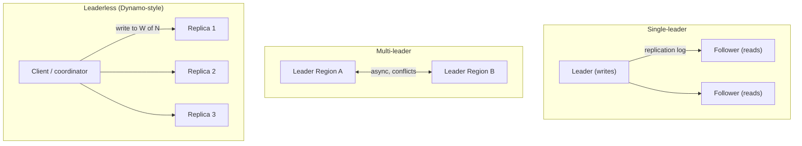
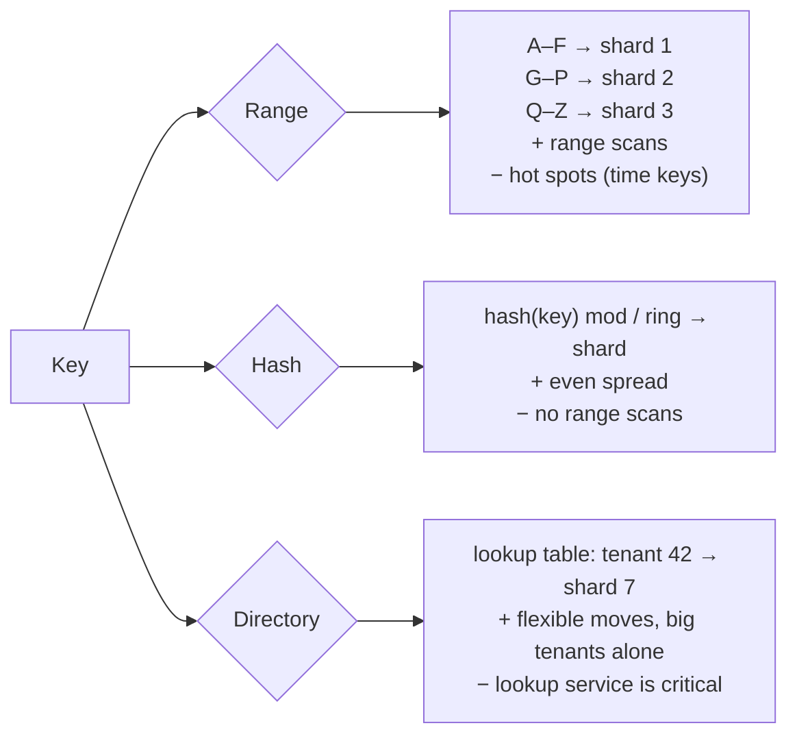
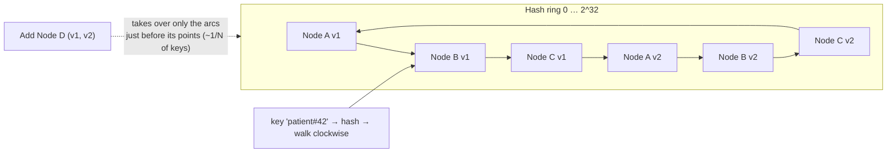

# Database Scaling: Replication, Sharding, Partitioning, Consistent Hashing

!!! abstract "Key takeaways"
    - **Order of operations:**
        1. Optimise queries and indexes.
        2. Scale up.
        3. Add **read replicas** + caching.
        4. **Partition** within one node (table partitioning).
        5. **Shard** across nodes when writes or storage exceed one primary.
        6. Consider **distributed SQL** (Spanner, CockroachDB, Aurora DSQL, YugabyteDB) or NoSQL designed for partitioning (DynamoDB, Cassandra).
    - **Replication** copies the same data to several nodes (availability + read scaling). There are three models:
        - **single-leader**: simple; async replication means lag
        - **multi-leader**: multi-Region writes; needs conflict resolution
        - **leaderless**: quorums with N, W, R where **W + R > N**
    - **Replication lag** causes anomalies: reading your own write and not seeing it, time going backwards across replicas, causally related writes arriving out of order. Fix with **read-your-writes**, **monotonic reads** and **consistent prefix** techniques.
    - **Partitioning / sharding** splits data so each node holds a subset (write and storage scaling).
        - **Range** partitioning keeps ordering, but hot spots are likely with time-based keys.
        - **Hash** partitioning spreads load evenly but makes range scans hard.
        - **Directory/lookup** partitioning is flexible but needs a lookup service.
    - **The shard key decides everything:** high cardinality, even access, and the **most common queries hit one shard**. Avoid cross-shard transactions.
    - **Consistent hashing** maps keys and nodes onto a ring, so adding or removing a node moves only ~**1/N** of the keys. **Virtual nodes** smooth the distribution. Alternatives: a fixed number of partitions (Kafka, Elasticsearch, Redis Cluster's 16,384 slots), jump hash, rendezvous hashing.

## Why it matters

The database is almost always the hardest part to scale. Interviewers probe whether you know **when** sharding is justified (and that it's a last resort), **how** to pick a shard key, what happens to **queries, joins, transactions and secondary indexes** after sharding, and how to **rebalance** without downtime. Replication questions test whether you understand **consistency anomalies**, not just "add replicas".

## Core concepts

### Replication models


*Notice where writes go: **one place** (simple, no conflicts), **several leaders** (low-latency writes per Region, but concurrent writes conflict), or **any replicas** (highly available, with quorum maths deciding read freshness).*

| | Single-leader | Multi-leader | Leaderless |
|---|---|---|---|
| Examples | PostgreSQL, MySQL, MongoDB replica sets, Aurora | Multi-Region active-active setups, CouchDB, BDR | Cassandra, DynamoDB internals, Riak, ScyllaDB |
| Writes | Leader only | Any leader | Any replica (W acks) |
| Conflicts | None | **Yes**: LWW, CRDTs, app merge | Yes: LWW/vector clocks, read repair |
| Failover | Promote follower (risk of lost async writes, split brain) | Other leaders continue | No failover needed |
| Use when | Most OLTP | Multi-Region writes, offline clients | High write availability, tunable consistency |

**Sync vs async:** synchronous followers guarantee durability but add latency and block on follower failure. Asynchronous is fast, but a leader crash can lose recent writes. **Semi-synchronous** (one sync follower, the rest async) is the common compromise.

**Quorums (leaderless):** N replicas, write to W, read from R. With **W + R > N**, the read set overlaps the latest write set (for example N=3, W=2, R=2). It's still not linearisable in every edge case (sloppy quorums, concurrent writes).

### Replication lag anomalies

| Anomaly | Example | Fix |
|---|---|---|
| **Read-your-writes** violation | User updates their profile, refreshes, sees the old data (read hit a lagging replica) | Read from the leader for N s after a write, or track the user's last write LSN/timestamp and wait for replicas to catch up |
| **Monotonic reads** violation | Two refreshes hit different replicas, so a comment appears then disappears | Pin a user to one replica (hash of userId) |
| **Consistent prefix** violation | An answer appears before its question (writes in different partitions) | Write causally related data to the same partition, or track causal dependencies |

### Partitioning strategies


*Notice that each strategy optimises a different thing: **range** for ordered scans, **hash** for even load, **directory** for control. Many systems combine them, for example a hash partition key plus a range sort key (Cassandra, DynamoDB).*

**Vertical vs horizontal partitioning:** vertical splits **columns or tables** (move blobs or rarely used columns out, or split by domain into separate databases). Horizontal splits **rows** (sharding).

**Choosing a shard key:**

1. **High cardinality**: many distinct values.
2. **Even access**: no key gets disproportionate traffic.
3. **Query locality**: the dominant queries include the key, so they hit **one shard**. For example `tenant_id` for SaaS, `patient_id` for health records, `user_id` for social apps.
4. **Transaction locality**: data changed together lives together.
5. **Stability**: the key doesn't change. Moving a row between shards is expensive.

### Secondary indexes across shards

- **Local (document-partitioned) index:** each shard indexes only its own data. Writes stay simple, but reads by the secondary attribute need **scatter-gather** to all shards (tail latency is the slowest shard). Examples: MongoDB, Elasticsearch, Cassandra secondary indexes.
- **Global (term-partitioned) index:** the index itself is partitioned by the indexed value. Reads go to one place, but writes touch several partitions, so the index is usually **updated asynchronously**. Example: DynamoDB GSIs (eventually consistent).

### Rebalancing and consistent hashing

**Why not `hash(key) mod N`?** When N changes, almost **every** key moves to a different node: a massive data migration plus a cache miss storm.


*Notice that a key belongs to the **next node clockwise**. Adding node D only steals the keys in the arcs before D's positions, about 1/N of all keys. **Virtual nodes** (many points per physical node) even out arc sizes and let a bigger machine take more points.*

| Rebalancing approach | How | Examples |
|---|---|---|
| Consistent hashing + vnodes | Ring positions per node, move adjacent ranges | Cassandra (token ranges + vnodes), Dynamo, many caches |
| Fixed number of partitions | Create many partitions up front (e.g. 1,000s), move whole partitions between nodes | Redis Cluster (16,384 slots), Elasticsearch shards, Kafka partitions, Riak |
| Dynamic splitting | Split a range when it grows, merge when it shrinks | HBase, MongoDB chunks, Spanner, CockroachDB, DynamoDB |
| Jump hash / rendezvous (HRW) | Stateless, minimal movement, even spread | Client-side sharding, load balancers |

### What sharding costs you

- **Cross-shard queries:** scatter-gather, pagination across shards, aggregations. Consider a separate **read model** (search index, data warehouse) fed by CDC.
- **Cross-shard transactions:** 2PC is slow and fragile. Prefer designs where transactions stay on one shard, or use **sagas** with compensation.
- **Global uniqueness and IDs:** you lose auto-increment. Use UUIDv7, Snowflake-style IDs, or ID ranges per shard.
- **Joins:** denormalise, co-locate related tables by the same key (Citus "colocation"), or join in the app.
- **Hot shards:** a celebrity, a big tenant or a time-based key. Mitigate by moving big tenants to dedicated shards (directory), salting keys, and splitting further.
- **Operations:** schema migrations on N shards, backups, monitoring, **resharding**.

**Resharding without downtime:**

1. Dual-write, or CDC from the old shard to the new layout.
2. Backfill.
3. Verify (checksums, shadow reads).
4. Switch reads.
5. Switch writes.
6. Retire the old shards.

Directory-based or fixed-partition schemes make this much easier.

## In practice: code & configuration

=== "❌ Common mistake"
    ```java
    // Modulo sharding: changing shard count remaps ~all keys.
    int shard = Math.floorMod(patientId.hashCode(), shardCount);   // 4 → 5 shards: ~80% of keys move

    // Shard by created_at month: all of today's writes hit ONE shard (hot spot).
    // Shard key = status: 3 values, huge skew, can't scale beyond 3 shards.
    ```

=== "✅ Correct approach"
    ```java
    // Consistent hashing with virtual nodes (illustrative; production systems use library/DB support).
    public final class HashRing<N> {
        private final NavigableMap<Long, N> ring = new TreeMap<>();
        private final int vnodes;

        public HashRing(Collection<N> nodes, int vnodes) {
            this.vnodes = vnodes;
            nodes.forEach(this::add);
        }
        public void add(N node) {
            for (int i = 0; i < vnodes; i++) ring.put(hash(node + "#" + i), node);   // many points per node
        }
        public void remove(N node) {
            for (int i = 0; i < vnodes; i++) ring.remove(hash(node + "#" + i));
        }
        public N nodeFor(String key) {
            Map.Entry<Long, N> e = ring.ceilingEntry(hash(key));                    // next point clockwise
            return (e != null ? e : ring.firstEntry()).getValue();                    // wrap around
        }
        private static long hash(String s) {                                         // stable 64-bit hash
            return Hashing.murmur3_128().hashString(s, UTF_8).asLong();              // Guava; any good hash works
        }
    }
    // Adding a node moves ~1/N of keys; 100–200 vnodes per node gives an even spread.
    ```

Partitioning inside one PostgreSQL node (a step before sharding):

```sql
-- Declarative partitioning: prune old data cheaply, keep indexes small.
CREATE TABLE rx_event (
    patient_id  BIGINT      NOT NULL,
    event_id    UUID        NOT NULL,
    occurred_at TIMESTAMPTZ NOT NULL,
    payload     JSONB       NOT NULL,
    PRIMARY KEY (occurred_at, event_id)          -- PK must include the partition key
) PARTITION BY RANGE (occurred_at);

CREATE TABLE rx_event_2026_10 PARTITION OF rx_event
    FOR VALUES FROM ('2026-10-01') TO ('2026-11-01');
CREATE INDEX ON rx_event_2026_10 (patient_id, occurred_at DESC);

-- Retention: detach + archive a month in O(1) instead of a giant DELETE.
ALTER TABLE rx_event DETACH PARTITION rx_event_2026_01 CONCURRENTLY;

-- Horizontal sharding on Postgres: Citus distributes by a column and co-locates related tables.
-- SELECT create_distributed_table('rx_event', 'patient_id');
```

## Real-world usage

- **Instagram** sharded PostgreSQL by user ID into thousands of **logical shards** mapped to fewer physical servers, so moving a logical shard is a rebalancing step. IDs embed the shard (a Snowflake-like scheme).
- **Discord** moved messages from MongoDB to Cassandra, then to ScyllaDB, partitioning by `(channel_id, bucket)` where the bucket is a time window, to avoid huge partitions for busy channels.
- **YouTube's Vitess** shards MySQL behind a proxy layer that hides sharding from apps and supports online resharding. It's now a CNCF project used by Slack, GitHub and others.
- **Amazon Dynamo (2007)** popularised consistent hashing + vnodes + quorums + hinted handoff + vector clocks. **DynamoDB** today splits partitions automatically.
- **Failure modes:**
    - Hot partitions.
    - Scatter-gather tail latency.
    - Split brain during leader failover.
    - Replica lag breaking read-your-writes.
    - Resharding projects that take months because the original key was wrong.

## Trade-offs & production gotchas

| Option | Pros | Cons | Use when |
|---|---|---|---|
| Read replicas | Easy read scale, DR | Lag anomalies, no write scale | Read-heavy, writes fit one node |
| Table partitioning (one node) | Pruning, cheap retention, smaller indexes | No write scale beyond one node | Large time-series tables |
| App-level sharding | Full control | Complexity in every query and migration | Specific needs, mature team |
| Proxy/middleware (Vitess, Citus) | Hides sharding, online resharding | Another layer to run | Large MySQL/Postgres estates |
| Distributed SQL (Spanner, CockroachDB, Aurora DSQL) | SQL + transactions + horizontal scale | Latency for distributed transactions, cost, compatibility gaps | Global, strongly consistent workloads |
| NoSQL with native partitioning (DynamoDB, Cassandra) | Massive scale, predictable latency | Access-pattern-driven design, limited queries | Known access patterns at scale |

!!! warning "Gotchas"
    - **Don't shard early.** One modern Postgres/MySQL node with replicas handles far more than most products need. Pick a **partition-friendly key** now so sharding stays possible later.
    - **Async failover can lose writes**, and if the old leader comes back thinking it's still leader, you get **split brain**. Use fencing tokens, consensus-based failover, or managed services.
    - **Auto-increment IDs** leak business volume and don't work across shards. Use UUIDv7 or Snowflake IDs (time-ordered for index locality).
    - **Scatter-gather tail latency:** p99 across 50 shards is roughly the worst of 50 p99s. Avoid it in hot paths.

## How this connects to my experience

- **Where I used it:**
    - OptumRx Meteor: MongoDB + Redis (MongoDB replica sets and sharding concepts apply directly).
    - Deloitte: RDS, DynamoDB (partition keys), Liquibase migrations, Elasticsearch (shards and replicas).
    - Skills: MongoDB, PostgreSQL, MySQL, Redis, DynamoDB.
- **Talking points:**
    - "MongoDB ran as a replica set. Read preference and write concern were the levers for consistency: `majority` writes for important data, primary reads where read-your-writes mattered." *[confirm: replica set vs sharded cluster, read preferences used]*
    - "In DynamoDB the partition key choice was the scaling decision: high-cardinality IDs, never status or date." *[confirm]*
    - "Elasticsearch: the index shard count is fixed at creation, so we sized shards for growth and used aliases to reindex." *[confirm]*
- **Likely follow-up chain:** "Did you shard MongoDB?" → "How would you choose a shard key for prescriptions?" → "What breaks after sharding?" → "How do you reshard?" Answer honestly about the actual setup. Then: `patient_id` (locality, cardinality) → cross-patient queries go to a read model (search/warehouse) → online resharding with CDC + dual reads + cut-over.

## Interview questions

### Fundamentals

??? question "Q1. Replication vs partitioning (sharding)?"
    **Answer:** Replication keeps **copies of the same data** on multiple nodes for availability and read scaling. Partitioning **splits data** so each node holds a subset, for write and storage scaling. Real systems do both: each partition is replicated.

    **Interviewer listens for:** different goals, and that they're combined.

    **Common wrong answer:** using them interchangeably.

??? question "Q2. Synchronous vs asynchronous replication?"
    **Answer:** Sync waits for followers to acknowledge before confirming the write: durable, but slower and blocked by a slow or failed follower. Async confirms after the leader writes: fast, but recent writes can be lost on leader failure and followers lag. Semi-sync (one sync follower) is common.

    **Interviewer listens for:** the durability vs latency trade-off.

    **Common wrong answer:** "async is unsafe, never use it".

??? question "Q3. Range vs hash partitioning?"
    **Answer:** Range keeps keys ordered, so range scans are efficient, but sequential keys (timestamps) create hot spots. Hash spreads load evenly, but range queries must hit all partitions. Combine them: a hash partition key plus a range sort key.

    **Interviewer listens for:** the hot-spot vs range-scan trade-off.

    **Common wrong answer:** "hash is always better".

??? question "Q4. What is consistent hashing?"
    **Answer:** Keys and nodes are hashed onto a ring, and each key belongs to the next node clockwise. Adding or removing a node moves only the keys in adjacent arcs (~1/N), unlike `mod N` which remaps almost everything. Virtual nodes even out the distribution and support uneven node capacity.

    **Interviewer listens for:** minimal movement, plus vnodes.

    **Common wrong answer:** "hashing that always gives the same result".

### Intermediate

??? question "Q5. How do you choose a shard key?"
    **Answer:** High cardinality, even access, stable values, and query and transaction locality: the main queries include the key so they hit one shard. For example `tenant_id` or `patient_id`. Avoid low-cardinality keys (status), monotonic keys (time) unless bucketed, and keys that change.

    **Interviewer listens for:** query locality as the main criterion.

    **Common wrong answer:** "the primary key".

??? question "Q6. Explain read-your-writes and how to guarantee it with replicas."
    **Answer:** After writing, the user should see their write. With async replicas, a read may hit a lagging follower. Fixes:
    - Read from the leader for a window after the write (or for data the user can edit).
    - Track the last write's LSN/timestamp in the session and read from a replica only if it has caught up.
    - Sticky routing.

    **Interviewer listens for:** concrete techniques.

    **Common wrong answer:** "use synchronous replication everywhere".

??? question "Q7. Local vs global secondary indexes in a sharded database?"
    **Answer:** **Local:** each shard indexes its own data. Writes are simple, but secondary-attribute reads scatter to all shards. **Global:** the index is partitioned by the indexed term. Reads go to one place, but writes touch several partitions and the index is usually updated asynchronously (eventually consistent), like DynamoDB GSIs.

    **Interviewer listens for:** where the cost lands (reads or writes).

    **Common wrong answer:** "indexes work the same after sharding".

??? question "Q8. What's the quorum condition in leaderless replication?"
    **Answer:** With N replicas, write W and read R: **W + R > N** ensures read and write sets overlap, so a read sees at least one up-to-date replica. For example N=3, W=2, R=2. Tune W/R for read- or write-heavy loads. Edge cases (sloppy quorums, concurrent writes) still need conflict resolution.

    **Interviewer listens for:** the formula plus its limits.

    **Common wrong answer:** "W = R = N always".

### Senior

??? question "Q9. What do you lose when you shard a relational database?"
    **Answer:**
    - Cross-shard joins and transactions (2PC, or sagas instead).
    - Global uniqueness constraints and auto-increment IDs.
    - Easy ad-hoc queries (scatter-gather or a separate read model).
    - Simple migrations and backups.
    - Consistent cross-shard aggregates.

    Mitigate by co-locating by key, denormalising, using CDC into a search or warehouse store, and using global ID generators.

    **Interviewer listens for:** a complete list with mitigations.

    **Common wrong answer:** "nothing, it just scales".

??? question "Q10. How do you reshard a live system without downtime?"
    **Answer:**
    1. Create the new layout.
    2. Backfill with CDC or dual writes.
    3. Verify (checksums, shadow reads, compare results).
    4. Cut over reads gradually (per tenant, via a directory).
    5. Cut over writes.
    6. Keep a rollback path.
    7. Retire the old shards.

    Logical shards or fixed partitions (many more than nodes) turn resharding into **moving partitions** instead of rehashing.

    **Interviewer listens for:** a phased migration with verification.

    **Common wrong answer:** "take a maintenance window and rehash".

??? question "Q11. One tenant is 40% of the traffic and overloads its shard. What do you do?"
    **Answer:**
    - **Directory-based placement:** move the big tenant to a dedicated shard or cluster.
    - **Sub-partition** its data by a second key (tenant + user/bucket).
    - Cache its hot reads.
    - Rate-limit per tenant.
    - Consider a cell-based architecture with that tenant in its own cell.

    **Interviewer listens for:** recognising tenant skew and using directory flexibility.

    **Common wrong answer:** "more replicas".

### Scenario-based

??? question "Q12. Prescription history: 5B rows, growing 2B/year, queries are mostly 'by patient, newest first'. Design storage."
    **Answer:**
    - Partition by `patient_id` (hash) for locality, with a sort by `occurred_at DESC` within the patient.
    - **Options:**
        - Postgres + Citus distributed by `patient_id`, with monthly range partitions within shards for retention.
        - Or DynamoDB/Cassandra with `PK=patient_id`, `SK=timestamp` (and bucketing for very large patients).
    - Cross-patient analytics go to the warehouse via CDC.
    - Retention by detaching or TTL-ing old partitions, plus an archive in object storage.
    - IDs: UUIDv7.

    **Interviewer listens for:** an access-pattern-led key, retention, and an analytics split.

    **Common wrong answer:** "one big table with an index".

??? question "Q13. After a failover, some confirmed orders disappeared. Why, and how do you prevent it?"
    **Answer:** With asynchronous replication, writes acknowledged by the old leader hadn't reached the promoted follower. Possibly a split brain if the old leader kept accepting writes. Prevent with:
    - Synchronous/semi-synchronous replication or quorum commit for critical data (Aurora's 4/6 storage quorum).
    - Fencing of the old leader.
    - Consensus-based failover (Patroni/etcd, managed services).
    - Idempotent client retries with order IDs to reconcile.

    **Interviewer listens for:** naming async loss and split brain.

    **Common wrong answer:** "disk failure".

## Cheat sheet

| Concept | Remember |
|---|---|
| Order | Indexes/queries → scale up → replicas + cache → table partitioning → shard → distributed SQL/NoSQL |
| Replication | Single-leader (simple), multi-leader (conflicts), leaderless (quorum W + R > N) |
| Sync vs async | Durable + slow vs fast + lag/loss. Semi-sync compromise |
| Lag anomalies | Read-your-writes, monotonic reads, consistent prefix |
| Partitioning | Range (scans, hot spots), hash (even, no scans), directory (flexible) |
| Shard key | High cardinality, even load, query and transaction locality, immutable |
| Indexes | Local (scatter reads) vs global (async, multi-partition writes) |
| Rebalance | `mod N` moves ~all. Consistent hashing ~1/N. Vnodes. Fixed partitions (Redis 16,384 slots) |
| Sharding costs | Cross-shard joins/transactions, uniqueness, IDs, migrations, hot shards |
| IDs | UUIDv7 / Snowflake (time-ordered) |

## Sources
1. Martin Kleppmann, *Designing Data-Intensive Applications*, ch. 5 (replication) and ch. 6 (partitioning): models, lag anomalies, secondary indexes, rebalancing.
2. [DeCandia et al.: Dynamo, Amazon's Highly Available Key-value Store (SOSP 2007)](https://www.allthingsdistributed.com/files/amazon-dynamo-sosp2007.pdf): consistent hashing, vnodes, quorums.
3. [Karger et al.: Consistent Hashing and Random Trees (STOC 1997)](https://www.cs.princeton.edu/courses/archive/fall09/cos518/papers/chash.pdf).
4. [Lamping & Veach: A Fast, Minimal Memory, Consistent Hash Algorithm (Jump hash)](https://arxiv.org/abs/1406.2294).
5. [Redis Cluster specification: hash slots](https://redis.io/docs/latest/operate/oss_and_stack/reference/cluster-spec/).
6. [PostgreSQL: table partitioning](https://www.postgresql.org/docs/current/ddl-partitioning.html) and [Citus distributed tables](https://docs.citusdata.com/en/stable/develop/reference_ddl.html).
7. [Instagram Engineering: Sharding & IDs at Instagram](https://instagram-engineering.com/sharding-ids-at-instagram-1cf5a71e5a5c).
8. [Discord: How Discord stores trillions of messages](https://discord.com/blog/how-discord-stores-trillions-of-messages).
9. [Vitess documentation: sharding and resharding](https://vitess.io/docs/concepts/shard/).
