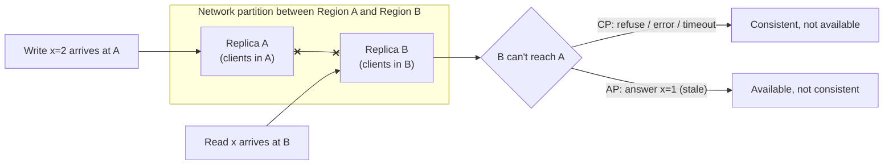
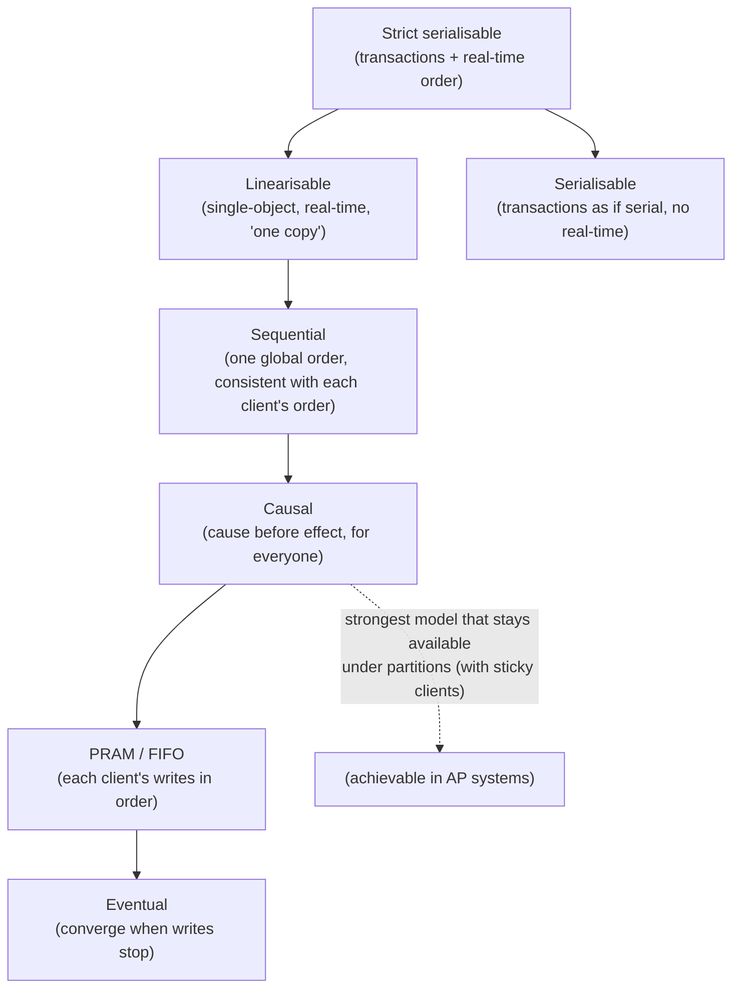

# CAP & PACELC, Consistency Models

!!! abstract "Key takeaways"
    - **CAP:** during a **network partition**, a replicated system must choose between **Consistency** (meaning *linearisability*: every read sees the latest write) and **Availability** (every request to a non-failed node gets a non-error response). Partitions **will** happen, so the real choice is **CP or AP while partitioned**. "Pick 2 of 3" is a misreading. You can't opt out of P.
    - **PACELC:** if **P**artitioned, choose **A** or **C**; **E**lse (normal operation), choose **L**atency or **C**onsistency. Strong consistency costs coordination, and coordination costs latency even when nothing is broken. Examples:
        - DynamoDB, Cassandra: PA/EL by default, tunable.
        - Spanner: PC/EC.
        - MongoDB: PA/EC-ish, depending on read and write concerns.
    - **Consistency models, strongest to weakest:**
        - **Linearisable** (behaves like a single copy, real-time order)
        - **Sequential**
        - **Causal** (causally related operations are seen in order by everyone; the strongest model that stays available during partitions)
        - **Eventual** (replicas converge if writes stop)

        **Session guarantees** (read-your-writes, monotonic reads, monotonic writes, writes-follow-reads) make eventual consistency usable.
    - **Linearisability ≠ serialisability.** Linearisability is about **recency of single objects**; serialisability is about **isolation of multi-object transactions**. Both together is **strict serialisability** (Spanner, FoundationDB, CockroachDB-style).
    - **Design choice:** per operation, not per system. Payments, inventory decrements and uniqueness need **strong** consistency (consensus, single leader, transactions). Feeds, counters, recommendations and caches are fine with **eventual** consistency plus conflict resolution (LWW, version vectors, CRDTs).

## Why it matters

"Is your system CP or AP?" is a classic interview question, and **most answers are wrong** ("we chose availability and partition tolerance" with no idea what happens to reads). Senior candidates explain **which operations** need which guarantee, **what users see** during a partition or under replica lag, and **what it costs** in latency. This is the theory behind every replication, caching and multi-Region decision on the other pages.

## Core concepts

### CAP, precisely


*Notice that CAP only describes behaviour **during a partition**. B either refuses to answer (staying consistent) or answers with possibly stale data (staying available). Without a partition, a system can be both consistent and available.*

**Common misconceptions:**

- "We're CA." In a distributed system you can't choose to have no partitions. A single-node database is "CA" only because it isn't distributed.
- "AP means no consistency." AP systems are usually **eventually consistent** and often offer per-request strong options.
- "CAP consistency = ACID consistency." No: CAP's C is **linearisability**. ACID's C is about application invariants.
- CAP's "availability" is strict: **every** non-failed node must respond. Many real systems are neither strictly CP nor strictly AP (for example, a single-leader DB with async replicas is neither).

### PACELC: the trade-off you pay every day

| System (default config) | If Partition | Else | Notes |
|---|---|---|---|
| DynamoDB | A | L | Eventually consistent reads by default. `ConsistentRead=true` on the base table → C (costs 2× RCU). Global tables: LWW by default, a multi-Region strong option exists |
| Cassandra / ScyllaDB | A | L | Tunable per query: `QUORUM`/`LOCAL_QUORUM` read + write → stronger |
| MongoDB (replica set) | A* | C | Primary reads with `majority` write concern are strong. Secondary reads trade C for L. *During partitions the minority side can't elect a primary |
| Spanner / CockroachDB / Aurora DSQL | C | C | Consensus (Paxos/Raft) + synchronised clocks/HLC. Higher write latency, especially cross-Region |
| PostgreSQL (primary + async replicas) | — | — | Primary reads are linearisable. Replica reads are stale. Failover can lose async writes |
| ZooKeeper / etcd | C | C | Consensus. Minority partition stops serving writes (and linearisable reads) |

### The consistency hierarchy


*Notice the two branches at the top: **linearisability** is about recency and real-time order of single objects; **serialisability** is about transaction isolation. Going down the chain, each step allows more anomalies but needs less coordination, so it gives lower latency and higher availability.*

| Model | Guarantee | Cost | Example use |
|---|---|---|---|
| Linearisable | Reads see the latest completed write. Real-time order | Consensus or a single leader on every operation | Leader election, locks, unique usernames, balances |
| Sequential | All see the same order (not necessarily real-time) | Global ordering | Replicated logs |
| Causal | If A happened-before B, everyone sees A before B | Track dependencies (vector clocks) | Comments and replies, chat, collaborative apps |
| Eventual | Replicas converge eventually | Cheapest, highest availability | Likes, view counts, caches, DNS |

**Session guarantees** (per client, on top of eventual consistency):

- **Read-your-writes:** I see my own updates.
- **Monotonic reads:** I never see older data after newer data.
- **Monotonic writes:** my writes apply in the order I made them.
- **Writes-follow-reads:** my write is ordered after the writes I had read.

MongoDB **causally consistent sessions** provide these when used with `majority` read and write concerns.

### Linearisability vs serialisability

- **Linearisable:** "the system behaves as if there's one copy of each object, and every operation takes effect at an instant between its start and end." It's a **recency** guarantee for single objects.
- **Serialisable:** "concurrent transactions produce a result equivalent to *some* serial order." It's an **isolation** guarantee across multiple objects, and that order may not match real time (a serialisable system can serve a stale snapshot).
- **Strict serialisable** = both. This is what people intuitively expect from "strong consistency" in a database.
- Isolation levels below serialisable (read committed, snapshot isolation / repeatable read) allow anomalies such as **lost updates** and **write skew** (two on-call doctors both go off call).

### Handling conflicts under eventual consistency

| Technique | How | Trade-off |
|---|---|---|
| Last-writer-wins (LWW) | Highest timestamp wins | Simple, but **silently loses** concurrent updates, and clock skew matters |
| Version vectors / vector clocks | Detect concurrent versions, keep siblings, app merges | Correct detection, but the app must merge |
| **CRDTs** | Data types whose merges always converge (G-counter, PN-counter, OR-set, LWW-register, sequence CRDTs) | Automatic convergence, limited operations, metadata overhead |
| Application merge | Domain logic (merge carts = union) | Flexible, but custom code per type |
| Avoid conflicts | Route each key's writes to one home Region/leader | Simplest. Writes depend on the home Region's availability |

### How strong consistency is achieved

- A **single leader** (all reads and writes through the leader) is linearisable if failover is fenced correctly.
- **Consensus** (Raft, Paxos, Zab) replicates a log by majority. It tolerates up to ⌊(N−1)/2⌋ failures, and the minority side stops making progress during a partition (CP).
- **Synchronised time:** Spanner's **TrueTime** (commit wait for the clock uncertainty) and hybrid logical clocks (CockroachDB) give globally ordered transactions.
- **Quorums** (W + R > N) give overlap but not full linearisability without extra mechanisms (read repair, write-back on read).

## In practice: code & configuration

=== "❌ Common mistake"
    ```java
    // "Check then act" across eventually consistent reads: two requests both see stock=1 and both sell.
    Item item = dynamo.getItem(r -> r.tableName("inventory").key(key));            // eventually consistent read
    if (Integer.parseInt(item.item().get("stock").n()) > 0) {
        dynamo.updateItem(r -> r.tableName("inventory").key(key)
            .updateExpression("SET stock = stock - :one")
            .expressionAttributeValues(Map.of(":one", n("1"))));                     // no condition → oversell
    }
    // MongoDB: w=1 writes + secondary reads → acknowledged writes can roll back after failover,
    // and users don't see their own updates.
    ```

=== "✅ Correct approach"
    ```java
    // Make the invariant part of the write: conditional (atomic) decrement, linearisable per item.
    dynamo.updateItem(r -> r.tableName("inventory").key(key)
        .updateExpression("SET stock = stock - :one")
        .conditionExpression("stock >= :one")                                       // invariant enforced atomically
        .expressionAttributeValues(Map.of(":one", n("1"))));
    // ConditionalCheckFailedException → out of stock (no oversell, no read needed)

    // MongoDB (Spring Data): majority writes + causally consistent session for read-your-writes.
    mongoTemplate.setWriteConcern(WriteConcern.MAJORITY);                           // survives failover
    mongoTemplate.setReadPreference(ReadPreference.primary());
    ClientSessionOptions causal = ClientSessionOptions.builder().causallyConsistent(true).build();
    Rx saved = mongoTemplate.withSession(causal).execute(ops -> {
        ops.save(rx);
        return ops.findById(rx.id(), Rx.class);                                     // sees its own write
    });
    ```

```sql
-- Cassandra: tunable consistency per statement (RF = 3 per DC)
CONSISTENCY LOCAL_QUORUM;   -- 2 of 3 in the local DC: strong within the DC (W + R > N), low latency
INSERT INTO rx_by_patient (patient_id, ts, rx_id, status) VALUES (?, ?, ?, ?);
CONSISTENCY ONE;            -- fastest, may read stale: fine for "recently viewed" widgets
SELECT * FROM rx_by_patient WHERE patient_id = ? LIMIT 20;
```

## Real-world usage

- **Amazon's shopping cart (Dynamo paper):** chose availability ("always writable") with version vectors and app-level merges. A deleted item could reappear, which was an acceptable trade for never rejecting "add to cart".
- **Google Spanner:** externally consistent (strict serialisable) global transactions using TrueTime. It pays commit-wait latency and needs well-provisioned networks, so it's "effectively CA" in practice because partitions are rare. Google's own framing is still CP.
- **Banking ledgers:** strong consistency for balances (single-leader or consensus, serialisable transactions, idempotent postings). Eventual consistency is fine for statement views and analytics.
- **Social and media:** likes, view counts and feeds are eventually consistent (CRDT-style counters, fan-out with lag). Uniqueness of usernames is linearisable (conditional write or consensus).
- **Healthcare:** prescription dispensing and controlled-substance counts need strong guarantees (no double dispense). Dashboards and notifications tolerate seconds of lag.

## Trade-offs & production gotchas

| Requirement | Choose | Mechanism |
|---|---|---|
| Never oversell / double-spend | Strong (linearisable per key) | Conditional writes, single leader, transactions with serialisable isolation |
| Global multi-Region writes, low latency | AP + conflict resolution | Home-Region routing, CRDTs, LWW only where loss is acceptable |
| User sees own changes | Session guarantees | Read-your-writes via leader reads or causal sessions |
| Ordering of related events | Causal / per-key ordering | Partition by entity key (Kafka key), version numbers |
| Coordination primitives (locks, leader) | CP | etcd/ZooKeeper/consensus with **fencing tokens** |

!!! warning "Gotchas"
    - **"Strong consistency" in vendor docs often means something narrower** (single-key, single-Region, or only on the primary). Read the fine print.
    - **Clocks lie.** LWW with skewed clocks drops the "newer" write. Use logical or hybrid clocks, or server-assigned versions.
    - **Distributed locks without fencing tokens are unsafe.** A paused process (GC) can wake up after its lease expired and still write.
    - **Snapshot isolation ≠ serialisable.** Write skew is possible. Use `SERIALIZABLE` or explicit locks/constraints for invariants that span rows.

## How this connects to my experience

- **Where I used it:**
    - OptumRx Meteor: MongoDB + Redis + Kafka, the GraphQL Consumer Service over 5 upstream systems (data from multiple sources with different freshness), Kafka retry/DLQ workflows.
    - Deloitte: DynamoDB + RDS.
- **Talking points:**
    - "In the GraphQL aggregation layer, each upstream had different freshness. We decided per field what could come from cache (eventual) and what needed a live call (fresh), and surfaced partial failures instead of blocking the whole response. That's an availability-over-consistency choice per field." *[confirm]*
    - "Kafka gave per-key ordering (partition by entity ID), and consumers were idempotent, so retries didn't create duplicates. That's causal/ordering guarantees without global coordination."
    - "For MongoDB, `majority` write concern for important writes, and primary reads where read-your-writes mattered." *[confirm]*
- **Likely follow-up chain:** "Is your system CP or AP?" → "What happens during a partition between your service and an upstream?" → "How do you prevent double processing?" → "Where did you need strong consistency?" Answer per operation, not per system. Reads degrade to cached or partial data (AP-ish). Writes that change prescriptions go to the system of record with idempotency keys and conditional updates (strong per key).

## Interview questions

### Fundamentals

??? question "Q1. State the CAP theorem correctly."
    **Answer:** In a distributed system that experiences a network partition, you must choose between consistency (linearisability: reads see the latest write) and availability (every non-failed node responds). Partitions can't be ruled out, so the choice is CP or AP during partitions. Without partitions you can have both.

    **Interviewer listens for:** "during a partition", and C = linearisability.

    **Common wrong answer:** "pick any two of three".

??? question "Q2. What does PACELC add?"
    **Answer:** Even without partitions, there's a trade-off between **latency** and **consistency**, because strong consistency needs coordination (round trips to replicas or a leader). For example, DynamoDB/Cassandra are PA/EL and Spanner is PC/EC.

    **Interviewer listens for:** the everyday latency cost.

    **Common wrong answer:** "it's CAP with an extra letter".

??? question "Q3. What is eventual consistency?"
    **Answer:** If no new writes occur, all replicas eventually converge to the same value. In the meantime, reads may return stale or different values. It needs conflict resolution for concurrent writes, and session guarantees to be user-friendly.

    **Interviewer listens for:** convergence, staleness and conflict handling.

    **Common wrong answer:** "data might be lost".

??? question "Q4. Linearisability vs serialisability?"
    **Answer:** Linearisability is a recency guarantee for single objects (one-copy behaviour in real time). Serialisability is transaction isolation (equivalent to some serial order, not necessarily real time). Both together is strict serialisability.

    **Interviewer listens for:** a clear distinction.

    **Common wrong answer:** "the same thing".

### Intermediate

??? question "Q5. Name the session guarantees and why they matter."
    **Answer:** Read-your-writes, monotonic reads, monotonic writes, writes-follow-reads. They give each user a coherent view on top of an eventually consistent store: no disappearing updates, no time travel. Implement with sticky replicas, version tokens or causally consistent sessions.

    **Interviewer listens for:** user-facing impact.

    **Common wrong answer:** "only possible with strong consistency".

??? question "Q6. Is a single-node PostgreSQL CP or AP?"
    **Answer:** CAP doesn't really apply. It isn't replicated, so there's no partition between replicas. With async replicas it's neither strictly CP nor AP: primary reads are linearisable, replica reads can be stale, and failover can lose acknowledged writes. Say what each configuration does.

    **Interviewer listens for:** precision over labels.

    **Common wrong answer:** "it's CA".

??? question "Q7. How do Cassandra consistency levels relate to quorums?"
    **Answer:** With replication factor N, choose per-request read and write levels (ONE, QUORUM, LOCAL_QUORUM, ALL). If W + R > N (for example QUORUM + QUORUM with RF=3), reads overlap the latest successful write. LOCAL_QUORUM keeps latency in-DC. Lower levels trade consistency for latency and availability.

    **Interviewer listens for:** a tunable trade-off per query.

    **Common wrong answer:** "Cassandra is always eventually consistent".

??? question "Q8. LWW vs CRDTs for conflict resolution?"
    **Answer:** LWW picks the highest timestamp. It's simple, but it silently drops concurrent updates and depends on clocks. CRDTs are data structures whose merge is commutative, associative and idempotent, so replicas converge automatically without losing updates (counters, sets, text). Use LWW only where losing a concurrent update is acceptable.

    **Interviewer listens for:** data loss with LWW.

    **Common wrong answer:** "LWW is fine everywhere".

### Senior

??? question "Q9. Design a multi-Region user profile service with low-latency writes."
    **Answer:**
    - **Home-Region per user** (by residency or signup): writes go to the home Region (strong per user), and other Regions get async replicas for reads (eventual).
    - Read-your-writes by routing the user's own reads home, or by a version token.
    - Fields that need global uniqueness (username/email) use a linearisable registry (conditional write in one Region, or a consensus store).
    - Optional fields that can merge (preferences) can use CRDT-like maps.

    **Interviewer listens for:** avoiding conflicts by design, and per-field choices.

    **Common wrong answer:** "multi-master with LWW for everything".

??? question "Q10. Why are distributed locks tricky, and what's the safe pattern?"
    **Answer:** Leases expire while a holder is paused (GC, network), so two holders can act at once. Clocks drift, and Redlock's assumptions are debated. The safe pattern is **fencing tokens**: the lock service issues a monotonically increasing token, and the protected resource rejects writes with older tokens. Better still, use conditional writes or transactions on the resource itself.

    **Interviewer listens for:** fencing tokens.

    **Common wrong answer:** "Redis SETNX with a TTL is safe".

??? question "Q11. Where would you choose causal consistency?"
    **Answer:** Where cause-before-effect matters to users but global ordering doesn't: comments and replies, chat threads, collaborative editing, notifications after updates. It's the strongest model achievable while staying available under partitions, and it's cheaper than linearisability. Implement with dependency tracking (vector clocks), per-entity partitioning, or causally consistent sessions.

    **Interviewer listens for:** user-visible ordering at lower cost.

    **Common wrong answer:** "use linearisability to be safe".

### Scenario-based

??? question "Q12. Two pharmacists dispense the last unit of a controlled drug at the same time from different terminals. Prevent it."
    **Answer:**
    - The stock decrement must be **linearisable per item**: a conditional atomic update (`stock >= 1`) or a serialisable transaction on the system of record.
    - Idempotency keys per dispense request.
    - Never check stock from a cache or replica for the decision.
    - Offline terminals queue requests that are validated centrally (or get a reserved allocation).
    - Audit log for compliance.

    **Interviewer listens for:** invariants enforced at the write, not by a prior read.

    **Common wrong answer:** "read the stock first, then update".

??? question "Q13. During a Region partition, should the prescription status page show stale data or an error?"
    **Answer:** Usually stale **with a clear "as of" timestamp** (AP for reads): patients and pharmacists can still work, and the risk is low. But **actions** that change state (dispense, cancel) should require the system of record (CP for writes), queueing or rejecting with a clear message when it's unreachable. Make it a per-operation decision with product and compliance input.

    **Interviewer listens for:** a per-operation choice plus UX.

    **Common wrong answer:** a blanket "we're AP" or "we're CP".

## Cheat sheet

| Concept | Remember |
|---|---|
| CAP | During a partition: C (linearisable) **or** A (every node answers). P is not optional |
| PACELC | Else: Latency vs Consistency. Dynamo/Cassandra PA/EL, Spanner PC/EC |
| Hierarchy | Strict serialisable > linearisable / serialisable > sequential > causal > FIFO > eventual |
| Session | Read-your-writes, monotonic reads/writes, writes-follow-reads |
| Lin vs Ser | Recency of one object vs isolation of transactions |
| Quorum | W + R > N for overlap. Not full linearisability alone |
| Conflicts | LWW (lossy), version vectors (detect), CRDTs (auto-merge), avoid (home Region) |
| Strong via | Single leader, consensus (Raft/Paxos), TrueTime/HLC, conditional writes |
| Locks | Leases + **fencing tokens**. Prefer conditional writes |
| Decide | **Per operation**: invariants strong, views eventual |

## Sources
1. [Gilbert & Lynch: Brewer's Conjecture and the Feasibility of Consistent, Available, Partition-Tolerant Web Services (2002)](https://users.ece.cmu.edu/~adrian/731-sp04/readings/GL-cap.pdf): the formal CAP proof.
2. [Eric Brewer: CAP Twelve Years Later (IEEE Computer, 2012)](https://www.infoq.com/articles/cap-twelve-years-later-how-the-rules-have-changed/): clarifications and misreadings.
3. [Daniel Abadi: Consistency Tradeoffs in Modern Distributed Database System Design (PACELC, IEEE Computer 2012)](https://www.cs.umd.edu/~abadi/papers/abadi-pacelc.pdf).
4. [Jepsen: Consistency models](https://jepsen.io/consistency): the hierarchy, definitions and availability properties.
5. Martin Kleppmann, *Designing Data-Intensive Applications*, ch. 5, 7 and 9: replication lag, transactions/isolation, linearisability, consensus.
6. [Martin Kleppmann: How to do distributed locking (fencing tokens)](https://martin.kleppmann.com/2016/02/08/how-to-do-distributed-locking.html).
7. [Shapiro et al.: Conflict-free Replicated Data Types (2011)](https://inria.hal.science/inria-00609399/document).
8. [Google: Spanner, TrueTime and the CAP theorem](https://research.google/pubs/spanner-truetime-and-the-cap-theorem/).
9. [MongoDB: causal consistency and read/write concerns](https://www.mongodb.com/docs/manual/core/causal-consistency-read-write-concerns/) and [Amazon DynamoDB read consistency](https://docs.aws.amazon.com/amazondynamodb/latest/developerguide/HowItWorks.ReadConsistency.html).
