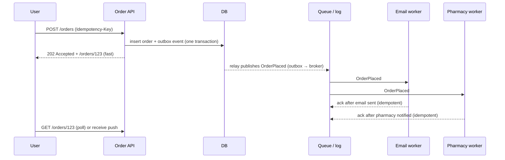
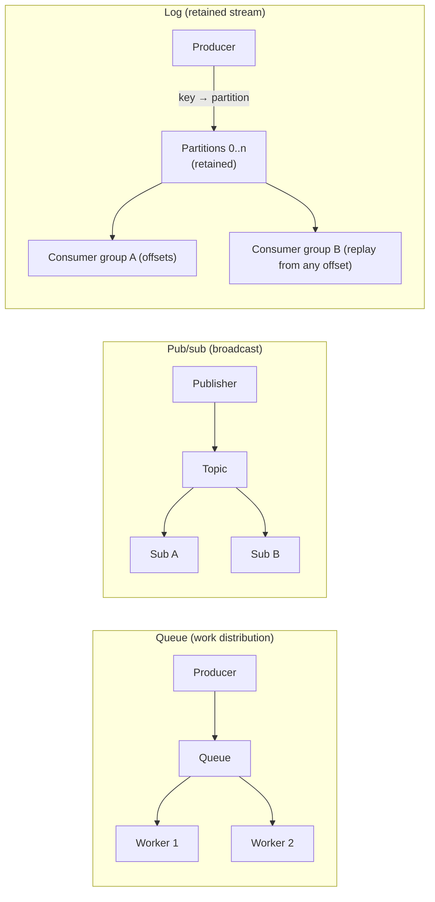
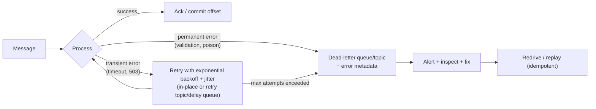

# Message Queues & Async Processing

!!! abstract "Key takeaways"
    - **Go async** to decouple services, absorb spikes (**load levelling**), cut user-facing latency (do slow work later), isolate failures, and fan out events to many consumers. The cost: **eventual consistency**, harder debugging, and duplicate and ordering issues.
    - **Three shapes:**
        - **Queue:** point-to-point, competing consumers, delete on ack. SQS, RabbitMQ queues.
        - **Pub/sub:** each subscriber gets a copy. SNS, RabbitMQ fan-out, Google Pub/Sub.
        - **Log:** retained, ordered per partition, consumers track offsets, **replayable**. Kafka, Kinesis, Pulsar, Redis Streams.
    - **Delivery is at-least-once in practice.** Design **idempotent consumers** (dedup table, conditional writes, idempotency keys). "Exactly-once" exists only inside specific boundaries (Kafka transactions read-process-write). End to end, it's **effectively-once** = at-least-once + idempotency.
    - **Failure handling:**
        - retries with **exponential backoff + jitter**
        - a **max-attempts → DLQ** policy
        - poison-message isolation
        - non-blocking retry topics for ordering-insensitive work
        - alerts on DLQ depth and consumer lag
    - **Patterns:**
        - **transactional outbox** (no dual writes)
        - **async request-reply** (202 + status URL, webhook or WebSocket)
        - **competing consumers** + autoscaling on lag/backlog
        - **sagas** or **workflow engines** (Temporal, Step Functions) for multi-step business processes with compensation

## Why it matters

Almost every design answer includes "put a queue here". Interviewers then ask the questions that matter: *What if the consumer crashes mid-way? What if the message is processed twice? What if order matters? What if the queue grows faster than you drain it? How does the user find out the result?* This page is about answering those, generalised beyond any one broker. (AWS specifics are in the AWS messaging page; Kafka internals are in the Kafka section.)

## Core concepts

### Sync vs async


*Notice what moved out of the request path: the user waits only for the durable write. Email and pharmacy work happen later, independently and with retries. A slow email provider can't slow down ordering.*

| Make it async when… | Keep it sync when… |
|---|---|
| Work is slow or unreliable (third-party APIs, reports, media processing) | The user needs the result immediately to continue |
| Traffic is spiky and the downstream has fixed capacity | Strong consistency of the response is required |
| Several consumers react to one event | The call is fast and reliable and adds no fan-out |
| Failure of a side effect shouldn't fail the main action | Simplicity matters more (low scale, one team) |

### Queue vs pub/sub vs log


*Notice the different lifetime of a message: a **queue** deletes it when a worker acknowledges it, **pub/sub** pushes a copy to each subscriber, and a **log keeps it**, so new consumers can join later and old ones can **replay**.*

| | Queue (SQS, RabbitMQ) | Log (Kafka, Kinesis, Pulsar) |
|---|---|---|
| Consumption | Competing consumers, per-message ack | Consumer groups, per-partition offsets |
| Ordering | None / per group (FIFO) | Per partition (per key) |
| Retention | Until acked (bounded) | Time/size-based, replayable |
| Parallelism | Add workers freely | Limited by partition count per group |
| Per-message features | Delays, priorities, routing (RabbitMQ), visibility timeout, DLQ | Compaction, stream processing, connectors |
| Best for | Task/job distribution, commands | Event streams, multiple independent consumers, event sourcing, CDC |

### Delivery semantics

| Semantics | How it happens | Risk |
|---|---|---|
| At-most-once | Ack/commit **before** processing | Lost messages on crash |
| **At-least-once** | Ack/commit **after** processing | **Duplicates** on crash or timeout. The practical default |
| Exactly-once (scoped) | Kafka idempotent producer + transactions (consume-transform-produce in Kafka). Dedup windows (SQS FIFO 5 min) | Only within that boundary. External side effects (email, HTTP) can still repeat |
| **Effectively-once** | At-least-once + **idempotent processing** | Needs a dedup key and store |

**Idempotency techniques:**

- A **processed-messages table** with a unique `(consumer, message_id)`, inserted in the **same transaction** as the business change.
- **Conditional writes** / upserts keyed by a business ID (`INSERT … ON CONFLICT DO NOTHING`, DynamoDB `attribute_not_exists`).
- **Natural idempotency:** "set status = SHIPPED" is idempotent; "add 1" is not. Use versions or event IDs for increments.
- **Idempotency keys** passed to external APIs (Stripe-style), so retries don't double-charge.

### Ordering

- Global ordering kills parallelism. Usually you need **per-entity ordering**: partition by `orderId`/`patientId` (Kafka key, SQS FIFO message group).
- Retries can break ordering. **Blocking retries** keep order but stall the partition. **Non-blocking retry topics** keep throughput but reorder. Choose per use case, or use **version numbers** so consumers ignore stale events.
- For state, prefer events that carry **versions or full state** (event-carried state transfer), so an out-of-order older event can be detected and dropped.

### Failures: retries, back-off, DLQ, poison messages


*Notice that **transient** and **permanent** errors take different paths. Retrying a malformed message 10 times wastes capacity and blocks ordered partitions, so send it to the DLQ quickly. Every DLQ needs an owner, an alert and a redrive procedure.*

- **Backoff:** `delay = min(cap, base × 2^attempt)` with **full jitter** (random 0..delay), to avoid synchronised retry storms.
- **Retry budgets** limit the total retry rate so retries can't amplify an outage.
- **Circuit breakers** on consumers stop hammering a dead downstream. Pause consumption, and the queue buffers in the meantime.

### Back-pressure and load levelling

- A queue **absorbs bursts** so the consumer processes at a sustainable rate. The trade-off is **latency** (queue age) instead of failure.
- **Monitor age, not just depth:** `ApproximateAgeOfOldestMessage` (SQS) and **consumer lag** (Kafka) translate directly into user-visible delay.
- **Autoscale consumers on backlog per worker or lag** (KEDA, Lambda ESM), and **cap** them at what the downstream can take.
- If the backlog keeps growing: shed or deprioritise non-critical work, use bounded queues with rejection at the producer (back-pressure all the way to the client: 429/503), and use priority queues for critical messages.

### Async request-reply and workflows

- **Async API:** `202 Accepted` + `Location: /jobs/{id}`. The client **polls** (with `Retry-After`), or gets a **webhook** callback (signed, retried, idempotent) or a **WebSocket/SSE** push.
- **Long-running, multi-step processes** (prescription fulfilment, onboarding, payments):
    - **Choreography:** services react to each other's events. Loosely coupled, but the overall flow is implicit.
    - **Orchestration:** a **workflow engine** (Temporal, AWS Step Functions, Camunda, Lambda durable functions) runs explicit steps with retries, timers and **compensations** (the **saga** pattern).
- **Scheduled and delayed work:** delay queues, scheduler services, or workflow timers. Avoid `sleep` in consumers.

### Choosing a broker

| Need | Good fit |
|---|---|
| Simple managed task queue | SQS, Google Cloud Tasks, Azure Service Bus queues |
| Rich routing (topic/headers exchanges), priorities, per-message TTL, request-reply | RabbitMQ (quorum queues), Azure Service Bus |
| High-throughput retained event log, replay, stream processing, CDC | Kafka (MSK, Confluent), Kinesis, Pulsar, Redpanda |
| Lightweight streams inside an existing Redis | Redis Streams (consumer groups, but memory-bound) |
| Cross-team event routing on AWS | EventBridge |
| Durable multi-step business processes | Temporal, Step Functions (not a raw queue) |

## In practice: code & configuration

=== "❌ Common mistake"
    ```java
    // Dual write (DB then broker): a crash between them loses the event, or publishes an event for a rolled-back TX.
    @Transactional
    public void placeOrder(Order o) {
        repo.save(o);
        kafka.send("orders", o.id(), new OrderPlaced(o));   // not atomic with the DB commit
    }

    // Consumer: not idempotent, infinite in-place retries on a poison message (partition stalls forever),
    // auto-commit before processing (message lost on crash).
    @KafkaListener(topics = "orders")
    void on(OrderPlaced e) { emailService.send(e); inventory.decrement(e.items()); }
    ```

=== "✅ Correct approach"
    ```java
    // Producer: transactional outbox (event row committed with the business change).
    @Transactional
    public void placeOrder(Order o) {
        repo.save(o);
        outbox.save(OutboxEvent.of("Order", o.id(), "OrderPlaced", json(o)));   // same DB transaction
    }   // Relay: Debezium CDC (or a poller) publishes outbox rows to Kafka keyed by aggregate id.

    // Consumer: idempotent, bounded retries with backoff, then dead-letter topic.
    @Configuration
    class KafkaErrorConfig {
        @Bean
        DefaultErrorHandler errorHandler(KafkaTemplate<Object, Object> template) {
            var recoverer = new DeadLetterPublishingRecoverer(template);          // → orders.DLT with headers
            var backoff = new ExponentialBackOffWithMaxRetries(4);                // 4 retries
            backoff.setInitialInterval(500); backoff.setMultiplier(2.0); backoff.setMaxInterval(10_000);
            var handler = new DefaultErrorHandler(recoverer, backoff);
            handler.addNotRetryableExceptions(ValidationException.class);         // poison → DLT immediately
            return handler;
        }
    }

    @KafkaListener(topics = "orders", groupId = "inventory")
    @Transactional
    void on(OrderPlaced e, @Header(KafkaHeaders.RECEIVED_KEY) String key) {
        if (processed.existsByConsumerAndEventId("inventory", e.eventId())) return;  // dedup
        inventory.reserve(e.orderId(), e.items());                                  // business change
        processed.save(new ProcessedEvent("inventory", e.eventId()));               // same TX, unique key
    }   // offset committed after success (container AckMode.RECORD/BATCH)
    ```

```sql
-- Outbox and dedup tables (PostgreSQL)
CREATE TABLE outbox_event (
  id             UUID PRIMARY KEY,
  aggregate_type TEXT NOT NULL,
  aggregate_id   TEXT NOT NULL,           -- becomes the Kafka key → per-aggregate ordering
  type           TEXT NOT NULL,
  payload        JSONB NOT NULL,
  created_at     TIMESTAMPTZ NOT NULL DEFAULT now()
);
CREATE TABLE processed_event (
  consumer   TEXT NOT NULL,
  event_id   UUID NOT NULL,
  processed_at TIMESTAMPTZ NOT NULL DEFAULT now(),
  PRIMARY KEY (consumer, event_id)        -- duplicate insert fails → already processed
);
```

## Real-world usage

- **Uber, LinkedIn, Netflix:** Kafka as the central event backbone (trip events, activity streams, CDC into data platforms). Uber documented **non-blocking retry topics + DLQ** for reliable reprocessing, a pattern now built into Spring Kafka (`@RetryableTopic`).
- **Stripe:** idempotency keys on every mutating API call make client retries safe. The same idea applies to queue consumers.
- **Shopify, Amazon:** queues level huge flash-sale spikes. Checkout writes are durable, and fulfilment and notifications drain behind them.
- **Temporal** (from Uber's Cadence) and **Step Functions** run long business workflows with retries and compensation instead of hand-built state machines over queues.
- **Failure modes:**
    - Unbounded retries amplifying an outage.
    - DLQs nobody reads.
    - Consumer lag growing silently.
    - Duplicate side effects (double emails or charges).
    - Ordering broken by retries.
    - Large messages hurting throughput (use a claim check).
- **Healthcare:** prescription events need per-patient ordering, idempotent processing (no double dispense or notification), PHI-minimal payloads (IDs, not clinical details, in event bodies), encryption, and auditability (retained logs).

## Trade-offs & production gotchas

| Choice | Pros | Cons | Use when |
|---|---|---|---|
| Queue | Simple work distribution, per-message ack | No replay, one consumer per message | Jobs, commands |
| Log | Replay, many consumers, ordering per key | Partition-bound parallelism, offset management | Events, CDC, analytics |
| Blocking retries | Preserve order | Stall the partition | Strict per-key order |
| Retry topics / delay queues | Throughput preserved | Reordering | Independent messages |
| Choreography | Loose coupling | Implicit flow, hard to trace | Few steps, few services |
| Orchestration (workflow engine) | Explicit flow, timers, compensation | Central component | Long multi-step business processes |

!!! warning "Gotchas"
    - **Visibility timeout / max poll interval** shorter than processing time leads to redelivery or a consumer-group rebalance, which leads to duplicates. Tune it, or extend leases during long work.
    - **Large payloads:** store them in object storage and send a reference (claim check).
    - **Schema evolution:** use a schema registry and backward-compatible changes. Consumers must tolerate unknown fields.
    - **Observability:** propagate trace context in message headers, and alert on lag/age and DLQ depth, not just on errors.
    - **Don't use a queue as a database:** for queryable state, persist to a DB and emit events.

## How this connects to my experience

- **Where I used it:**
    - OptumRx Meteor: "Designed **Kafka-based event-driven workflows with retry and DLQ handling**".
    - Deloitte: "event-driven healthcare analytics workflows" with **SQS/SNS** and Lambda.
- **Talking points:**
    - "Retries were bounded with exponential backoff, non-retryable errors went straight to the DLT, and DLT messages carried exception headers so we could fix and replay." *[confirm: blocking vs @RetryableTopic, replay tooling]*
    - "Consumers were idempotent using event IDs (dedup store), because rebalances and retries make duplicates normal." *[confirm: dedup store (MongoDB/Redis) and key]*
    - "Events were keyed by entity ID for per-entity ordering." *[confirm: key choice]*
    - "At Deloitte, SNS fanned out to SQS queues per consumer with DLQs and alarms." *[confirm]*
- **Likely follow-up chain:** "Walk me through your retry/DLQ design." → "How did you avoid duplicates?" → "How did you replay DLQ messages safely?" → "What about ordering during retries?" Answer: backoff + max attempts + DLT with headers → idempotency keys → a replay tool that republishes to the main topic and relies on idempotency → per-key ordering with blocking retries where order mattered, and versions to drop stale events.

## Interview questions

### Fundamentals

??? question "Q1. Why use a message queue?"
    **Answer:** To decouple producers from consumers, absorb load spikes (load levelling), take slow or unreliable work out of the request path, isolate failures (a downstream outage doesn't fail the request), and fan out to multiple consumers. The cost is eventual consistency and operational complexity.

    **Interviewer listens for:** benefits and costs.

    **Common wrong answer:** "to make it faster" (only the user-facing path gets faster).

??? question "Q2. Queue vs pub/sub vs log?"
    **Answer:**
    - **Queue:** each message goes to one consumer, deleted on ack.
    - **Pub/sub:** each subscriber gets a copy, pushed.
    - **Log:** messages are retained and ordered per partition, and consumer groups track offsets, so replay and late joiners are possible.

    **Interviewer listens for:** retention and replay.

    **Common wrong answer:** "Kafka is just a queue".

??? question "Q3. At-most-once vs at-least-once vs exactly-once?"
    **Answer:** Ack before processing means at-most-once (loss on crash). Ack after processing means at-least-once (duplicates). Exactly-once only holds within a boundary (Kafka transactions, dedup windows). End to end, you get **effectively-once** through idempotent consumers.

    **Interviewer listens for:** idempotency as the real answer.

    **Common wrong answer:** "Kafka guarantees exactly-once to my email provider".

??? question "Q4. What is a DLQ and what must surround it?"
    **Answer:** A queue or topic for messages that failed permanently or exceeded max attempts, with error metadata. Around it you need an owner, alerts on depth or age, inspection tooling, a fix-and-**redrive** procedure, and idempotent consumers so redrive is safe.

    **Interviewer listens for:** an operational process.

    **Common wrong answer:** "a place failed messages go".

### Intermediate

??? question "Q5. How do you make a consumer idempotent?"
    **Answer:**
    - A dedup table keyed by `(consumer, eventId)` written in the same transaction as the business change.
    - Or conditional upserts keyed by a business ID.
    - Or naturally idempotent operations (set state, not increment).
    - Pass idempotency keys to external APIs.
    - TTL or clean up old dedup rows according to the redelivery window.

    **Interviewer listens for:** same-transaction dedup.

    **Common wrong answer:** "check whether it exists, then insert" (race).

??? question "Q6. Why retry with exponential backoff and jitter?"
    **Answer:** Immediate, synchronised retries hammer a struggling dependency and create retry storms. Exponential backoff spaces attempts out, and jitter de-synchronises clients. Cap the delay and the number of attempts, and use retry budgets.

    **Interviewer listens for:** jitter specifically.

    **Common wrong answer:** "retry every second forever".

??? question "Q7. How do you preserve ordering while scaling consumers?"
    **Answer:** Partition by entity key (Kafka key, FIFO message group). Order holds per key, and parallelism comes from many keys and partitions. Retries must not reorder that key: use blocking retries, or attach versions so consumers drop stale events.

    **Interviewer listens for:** per-key ordering.

    **Common wrong answer:** "one consumer for everything".

??? question "Q8. What's the transactional outbox and why use it?"
    **Answer:** Write the business change **and** an event row in the same DB transaction. A relay (CDC like Debezium, or a poller) publishes outbox rows to the broker and marks them sent. This avoids dual-write inconsistency (event lost, or event for a rolled-back change). Consumers must still be idempotent, because the relay may publish twice.

    **Interviewer listens for:** dual-write awareness.

    **Common wrong answer:** "publish in an @AfterCommit hook" (still lossy on crash).

### Senior

??? question "Q9. The queue backlog grows all day and drains overnight. Is that a problem?"
    **Answer:** It depends on the latency SLO. If message age (user-visible delay) exceeds the SLO, yes. Options:
    - Autoscale consumers on backlog per worker or lag (capped by downstream capacity).
    - Optimise processing (batching, fewer round trips).
    - Prioritise critical messages (separate queues).
    - Shed or defer non-critical work.
    - Find the actual bottleneck downstream.

    If the SLO allows hours, it's healthy load levelling.

    **Interviewer listens for:** tying the backlog to an SLO.

    **Common wrong answer:** "add consumers without limit".

??? question "Q10. Choreography vs orchestration for a 6-step prescription fulfilment flow?"
    **Answer:** Choreography (services react to events) is loosely coupled, but the flow is implicit and hard to monitor, and compensations are scattered. Orchestration (Temporal, Step Functions) makes the flow explicit with retries, timers, human steps and saga compensations in one place. For 6 steps with timeouts and compliance audit, **orchestrate**, and use events for notifications and analytics.

    **Interviewer listens for:** criteria (number of steps, visibility, compensation).

    **Common wrong answer:** "always choreography, because it's more microservices".

??? question "Q11. How do you design an async API so clients get results reliably?"
    **Answer:**
    - `POST` with an Idempotency-Key, returning `202` + `Location: /jobs/{id}`.
    - `GET /jobs/{id}` returns status and a result link, with a `Retry-After` hint.
    - Optional **webhooks**: signed (HMAC), retried with backoff, idempotent on the receiver, with a replay endpoint.
    - Or WebSocket/SSE pushes for interactive UIs.
    - Results kept for N days.

    **Interviewer listens for:** idempotency plus multiple notification channels.

    **Common wrong answer:** "keep the HTTP connection open until done".

### Scenario-based

??? question "Q12. Patients received the same refill SMS three times. Find and fix the cause."
    **Answer:**
    - **Likely causes:** a consumer timeout or rebalance (processing exceeded `max.poll.interval.ms` or the visibility timeout) leading to redelivery; retries after a partial success (SMS sent, then a DB write failed); multiple scheduler instances enqueuing the same reminder.
    - **Fixes:** an idempotency key per reminder (patient + rx + due date) checked and stored transactionally, passed to the SMS provider if supported; tune the timeouts; a single-run scheduler (lock) or deterministic message IDs with dedup.
    - Alert on duplicate-send metrics.

    **Interviewer listens for:** multiple root causes and idempotency.

    **Common wrong answer:** "use exactly-once Kafka".

??? question "Q13. A poison message is stalling a Kafka partition. What do you do now, and what's the long-term fix?"
    **Answer:**
    - **Now:** identify it from the logs or offset, skip it to the DLT (with the error handler, or by seeking past it via an admin tool), and confirm lag recovers.
    - **Long term:** classify exceptions (non-retryable → DLT immediately), bounded retries, schema validation at the producer, contract tests, a DLT alert and replay tooling, and consumer code that tolerates unknown fields.

    **Interviewer listens for:** immediate unblocking plus prevention.

    **Common wrong answer:** "restart the consumer".

## Cheat sheet

| Concept | Remember |
|---|---|
| Why async | Decouple, load-level, cut latency, isolate failures, fan out |
| Shapes | Queue (compete, delete), pub/sub (copy each), log (retain, offsets, replay) |
| Semantics | At-least-once + idempotency = effectively-once |
| Idempotency | Dedup table in the same TX, conditional upserts, idempotency keys |
| Ordering | Per key/partition. Retries may reorder → blocking retry or versions |
| Retries | Exponential backoff + **jitter**, max attempts, budgets, classify errors |
| DLQ | Owner, alert, inspect, redrive (idempotent) |
| Back-pressure | Monitor **age/lag**, autoscale on backlog with a cap, prioritise, shed |
| Outbox | Business change + event row in one TX, CDC relay |
| Async API | 202 + Location, poll/webhook/WebSocket, Idempotency-Key |
| Workflows | Saga. Choreography vs orchestration (Temporal, Step Functions) |

## Sources
1. Gregor Hohpe & Bobby Woolf, *Enterprise Integration Patterns*: queues, pub/sub, dead letter channel, idempotent receiver, claim check.
2. [Microsoft Azure Architecture Center: Queue-Based Load Leveling](https://learn.microsoft.com/en-us/azure/architecture/patterns/queue-based-load-leveling) and [Asynchronous Request-Reply](https://learn.microsoft.com/en-us/azure/architecture/patterns/async-request-reply).
3. [microservices.io: Transactional outbox](https://microservices.io/patterns/data/transactional-outbox.html) and [Saga](https://microservices.io/patterns/data/saga.html) (Chris Richardson).
4. [Amazon Builders' Library: Timeouts, retries and backoff with jitter](https://aws.amazon.com/builders-library/timeouts-retries-and-backoff-with-jitter/) and [Avoiding insurmountable queue backlogs](https://aws.amazon.com/builders-library/avoiding-insurmountable-queue-backlogs/).
5. [Spring for Apache Kafka: error handling, DefaultErrorHandler, DeadLetterPublishingRecoverer, non-blocking retries](https://docs.spring.io/spring-kafka/reference/kafka/annotation-error-handling.html).
6. [Confluent: Exactly-once semantics in Kafka](https://www.confluent.io/blog/exactly-once-semantics-are-possible-heres-how-apache-kafka-does-it/).
7. [Uber Engineering: Building reliable reprocessing and dead letter queues with Kafka](https://www.uber.com/blog/reliable-reprocessing/).
8. [Stripe: Designing robust and predictable APIs with idempotency](https://stripe.com/blog/idempotency).
9. [Temporal documentation: workflows and sagas](https://docs.temporal.io/workflows).
