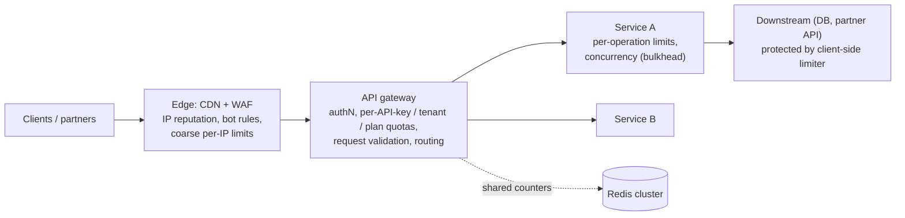
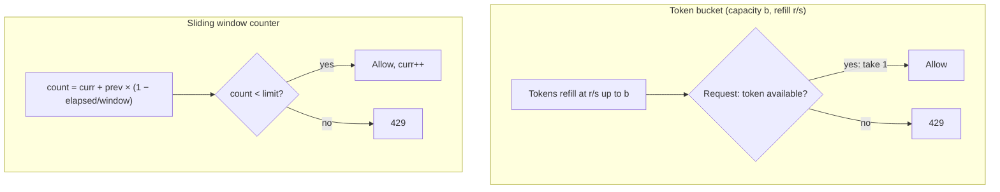
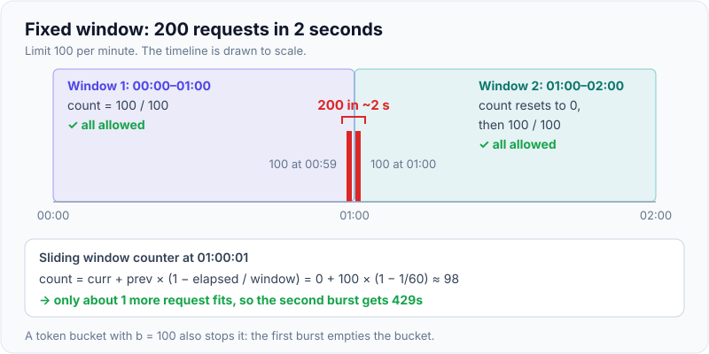

# Rate Limiting & API Gateway Design

!!! abstract "Key takeaways"
    - **Rate limiting** protects availability (noisy neighbours, abuse, retry storms), enforces **fairness and quotas** (per user, API key, tenant or plan) and controls **cost**. Reject with **HTTP 429** + `Retry-After` and quota headers.
    - **Algorithms:**
        - **Token bucket:** refill rate r, capacity b. Allows bursts up to b. The most common choice.
        - **Leaky bucket:** constant outflow, smooths traffic into a queue.
        - **Fixed window counter:** simple, but allows a 2× burst at window edges.
        - **Sliding window log:** exact, but memory-heavy.
        - **Sliding window counter:** weighted blend of the current and previous windows. Accurate enough and cheap.
    - **Distributed limiting:** a shared counter in **Redis**, updated **atomically** (Lua script / `INCR` + `EXPIRE`), keyed by `limit:{tenant}:{window}`. Trade exactness for latency with **local token buckets plus periodic sync**, and decide **fail-open vs fail-closed** when Redis is down.
    - **Layering:**
        - Edge/WAF for IP- and bot-level floods.
        - **API gateway** for per-key, per-tenant and plan quotas.
        - **Service** for expensive operations and concurrency limits.
        - Client-side throttling and backoff.
    - **An API gateway** is the single entry point: routing, TLS, **authentication/token validation**, rate limits, request validation, transformation, caching, observability and canary routing. Keep **business logic out**. Use **BFFs** for client-specific aggregation, and a **service mesh** for east-west (service-to-service) traffic.

## Why it matters

"Design a rate limiter" is one of the most common system design questions. It's small enough to finish in 45 minutes and deep enough to test algorithms, distributed state, atomicity and failure handling. API gateway design comes up in every microservices discussion: what belongs at the edge, and what belongs in services. Both are central to the GraphQL/API work on the resume.

## Core concepts

### Where limits live


*Notice that each layer has a different job: the **edge** absorbs floods cheaply, the **gateway** enforces business quotas (it knows the authenticated identity), and **services** protect their own scarce resources, including **outbound** calls to partners with their own limits.*

### The algorithms


*Notice that the token bucket separates the **average rate** (r) from the **burst** (b). That matches how real clients behave (bursty but bounded), which is why AWS API Gateway, Stripe and Envoy use token-bucket variants.*

{ loading=lazy }
*Watch the burst empty the bucket at once, then the tokens come back one per second. b sets the burst size, r sets the long-run rate.*

| Algorithm | State per key | Bursts | Accuracy | Notes |
|---|---|---|---|---|
| **Token bucket** | tokens + last refill time | Up to capacity b | Good | Default for APIs. Lazy refill on each request (no timer needed) |
| **Leaky bucket (queue)** | queue / level | Smoothed to a constant rate | Good | Shapes traffic. Adds latency. Good for outbound calls to fragile partners |
| **Fixed window** | counter per window | **Up to 2× at boundaries** | Low | Simplest (`INCR` + `EXPIRE`) |
| **Sliding window log** | timestamp per request | Exact | Exact | Memory O(requests). Fine for low limits (e.g. 5 logins/min) |
| **Sliding window counter** | 2 counters | Approximate | ~Good (assumes even distribution in the previous window) | Cheap and accurate enough. Popular at scale (Cloudflare) |
| Concurrency limiter | in-flight count | n/a | Exact | Limits **simultaneous** requests (bulkhead). Adaptive variants (Netflix concurrency-limits) |

**Fixed-window boundary problem:** with a limit of 100/min, a client can send 100 at 00:59 and 100 at 01:00, which is 200 in 2 seconds. A sliding window or a token bucket fixes this.

{ loading=lazy }
*Notice that each window's counter is within the limit, yet the client got twice the limit in two seconds. The sliding window counter still remembers the previous window.*

### Distributed rate limiting

- **Shared store:** Redis (single-digit-ms latency, atomic Lua). Key per `{dimension}:{id}`. TTL so idle keys disappear.
- **Atomicity:** a read-modify-write across requests races, so use **one Lua script** (`EVALSHA`) or atomic `INCR`. Use Redis server `TIME` to avoid client clock skew.
- **Redis Cluster:** keep all keys of one limit in **one slot** (hash tags `{tenant42}`) so a script can touch them atomically.
- **Latency vs accuracy:**
    - Option 1: every request goes to Redis (accurate, adds ~1 ms).
    - Option 2: a **local token bucket per instance** with limit/N, re-balanced periodically (fast, approximate).
    - Option 3: **batch increments** (sync every 100 ms).
- **Failure mode:**
    - **Fail-open** (allow when Redis is down) protects availability. Most product APIs choose this, with a local fallback limiter.
    - **Fail-closed** protects downstream systems or cost. Use it for security limits (login attempts, OTP sends).
- **Multi-Region:** usually limit **per Region** (each gets a share), or accept approximate global limits with async aggregation.

### Communicating limits

- **429 Too Many Requests** + `Retry-After` (seconds or an HTTP date).
- Quota headers: the de-facto `X-RateLimit-Limit`, `-Remaining` and `-Reset`, or the IETF draft `RateLimit-Policy` / `RateLimit` fields.
- Separate **quotas** (daily/monthly plan allowances, billing) from **rate limits** (per-second protection).
- Clients should honour `Retry-After` and use exponential backoff with jitter. SDKs should do it automatically.

### API gateway responsibilities

| Belongs in the gateway | Keep out of the gateway |
|---|---|
| Routing, versioning (`/v1`), canary/weighted routing | Business rules, domain validation |
| TLS termination, mTLS to backends | Orchestration of multi-step business flows |
| **Authentication** (JWT validation, OAuth2 introspection, API keys), coarse authorisation (scopes) | Fine-grained authorisation on domain data (belongs in services) |
| Rate limiting, quotas, request size limits | Data transformations that encode domain knowledge |
| Request/response validation against OpenAPI schema | Long-running work |
| Caching of public GETs, compression | Per-client response shaping for many clients (→ BFF) |
| Observability: access logs, metrics, trace start | |
| CORS, WAF integration, IP allow-lists | |

**Patterns:**

- **Single gateway** for small systems.
- **Gateway per domain/team** to avoid a monolithic bottleneck.
- **Backend for Frontend (BFF):** one per client type (web, mobile, partner), shaping and aggregating data for that client.
- **GraphQL gateway / federation** as the aggregation layer for many backends.

**Gateway vs service mesh:** the gateway handles **north-south** traffic (clients → system): API products, auth, quotas. The **mesh** (Istio, Linkerd, Envoy sidecars or ambient mode) handles **east-west** traffic: service-to-service mTLS, retries, timeouts and traffic shifting. They complement each other.

## In practice: code & configuration

=== "❌ Common mistake"
    ```java
    // Non-atomic read-modify-write across instances (race → over-admission),
    // fixed window (2× bursts at boundaries), client clock, and no TTL (keys pile up).
    long count = Long.parseLong(Optional.ofNullable(redis.get(key)).orElse("0"));
    if (count >= LIMIT) throw new TooManyRequests();
    redis.set(key, String.valueOf(count + 1));   // two instances read 99, both write 100
    ```

=== "✅ Correct approach"
    ```lua
    -- token_bucket.lua: atomic token bucket in Redis (one round trip).
    -- KEYS[1] = bucket key (e.g. "rl:{tenant42}:orders")
    -- ARGV[1] = capacity, ARGV[2] = refill tokens per second, ARGV[3] = tokens requested
    local capacity = tonumber(ARGV[1])
    local rate     = tonumber(ARGV[2])
    local cost     = tonumber(ARGV[3])
    local t        = redis.call('TIME')                         -- server clock, no client skew
    local now      = tonumber(t[1]) + tonumber(t[2]) / 1e6

    local state  = redis.call('HMGET', KEYS[1], 'tokens', 'ts')
    local tokens = tonumber(state[1]) or capacity
    local ts     = tonumber(state[2]) or now

    tokens = math.min(capacity, tokens + (now - ts) * rate)     -- lazy refill
    local allowed = tokens >= cost
    if allowed then tokens = tokens - cost end

    redis.call('HSET', KEYS[1], 'tokens', tokens, 'ts', now)
    redis.call('EXPIRE', KEYS[1], math.ceil(capacity / rate) * 2)   -- idle keys expire
    local retry_after = allowed and 0 or math.ceil((cost - tokens) / rate)
    return { allowed and 1 or 0, math.floor(tokens), retry_after }
    ```

    ```java
    // Caller: fail-open with a local fallback limiter if Redis is unavailable.
    public Decision check(String tenant, String api) {
        try {
            List<Long> r = redis.execute(tokenBucketScript,
                    List.of("rl:{" + tenant + "}:" + api), "100", "50", "1");   // burst 100, 50/s
            return new Decision(r.get(0) == 1, r.get(1), r.get(2));
        } catch (RedisConnectionFailureException e) {
            metrics.counter("ratelimit.redis.unavailable").increment();
            return localFallback.tryAcquire(tenant + ":" + api);                   // per-instance limit
        }
    }
    // 429 response: Retry-After: <r.get(2)>, RateLimit-Policy: "100;w=1", RateLimit: remaining=<r.get(1)>
    ```

Gateway-level configuration (Spring Cloud Gateway server WebFlux, Redis token bucket):

```yaml
spring:
  cloud:
    gateway:
      server:
        webflux:
          routes:
            - id: orders
              uri: lb://orders-service
              predicates: [ "Path=/api/v1/orders/**" ]
              filters:
                - name: RequestRateLimiter
                  args:
                    redis-rate-limiter.replenishRate: 50     # tokens/second
                    redis-rate-limiter.burstCapacity: 100    # bucket size
                    redis-rate-limiter.requestedTokens: 1
                    key-resolver: "#{@tenantKeyResolver}"    # bean: tenant id from the JWT
```

## Real-world usage

- **Stripe** runs several limiters: a request-rate token bucket per user, a **concurrent-requests limiter**, and **load shedders** that drop low-priority traffic first under stress (critical API calls keep working).
- **GitHub, Twitter/X, Shopify** publish per-token limits with headers. Shopify's GraphQL API uses a **cost-based** limit (query complexity points), a natural fit for GraphQL.
- **Cloudflare** uses sliding-window counters at the edge for very high volume.
- **AWS API Gateway** has token-bucket throttles per account, stage and method, plus usage plans (quotas per API key).
- **Failure modes:**
    - A limiter in Redis becomes a single point of failure (fail-open decisions matter).
    - Per-IP limits punish users behind NAT or corporate proxies.
    - Limits that ignore cost (one expensive query = one cheap query).
    - Retry storms when clients ignore `Retry-After`.
- **Healthcare and banking:** strict limits on authentication endpoints (credential stuffing) and OTP or SMS sends (cost and fraud), partner quotas per contract, and audit of limit violations.

## Trade-offs & production gotchas

| Choice | Pros | Cons | Use when |
|---|---|---|---|
| Token bucket | Bursts + average rate, O(1) state | Two parameters to tune | Most APIs |
| Sliding window counter | Cheap, smooth | Approximate | Very high volume edges |
| Sliding log | Exact | Memory per request | Low limits (logins, OTPs) |
| Central Redis | Accurate global limits | Latency, dependency | Per-tenant quotas |
| Local per-instance | No network hop | Approximate, uneven with skewed load balancing | Very hot paths, fallback |
| Fail-open | Availability | Abuse during outage | Product APIs |
| Fail-closed | Protection | Outage amplification | Security/cost-sensitive limits |

!!! warning "Gotchas"
    - **Limit by the right identity:** the authenticated principal, API key or tenant, not just IP (NAT, proxies, IPv6 rotation).
    - **Cost-aware limits for GraphQL:** one query can be 1 or 10,000 resolver calls. Limit by **query cost/complexity**, not request count.
    - **Don't double-limit inconsistently:** gateway and service limits must be coordinated, and the clients must be told which one they hit.
    - **Clock skew:** use Redis `TIME`, not app server time, in distributed scripts.

## How this connects to my experience

- **Where I used it:**
    - OptumRx Meteor: "Owned the **GraphQL Consumer Service** end-to-end… integration layer between **5 upstream systems** and multiple downstream consumers", "Built secure enterprise APIs using OAuth2, PingFederate", Redis.
    - Deloitte: AWS API Gateway.
- **Talking points:**
    - "The GraphQL layer needed protection in both directions: query depth and complexity limits for clients, and outbound concurrency limits and timeouts so we never overloaded the 5 upstream systems." *[confirm: depth/complexity limits, outbound limits]*
    - "Gateway-level concerns (token validation against PingFederate, routing, quotas) stayed at the edge. Field-level authorisation stayed in the service." *[confirm: which gateway product was in front]*
    - "On AWS, API Gateway throttling and usage plans handled per-client limits." *[confirm]*
- **Likely follow-up chain:** "How would you rate-limit your GraphQL API?" → "Why not count requests?" → "Where's the state?" → "What if Redis is down?" Answer: cost-based limits per client (complexity points, token bucket) → one query ≠ one unit of work → Redis Lua, keyed by client ID → fail-open with a local fallback limiter, alerting.

## Interview questions

### Fundamentals

??? question "Q1. Why rate limit?"
    **Answer:** To protect availability (abuse, noisy neighbours, retry storms), enforce fair usage and plan quotas, control cost (SMS, LLM, partner calls), and slow brute-force attacks. Reject excess with 429 + `Retry-After`.

    **Interviewer listens for:** several motivations, including security and cost.

    **Common wrong answer:** "to stop DDoS". That mostly belongs at the edge.

??? question "Q2. Explain the token bucket."
    **Answer:** A bucket of capacity b refills at r tokens/second. Each request takes a token (or a cost). If none are available, reject or queue. It allows bursts up to b while enforcing average rate r. Implement with lazy refill: compute the tokens from the elapsed time on each request.

    **Interviewer listens for:** burst vs rate, and lazy refill.

    **Common wrong answer:** "a timer adds tokens every second for every key" (doesn't scale).

??? question "Q3. Fixed window vs sliding window?"
    **Answer:** A fixed window counts per calendar window, so it's simple but allows up to 2× bursts at boundaries. A sliding log is exact but stores a timestamp per request. A sliding window counter weights the previous window's count, giving a cheap approximation without the boundary burst.

    **Interviewer listens for:** the boundary problem.

    **Common wrong answer:** "they're the same".

??? question "Q4. What should a 429 response include?"
    **Answer:** `Retry-After`, the current limit and remaining quota headers (`X-RateLimit-*` or the IETF `RateLimit`/`RateLimit-Policy` fields), and an error body naming which limit was hit. Clients should back off with jitter.

    **Interviewer listens for:** client guidance.

    **Common wrong answer:** returning 503 or 500.

### Intermediate

??? question "Q5. How do you implement a distributed rate limiter?"
    **Answer:** Put the counters in a shared low-latency store (Redis), update them atomically with a Lua script or `INCR`/`EXPIRE`, use the server clock, and keep keys in one cluster slot (hash tags). Expire idle keys. Decide fail-open vs fail-closed. For extreme throughput, use local buckets with periodic sync.

    **Interviewer listens for:** atomicity plus a failure policy.

    **Common wrong answer:** "an in-memory map in each instance" (not global).

??? question "Q6. Where should rate limiting happen?"
    **Answer:** In layers:
    - Edge/WAF: per-IP floods and bots.
    - Gateway: per-identity quotas, because it knows the authenticated principal.
    - Service: expensive operations and concurrency.
    - Outbound clients: partner limits.
    - Clients: backoff.

    **Interviewer listens for:** layering by purpose.

    **Common wrong answer:** "only in the gateway".

??? question "Q7. What belongs in an API gateway?"
    **Answer:** Routing, TLS, authentication and coarse authorisation, rate limits and quotas, schema validation, caching, CORS, observability, canary routing. Not business logic or domain authorisation. Use BFFs for client-specific aggregation and a mesh for east-west traffic.

    **Interviewer listens for:** a thin gateway.

    **Common wrong answer:** "orchestration of business workflows".

??? question "Q8. API gateway vs service mesh?"
    **Answer:** The gateway handles north-south (external clients): API keys, OAuth, quotas, API products. The mesh handles east-west (internal service calls): mTLS identity, retries, timeouts, traffic shifting, telemetry. You often run both.

    **Interviewer listens for:** traffic direction.

    **Common wrong answer:** "the mesh replaces the gateway".

### Senior

??? question "Q9. Design rate limiting for a public GraphQL API."
    **Answer:**
    - Compute a **query cost** (static analysis of fields × list sizes, or actual resolver cost).
    - A token bucket per client in cost points (Shopify-style), with headers that report the cost used and remaining.
    - Depth and complexity limits, persisted queries for first-party clients.
    - Separate limits for mutations.
    - Outbound concurrency limits to upstreams.
    - Fail-open with a local fallback.

    **Interviewer listens for:** cost-based limiting.

    **Common wrong answer:** "100 requests per minute".

??? question "Q10. Redis for the rate limiter goes down. What happens?"
    **Answer:**
    - **Product APIs:** fail-open with a conservative per-instance local limiter, an alert, and a circuit breaker so you stop calling Redis.
    - **Security limits** (login/OTP): fail-closed, or degrade to stricter local limits.
    - Run Redis Multi-AZ and test the failure.

    **Interviewer listens for:** a per-limit policy.

    **Common wrong answer:** "the API goes down".

??? question "Q11. How do you rate-limit accurately across 3 Regions?"
    **Answer:**
    - Usually **split the quota per Region** (by observed traffic share) and enforce locally: low latency, slightly inaccurate.
    - Or rebalance shares periodically from aggregated counts.
    - True global exactness needs cross-Region coordination, which adds latency. Rarely worth it.
    - For billing quotas, reconcile asynchronously and enforce softly.

    **Interviewer listens for:** pragmatic approximation.

    **Common wrong answer:** "one global Redis".

### Scenario-based

??? question "Q12. Design a rate limiter service (the classic question)."
    **Answer:**
    1. **Requirements:** per user/API-key limits, multiple rules (per second and per day), low latency (< 1–2 ms overhead), high availability, configurable rules.
    2. **Design:** a gateway middleware calls the limiter; rules come from config (cached); counters live in Redis Cluster using a token-bucket Lua script; hash-tagged keys with TTL.
    3. **Responses:** 429 + headers.
    4. **Failure handling:** fail-open + local fallback.
    5. **Observability:** allowed/denied metrics per rule, hot keys.
    6. **Extensions:** cost-based limits, per-tenant plans, Region-split quotas.

    **Interviewer listens for:** algorithm choice, atomicity, failure handling and a rules engine.

    **Common wrong answer:** a single-node in-memory counter.

??? question "Q13. A partner API allows 20 requests/second, but your burst traffic is 200/s. Design the integration."
    **Answer:**
    - Put a **queue** in front of the partner calls.
    - Workers use a **leaky bucket** / token bucket at 20/s globally (Redis-coordinated or a single consumer group with a capped concurrency).
    - Retry on 429 honouring `Retry-After`.
    - Batch if the partner supports it.
    - Cache responses.
    - Make calls idempotent.
    - The user-facing flow becomes async (202 + status).

    **Interviewer listens for:** smoothing (shaping) instead of rejecting.

    **Common wrong answer:** "call them and retry on errors".

## Cheat sheet

| Concept | Remember |
|---|---|
| Why | Availability, fairness/quotas, cost, security |
| Token bucket | Capacity b (burst) + refill r (rate), lazy refill. Default |
| Leaky bucket | Constant outflow. Shaping outbound calls |
| Fixed window | Simple, 2× boundary burst |
| Sliding log / counter | Exact + memory / approximate + cheap |
| Concurrency limit | In-flight cap (bulkhead), adaptive limits |
| Distributed | Redis + Lua (atomic), server `TIME`, hash tags, TTL |
| Failure | Fail-open (product) vs fail-closed (security), local fallback |
| Response | 429 + `Retry-After` + RateLimit headers |
| Layers | Edge (IP/bots) → gateway (identity quotas) → service (expensive ops) → outbound |
| Gateway | Routing, auth, limits, validation, observability. No business logic. BFF. Mesh for east-west |
| GraphQL | Cost/complexity-based limits |

## Sources
1. Alex Xu, *System Design Interview*, Vol. 1, ch. 4 "Design a rate limiter": algorithms and distributed design.
2. [Stripe: Scaling your API with rate limiters](https://stripe.com/blog/rate-limiters): request, concurrency and load-shedding limiters.
3. [Cloudflare: How we built rate limiting capable of scaling to millions of domains](https://blog.cloudflare.com/counting-things-a-lot-of-different-things/): sliding window counter.
4. [IETF draft: RateLimit header fields for HTTP](https://datatracker.ietf.org/doc/draft-ietf-httpapi-ratelimit-headers/) and [RFC 6585 §4 (429)](https://www.rfc-editor.org/rfc/rfc6585#section-4).
5. [Redis: rate limiting patterns and scripting](https://redis.io/docs/latest/develop/interact/programmability/eval-intro/).
6. [Spring Cloud Gateway: RequestRateLimiter filter](https://docs.spring.io/spring-cloud-gateway/reference/spring-cloud-gateway-server-webflux/gatewayfilter-factories/requestratelimiter-factory.html).
7. [Shopify: GraphQL Admin API rate limits (cost-based)](https://shopify.dev/docs/api/usage/limits).
8. [Netflix concurrency-limits library](https://github.com/Netflix/concurrency-limits): adaptive concurrency limiting.
9. [microservices.io: API gateway and Backends for Frontends patterns](https://microservices.io/patterns/apigateway.html).
