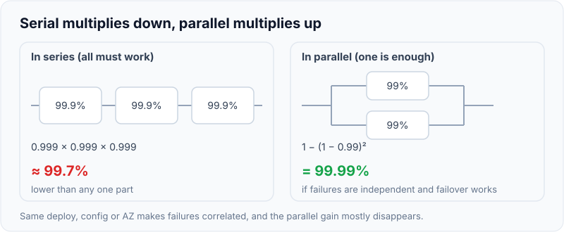
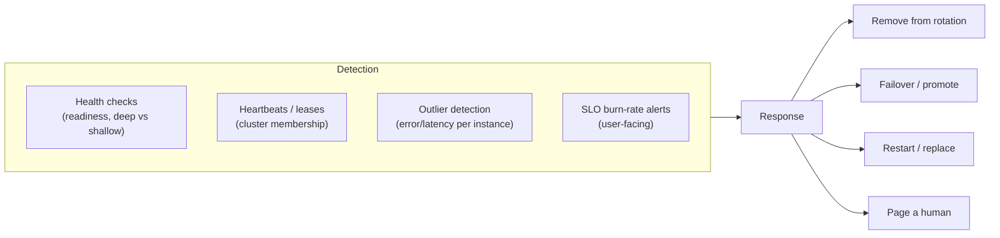
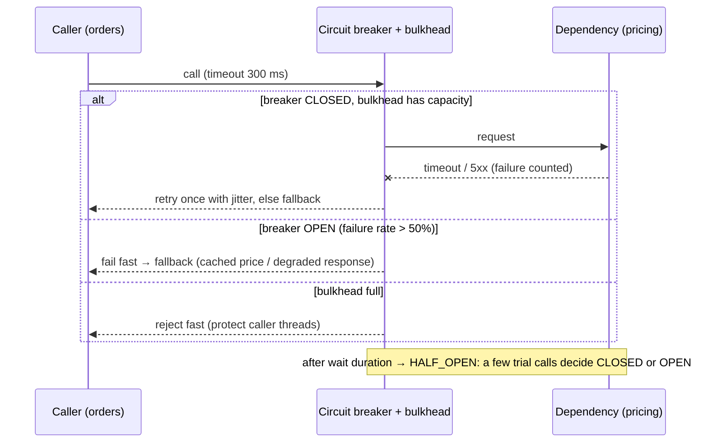

# Availability, Fault Tolerance, Disaster Recovery

!!! abstract "Key takeaways"
    - **Availability** is the fraction of time (or of requests) served successfully. Express it as an **SLO** with an **error budget**. Serial dependencies **multiply** (lower availability). Redundancy **in parallel** raises it, if failures are independent and failover works.
    - **Fault tolerance** = **redundancy** (no single point of failure: N+1, multi-AZ, replicas) + **detection** (health checks, heartbeats, outlier ejection, watching for **gray failures**) + **recovery** (automatic failover, restart, re-route).
    - **Contain the blast radius:**
        - **Timeouts** on every remote call.
        - **Retries** with backoff and jitter, within a budget.
        - **Circuit breakers.**
        - **Bulkheads** (separate pools/limits per dependency).
        - **Graceful degradation** (fallbacks, cached or partial responses).
        - **Load shedding** (drop low-priority work first).
        - **Cells / shuffle sharding** (failures hit a subset of customers).
    - **Most outages are caused by change.** Deploy safely: canary or progressive delivery, automatic rollback on SLO alarms, feature flags, one zone or cell at a time, and backward-compatible schema changes (expand/contract).
    - **Disaster recovery:**
        - **RPO** (data loss) and **RTO** (downtime) per workload.
        - Strategies from backup & restore to active-active.
        - **Backups are not replication**: keep immutable, isolated copies.
        - **Test it** with game days and chaos engineering.

## Why it matters

Every design interview ends with "what happens when X fails?", and every senior role includes owning production. Interviewers want the **mechanisms**: what detects the failure, how fast, what the user sees, how the failure is contained, and how the system recovers. They also want to know you prevent the most common cause of outages, which is **your own deployments**.

## Core concepts

### Availability maths and SLOs

- Availability = good / valid events (requests) or uptime / total time.
- **Serial:** A × B × C. Three 99.9% dependencies give ≈ 99.7%.
- **Parallel (redundant):** 1 − (1−A)ⁿ. Two independent 99% replicas give 99.99%, *if* failover is instant and failures are independent (they often aren't: same deploy, same config, same AZ).
- **MTBF/MTTR:** availability ≈ MTBF / (MTBF + MTTR). Cutting **MTTR** (detect and recover faster) is often cheaper than raising MTBF.
- **SLO + error budget:** 99.9% monthly = ~43 min of budget. When the budget is spent, prioritise reliability over features.

{ loading=lazy }
*Notice the direction: every serial dependency lowers availability, while redundancy raises it only if the replicas fail independently.*

### Failure detection


*Notice the different layers: infrastructure checks catch **crashes**, outlier detection catches **sick-but-alive** instances, and SLO alerts catch what **users** experience. You need all of them, because each misses failures the others catch.*

**Gray failures** are partial failures that health checks miss: a node that answers `/health` but times out on real requests, packet loss on one path, a slow disk, a bad dependency for one tenant. Detect them with **client-side metrics** (callers measure errors and latency per target), outlier ejection and differential observation.

**Failure detectors trade speed for accuracy:** aggressive timeouts give false positives (flapping failovers, split brain), while conservative ones give slow recovery. Use multiple signals and confirmation (M-of-N).

### Redundancy models

| Model | Description | Failover | Cost | Use when |
|---|---|---|---|---|
| Active-passive (cold/warm/hot standby) | Standby takes over on failure | Seconds to hours depending on warmth | Lower | Stateful primaries (DBs) |
| Active-active | All nodes serve traffic | Immediate (LB stops routing) | Higher | Stateless tiers, multi-Region reads |
| N+1 / N+2 | Spare capacity for 1–2 failures | Immediate | Moderate | Fleets, AZs (static stability) |
| Quorum-based | Majority must agree (Raft/Paxos) | Automatic leader election | 3/5 nodes | Coordination, config, metadata |

### Containing failures: resilience patterns


*Notice that the caller **never waits forever** and never piles up threads on a dead dependency. The breaker turns a slow failure into a **fast, handled** one, and the fallback decides what the user sees.*

{ loading=lazy }
*Watch what callers get in each state: real calls when closed, an instant fallback when open, and a handful of trial calls when half-open.*

| Pattern | Prevents | Key settings |
|---|---|---|
| **Timeout** | Threads and connections stuck forever | Per call, below the caller's own deadline. Propagate deadlines |
| **Retry + backoff + jitter** | Transient failures becoming errors | Only idempotent operations, max attempts, **retry budget**, one layer only |
| **Circuit breaker** | Hammering a failing dependency, cascading latency | Failure-rate threshold, window, open duration, half-open trials |
| **Bulkhead** | One dependency exhausting shared pools | Separate thread pools or semaphores per dependency |
| **Fallback / graceful degradation** | Total failure when a non-critical part fails | Cached data, defaults, partial responses, feature off |
| **Load shedding** | Overload collapse (latency spiral) | Admission control, priority classes, queue limits, adaptive concurrency |
| **Rate limiting** | Abuse and noisy neighbours | Per client/tenant |
| **Idempotency** | Duplicate side effects from retries | Idempotency keys |

### Isolating blast radius

- **Cell-based architecture:** independent full-stack copies, each serving a subset of customers. A bad deploy or poison request affects one cell.
- **Shuffle sharding:** each customer is assigned a random *combination* of k workers out of n. Two customers rarely share all workers, so one bad customer can't take everyone down (AWS Route 53 uses this).

{ loading=lazy }
*Notice customer B on the right: it shares one worker with A, not both, so it stays up while A's workers are down.*
- **Zonal isolation:** keep traffic within an AZ where possible, and evacuate an impaired AZ (zonal shift).
- **Dependency hygiene:** distinguish **hard** dependencies (can't function without) from **soft** ones (degrade without). Minimise hard dependencies, especially cross-Region and control-plane ones.

### Change safety

Most production incidents follow a change: code, config, feature flag, infrastructure or certificate.

- **Progressive delivery:** canary (1% → 10% → 50% → 100%) with **automated analysis** of SLIs, then rollback.
- **One fault domain at a time:** one AZ, one cell, one Region per wave, with bake time.
- **Feature flags** separate deploy from release, and give a kill switch.
- **Backward compatibility:** expand/contract DB migrations, tolerant readers, versioned events.
- **Config is code:** review, validation and staged rollout for config too (many big outages were config pushes).

### Disaster recovery

- **RPO / RTO per workload**, set by the business.
- **Strategies:** backup & restore → pilot light → warm standby → active-active (see the AWS HA/DR page for the cloud mapping).
- **Backups:** point-in-time, **immutable**, in an **isolated** account or location, and **restore-tested**. Replication copies corruption and deletes.
- **Runbooks + automation**, fail-back plans, and **regular game days**.

### Chaos engineering

Form a hypothesis about **steady state** (an SLI). Inject a real-world failure (instance kill, latency, dependency outage, AZ loss) in a controlled way with a **small blast radius** and abort conditions. Observe, fix the weaknesses, and automate the experiment. Tools: Chaos Monkey/Gremlin/Litmus/AWS FIS. Start in staging, then move to production with guardrails.

## In practice: code & configuration

=== "❌ Common mistake"
    ```java
    // No timeout (default can be infinite), retry on everything (including non-idempotent POST),
    // no breaker, shared pool: a slow pricing service exhausts all request threads → total outage.
    public Price price(String sku) {
        for (int i = 0; i < 5; i++) {
            try { return restTemplate.getForObject(PRICING + sku, Price.class); }
            catch (Exception e) { /* immediate retry, no backoff */ }
        }
        throw new IllegalStateException("pricing down");
    }
    ```

=== "✅ Correct approach"
    ```java
    // Resilience4j: timeout + retry (backoff) + circuit breaker + bulkhead, with a degraded fallback.
    @CircuitBreaker(name = "pricing", fallbackMethod = "cachedPrice")
    @Bulkhead(name = "pricing")                       // cap concurrent calls to this dependency
    @Retry(name = "pricing")                          // idempotent GET only
    public Price price(String sku) {
        return pricingClient.get(sku);                // HTTP client with connect/read timeouts set
    }

    private Price cachedPrice(String sku, Throwable t) {
        metrics.counter("pricing.fallback", "reason", t.getClass().getSimpleName()).increment();
        return priceCache.getIfPresent(sku)           // last known price, flagged as stale
                .map(Price::markStale)
                .orElseThrow(() -> new DegradedException("pricing unavailable"));
    }
    ```

```yaml
resilience4j:
  circuitbreaker:
    instances:
      pricing:
        sliding-window-type: COUNT_BASED
        sliding-window-size: 50
        minimum-number-of-calls: 20
        failure-rate-threshold: 50            # % failures to open
        slow-call-duration-threshold: 500ms
        slow-call-rate-threshold: 50          # slow calls also open the breaker
        wait-duration-in-open-state: 10s
        permitted-number-of-calls-in-half-open-state: 5
  retry:
    instances:
      pricing:
        max-attempts: 3                       # includes the first call
        wait-duration: 100ms
        enable-exponential-backoff: true
        exponential-backoff-multiplier: 2
        retry-exceptions: [java.io.IOException, java.util.concurrent.TimeoutException]
  bulkhead:
    instances:
      pricing:
        max-concurrent-calls: 20
        max-wait-duration: 0                  # reject immediately when full
spring:
  http:
    client:
      connect-timeout: 200ms                  # Boot 3.4+ HTTP client settings
      read-timeout: 400ms                     # below the caller's own deadline
```

## Real-world usage

- **AWS (Builders' Library):** static stability, cells, shuffle sharding, load shedding, and "avoid fallback in distributed systems" (fallback paths that are rarely exercised fail when needed, so prefer designs that don't need them or exercise them constantly).
- **Netflix:** Hystrix popularised circuit breakers and bulkheads (now Resilience4j). Chaos Monkey and regional evacuation are routine.
- **Google SRE:** error budgets tie release velocity to reliability. Postmortems are blameless and action-oriented.
- **Notable incidents:**
    - **Config and deploy pushes:** Cloudflare's 2019 regex WAF rule, CrowdStrike 2024, several hyperscaler config outages. These are why staged rollouts and kill switches matter.
    - **Retry storms** that turned brief blips into long outages.
    - **Certificate expiries.**
- **Healthcare and banking:** documented and tested DR, degraded modes that preserve patient safety (read-only mode, cached formulary), and regulatory incident reporting.

## Trade-offs & production gotchas

| Choice | Pros | Cons | Use when |
|---|---|---|---|
| Aggressive failure detection | Fast recovery | False positives, flapping, split brain | Stateless tiers |
| Conservative detection | Stability | Slow recovery | Stateful leaders |
| Fallbacks | Better UX in failures | Rarely-tested code paths | Exercise them regularly |
| Retries | Mask transient errors | Amplify overload | With budgets + jitter + breakers |
| Cells | Small blast radius | Routing and operations complexity | Large multi-tenant systems |
| Active-active multi-Region | Lowest RTO | Data consistency, cost | Critical global systems |

!!! warning "Gotchas"
    - **Timeouts must nest:** client > gateway > service > dependency. An inner timeout longer than the outer one causes wasted work and confusing errors.
    - **Retries multiply across layers:** 3 retries at each of 4 layers is 3⁴ = 81 calls per user request. Retry at **one** layer.
    - **Health checks that include dependencies** turn a DB blip into a fleet-wide outage.
    - **Correlated failures** defeat redundancy: same bad deploy, same config, same AZ, same certificate. Diversify and stagger.

## How this connects to my experience

- **Where I used it:**
    - OptumRx Meteor: the GraphQL Consumer Service over **5 upstream systems** (each a dependency that can fail), 750K+ users, "release management, and production support", Kafka retry/DLQ.
    - Engineering standards (CI/CD, deployment practices).
- **Talking points:**
    - "With 5 upstreams, one slow system must not take down the whole graph: per-upstream timeouts, circuit breakers and bulkheads, and partial GraphQL responses with errors for the failed fields, instead of failing the whole query." *[confirm: which resilience library (Resilience4j?), partial-response approach]*
    - "Deployments were progressive with health checks and quick rollback." *[confirm: canary/blue-green, tooling]*
    - "Production support: incident response and postmortems." *[confirm: an incident story and what changed after it]*
- **Likely follow-up chain:** "What happens when one upstream is down?" → "How do you avoid cascading failure?" → "How did you test it?" → "Tell me about an incident." Answer: partial response + fallback → timeouts/breakers/bulkheads/retry budget → fault injection in lower environments → incident STAR (detection, mitigation, root cause, prevention). *[confirm]*

## Interview questions

### Fundamentals

??? question "Q1. How do redundancy and dependencies affect availability?"
    **Answer:** Serial dependencies multiply (three at 99.9% give ~99.7%). Parallel redundancy improves it (1 − (1−A)ⁿ), assuming independent failures and working failover. So reduce hard dependencies, add redundancy, and make failover fast.

    **Interviewer listens for:** the maths, and the independence caveat.

    **Common wrong answer:** "more servers = more availability" without detail.

??? question "Q2. What is a circuit breaker?"
    **Answer:** A wrapper that tracks failures and slow calls to a dependency. Past a threshold it **opens** and fails fast (with a fallback) for a wait period. Then it goes **half-open** to try a few calls, closing on success or reopening on failure. It prevents cascading latency and gives the dependency room to recover.

    **Interviewer listens for:** the three states, and slow-call detection.

    **Common wrong answer:** "it retries until it succeeds".

??? question "Q3. What's a bulkhead?"
    **Answer:** Isolating resources per dependency or workload (separate thread pools, semaphores, connection pools, even separate clusters), so one failing or slow dependency can't exhaust shared capacity and take everything down.

    **Interviewer listens for:** isolating resource exhaustion.

    **Common wrong answer:** "a firewall".

??? question "Q4. RPO vs RTO?"
    **Answer:** RPO is the maximum acceptable data loss (time since the last recoverable point). RTO is the maximum acceptable downtime. Both are set by the business per workload and drive the DR strategy and cost.

    **Interviewer listens for:** business-driven, per workload.

    **Common wrong answer:** confusing them.

### Intermediate

??? question "Q5. What is a gray failure and how do you detect it?"
    **Answer:** A partial failure that health checks don't catch: the node passes `/health` but real requests are slow or failing (a bad disk, one bad path, one failing dependency). Detect with caller-side metrics per target, outlier ejection, synthetic transactions on real paths, and SLO-based alerts.

    **Interviewer listens for:** caller-side observation.

    **Common wrong answer:** "health checks catch everything".

??? question "Q6. Why are retries dangerous, and how do you make them safe?"
    **Answer:** They amplify load during overload (retry storms) and multiply across layers. Make them safe with idempotent operations only, exponential backoff + jitter, small max attempts, **retry budgets** (for example, retries ≤ 10% of requests), retrying at a single layer, honouring `Retry-After`, and circuit breakers.

    **Interviewer listens for:** budgets and layering.

    **Common wrong answer:** "retry 5 times immediately".

??? question "Q7. What is graceful degradation? Give examples."
    **Answer:** Keep the core function working when non-critical parts fail:
    - Show the cached formulary when the pricing service is down.
    - Hide recommendations.
    - Return partial GraphQL data with field errors.
    - Read-only mode during a DB failover.
    - Queue writes for later.

    Decide with product which features are critical.

    **Interviewer listens for:** a product-aware, explicit design.

    **Common wrong answer:** "show an error page".

??? question "Q8. What is load shedding?"
    **Answer:** Under overload, deliberately reject some work early (cheaply) so the rest succeeds within its latency targets, instead of everything slowing down and timing out. Prioritise by request class (checkout over analytics), use admission control based on concurrency or queue time, and return 503/429 fast.

    **Interviewer listens for:** "fail some fast instead of all slowly".

    **Common wrong answer:** "autoscaling solves overload".

### Senior

??? question "Q9. Explain cells and shuffle sharding."
    **Answer:**
    - **Cells:** full independent stacks, each serving a subset of customers, behind a thin router. Failures and bad deploys are limited to one cell.
    - **Shuffle sharding:** each customer gets a random combination of k resources from n. The chance that two customers share all k is tiny, so a poison customer affects few others.

    Both limit blast radius, at the cost of routing and operational complexity.

    **Interviewer listens for:** the blast-radius reasoning.

    **Common wrong answer:** "just sharding".

??? question "Q10. How do you make deployments safe at scale?"
    **Answer:**
    - Progressive delivery (canary waves by AZ, cell or Region) with automated SLI analysis and automatic rollback.
    - Feature flags with kill switches.
    - Bake times.
    - Backward-compatible changes (expand/contract).
    - Config changes go through the same pipeline.
    - Freeze when the error budget is exhausted.

    **Interviewer listens for:** "most outages come from change".

    **Common wrong answer:** "test more in QA".

??? question "Q11. Why can fallback logic be dangerous?"
    **Answer:** Fallback paths run rarely, so they're untested and can fail exactly when needed. They can also shift load onto another system (for example, a cache miss falling back to a DB that can't handle the full load). Prefer static stability and pre-provisioned capacity, keep fallbacks simple and exercised regularly, and load-test them.

    **Interviewer listens for:** the "fallback is a liability" nuance.

    **Common wrong answer:** "more fallbacks are always better".

### Scenario-based

??? question "Q12. One of 5 upstream systems in your GraphQL layer becomes slow (5 s responses). What happens, and what should happen?"
    **Answer:**
    - **Without protection:** resolver threads and connections pile up, the whole graph slows, then the gateway times out (cascading failure).
    - **With protection:**
        - per-upstream timeout (for example 500 ms)
        - bulkhead (max concurrent calls)
        - circuit breaker opens on slow-call rate
        - fallback to cached data, or **partial response** with errors only on that upstream's fields
        - alert
    - After it recovers: half-open trials close the breaker.

    **Interviewer listens for:** isolating one dependency, and partial responses.

    **Common wrong answer:** "increase timeouts".

??? question "Q13. Design availability for a pharmacy dispensing system that must work during a WAN outage to head office."
    **Answer:**
    - Run local-first at the store: a local service + DB with the formulary and patient prescriptions cached or synced.
    - Allow dispensing within safe rules offline (pre-authorised scripts, limits on controlled substances).
    - Queue events with idempotency keys and sync them when back.
    - Resolve conflicts centrally with audit.
    - Clear UI indication of offline mode.
    - DR for the central system separately.
    - Patient-safety rules decide what's allowed offline.

    **Interviewer listens for:** offline-first, safety-driven degradation.

    **Common wrong answer:** "the store can't operate".

## Cheat sheet

| Concept | Remember |
|---|---|
| Maths | Serial multiply ↓. Parallel 1−(1−A)ⁿ ↑ (independent). Availability ≈ MTBF/(MTBF+MTTR) |
| SLO | Error budget. 99.9% ≈ 43 min/month |
| Detect | Health checks, heartbeats, outlier ejection, SLO alerts. Watch gray failures |
| Contain | Timeouts, retries (budget, jitter), breaker, bulkhead, fallback, shedding |
| Breaker | CLOSED → OPEN (failure/slow rate) → HALF_OPEN trials |
| Isolation | Cells, shuffle sharding, zonal isolation, hard vs soft dependencies |
| Change safety | Canary waves, auto rollback, flags, expand/contract, config as code |
| DR | RPO/RTO per workload, immutable isolated backups, tested restores |
| Chaos | Hypothesis on steady state, small blast radius, abort conditions |
| Never | Retry everywhere, dependency checks in liveness, untested fallbacks |

## Sources
1. [Google SRE Book: Embracing Risk, Service Level Objectives, Addressing Cascading Failures](https://sre.google/sre-book/addressing-cascading-failures/).
2. [Amazon Builders' Library](https://aws.amazon.com/builders-library/): static stability, shuffle sharding, load shedding, avoiding fallback, timeouts/retries/jitter.
3. [Workload isolation using shuffle-sharding (Builders' Library)](https://aws.amazon.com/builders-library/workload-isolation-using-shuffle-sharding/).
4. [Huang et al.: Gray Failure, the Achilles' Heel of Cloud-Scale Systems (HotOS 2017)](https://www.microsoft.com/en-us/research/publication/gray-failure-achilles-heel-cloud-scale-systems/).
5. Michael Nygard, *Release It!* (2nd ed.): stability patterns (circuit breaker, bulkhead, timeouts, fail fast).
6. [Resilience4j documentation](https://resilience4j.readme.io/docs): circuit breaker, retry, bulkhead configuration.
7. [Principles of Chaos Engineering](https://principlesofchaos.org/).
8. [AWS: Disaster recovery of workloads on AWS](https://docs.aws.amazon.com/whitepapers/latest/disaster-recovery-workloads-on-aws/disaster-recovery-options-in-the-cloud.html).
