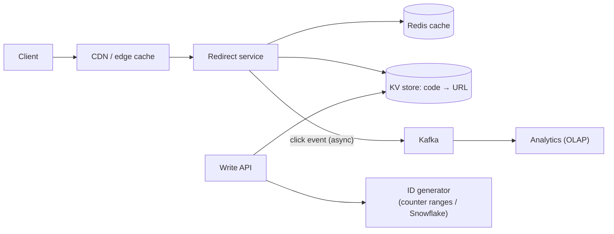
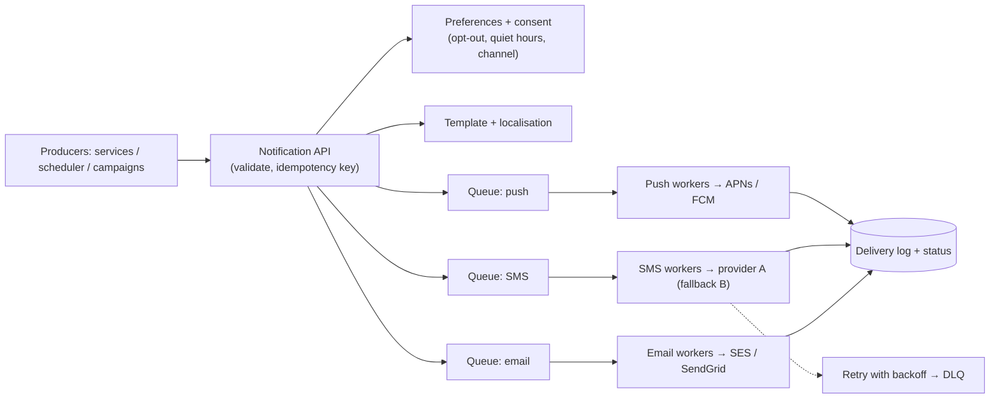
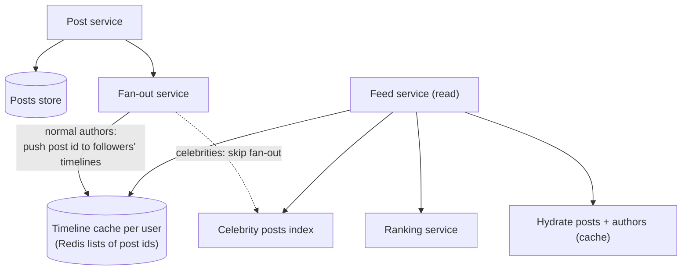
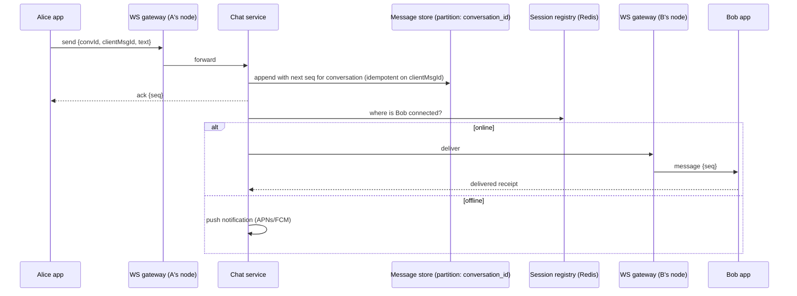
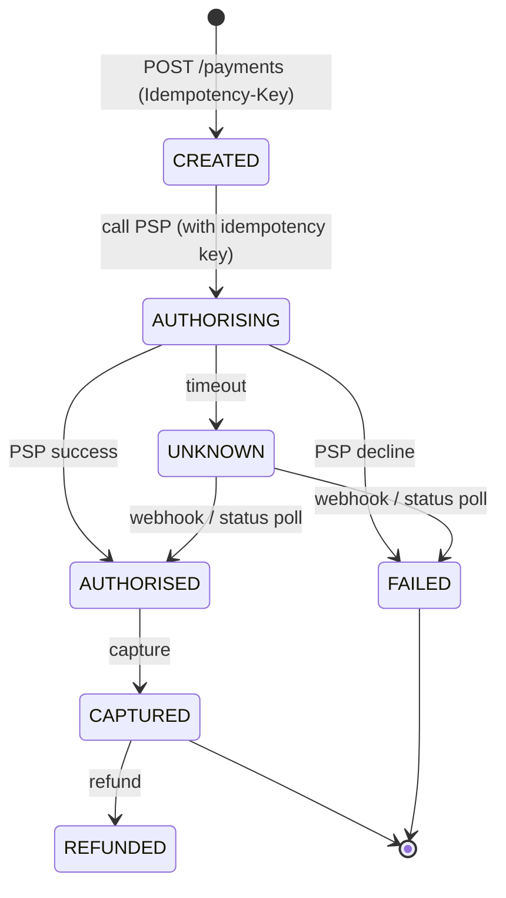
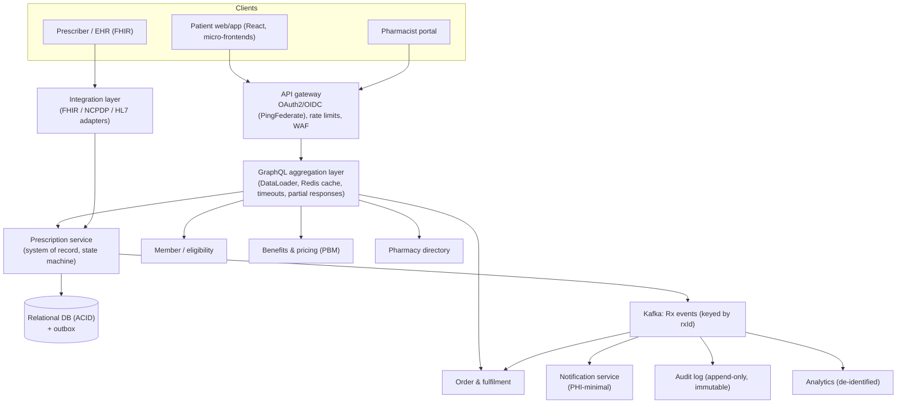

# Case Studies: URL Shortener, Rate Limiter, Notifications, News Feed, Chat, Payments, Prescription Platform

!!! abstract "Key takeaways"
    Each case has one or two **signature problems**. Name them early and spend your deep-dive time there:

    | Case | Signature problems | Key choices |
    |---|---|---|
    | URL shortener | ID generation, read-heavy redirects | Base62 of a unique ID (counter ranges / Snowflake), KV store, cache + CDN, 301 vs 302 |
    | Rate limiter | Algorithm, atomic distributed counters | Token bucket in Redis + Lua, fail-open/closed, headers |
    | Notification system | Fan-out, provider failures, duplicates, preferences | Queue per channel, idempotency keys, retries + DLQ, templates, rate limits per provider |
    | News feed | Fan-out on write vs read, celebrities | Hybrid fan-out, precomputed timelines in cache, ranking service |
    | Chat | Real-time delivery, ordering, presence, offline | WebSocket gateways, per-conversation sequence numbers, inbox fan-out, push for offline |
    | Payment system | Exactly-once money movement, reconciliation | Idempotency keys, state machine, double-entry ledger, outbox, PSP webhooks, daily reconciliation |
    | Prescription platform | PHI, integrations, correctness, safety | Strong consistency for dispensing, event-driven workflow, audit, consent, aggregation layer |

## Why it matters

Interviewers pick from a small set of classic problems, plus a domain problem close to your resume (here, healthcare). Practising these turns the framework into muscle memory. Each case below is a **45-minute answer skeleton**: say the requirements and numbers quickly, draw the high-level design, then go deep on the signature problems.

## Core concepts

### 1. URL shortener

**Requirements:**

- Shorten a long URL, redirect from the short one.
- Optional custom alias and expiry.
- Analytics (clicks).
- Assume 100M new URLs/month and a 100:1 read/write ratio.

**Estimates:**

- Writes ≈ 40/s. Reads ≈ 4k/s average, ~20k/s peak.
- 100M × 12 months × 5 years × ~500 B ≈ 3 TB.
- Key space: base62 with 7 characters ≈ 3.5 × 10¹² keys.

**API:**

- `POST /urls {longUrl, alias?, expiresAt?} → {shortUrl}`
- `GET /{code}` → 301 or 302

**Data:** a key-value store `code → {longUrl, ownerId, createdAt, expiresAt}`, plus an analytics stream.


*Notice that the read path never waits for analytics (async). Writes need **unique codes without coordination on every request**.*

**Deep dives:**

- **Code generation:**
    - **Hash + truncate** (MD5 → 7 chars) needs collision checks.
    - **Base62 of a unique ID** (DB sequence handed out in **ranges** per server, or Snowflake) has no collisions, but sequential codes are guessable. Shuffle or encrypt the ID if that matters.
    - Custom aliases use a conditional insert.
- **301 vs 302:** 301 (permanent) is cached by browsers, so there's less load but you lose click analytics. 302/307 keeps tracking.
- **Scale:** cache hot codes (heavily skewed popularity), serve redirects from the edge, and partition the KV store by code hash.
- **Abuse:** malware URL scanning, rate limits per user, expiry cleanup.

### 2. Rate limiter

See [Rate limiting & API gateway design](08-rate-limiting-and-api-gateway-design.md).

- **Signature answer:** token bucket per client in Redis with an atomic Lua script, rules from config, 429 + headers, fail-open with a local fallback, layered limits (edge → gateway → service), cost-based limits for GraphQL.

### 3. Notification system

**Requirements:**

- Send push, SMS and email triggered by events or schedules.
- User preferences, opt-out and quiet hours.
- Templates, localisation.
- No duplicates, delivery tracking.
- Assume 50M notifications/day with 10× spikes (campaigns).


*Notice that there's **one queue per channel**, so a slow SMS provider can't delay push. Workers respect **per-provider rate limits**, and every send carries an **idempotency key**.*

**Deep dives:**

- **Deduplication:** the key is `(userId, eventId, channel)`, stored before sending (a conditional insert). Pass it to providers that support it.
- **Retries and failover:** exponential backoff, failover to a secondary provider, DLQ, delivery receipts via webhooks.
- **Fan-out at scale** (campaigns): batch expansion jobs, throttling, prioritising transactional over marketing traffic.
- **User experience:** quiet hours and time zones, aggregation ("5 new messages"), unsubscribe links (legal).
- **Healthcare twist:** minimise PHI in SMS and email ("Your prescription is ready", not the drug name), and log consent.

### 4. News feed (social timeline)

**Requirements:**

- Post, follow, view a home feed sorted by rank or time.
- Assume 300M DAU, average 200 follows, some celebrities with 50M followers.
- Feed load p99 < 200 ms.


*Notice the **hybrid**: fan-out on **write** for normal users (fast reads) and fan-out on **read** for celebrities (merged at request time). That avoids writing 50M timeline entries per celebrity post.*

**Deep dives:**

- **Push vs pull:** push gives fast reads but expensive writes, and wastes work on inactive users. Pull gives cheap writes and slow reads. Hybrid, plus skipping fan-out for inactive users.
- **Storage:** timelines hold only IDs (capped at ~800). Hydrate from post and user caches.
- **Ranking:** candidate generation → ML scoring → filtering. Cache ranked results briefly.
- **Pagination:** cursor-based (last seen score or ID), not offsets.

### 5. Chat (1:1 and group)

**Requirements:**

- Send and receive in real time, history, delivery and read receipts, presence, offline push.
- Groups up to 500.
- Assume 50M DAU, 40 messages each per day ≈ 2B messages/day ≈ 25k/s.


*Notice that each message gets a **per-conversation sequence number** (ordering) and the client's ID (deduplication on retries). A **session registry** routes delivery to the gateway node holding the recipient's WebSocket.*

**Deep dives:**

- **Connection layer:** stateful WebSocket gateways, consistent routing, heartbeats, reconnect with "sync since seq N".
- **Storage:** a wide-column store (Cassandra/ScyllaDB) partitioned by `(conversation_id, time bucket)`, clustered by sequence.
- **Group fan-out:** write once per conversation, deliver to online members via the registry, push to offline ones.
- **Presence:** heartbeats with a TTL in Redis, fanned out lazily (only to friends who are viewing).
- **E2E encryption** (Signal protocol) means the server stores ciphertext and can't search it.

### 6. Payment system

**Requirements:**

- Accept card payments through a PSP (Stripe/Adyen), refunds, payouts.
- **Never double-charge, never lose money.**
- Audit, reconciliation.
- Moderate QPS (hundreds/s), extreme correctness.


*Notice the **UNKNOWN** state: a timeout doesn't mean failure. You resolve it with PSP webhooks or status queries, never by blindly retrying with a new key, which risks a double charge.*

**Deep dives:**

- **Idempotency:** the client sends an `Idempotency-Key`. Store `(key → request hash, response)`, and return the stored response on retries. Pass the key to the PSP.
- **Ledger:** **double-entry**, append-only (every movement debits one account and credits another, and the sum is zero). Balances are derived. No updates in place.
- **Consistency:** a payment state machine in a relational DB (ACID), outbox events (PaymentCaptured) to downstream services.
- **Reconciliation:** a daily job matches internal ledger entries against PSP settlement reports. Mismatches go to an exception queue.
- **Security:** PCI DSS scope reduction (tokenisation and hosted fields, so card data never touches your servers), encryption, fraud checks.

### 7. Healthcare prescription platform (★)

**Requirements:**

- **Functional:**
    - Prescribers create e-prescriptions.
    - Patients view prescriptions, order refills and choose a pharmacy or home delivery.
    - Pharmacists verify and dispense.
    - Benefit and price checks with the insurer (PBM).
    - Order tracking.
    - Refill reminders.
    - Prior authorisation.
- **Non-functional:**
    - **PHI protection** (HIPAA), audit everything, consent.
    - **Correctness:** no double dispense, controlled-substance rules.
    - Availability 99.9%+ for patient and pharmacy flows.
    - Integrations with many external systems (PBM, pharmacy systems, EHRs via HL7/FHIR/NCPDP).
    - Data residency.
- **Scale** (assume): 5M patients, 750K+ active users, ~1M prescription events/day, peaks in the morning.

**Estimates:** ~40 write QPS peak, ~400–2k read QPS peak (with aggregation fan-out to upstreams multiplying internal calls), event storage ~2 TB/yr with replicas, documents ~5 TB/yr. **Not a big-data problem.** The hard parts are correctness, integration and compliance.


*Notice the split: a **strongly consistent system of record** for prescriptions (ACID + state machine), **event-driven** propagation to fulfilment, notifications, audit and analytics, and a **GraphQL aggregation layer** that composes many upstream systems for the UI with caching and partial-failure handling. This is the shape of the OptumRx Meteor GraphQL Consumer Service work.*

**Deep dives:**

- **Prescription lifecycle:** a state machine (`RECEIVED → VERIFIED → ADJUDICATED → FILLED → SHIPPED/PICKED_UP`, plus `ON_HOLD`, `CANCELLED`, `TRANSFERRED`).
    - Transitions are **conditional updates** with versions (optimistic locking), so two pharmacists can't fill the same script.
    - Refill counts are decremented atomically.
    - Controlled substances get extra validation and audit.
- **Aggregation over upstreams:**
    - Per-upstream timeouts, circuit breakers and bulkheads.
    - DataLoader batching.
    - Redis cache for reference data (formulary, pharmacy directory) with TTLs.
    - **Partial responses**: show the prescription even if pricing is down, marked "price unavailable".
- **Events:**
    - Outbox → Kafka, keyed by `rxId` (per-prescription ordering).
    - Idempotent consumers.
    - Retry topics and a DLQ with redrive.
    - Schema registry for evolution.
- **Security and compliance:**
    - OAuth2/OIDC with fine-grained authorisation (a patient sees their own, or their dependants' with consent; pharmacists are scoped to their store).
    - Encryption in transit and at rest (KMS keys per data class).
    - **Audit every PHI access.**
    - Minimum-necessary data in events and notifications.
    - De-identified analytics.
    - Data residency.
- **Notifications:** refill reminders scheduled by due date, idempotent per `(rx, dueDate, channel)`, no drug names in SMS, opt-out honoured.
- **Availability:** multi-AZ, a warm-standby DR Region for core flows, degraded modes (read-only, cached formulary), and an offline-capable pharmacy client for WAN outages.
- **Evolution:** strangler-fig migration from legacy pharmacy systems, consumer-driven contracts for upstreams, micro-frontends for independent UI delivery.

## In practice: code & configuration

The **idempotency-key** pattern recurs in notifications, payments and prescriptions:

=== "❌ Common mistake"
    ```java
    // Retrying a timed-out POST creates a second charge / second dispense.
    @PostMapping("/payments")
    public Payment pay(@RequestBody PayRequest r) {
        return psp.charge(r.amount(), r.card());     // client retries on timeout → charged twice
    }
    ```

=== "✅ Correct approach"
    ```java
    @PostMapping("/payments")
    @Transactional
    public ResponseEntity<PaymentView> pay(@RequestHeader("Idempotency-Key") String key,
                                           @RequestBody PayRequest req) {
        String reqHash = sha256(canonicalJson(req));
        Optional<IdemRecord> existing = idem.findById(key);
        if (existing.isPresent()) {
            if (!existing.get().requestHash().equals(reqHash))
                return ResponseEntity.unprocessableEntity().build();     // same key, different body
            return existing.get().storedResponse();                      // replay the first result
        }
        Payment p = payments.create(req);                                // state CREATED
        idem.save(new IdemRecord(key, reqHash, p.id()));                 // unique PK on key: concurrent dupes fail
        outbox.save(Event.of("PaymentRequested", p.id()));               // worker calls the PSP with the same key
        return ResponseEntity.accepted().body(PaymentView.of(p));        // 202, final state via webhook/poll
    }
    ```

```sql
-- Double-entry ledger: append-only, every transaction balances to zero.
CREATE TABLE ledger_entry (
  id          BIGINT GENERATED ALWAYS AS IDENTITY PRIMARY KEY,
  txn_id      UUID        NOT NULL,
  account_id  TEXT        NOT NULL,
  amount      NUMERIC(19,4) NOT NULL,          -- +credit / −debit, integer minor units also fine
  currency    CHAR(3)     NOT NULL,
  created_at  TIMESTAMPTZ NOT NULL DEFAULT now()
);
-- Invariant (checked in the posting transaction): SUM(amount) per txn_id = 0
-- Balance = SUM(amount) per account (materialised and periodically verified)
```

## Real-world usage

- **Bitly / TinyURL:** KV stores plus caches. Bitly's analytics pipeline is a big part of the product.
- **Twitter/X:** hybrid fan-out for timelines. **Facebook News Feed:** ranking-heavy pull model.
- **WhatsApp:** Erlang-based connection servers handling millions of connections per node. **Slack/Discord:** gateway layers plus per-channel storage partitions (Discord on ScyllaDB).
- **Stripe:** idempotency keys and a double-entry ledger. **Uber:** payment state machines and reconciliation pipelines.
- **Healthcare:** Surescripts (US e-prescribing network), NCPDP SCRIPT standard, FHIR `MedicationRequest`. PBMs aggregate benefits, pricing and pharmacy networks.

## Trade-offs & production gotchas

| Case | Key trade-off | Typical choice |
|---|---|---|
| URL shortener | 301 (fast, cached) vs 302 (analytics) | 302 with an edge cache |
| Notifications | Speed vs duplicates | At-least-once + idempotency keys |
| News feed | Fan-out on write vs read | Hybrid |
| Chat | Strict global order vs scalability | Per-conversation ordering |
| Payments | Availability vs correctness | Correctness (state machine, idempotency, reconciliation) |
| Prescriptions | Freshness of aggregated data vs latency | Cache reference data. Live calls for state-changing data. Partial responses |

!!! warning "Gotchas"
    - **Don't spend 20 minutes on the easy part** (URL encoding). Get to the signature problems.
    - **Name correctness invariants explicitly:** "no double charge", "no double dispense". Then show the mechanism (idempotency key, conditional update, state machine).
    - **Compliance is a requirement, not an afterthought,** in healthcare and banking cases: audit, PHI minimisation, consent, residency.

## How this connects to my experience

- **Where I used it:**
    - **OptumRx Meteor** (healthcare/pharmacy benefits, 750K+ users): owned the **GraphQL Consumer Service** over **5 upstream systems**, Kafka workflows with retry/DLQ, Redis caching, OAuth2/PingFederate, React + micro-frontends.
    - **Deloitte ConvergeHealth:** event-driven healthcare analytics on AWS.
- **Talking points for the prescription case:**
    - "I'd structure it like Meteor: a GraphQL aggregation layer composing member, prescription, pricing and pharmacy upstreams, with DataLoader, Redis for reference data, timeouts, breakers and partial responses." *[confirm: which upstream domains the 5 systems were]*
    - "Kafka carried workflow events keyed by entity, with retry topics, a DLQ and idempotent consumers." *[confirm: which workflows (refills, order status, notifications?)]*
    - "Security: OAuth2 via PingFederate and AD, field-level authorisation, PHI-minimal events." *[confirm: field-level auth approach]*
    - Don't claim ownership of parts you didn't own (dispensing systems, PBM adjudication). Say "integrated with" or "consumed from".
- **Likely follow-up chain:** "What would you do differently?" → "How did you handle an upstream outage?" → "How would you scale this 10×?" → "How do you prevent double processing?" Answer with lessons *[confirm]* → partial responses + breakers → caching, read replicas upstream, async workflows → idempotency keys + conditional state transitions.

## Interview questions

### Fundamentals

??? question "Q1. URL shortener: how do you generate short codes?"
    **Answer:**
    - **Base62-encode a unique 64-bit ID.** Get IDs from a DB sequence handed out in ranges per server (no per-request coordination), or from a Snowflake-style generator. No collisions.
    - **Alternative:** hash the URL and truncate to 7 characters, with collision checks (conditional insert, retry with salt).
    - Obfuscate sequential IDs if enumeration matters.

    **Interviewer listens for:** uniqueness without hot coordination.

    **Common wrong answer:** "random 7 characters" with no collision handling.

??? question "Q2. 301 or 302 redirects?"
    **Answer:** 301 is permanent and cached by browsers and proxies: fewer requests, but lost click analytics, and hard to change. 302/307 is temporary: every click hits you (analytics, can change the target). Most shorteners use 302 with edge caching.

    **Interviewer listens for:** the analytics trade-off.

    **Common wrong answer:** "301 always".

??? question "Q3. News feed: fan-out on write vs read?"
    **Answer:** On write, push post IDs into followers' timelines: fast reads, expensive for celebrities and inactive users. On read, merge followed authors' posts at request time: cheap writes, slow reads. Hybrid: push for normal authors, pull for celebrities.

    **Interviewer listens for:** the celebrity problem.

    **Common wrong answer:** only one approach.

??? question "Q4. Chat: how do you guarantee message ordering?"
    **Answer:** Per-conversation sequence numbers assigned by the service (or the partition owner) on write, plus a client message ID for dedup on retries. Clients render by sequence and request gaps after reconnecting ("sync since seq N"). Global ordering isn't needed.

    **Interviewer listens for:** per-conversation scope.

    **Common wrong answer:** "use timestamps" (clock skew).

### Intermediate

??? question "Q5. Notifications: how do you avoid sending duplicates?"
    **Answer:** An idempotency key per logical notification `(user, event, channel)`, inserted with a unique constraint before sending. Workers check it on retry. Pass provider-side idempotency where supported. Accept that at-least-once delivery from queues makes this necessary.

    **Interviewer listens for:** a dedup store plus retries.

    **Common wrong answer:** "exactly-once queues".

??? question "Q6. Notifications: how do you handle provider outages?"
    **Answer:** A queue per channel, retries with backoff, failover to a secondary provider, circuit breakers per provider, DLQ with redrive, delivery receipts for status, rate limits per provider, and prioritising transactional over marketing traffic.

    **Interviewer listens for:** isolation per channel and provider.

    **Common wrong answer:** "retry forever".

??? question "Q7. Payments: why an idempotency key, and what do you store?"
    **Answer:** Clients retry on timeouts, and without a key a retry can double-charge. Store the key, a hash of the request and the response (or a resource reference). On a repeat, return the stored result. On the same key with a different body, return 422. Pass the key to the PSP too. Expire keys after a window (for example 24 h+).

    **Interviewer listens for:** the request hash and the stored response.

    **Common wrong answer:** "check whether a payment exists for the user".

??? question "Q8. Payments: what happens when the PSP call times out?"
    **Answer:** The state becomes **UNKNOWN**, not failed. Resolve it through PSP webhooks or a status query using the same idempotency key. Never retry with a new key. Show the user "processing". Reconciliation catches anything left over.

    **Interviewer listens for:** treating timeout as unknown.

    **Common wrong answer:** "mark failed and let the user retry".

### Senior

??? question "Q9. Prescription platform: how do you prevent two pharmacists dispensing the same prescription?"
    **Answer:** The prescription state machine lives in the system of record. Transition `VERIFIED → FILLING` with a conditional update (`WHERE id = ? AND state = 'VERIFIED' AND version = ?`). Only one succeeds, and the other gets a conflict and refreshes. Refill counts are decremented atomically with a condition. Audit every transition.

    **Interviewer listens for:** conditional transitions and audit.

    **Common wrong answer:** "lock in the UI".

??? question "Q10. Prescription platform: how do you design the aggregation layer over many upstreams?"
    **Answer:**
    - A GraphQL schema per domain (or federation).
    - Resolvers call upstreams through clients with timeouts, breakers and bulkheads.
    - DataLoader batches and dedupes per request.
    - Redis caches reference data with TTLs.
    - Partial responses with typed errors for degraded fields.
    - Field-level authorisation.
    - Persisted queries and complexity limits.
    - Observability per upstream (latency, errors).

    **Interviewer listens for:** resilience plus performance plus security.

    **Common wrong answer:** "a thin proxy that calls everything sequentially".

??? question "Q11. Payments: what is reconciliation and why is it needed?"
    **Answer:** Systematically comparing your ledger with external records (PSP settlement files, bank statements) to find mismatches: missing captures, double refunds, fees, currency differences. It's needed because distributed systems and partners can fail in ways your state machine never saw. Run it daily, with an exceptions workflow and alerts.

    **Interviewer listens for:** "trust but verify" for money.

    **Common wrong answer:** "our system is correct, so we don't need it".

### Scenario-based

??? question "Q12. Design refill reminders for 5M patients."
    **Answer:**
    - **Scheduler:** query due refills by date, or use per-prescription timers in a workflow engine. Shard the scheduler by patient hash.
    - Enqueue reminder jobs keyed by `(rx, dueDate)`, idempotent.
    - The notification service checks preferences, consent and quiet hours, uses PHI-minimal templates, and has channel queues with provider rate limits.
    - Spread the 9am peak per time zone.
    - Delivery tracking, retries, DLQ.
    - Metrics: delivered %, refill conversion.

    **Interviewer listens for:** scheduling, idempotency and PHI.

    **Common wrong answer:** "a cron job that loops over all patients and sends SMS synchronously".

??? question "Q13. Chat: a user reconnects after 2 hours offline on a flaky network. What happens?"
    **Answer:**
    1. The client reconnects (with exponential backoff) to any gateway.
    2. It authenticates and sends its last seen sequence per conversation.
    3. The server returns the missed messages (paginated) and updates the session registry.
    4. Pending pushes are cleared, presence is updated, and receipts are sent for the delivered messages.
    5. Unsent outgoing messages are retried with their client message IDs (dedup server-side).

    **Interviewer listens for:** sync by sequence, plus dedup.

    **Common wrong answer:** "re-download all history".

## Cheat sheet

| Case | Signature answer |
|---|---|
| URL shortener | Base62(ID ranges/Snowflake), KV + cache + CDN, 302 + async analytics |
| Rate limiter | Token bucket, Redis Lua, 429 + headers, fail-open + local fallback |
| Notifications | Queue per channel, preferences/consent, idempotency key, provider failover, DLQ |
| News feed | Hybrid fan-out, ID-only timelines in cache, ranking, cursor pagination |
| Chat | WS gateways + session registry, per-conversation seq + client msg id, push for offline |
| Payments | Idempotency key, state machine with UNKNOWN, double-entry ledger, outbox, reconciliation, PCI scope reduction |
| Prescriptions | ACID system of record + conditional transitions, GraphQL aggregation (DataLoader, cache, breakers, partial responses), Kafka events (outbox, idempotent, DLQ), audit, PHI minimisation, consent |

## Sources
1. Alex Xu, *System Design Interview*, Vol. 1 (URL shortener, rate limiter, notification system, news feed, chat) and Vol. 2 (payment system).
2. [Stripe: Designing robust and predictable APIs with idempotency](https://stripe.com/blog/idempotency).
3. [Uber Engineering: Payments platform and reconciliation](https://www.uber.com/blog/payments-platform/).
4. [Discord: How Discord stores trillions of messages](https://discord.com/blog/how-discord-stores-trillions-of-messages).
5. [Twitter: Timelines at scale (QCon talk)](https://www.infoq.com/presentations/Twitter-Timeline-Scalability/): hybrid fan-out.
6. [HL7 FHIR MedicationRequest resource](https://hl7.org/fhir/R4/medicationrequest.html) and [NCPDP SCRIPT standard overview](https://www.ncpdp.org/Standards-Development/Standards-Information).
7. [HHS: HIPAA Security Rule summary](https://www.hhs.gov/hipaa/for-professionals/security/laws-regulations/index.html): safeguards, audit controls, minimum necessary.
8. [Martin Fowler: Accounting patterns / double-entry](https://martinfowler.com/eaaDev/AccountingNarrative.html).
