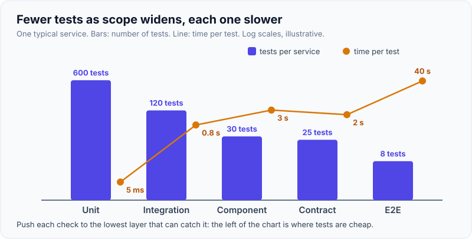
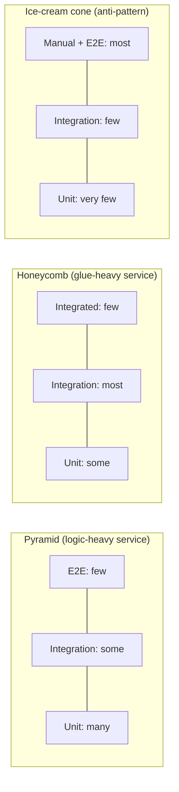
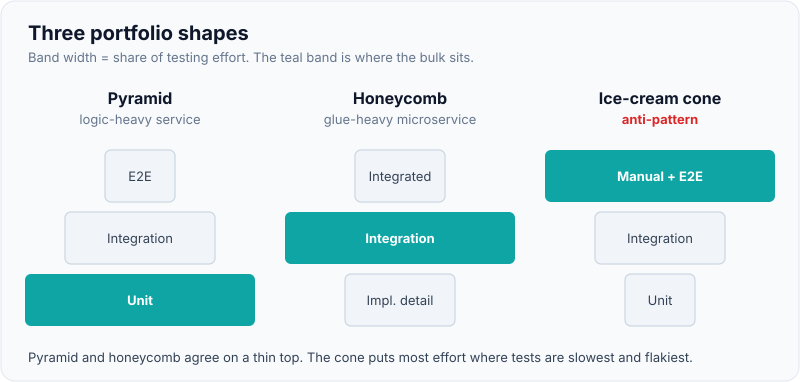
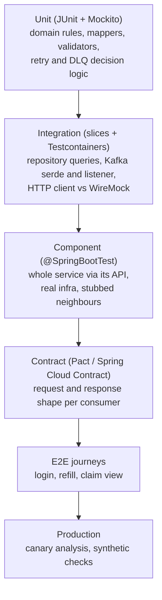
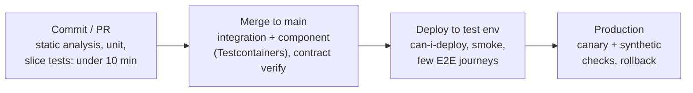

# Test Pyramid & Testing Strategy for Microservices

!!! abstract "Key takeaways"
    - The **test pyramid** (Mike Cohn, popularised by Martin Fowler) says: write **lots of fast, isolated tests** and **few slow, broad ones**. The exact layer names matter less than the two rules: *write tests of different granularity*, and *the broader the test, the fewer you need*.
    - For microservices the middle of the pyramid grows: **integration tests** for each adapter (DB, Kafka, HTTP client), **component tests** for one service with real infrastructure in containers, and **contract tests** between services. Spotify's **honeycomb** and Kent C. Dodds' **trophy** are the same idea with a fatter middle.
    - The anti-pattern is the **ice-cream cone**: mostly manual and end-to-end tests, few unit tests. It is slow, flaky and blocks independent deployment.
    - A strategy is more than a shape: decide **what each layer proves**, **where it runs in the pipeline** (PR, merge, nightly, production), **who owns it**, and **how flaky tests are handled**. Measure escaped defects, pipeline time and flake rate, not just coverage.
    - Push each check to the **lowest layer that can catch it**: logic in unit tests, SQL and serialisation in integration tests, API compatibility in contract tests, and only a handful of critical **user journeys** end to end, plus synthetic checks and canaries in production.

## Why it matters

Testing a monolith is mostly about code. Testing microservices is mostly about **boundaries**: a database you don't control in tests, a Kafka topic shared with three teams, five upstream APIs owned by other people. Two failure modes are common:

| Failure mode | What it looks like | Why it hurts |
|---|---|---|
| Too few broad tests | Unit tests pass, but the SQL, JSON mapping or Kafka serialiser is wrong | Bugs surface in staging or production |
| Too many broad tests | A 90-minute E2E suite in a shared environment, 5% of runs red for no reason | Teams stop trusting red builds; releases queue behind the slowest team |

A good strategy gives **fast feedback on most changes** (minutes, on the PR), **high confidence before production** (contracts, component tests), and **safety nets after deploy** (canaries, synthetic monitoring). As a lead, "what is your testing strategy?" is really asking whether you can make those trade-offs explicit and get a team to follow them. The [microservice testing page](../microservices/12-microservice-testing-strategy-and-contract-testing.md) covers contracts and component tests in depth; this page is about the strategy that ties the layers together.

## Core concepts

### The pyramid and why it has that shape

Mike Cohn introduced the test automation pyramid in *Succeeding with Agile* (2009): a wide base of unit tests, a middle layer of service tests, and a thin top of UI tests. Martin Fowler's bliki entry and Ham Vocke's *The Practical Test Pyramid* (martinfowler.com, 2018) reduce it to two rules:

1. **Write tests with different granularity.**
2. **The more high-level you get, the fewer tests you should have.**

The shape follows from cost. As scope grows, each test gets slower, needs more environment, fails for more reasons that aren't your bug, and points less precisely at the cause.

| Property | Unit | Integration / component | End-to-end |
|---|---|---|---|
| Runtime per test | ms | 100 ms to seconds | seconds to minutes |
| Environment | JVM only | Docker (Testcontainers), stubs | Many deployed services |
| Failure localisation | One class | One service or adapter | "Something in the journey" |
| Flakiness risk | Very low | Low to medium | High (network, data, timing) |
| What it proves | Logic is right | This service works with real infra | The system works together |

{ loading=lazy }
*Notice the two curves cross: the layers you need most of are the ones that cost least per test. Numbers are illustrative.*

### Alternatives: trophy, honeycomb and the ice-cream cone

The pyramid is a heuristic, not a law. Two well-known variants shift weight to the middle:

- **Testing trophy** (Kent C. Dodds, mainly for frontends): static analysis at the base, a small unit layer, the **largest layer is integration**, a few E2E tests on top. See the [frontend testing page](06-frontend-testing-jest-react-testing-library-e2e.md).
- **Testing honeycomb** (Spotify engineering, 2018): for microservices whose code is mostly glue between APIs and stores, **integration tests dominate**, with few "implementation detail" unit tests and few "integrated" tests that need other services running.
- **Ice-cream cone** (anti-pattern): most effort in manual and E2E testing, little in unit tests. Typical of teams that bolted automation onto an existing manual QA process.

Google's testing blog post *Just Say No to More End-to-End Tests* (2015) suggested roughly **70% unit, 20% integration, 10% E2E** as a starting split. Treat ratios as a smell detector, not a target: a service that is mostly mapping between Kafka and MongoDB will rightly have more integration tests than a pricing engine.


*Notice the pyramid and honeycomb agree on the top (few broad tests) and only differ on where the bulk sits. The cone inverts both.*

{ loading=lazy }
*Watch where the widest band sits in each shape: that is where the team spends most of its testing effort.*

### Test sizes: a better vocabulary than "unit vs integration"

"Unit" and "integration" mean different things to different people. Google's test sizes (described in *Software Engineering at Google*, ch. 11) classify by **resources** instead:

| Size | Constraint | Typical example |
|---|---|---|
| Small | Single process (often single thread), no network, no disk, no sleep | Pure Java/JUnit test of a domain class |
| Medium | Single machine; may use localhost network and containers | `@DataMongoTest` with Testcontainers, a WireMock-backed client test |
| Large | Multiple machines / real deployed services | E2E journey in a staging environment |

Sizes give enforceable rules ("small tests may not open a socket") and map cleanly to pipeline stages.

### Solitary vs sociable unit tests

Fowler distinguishes **solitary** unit tests (every collaborator replaced by a test double) from **sociable** ones (real collaborators used where they are fast and deterministic). The "London" school of TDD leans solitary; the "Classic/Detroit" school leans sociable. Practical rule: **mock what you don't own or what is slow/non-deterministic** (HTTP, DB, clock, randomness), use real objects for your own value objects and domain services. Over-mocking produces tests that pass while the real wiring is broken and that break on every refactor.

### Test doubles (Meszaros)

| Double | What it does | Example |
|---|---|---|
| Dummy | Passed but never used | `null`-safe placeholder argument |
| Stub | Returns canned answers | `when(repo.find(id)).thenReturn(member)` |
| Spy | Records calls on a real or stub object | Mockito `spy()`; Kafka test consumer that records messages |
| Mock | Pre-programmed with expectations, verified | `verify(publisher).send(event)` |
| Fake | Working lightweight implementation | In-memory repository, WireMock server, embedded broker |

Interviewers like this distinction because "I mocked it" often means "I stubbed it". The details of Mockito are on the [JUnit 5 & Mockito page](02-junit-5-and-mockito.md).

### What each layer proves in a Spring Boot microservice


*Notice each arrow adds one new kind of risk: real infrastructure, then the whole service, then another team's service, then the deployed system, then real traffic.*

| Risk | Lowest layer that catches it | Tooling |
|---|---|---|
| Wrong business rule, edge case | Unit | JUnit 5, AssertJ, parameterised tests |
| Wrong SQL / Mongo query, missing index use, migration error | Integration | `@DataJpaTest`/`@DataMongoTest` + Testcontainers |
| JSON/Avro serialisation, Kafka headers, consumer offsets | Integration | `@JsonTest`, Testcontainers Kafka |
| Controller validation, error mapping, security rules | Slice | `@WebMvcTest`, `@GraphQlTest`, `spring-security-test` |
| Timeouts, retries, circuit breaker to an upstream | Integration / component | WireMock faults, Resilience4j config |
| Provider changes a field the consumer uses | Contract | Pact + `can-i-deploy`, Spring Cloud Contract |
| Login + core journey across services | E2E | Playwright, REST-assured against staging |
| Config drift, capacity, real data shapes | Production | Canary, synthetic monitoring, feature flags |

The slices and integration setup are on the [Spring Boot test slices page](03-spring-boot-test-slices-and-integration-tests.md), containers on the [Testcontainers page](04-testcontainers.md), contracts on the [contract testing page](05-contract-testing.md).

### Testing event-driven flows

Kafka consumers need tests for the paths that only show up under failure:

- **Happy path**: produce to the real (containerised) topic, assert the side effect with Awaitility, not `Thread.sleep`.
- **Poison message**: a record that can't be deserialised goes to the DLQ instead of blocking the partition.
- **Retry exhaustion**: a transient upstream error is retried N times, then lands on the retry/DLQ topic with the original headers.
- **Idempotency**: the same event delivered twice produces one side effect.

These are integration tests with Testcontainers Kafka; the decision logic ("is this exception retryable?") stays in unit tests. The broker-side design is on the [Kafka error handling page](../kafka/07-error-handling-retry-topics-dlq-poison-messages-replay.md).

### Mapping layers to the pipeline


*Notice the fast layers gate every PR, while slow layers run less often and later; nothing heavy sits on the developer's critical path.*

Two common rules: the **PR build stays under about 10 minutes** (otherwise people batch changes), and **every layer must be deterministic enough to block a merge**. A test that is allowed to fail is noise.

{ loading=lazy }
*Watch how late the last bug is caught: each stage only stops the kind of defect its tests can see, and the cost of a catch grows to the right.*

### Flaky tests

A flaky test passes and fails on the same code. Google has reported that about 1.5% of its test runs were flaky and that almost 16% of tests showed some flakiness (Google Testing Blog, 2016). Common causes and fixes:

| Cause | Fix |
|---|---|
| `Thread.sleep` waits | Awaitility / `findBy` / Playwright auto-waiting |
| Shared mutable test data | Data per test, unique IDs, Testcontainers per suite |
| Test order dependence | Random order in CI, no static state |
| Time and time zones | Inject `Clock`; fixed instant in tests |
| Real external services | WireMock or contract stubs |
| Resource limits in CI | Fewer, shared containers; limit parallelism |

Process: detect (rerun-on-failure reports, CI analytics), **quarantine** with a ticket and an owner, fix or delete within a set time. Never "retry until green" silently.

### Testing in production

Pre-production tests can't reproduce real traffic, data and configuration. Safe production checks complement them: **canary releases** with automated metric analysis, **synthetic monitoring** of key journeys, **feature flags** to separate deploy from release, and **dark launches**. See [deployment strategies](../microservices/11-deployment-strategies-blue-green-canary-feature-flags.md). In healthcare and banking, synthetic transactions must use test accounts that downstream systems recognise and exclude.

## In practice: code & configuration

### Split fast and slow tests in the build

Maven runs `*Test` classes with Surefire in the `test` phase and `*IT` classes with Failsafe in `integration-test`/`verify`. Keep that split so the PR build can run only the fast ones.

=== "❌ Common mistake"
    ```java
    // One kind of test for everything: full context + live shared staging services.
    @SpringBootTest   // whole app, every test class
    class PriceServiceTest {

        @Autowired PriceService service;

        @Test
        void discountIsApplied() throws Exception {
            // calls the real pricing-rules service in the shared staging env
            Thread.sleep(2000);                               // "wait for the cache"
            assertThat(service.price("rx-1").total()).isEqualByComparingTo("8.50");
        }
    }
    // 40 s per class, fails when staging data changes, and a discount bug
    // is reported as "pricing journey failed".
    ```

=== "✅ Correct approach"
    ```java
    // 1. Unit: the rule itself, milliseconds, no Spring.
    class DiscountPolicyTest {
        private final Clock clock = Clock.fixed(Instant.parse("2026-01-15T10:00:00Z"), ZoneOffset.UTC);
        private final DiscountPolicy policy = new DiscountPolicy(clock);

        @ParameterizedTest
        @CsvSource({ "10.00, GENERIC, 8.50", "10.00, BRAND, 10.00" })
        void appliesGenericDiscount(BigDecimal list, DrugType type, BigDecimal expected) {
            assertThat(policy.apply(list, type)).isEqualByComparingTo(expected);
        }
    }

    // 2. Integration: the HTTP client against a fake upstream, including failure.
    @Tag("integration")
    class PricingRulesClientIT {
        @RegisterExtension
        static WireMockExtension rules = WireMockExtension.newInstance()
                .options(wireMockConfig().dynamicPort()).build();

        private final PricingRulesClient client =
                new PricingRulesClient(RestClient.create(rules.baseUrl()), Duration.ofMillis(500));

        @Test
        void timesOutFastWhenUpstreamIsSlow() {
            rules.stubFor(get(urlPathEqualTo("/rules/rx-1"))
                    .willReturn(okJson("{}").withFixedDelay(2_000)));        // slower than our 500 ms timeout
            assertThatThrownBy(() -> client.rulesFor("rx-1"))
                    .isInstanceOf(UpstreamTimeoutException.class);
        }
    }
    // 3. Contract test with the pricing-rules team, 4. one E2E journey for "price a refill".
    ```

```xml
<!-- pom.xml: Surefire for *Test (PR), Failsafe for *IT (merge build) -->
<plugin>
  <groupId>org.apache.maven.plugins</groupId>
  <artifactId>maven-failsafe-plugin</artifactId>
  <executions>
    <execution>
      <goals><goal>integration-test</goal><goal>verify</goal></goals>
    </execution>
  </executions>
</plugin>
```

With Gradle, a separate `integrationTest` source set or JUnit tags (`useJUnitPlatform { excludeTags("integration") }`) do the same job.

### A one-page strategy a lead can hand to the team

```text
Service: refill-service            Owner: Team Meteor-B
Layer          What it proves                       Runs on       Gate
Static         compile, lint, SAST, dependency scan  every PR      blocks merge
Unit           rules, mappers, retry decisions       every PR      blocks merge
Slice/IT       queries, Kafka serde, HTTP clients    every PR*     blocks merge
Component      API -> DB/Kafka with stubbed upstreams merge        blocks deploy
Contract       consumer pacts verified; can-i-deploy merge/deploy  blocks deploy
E2E (5 max)    login, refill, cancel, view history   post-deploy   blocks promotion
Prod           canary metrics, synthetic refill      continuous    auto-rollback
Quality gate   new-code coverage >= 80%, 0 new issues every PR     blocks merge
Flaky policy   quarantine within 1 day, fix or delete within 1 sprint
(* if total PR time stays under 10 minutes)
```

## Real-world usage

- **Spotify** described the honeycomb after finding that most of its microservices' complexity sat in interactions, not internal logic, so integration tests gave the best return.
- **Google** classifies tests by size and tracks flakiness centrally; its blog posts on E2E tests and flaky tests are widely quoted in interviews.
- **ThoughtWorks** (Toby Clemson's *Testing Strategies in a Microservice Architecture*, martinfowler.com) laid out unit, integration, component, contract and end-to-end tests for microservices; most current strategies follow that list.
- **Regulated domains** (healthcare, banking): test data is synthetic (no PHI or real account data), test evidence is kept for audits, and critical journeys are covered by both pre-release E2E tests and production synthetic checks.

## Trade-offs & production gotchas

| Option | Pros | Cons | Use when |
|---|---|---|---|
| Classic pyramid | Fast feedback, precise failures | Can miss wiring/infra bugs if the middle is thin | Logic-heavy services, libraries |
| Honeycomb (integration-heavy) | Tests what usually breaks in glue code | Slower suites, Docker in CI | API/data-mapping services |
| Large E2E suite | Realistic | Slow, flaky, couples teams' releases | Only a few critical journeys |
| Testing in production | Real traffic and config | Needs observability, flags, safe test data | Mature teams with canaries |
| Manual exploratory testing | Finds what nobody scripted | Doesn't scale, not regression | New features, UX, edge discovery |

!!! warning "Gotcha: a coverage target as the strategy"
    "80% coverage" says nothing about whether the right risks are tested. Teams hit the number with assertion-free tests of getters. Use coverage on **new code** as a floor and review **what** is tested. See [TDD, coverage & quality gates](07-tdd-coverage-and-quality-gates.md).

!!! warning "Gotcha: the shared staging environment as the main safety net"
    If every release needs a green run in a shared environment, teams wait on each other and one broken service blocks everyone. Contract tests plus component tests let each service prove compatibility on its own.

!!! warning "Gotcha: mocking what you don't own"
    A hand-written Mockito stub of another team's client encodes your guess about their API. Use contract-verified stubs or WireMock driven by contracts.

!!! question "Interview angle"
    "Describe your testing strategy" is a design question. Answer with layers, what each proves, where it runs, how you keep it fast and trustworthy, and one concrete example of a bug each layer caught.

## How this connects to my experience

- **Where I used it:** OptumRx Meteor (Publicis Sapient): "Established engineering standards around testing, CI/CD, code quality, and deployment practices" while leading "a cross-functional team of 8–10 engineers". The GraphQL Consumer Service integrates "5 upstream systems and multiple downstream consumers", and the "Kafka-based event-driven workflows with retry and DLQ handling" are exactly the paths that need integration tests. Earlier, at Coriolis: "automated deployments through GitLab CI/CD pipelines".
- **Talking points:**
    - The strategy as a table per layer: unit for resolvers' mapping and business rules, slices for the GraphQL schema and controllers, Testcontainers for MongoDB, Redis and Kafka, WireMock for the five upstreams. *[confirm: which layers and tools were in the standard]*
    - Kafka retry and DLQ tested with a real broker: poison message, retry exhaustion, idempotent replay. *[confirm: whether these were automated tests or verified manually]*
    - Pipeline split: fast tests on every merge request, slower suites on merge, a few E2E journeys after deploy. *[confirm: pipeline stages and typical PR build time]*
    - QA in the same team (the resume says teams spanned "backend, frontend, and QA functions"): how automation and manual exploratory testing were divided. *[confirm]*
- **Likely follow-up chain:** "What did your testing standard say?" → "How did you test against five upstreams you didn't own?" (WireMock, contracts or schema checks) → "How did you keep the pipeline fast?" (layer split, shared containers) → "How did you handle flaky tests?" (quarantine and ownership). Answer each with the layer table above and one concrete bug it caught. *[confirm: one real example of a bug caught by integration or contract tests]*

## Interview questions

### Fundamentals

??? question "Q1. What is the test pyramid and why is it shaped that way?"
    **Answer:** A model for a test portfolio: many small, fast, isolated tests at the base, fewer integration/service tests in the middle, very few end-to-end tests at the top. Broader tests are slower, flakier, need more environment and localise failures poorly, so you want only enough of them to prove the pieces fit together. Fowler's two rules: write tests at different granularities, and have fewer the higher you go.

    **Interviewer listens for:** cost and feedback speed as the reason; "granularity" rather than fixed ratios.

    **Common wrong answer:** "70/20/10 is the rule" with no reasoning.

??? question "Q2. What is the difference between a stub, a mock, a spy and a fake?"
    **Answer:** A stub returns canned answers; a mock also has expectations that are verified (calls, arguments); a spy records calls on a real (or partially real) object; a fake is a lightweight working implementation such as an in-memory repository or WireMock. A dummy is passed but never used.

    **Interviewer listens for:** state verification (stubs) vs behaviour verification (mocks).

    **Common wrong answer:** "They're all mocks."

??? question "Q3. What is the ice-cream cone anti-pattern?"
    **Answer:** An inverted pyramid: most testing done manually or through the UI end to end, with few unit and integration tests. Feedback is slow, suites are flaky and expensive, and failures are hard to diagnose. Fix it by pushing checks down to the lowest layer that can catch each risk and deleting redundant E2E tests.

    **Interviewer listens for:** a migration path, not just the definition.

    **Common wrong answer:** "It's when you have too many unit tests."

### Intermediate

??? question "Q4. What extra layers does a microservice need compared with a monolith?"
    **Answer:** Integration tests for each adapter (database, broker, HTTP clients), component tests that run one service in isolation with real infrastructure and stubbed neighbours, and contract tests between services. E2E tests shrink to a few journeys because contracts and component tests cover compatibility and behaviour per service.

    **Interviewer listens for:** component and contract tests; why E2E shrinks.

    **Common wrong answer:** "More E2E tests because there are more services."

??? question "Q5. Solitary or sociable unit tests: which do you prefer?"
    **Answer:** Mostly sociable: use real domain objects and value objects, and double only what's slow, non-deterministic or owned by someone else (HTTP, DB, clock, randomness, message brokers). Solitary tests with everything mocked couple tests to implementation and can pass while the real wiring is broken. Solitary tests are useful when a collaborator is expensive or when designing interactions outside-in.

    **Interviewer listens for:** a rule for what to mock and the refactoring cost of over-mocking.

    **Common wrong answer:** "Always mock every dependency, that's what a unit test is."

??? question "Q6. How do you test a Kafka consumer with retry and DLQ handling?"
    **Answer:** Unit-test the decision logic (which exceptions are retryable, backoff values). Integration-test with a real broker in Testcontainers: produce a valid event and assert the side effect with Awaitility; produce a malformed record and assert it lands on the DLQ with original headers; make a dependency fail transiently and assert N retries then DLQ; deliver a duplicate and assert one side effect.

    **Interviewer listens for:** failure paths, real broker, no sleeps, idempotency.

    **Common wrong answer:** "Mock the KafkaTemplate and verify `send` was called."

### Senior

??? question "Q7. How do you decide which tests run on a PR and which run later?"
    **Answer:** By feedback time and blast radius. The PR build runs everything fast and deterministic (static analysis, unit, slice and most integration tests) and must stay under about 10 minutes. Slower component and contract verification run on merge; `can-i-deploy` gates deployment; a handful of E2E journeys run after deploy to a test environment; canaries and synthetic checks run in production. If a stage gets slow, shard it or move tests down a layer rather than dropping the gate.

    **Interviewer listens for:** explicit time budgets and gates per stage.

    **Common wrong answer:** "Run everything on every commit."

??? question "Q8. How do you handle flaky tests across a team?"
    **Answer:** Treat flakiness as a defect. Detect it (CI reruns, flake dashboards), quarantine the test immediately so it doesn't block others, create a ticket with an owner and a deadline, fix the root cause (sleeps, shared data, ordering, time, real external calls) or delete the test. Don't add blanket retries, which hide real race conditions. Track the flake rate as a team metric.

    **Interviewer listens for:** quarantine plus ownership; root causes; no silent retry.

    **Common wrong answer:** "Add `@RepeatedTest` / rerun until it passes."

??? question "Q9. How do you measure whether a testing strategy works?"
    **Answer:** Outcome metrics: escaped defects (bugs found in production by layer that should have caught them), change failure rate and mean time to restore (DORA), pipeline duration, flake rate. Coverage on new code and mutation score are input signals. Review escaped defects and add the cheapest test that would have caught each one.

    **Interviewer listens for:** outcome metrics over coverage; feedback loop from incidents.

    **Common wrong answer:** "Coverage above 80%."

### Scenario-based

??? question "Q10. You inherit a service with a 90-minute flaky E2E suite and few unit tests. What do you do?"
    **Answer:** First stop the bleeding: quarantine the flakiest E2E tests and make the rest a non-blocking signal for a short time. Map each E2E test to the risk it covers, then replace it with the lowest-layer test that covers the same risk (unit for logic, Testcontainers for SQL/Kafka, contracts for API shape). Keep five to ten critical journeys end to end. Add a quality gate on new code so the base grows. Report pipeline time and escaped defects to show progress.

    **Interviewer listens for:** incremental plan, risk mapping, keeping a few journeys, metrics.

    **Common wrong answer:** "Delete the E2E suite and write unit tests."

??? question "Q11. Your GraphQL service aggregates five upstreams owned by other teams. How do you test it?"
    **Answer:** Unit-test resolvers' mapping and merging rules. Use `@GraphQlTest` for the schema and error handling. Test each upstream client with WireMock, including timeouts, 5xx and malformed bodies, and assert partial responses with GraphQL `errors` where that's the design. Add consumer-driven contracts (or at least OpenAPI/schema diff checks) with each upstream team so their changes are caught before deploy. One or two E2E journeys exercise the real chain in a test environment.

    **Interviewer listens for:** failure-path testing, contracts for team boundaries, partial-response behaviour.

    **Common wrong answer:** "Point tests at the upstreams' dev environments."

## Cheat sheet

| Concept | Remember |
|---|---|
| Pyramid rules | Different granularities; fewer tests the higher you go |
| Variants | Trophy (frontend, integration-heavy), honeycomb (microservices), cone (anti-pattern) |
| Test sizes | Small (one process), medium (one machine), large (many machines) |
| Doubles | Dummy, stub, spy, mock, fake |
| Microservice layers | Unit, integration, component, contract, E2E, production checks |
| Placement | Lowest layer that can catch the risk |
| PR budget | About 10 minutes, deterministic, blocking |
| Flaky tests | Quarantine, owner, fix or delete; never silent retry |
| Metrics | Escaped defects, change failure rate, pipeline time, flake rate |
| Kafka | Real broker, Awaitility, poison message, retry exhaustion, duplicates |

## Sources
1. [Martin Fowler: Test Pyramid](https://martinfowler.com/bliki/TestPyramid.html): origin with Mike Cohn and the rationale.
2. [Ham Vocke: The Practical Test Pyramid (martinfowler.com)](https://martinfowler.com/articles/practical-test-pyramid.html): the two rules, layers in a Spring Boot service, contract tests.
3. [Toby Clemson: Testing Strategies in a Microservice Architecture](https://martinfowler.com/articles/microservice-testing/): unit, integration, component, contract, E2E for microservices.
4. [Martin Fowler: Unit Test (solitary vs sociable)](https://martinfowler.com/bliki/UnitTest.html) and [Mocks Aren't Stubs](https://martinfowler.com/articles/mocksArentStubs.html): test doubles, classic vs mockist.
5. [Gerard Meszaros: Test Double (xunitpatterns.com)](http://xunitpatterns.com/Test%20Double.html): dummy, stub, spy, mock, fake.
6. [Spotify Engineering: Testing of Microservices (2018)](https://engineering.atspotify.com/2018/01/testing-of-microservices/): the honeycomb.
7. [Kent C. Dodds: The Testing Trophy and Testing Classifications](https://kentcdodds.com/blog/the-testing-trophy-and-testing-classifications): trophy shape.
8. [Google Testing Blog: Just Say No to More End-to-End Tests (2015)](https://testing.googleblog.com/2015/04/just-say-no-to-more-end-to-end-tests.html): 70/20/10 suggestion, E2E costs.
9. [Google Testing Blog: Flaky Tests at Google and How We Mitigate Them (2016)](https://testing.googleblog.com/2016/05/flaky-tests-at-google-and-how-we.html): flake statistics.
10. [Software Engineering at Google, ch. 11 "Testing Overview"](https://abseil.io/resources/swe-book/html/ch11.html): test sizes and scope.
11. [Maven Failsafe Plugin](https://maven.apache.org/surefire/maven-failsafe-plugin/): `*IT` integration tests in the `integration-test`/`verify` phases.
