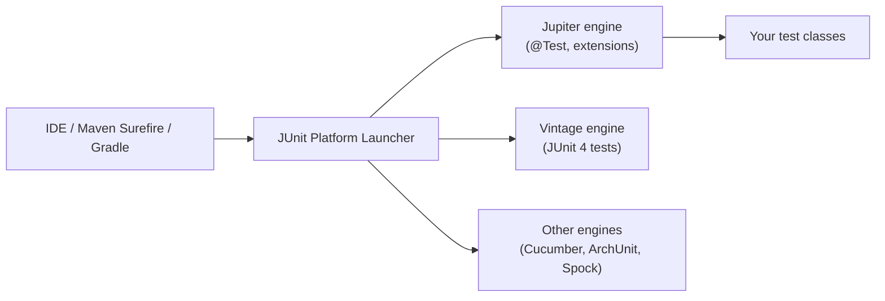
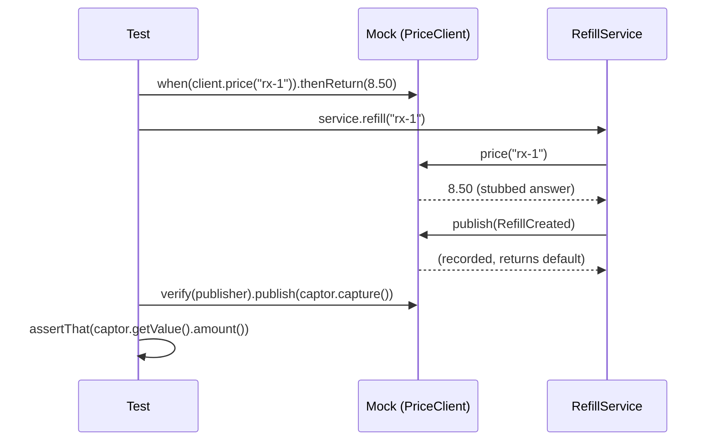

# JUnit 5 & Mockito

!!! abstract "Key takeaways"
    - **JUnit 5 = Platform + Jupiter + Vintage.** The Platform launches tests (Maven Surefire, Gradle, IDEs), Jupiter is the programming model (`@Test`, `@BeforeEach`, extensions), Vintage runs old JUnit 4 tests. JUnit 6 (September 2025) keeps the Jupiter API, raises the baseline to Java 17 and unifies version numbers.
    - A **new test-class instance is created per test method** by default (`PER_METHOD`), so fields are reset between tests. That is why `@BeforeAll` must be `static` unless you choose `@TestInstance(PER_CLASS)`.
    - **Extensions** (`@ExtendWith`) replace JUnit 4 runners and rules and can be combined: `MockitoExtension`, `SpringExtension`, Testcontainers' extension all live side by side.
    - **Mockito**: *stub* queries (`when(...).thenReturn(...)`), *verify* commands (`verify(mock).send(...)`). Don't verify what you stubbed. `MockitoExtension` uses **strict stubs**: unused stubbings fail the test.
    - Mockito 5 uses the **inline mock maker by default**, so final classes and static methods can be mocked; on Java 21+ add Mockito as a `-javaagent` to avoid the dynamic-agent warning. Being able to mock statics doesn't mean you should: inject a `Clock` or a collaborator instead.

## Why it matters

Unit tests are the base of the [test pyramid](01-test-pyramid-and-testing-strategy-for-microservices.md): thousands of them run on every pull request, so their speed, readability and stability decide whether a team trusts its build. Interviewers use JUnit and Mockito questions to separate people who *write tests* from people who *design for testability*: do you know the lifecycle, can you test exceptions and edge cases cleanly, and do you know when a mock makes a test worse?

JUnit 4 (2006) was one jar with runners (`@RunWith`) and rules (`@Rule`), and you could only use one runner per class. JUnit 5 (2017) split the engine from the API, added a single extension model, Java 8+ lambdas (`assertThrows`, `assertAll`), parameterised tests as a first-class feature, nested tests and display names. Spring Boot 3.x's `spring-boot-starter-test` brings JUnit Jupiter, Mockito, AssertJ, Hamcrest, JSONassert and JsonPath.

## Core concepts

### Architecture: Platform, Jupiter, Vintage


*Notice the build tool only talks to the Platform; any engine plugged into it runs in the same build, which is how JUnit 4 and 5 tests coexist during a migration.*

### Lifecycle

| Annotation | Runs | Notes |
|---|---|---|
| `@BeforeAll` / `@AfterAll` | Once per class | `static`, unless `@TestInstance(Lifecycle.PER_CLASS)` |
| `@BeforeEach` / `@AfterEach` | Around every test | Fresh fixture per test |
| `@Test`, `@ParameterizedTest`, `@RepeatedTest`, `@TestFactory` | The test itself | `@TestFactory` returns dynamic tests |
| `@Nested` | Inner, non-static class | Inherits outer `@BeforeEach`; groups scenarios |
| `@Disabled`, `@EnabledOnOs`, `@EnabledIf...` | Conditions | Prefer a reason string on `@Disabled` |
| `@Tag("integration")` | Filtering | Build tools include/exclude tags |
| `@Timeout` | Fails slow tests | Useful for code that could hang |

Because each test method gets a **new instance** by default, there is no hidden state between tests through fields. `PER_CLASS` shares one instance (handy for expensive non-static setup, e.g. in Kotlin), but then you are responsible for resetting state. Test **order** is deliberately not guaranteed (it is deterministic but not obvious); `@TestMethodOrder` exists for rare cases, and needing it usually means tests share state.

{ loading=lazy }
*Watch the instance counter: each test gets its own object, so a field set in test one is gone in test two.*

### Extensions

The extension model is a set of callback interfaces (`BeforeEachCallback`, `ParameterResolver`, `TestExecutionExceptionHandler`, `ExecutionCondition`...). Frameworks plug in through them:

- `@ExtendWith(MockitoExtension.class)` creates `@Mock`, `@Spy`, `@Captor` fields and injects them with `@InjectMocks`; it also enforces strict stubs.
- `@SpringBootTest`, `@WebMvcTest` and the other slices are meta-annotated with `@ExtendWith(SpringExtension.class)`, which loads (and caches) the application context.
- `@Testcontainers` starts and stops `@Container` fields.
- `@RegisterExtension` registers an extension instance programmatically, e.g. `WireMockExtension` with a dynamic port.
- `@TempDir` injects a temporary directory that is cleaned up after the test.

### Parameterised and nested tests

`@ParameterizedTest` with `@ValueSource`, `@CsvSource`, `@EnumSource`, `@MethodSource` or `@ArgumentsSource` runs the same test body over a table of inputs. It is the cleanest way to cover boundaries (0, 1, max, max+1, null, empty) without copy-paste, and each row shows up as its own test in the report. `@Nested` groups tests by context ("when the member is inactive...") so reports read like a specification.

### Assertions: JUnit vs AssertJ

JUnit's `Assertions` cover the basics plus `assertThrows`, `assertAll` (soft assertions: report every failure, not just the first) and `assertTimeout`. Most Spring teams use **AssertJ** (`assertThat(x).isEqualTo(y)`) for fluent, type-specific assertions and better messages: collections (`containsExactly`, `extracting`), exceptions (`assertThatThrownBy(...).isInstanceOf(...).hasMessageContaining(...)`), `BigDecimal` (`isEqualByComparingTo`, which ignores scale) and recursive comparison (`usingRecursiveComparison()`) for DTOs.

### Mockito in one picture


*Notice the two directions: the stub feeds data in (a query), and verify checks a side effect going out (a command). The query is never verified because the result already proves it was called.*

A Mockito mock is a generated subclass (or, with the inline mock maker, an instrumented class) that **records every call** and returns **defaults** (null, 0, false, empty collections, empty `Optional`) unless stubbed. Key API:

| Need | API |
|---|---|
| Stub a return | `when(m.find(id)).thenReturn(x)` or BDD `given(m.find(id)).willReturn(x)` |
| Stub a void method / spy safely | `doThrow(ex).when(m).delete(id)`, `doReturn(x).when(spy).find(id)` |
| Successive answers | `thenReturn(a, b).thenThrow(ex)` |
| Computed answer | `thenAnswer(inv -> inv.getArgument(0))` |
| Verify interaction | `verify(m).send(event)`, `verify(m, times(2))`, `never()`, `verifyNoMoreInteractions(m)` |
| Inspect an argument | `ArgumentCaptor<Event> c`; `verify(m).send(c.capture())` |
| Match arguments | `any()`, `eq()`, `argThat(e -> e.amount() > 0)`; all args must be matchers if one is |
| Order | `InOrder inOrder = inOrder(a, b)` |
| Partial mock | `spy(realObject)` (calls real methods unless stubbed) |
| Static / construction | `try (var s = mockStatic(UUID.class)) { ... }`, `mockConstruction(...)` |

### Strict stubs

With `MockitoExtension`, the default strictness is `STRICT_STUBS`: a stubbing the code never uses fails with `UnnecessaryStubbingException`, and a stubbing called with different arguments reports a `PotentialStubbingProblem`. This catches dead setup and wrong-argument bugs. Use `lenient()` only for a deliberate shared stub (for example in `@BeforeEach` for some tests).

### Mock makers, Java 21 and final classes

Mockito 5 switched the default to the **inline mock maker** (formerly `mockito-inline`), which instruments classes with a Java agent. That makes final classes, records and static methods mockable. On JDK 21+, JEP 451 prints a warning when an agent is attached dynamically, and a future JDK will block it, so configure Mockito as a startup agent:

```xml
<!-- pom.xml: load Mockito's agent at JVM start (no JEP 451 warning) -->
<plugin>
  <artifactId>maven-surefire-plugin</artifactId>
  <configuration>
    <argLine>@{argLine} -javaagent:${org.mockito:mockito-core:jar}</argLine>
  </configuration>
</plugin>
<!-- needs maven-dependency-plugin's "properties" goal to resolve the jar path -->
```

## In practice: code & configuration

### Over-mocked vs behaviour-focused

=== "❌ Common mistake"
    ```java
    @ExtendWith(MockitoExtension.class)
    class RefillServiceTest {
        @Mock MemberRepository repo;
        @Mock PriceClient prices;
        @Mock RefillMapper mapper;          // mocking our own pure mapper
        @Mock EventPublisher publisher;
        @InjectMocks RefillService service;

        @Test
        void test1() {                       // name says nothing
            when(repo.findById("m1")).thenReturn(Optional.of(new Member("m1", true)));
            when(prices.price("rx-1")).thenReturn(new BigDecimal("8.50"));
            when(mapper.toEvent(any())).thenReturn(mock(RefillCreated.class));
            service.refill("m1", "rx-1");
            verify(repo).findById("m1");     // verifying a stubbed query: redundant
            verify(prices).price("rx-1");    // the test now mirrors the implementation
            verify(mapper).toEvent(any());
            verify(publisher).publish(any()); // ...and never checks WHAT was published
        }
    }
    ```

=== "✅ Correct approach"
    ```java
    @ExtendWith(MockitoExtension.class)
    class RefillServiceTest {
        @Mock MemberRepository repo;        // I/O boundary: mock
        @Mock PriceClient prices;           // another team's API: mock
        @Mock EventPublisher publisher;     // side effect we must verify
        @Captor ArgumentCaptor<RefillCreated> event;

        // real mapper and fixed clock: sociable, deterministic
        private final Clock clock = Clock.fixed(Instant.parse("2026-01-15T10:00:00Z"), ZoneOffset.UTC);
        private RefillService service;

        @BeforeEach
        void setUp() {
            service = new RefillService(repo, prices, new RefillMapper(), publisher, clock);
        }

        @Test
        @DisplayName("active member: refill is priced and a RefillCreated event is published")
        void publishesPricedRefill() {
            given(repo.findById("m1")).willReturn(Optional.of(new Member("m1", true)));
            given(prices.price("rx-1")).willReturn(new BigDecimal("8.50"));

            service.refill("m1", "rx-1");

            then(publisher).should().publish(event.capture());       // verify the command only
            assertThat(event.getValue())
                    .extracting(RefillCreated::memberId, RefillCreated::amount, RefillCreated::createdAt)
                    .containsExactly("m1", new BigDecimal("8.50"), Instant.parse("2026-01-15T10:00:00Z"));
        }

        @Test
        void inactiveMemberIsRejectedAndNothingIsPublished() {
            given(repo.findById("m1")).willReturn(Optional.of(new Member("m1", false)));

            assertThatThrownBy(() -> service.refill("m1", "rx-1"))
                    .isInstanceOf(InactiveMemberException.class)
                    .hasMessageContaining("m1");
            then(publisher).shouldHaveNoInteractions();
            // no stub for prices: strict stubs would fail if we had added an unused one
        }
    }
    ```

{ loading=lazy }
*The left test checks how the code is written; the right test checks what it does. Only the right one survives an internal refactor.*

### Parameterised boundaries

```java
@ParameterizedTest(name = "{0} days supply -> refill allowed: {1}")
@CsvSource({
    "0,  false",   // just filled
    "6,  false",   // one day before the window opens
    "7,  true",    // window opens at 7 days remaining
    "30, true"
})
void refillWindow(int daysRemaining, boolean allowed) {
    assertThat(new RefillPolicy().isAllowed(daysRemaining)).isEqualTo(allowed);
}
```

### Nested scenarios and soft assertions

```java
@DisplayName("PasswordPolicy")
class PasswordPolicyTest {
    private final PasswordPolicy policy = new PasswordPolicy(12);

    @Nested
    class WhenTooShort {
        @Test
        void reportsLengthAndStillChecksOtherRules() {
            var result = policy.check("Ab1!");
            assertAll(                                     // every failure is reported, not just the first
                () -> assertThat(result.valid()).isFalse(),
                () -> assertThat(result.errors()).contains("MIN_LENGTH"),
                () -> assertThat(result.errors()).doesNotContain("MISSING_DIGIT"));
        }
    }
}
```

### Avoid mocking statics: inject the dependency

=== "❌ Common mistake"
    ```java
    // production code calls Instant.now() and UUID.randomUUID() directly,
    // so the test reaches for static mocking
    try (var uuid = mockStatic(UUID.class); var now = mockStatic(Instant.class)) {
        uuid.when(UUID::randomUUID).thenReturn(FIXED_UUID);
        now.when(Instant::now).thenReturn(FIXED_INSTANT);
        ...
    }
    ```

=== "✅ Correct approach"
    ```java
    // production code takes a Clock and an IdGenerator; tests pass fixed ones
    var service = new RefillService(repo, prices, mapper, publisher,
            Clock.fixed(FIXED_INSTANT, ZoneOffset.UTC), () -> "id-1");
    ```

## Real-world usage

- **Spring Boot services**: plain JUnit + Mockito for domain and service classes (milliseconds, no Spring context), and the [Spring Boot test slices](03-spring-boot-test-slices-and-integration-tests.md) only where Spring wiring itself matters. Mixing the two (a `@SpringBootTest` just to get a `@MockitoBean`) is the most common reason suites get slow.
- **Migrations**: teams run Vintage and Jupiter side by side and migrate class by class; OpenRewrite has recipes for JUnit 4 to 5 and for Spring Boot's `@MockBean` to `@MockitoBean`.
- **Regulated domains**: tests use synthetic member IDs and fixed clocks (date-of-birth, eligibility windows and statement cut-off dates are classic time bugs). Time-zone edge cases (DST changes, end of month) are good parameterised cases.
- **Known failure modes**: `when(spy.method())` calling the real method during stubbing; matchers mixed with raw values (`InvalidUseOfMatchersException`); `@InjectMocks` silently choosing a constructor and leaving a field null; static state leaking between tests.

## Trade-offs & production gotchas

| Option | Pros | Cons | Use when |
|---|---|---|---|
| Real collaborator | Tests real behaviour, refactor-safe | Can be slow or need setup | Value objects, mappers, pure domain services |
| Stub (`when/given`) | Isolates from I/O, easy edge cases | Encodes assumptions about the dependency | Repositories, HTTP clients, other teams' APIs |
| Mock + `verify` | Proves a command happened | Couples test to call structure | Side effects: publish, send, save, audit |
| Spy | Partial real behaviour | Confusing, real side effects | Legacy code you can't restructure yet |
| Fake (in-memory) | Realistic, reusable, fast | Must be maintained, can drift | Repositories used by many tests |
| Static mocking | Works on code you can't change | Hides a design problem, thread-local scope | Third-party statics, short-lived legacy |

!!! warning "Gotcha: `when()` on a spy calls the real method"
    `when(spy.load(id)).thenReturn(x)` invokes the real `load` while stubbing, which may hit the database or throw. Use `doReturn(x).when(spy).load(id)`.

!!! warning "Gotcha: matcher mixing"
    `verify(m).send(any(), "topic")` throws: if any argument is a matcher, all must be. Write `verify(m).send(any(), eq("topic"))`.

!!! warning "Gotcha: `@InjectMocks` is forgiving"
    It tries constructor, then setter, then field injection and doesn't fail when it can't satisfy a dependency. Prefer constructing the class under test yourself in `@BeforeEach`: the compiler then tells you about new dependencies.

!!! question "Interview angle"
    Expect "what's the difference between `@Mock` and `@MockitoBean` (formerly `@MockBean`)?": `@Mock` is plain Mockito, no Spring; `@MockitoBean` replaces a bean in the Spring context and changes the context cache key, so overusing it slows the suite. `@MockBean` was deprecated in Boot 3.4 and removed in Boot 4.0.

## How this connects to my experience

- **Where I used it:** Not called out as a separate resume bullet; position it as part of "Established engineering standards around testing, CI/CD, code quality, and deployment practices" on OptumRx Meteor, and the Java/Spring Boot services across Publicis Sapient, Deloitte and Coriolis.
- **Talking points:**
    - Unit-testing GraphQL Consumer Service mapping and merge logic over the 5 upstreams with real mappers and stubbed clients. *[confirm: which classes had the most unit tests]*
    - Kafka retry/DLQ decision logic ("is this exception retryable?") as parameterised unit tests, with the broker paths covered by integration tests. *[confirm]*
    - Code-review rules I'd enforce as a lead: one behaviour per test, descriptive names, no `Thread.sleep`, inject `Clock`, verify only commands. *[confirm: which of these were in the team standard]*
- **Likely follow-up chain:** "How do you decide what to mock?" (I/O, other teams, time and randomness; never my own value objects) → "Show me how you'd test an exception path" (`assertThatThrownBy`, plus `shouldHaveNoInteractions` on side effects) → "Your tests break on every refactor, why?" (over-verification of queries; move to state and command verification).

## Interview questions

### Fundamentals

??? question "Q1. What are the parts of JUnit 5 and why was it split that way?"
    **Answer:** The **Platform** (launcher API used by IDEs and build tools), **Jupiter** (the new programming and extension model) and **Vintage** (an engine that runs JUnit 3/4 tests). Splitting the launcher from the engine let tools integrate once and let several engines (Jupiter, Vintage, Cucumber, ArchUnit) run in one build, which made gradual migration from JUnit 4 possible. JUnit 6 keeps this design with a Java 17 baseline.

    **Interviewer listens for:** Platform vs engine; Vintage for migration.

    **Common wrong answer:** "JUnit 5 is just JUnit 4 with new annotation names."

??? question "Q2. Why must `@BeforeAll` be static, and when isn't it?"
    **Answer:** JUnit creates a new instance of the test class for every test method, so a once-per-class method can't belong to an instance. With `@TestInstance(Lifecycle.PER_CLASS)` there's one instance for all methods and `@BeforeAll` can be non-static, at the cost of shared state you must reset yourself.

    **Interviewer listens for:** per-method instance as the default and the reason for it (isolation).

    **Common wrong answer:** "It's a language requirement."

??? question "Q3. What's the difference between a stub and a mock in Mockito terms?"
    **Answer:** Mockito creates the same kind of object for both; the difference is use. Stubbing (`when/given`) programs answers for queries, so the test checks the resulting state. Mocking with `verify` checks that a command (a side effect) was sent with the right arguments. Rule of thumb: stub queries, verify commands, don't verify what you stubbed.

    **Interviewer listens for:** query vs command; why verifying stubbed calls is redundant.

    **Common wrong answer:** "`@Mock` is a mock and `when` makes it a stub, they're different classes."

### Intermediate

??? question "Q4. What does `MockitoExtension`'s strict stubbing do?"
    **Answer:** It fails a test when a stubbing is never used (`UnnecessaryStubbingException`) and warns or fails when a stubbed method is called with different arguments (`PotentialStubbingProblem`). It keeps tests honest: dead setup is removed and argument mismatches show up as clear errors instead of `null` returns. `lenient()` opts out for a specific stub.

    **Interviewer listens for:** unused stubs fail; argument mismatch detection; `lenient()` as a deliberate exception.

    **Common wrong answer:** "It makes Mockito throw if you call an unstubbed method." (Unstubbed calls return defaults.)

??? question "Q5. When would you use an `ArgumentCaptor`?"
    **Answer:** When the code under test builds an object internally and passes it to a collaborator, and you need to assert its contents: for example the event published to Kafka, or the entity saved. Capture in `verify`, then assert on `getValue()` (or `getAllValues()`). Don't use captors with `when` for stubbing; use matchers there.

    **Interviewer listens for:** use in verification, asserting fields of an internally built object.

    **Common wrong answer:** "To stub methods that take complex arguments."

??? question "Q6. Spy vs mock: when is a spy acceptable?"
    **Answer:** A mock replaces all behaviour; a spy wraps a real object and calls real methods unless stubbed. Spies are acceptable for legacy code you can't restructure yet, or to stub one expensive method on an otherwise real object. They are a smell in new code because the class is doing too much. Stub spies with `doReturn().when(spy)` to avoid invoking the real method.

    **Interviewer listens for:** `doReturn` on spies; spy as a design smell.

    **Common wrong answer:** "Spies are better because they test more real code."

??? question "Q7. How do you test code that uses `LocalDate.now()` or `UUID.randomUUID()`?"
    **Answer:** Make the dependency explicit: inject a `java.time.Clock` (and use `LocalDate.now(clock)`) and an ID supplier. Tests pass `Clock.fixed(...)` and a fixed supplier. Static mocking with `mockStatic` works but hides the dependency, is thread-scoped and needs the inline mock maker; I'd use it only for code I can't change.

    **Interviewer listens for:** `Clock` injection; static mocking as last resort.

    **Common wrong answer:** "Use `Thread.sleep` and compare with a tolerance."

### Senior

??? question "Q8. Your team's unit tests break on every refactor even though behaviour doesn't change. What's wrong and how do you fix it?"
    **Answer:** The tests are coupled to implementation: they mock internal collaborators (mappers, helpers) and verify every call, including stubbed queries. Fix by testing through the public behaviour of a meaningful unit, using real objects for internal, deterministic collaborators (sociable tests), mocking only boundaries, verifying only outgoing commands and asserting on returned state. Add a review guideline and refactor the worst offenders first.

    **Interviewer listens for:** over-mocking and over-verification as the cause; sociable tests; a team-level fix.

    **Common wrong answer:** "Use `lenient()` and `any()` everywhere."

??? question "Q9. What changed in Mockito 5 and how does it affect a Java 21 build?"
    **Answer:** Mockito 5 made the inline mock maker the default (final classes, statics, constructors are mockable) and requires Java 11+. The inline mock maker attaches a Java agent at runtime; JDK 21's JEP 451 warns about dynamic agent loading and a future JDK will disallow it by default. Configure Mockito as a `-javaagent` in Surefire/Gradle test JVM args. `-XX:+EnableDynamicAgentLoading` only silences it.

    **Interviewer listens for:** inline default; JEP 451; the startup agent fix.

    **Common wrong answer:** "Mockito can't mock final classes."

### Scenario-based

??? question "Q10. A test passes alone but fails when the whole class runs. How do you debug it?"
    **Answer:** That means shared state: a static field, a singleton cache, a mocked static not closed (`mockStatic` outside try-with-resources), a `PER_CLASS` lifecycle with leftover data, or a system property/time zone changed by another test. Run with a fixed random order (`junit.jupiter.testmethod.order.default=org.junit.jupiter.api.MethodOrderer$Random`) to reproduce, find the polluting test, and make each test set up and clean its own state.

    **Interviewer listens for:** order dependence; statics; reproducing with random order.

    **Common wrong answer:** "Add `@TestMethodOrder` so it always runs in the order that passes."

??? question "Q11. How would you test a service method that retries a flaky upstream three times before giving up?"
    **Answer:** Unit test with a stubbed client: `thenThrow(timeout).thenThrow(timeout).thenReturn(ok)` asserts success on the third attempt; four throws assert the final exception and `verify(client, times(3))`. Inject the backoff policy or use a zero-delay configuration so the test doesn't sleep. The real Resilience4j wiring and timeouts get an integration test with WireMock faults.

    **Interviewer listens for:** consecutive stubbing; `times(n)`; no real waiting; unit vs integration split.

    **Common wrong answer:** "Point it at a real flaky service and run it a few times."

## Cheat sheet

| Concept | Remember |
|---|---|
| Architecture | Platform (launcher) + Jupiter (API) + Vintage (JUnit 4) |
| Lifecycle | New instance per test; `@BeforeAll` static unless `PER_CLASS` |
| Extensions | `@ExtendWith`, `@RegisterExtension`; many per class |
| Data-driven | `@ParameterizedTest` + `@CsvSource` / `@MethodSource` |
| Assertions | AssertJ `assertThat`, `assertThatThrownBy`, `assertAll` for soft checks |
| Mockito rule | Stub queries, verify commands, don't verify stubs |
| Strict stubs | Unused stubbing fails; `lenient()` to opt out |
| Spy stubbing | `doReturn(x).when(spy).m()` |
| Matchers | All or nothing: `any(), eq(...)` |
| Mockito 5 | Inline mock maker default; `-javaagent` on Java 21+ |
| Spring | `@MockitoBean` (Boot 3.4+), `@MockBean` removed in 4.0 |
| Time | Inject `Clock`, never sleep |

## Sources
1. [JUnit User Guide](https://docs.junit.org/current/user-guide/): architecture, lifecycle, extensions, parameterised and nested tests.
2. [JUnit 6.0.0 release notes](https://docs.junit.org/6.0.0/release-notes/) and [InfoQ: JUnit 6 adds Java 17 baseline (2025)](https://www.infoq.com/news/2025/10/junit6-java17-kotlin): Java 17 baseline, unified versioning.
3. [Mockito Javadoc](https://javadoc.io/doc/org.mockito/mockito-core/latest/org/mockito/Mockito.html): stubbing, verification, captors, spies, strictness, static and construction mocking.
4. [Mockito 5 release notes (GitHub)](https://github.com/mockito/mockito/releases/tag/v5.0.0): inline mock maker as default, Java 11 baseline.
5. [JEP 451: Prepare to Disallow the Dynamic Loading of Agents](https://openjdk.org/jeps/451): the JDK 21 warning and `-javaagent` fix.
6. [Spring Framework reference: Bean overriding in tests (`@MockitoBean`)](https://docs.spring.io/spring-framework/reference/testing/annotations/integration-spring/annotation-mockitobean.html): Spring's replacement for `@MockBean`.
7. [Spring Boot issue #43348](https://github.com/spring-projects/spring-boot/issues/43348): `@MockBean`/`@SpyBean` deprecation in 3.4.
8. [AssertJ documentation](https://assertj.github.io/doc/): fluent assertions, recursive comparison, exception assertions.
9. [Martin Fowler: Mocks Aren't Stubs](https://martinfowler.com/articles/mocksArentStubs.html): state vs behaviour verification.
