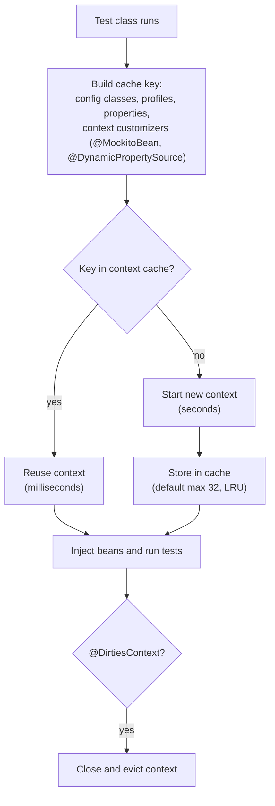
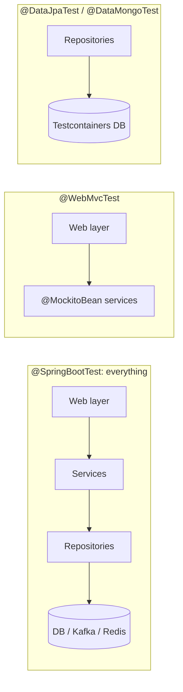

# Spring Boot Test Slices & Integration Tests

!!! abstract "Key takeaways"
    - `@SpringBootTest` starts the **whole application context**; **slices** (`@WebMvcTest`, `@DataJpaTest`, `@DataMongoTest`, `@JsonTest`, `@RestClientTest`, `@GraphQlTest`...) start **only the beans for one layer**, so they are faster and fail more precisely.
    - The **TestContext framework caches contexts** across test classes, keyed by configuration (annotations, properties, profiles, mocked beans). Every distinct `@MockitoBean` set, `@TestPropertySource` or `@DirtiesContext` creates a new context. Context count, not test count, usually decides suite time.
    - `webEnvironment = MOCK` (default) uses MockMvc with no server; `RANDOM_PORT` starts a real embedded server. With a real server, the test's `@Transactional` **does not roll back** the server's work because it runs on another thread.
    - `@DataJpaTest` is `@Transactional` (rolls back each test) and replaces your DataSource with an embedded one unless you say `@AutoConfigureTestDatabase(replace = NONE)`, which you want with Testcontainers.
    - Spring Boot 3.4 replaced `@MockBean` with Spring Framework's `@MockitoBean` and added `MockMvcTester` (AssertJ-style MockMvc). Boot 4.0 removed `@MockBean` and adds `RestTestClient`.

## Why it matters

A unit test proves your logic; it can't prove that Spring wires it the way you think. Typical bugs that only a Spring test catches: a validation annotation that isn't triggered, a `@ControllerAdvice` that maps the wrong status, a security rule that lets an anonymous call through, a JSON property renamed by a Jackson setting, a derived query method that generates the wrong SQL, a `@Transactional` that never applies because of self-invocation.

The opposite failure is just as common: every test class is a `@SpringBootTest` with a different combination of mocks, the suite starts the context 80 times, and the PR build takes 25 minutes. Interviewers ask about slices and context caching to see whether you can get Spring's confidence **and** keep the build fast.

## Core concepts

### The Spring TestContext framework

`@SpringBootTest` and every slice are meta-annotated with `@ExtendWith(SpringExtension.class)`. The extension asks the TestContext framework for an `ApplicationContext` built from the test's configuration, injects `@Autowired` fields into the test instance, and handles `@Transactional` tests (rollback by default), `@Sql` scripts and `@DynamicPropertySource`.


*Notice that anything changing the key (a different mocked bean, an extra property) sends you down the slow branch, and `@DirtiesContext` throws a context away on purpose.*

{ loading=lazy }
*Watch the timer jump only when the configuration differs: the number of distinct contexts, not tests, drives suite time.*

### `@SpringBootTest` web environments

| `webEnvironment` | Server | Client | Typical use |
|---|---|---|---|
| `MOCK` (default) | None; mock servlet environment | `MockMvc` (`@AutoConfigureMockMvc`), `MockMvcTester`, `WebTestClient` | Full context, fast HTTP-level tests |
| `RANDOM_PORT` | Real embedded server on a free port | `TestRestTemplate`, `WebTestClient`, `RestTestClient` (Boot 4) | Filters, real HTTP stack, servlet container behaviour |
| `DEFINED_PORT` | Real server on `server.port` | same | Rarely; port clashes in CI |
| `NONE` | No web environment | n/a | Batch jobs, Kafka consumers, CLI apps |

### Test slices

A slice is a set of auto-configurations plus a component-scan filter. `@WebMvcTest(RefillController.class)` loads that controller, `@ControllerAdvice`, filters, converters, Jackson, validation and Spring Security's web config, but **not** your services or repositories, which you supply as `@MockitoBean`s.

| Slice | Loads | Doesn't load | Notes |
|---|---|---|---|
| `@WebMvcTest` | Controllers, advice, filters, `WebMvcConfigurer`, Jackson, security | `@Service`, `@Repository` | Gives `MockMvc` / `MockMvcTester` |
| `@WebFluxTest` | WebFlux controllers, `WebFilter`s | Services, repositories | Gives `WebTestClient` |
| `@GraphQlTest` | `@Controller` with `@QueryMapping`/`@SchemaMapping`, schema, scalars, instrumentation | Services, data sources | Gives `GraphQlTester` |
| `@DataJpaTest` | Entities, repositories, `EntityManager`, Flyway/Liquibase | Web, services | `@Transactional`, embedded DB by default |
| `@DataMongoTest` | Mongo repositories, `MongoTemplate` | Web, services | Use Testcontainers MongoDB |
| `@DataRedisTest` | Redis repositories, templates | Web, services | |
| `@JdbcTest` / `@DataJdbcTest` | `JdbcTemplate` / Spring Data JDBC | JPA | |
| `@JsonTest` | `ObjectMapper`, `@JsonComponent`, `JacksonTester` | Everything else | Fast serialisation checks |
| `@RestClientTest` | `RestClient`/`RestTemplate` builders, `MockRestServiceServer` | Everything else | Test an HTTP client class |


*Notice each slice cuts the graph at a layer boundary and replaces the other side with mocks or a real container, so a failure points at one layer.*

{ loading=lazy }
*The fewer filled cells, the faster the context starts and the more precisely a failure points at its layer.*

### `@MockitoBean` and the context cache

`@MockitoBean` (Spring Framework 6.2, used by Boot 3.4+) replaces or adds a bean in the context with a Mockito mock and resets it after each test. Because the set of overridden beans is part of the cache key, two test classes that mock different beans can't share a context. Teams fix this by declaring a **shared base class** or a composed annotation with one agreed set of mocks for a slice, or by not mocking at all in integration tests (use WireMock and Testcontainers instead).

### Transactions in tests

- A test method annotated `@Transactional` (or a `@DataJpaTest`) **rolls back** after the test, so the database is clean for the next one.
- Rollback hides **flush-time** errors: constraint violations may never be raised if nothing flushes. Call `entityManager.flush()` (or `saveAndFlush`) before asserting.
- With `RANDOM_PORT`, the HTTP request runs on a server thread in its **own transaction**; the test's transaction can't roll it back. Clean up explicitly (`@Sql` with `executionPhase = AFTER_TEST_METHOD`, truncation, or unique data per test).
- Rollback also hides `@TransactionalEventListener(phase = AFTER_COMMIT)` behaviour, because the commit never happens. Use `TestTransaction.flagForCommit()` / `end()` or a non-transactional test for those.

### Properties, profiles and dynamic config

`@TestPropertySource`, `properties = "..."` on `@SpringBootTest`, `@ActiveProfiles("test")` and `@DynamicPropertySource` (for container URLs known only at runtime) all feed the context. Since Boot 3.1, `@ServiceConnection` on a Testcontainers field replaces most `@DynamicPropertySource` code; see [Testcontainers](04-testcontainers.md).

### Security tests

`spring-security-test` adds `@WithMockUser`, `@WithUserDetails`, and MockMvc request post-processors such as `jwt()` (with claims and authorities), `oidcLogin()` and `csrf()`. Always test the **negative** cases: anonymous gets 401, wrong scope gets 403, and CSRF is enforced where sessions are used. See [resource server configuration](../spring-security-oauth2/07-resource-server-and-client-configuration-in-spring.md).

## In practice: code & configuration

### Controller slice with security and validation

=== "❌ Common mistake"
    ```java
    @SpringBootTest                         // whole app, real DB config, every bean
    @AutoConfigureMockMvc
    class RefillControllerTest {
        @Autowired MockMvc mvc;
        @MockBean RefillService service;    // deprecated since Boot 3.4, removed in 4.0
        @MockBean AuditClient audit;        // a different mock set from every other class:
                                            // this class gets its own context
        @Test
        void createsRefill() throws Exception {
            mvc.perform(post("/refills").content("{\"rxId\":\"rx-1\"}")
                    .contentType(APPLICATION_JSON))
               .andExpect(status().isOk());   // no auth, no negative case, no body check
        }
    }
    ```

=== "✅ Correct approach"
    ```java
    @WebMvcTest(RefillController.class)      // web layer only: controller, advice, Jackson, security
    @Import(SecurityConfig.class)            // our real security rules
    class RefillControllerTest {
        @Autowired MockMvcTester mvc;        // Boot 3.4+: AssertJ-style MockMvc
        @MockitoBean RefillService service;  // the only collaborator of this controller

        @Test
        void createsRefillForMemberWithScope() {
            given(service.create(any())).willReturn(new RefillView("r-1", "PENDING"));

            assertThat(mvc.post().uri("/refills")
                    .with(jwt().authorities(new SimpleGrantedAuthority("SCOPE_refill:write")))
                    .contentType(APPLICATION_JSON)
                    .content("""
                        {"rxId":"rx-1","quantity":30}
                        """))
                .hasStatus(HttpStatus.CREATED)
                .bodyJson().extractingPath("$.status").isEqualTo("PENDING");
        }

        @Test
        void rejectsInvalidQuantityWithProblemDetail() {
            assertThat(mvc.post().uri("/refills")
                    .with(jwt().authorities(new SimpleGrantedAuthority("SCOPE_refill:write")))
                    .contentType(APPLICATION_JSON)
                    .content("{\"rxId\":\"rx-1\",\"quantity\":0}"))
                .hasStatus(HttpStatus.BAD_REQUEST)
                .bodyJson().extractingPath("$.title").isEqualTo("Bad Request");
            then(service).shouldHaveNoInteractions();
        }

        @Test
        void anonymousCallIsUnauthorized() {
            assertThat(mvc.post().uri("/refills").contentType(APPLICATION_JSON).content("{}"))
                .hasStatus(HttpStatus.UNAUTHORIZED);
        }
    }
    ```

### Repository slice against a real database

```java
@DataJpaTest
@AutoConfigureTestDatabase(replace = AutoConfigureTestDatabase.Replace.NONE) // keep our Postgres
@Testcontainers
class RefillRepositoryTest {

    @Container
    @ServiceConnection                                   // Boot 3.1+: wires spring.datasource.*
    static PostgreSQLContainer<?> pg = new PostgreSQLContainer<>("postgres:16-alpine");

    @Autowired RefillRepository repo;
    @Autowired TestEntityManager em;

    @Test
    void findsOnlyPendingRefillsForMemberNewestFirst() {
        em.persist(new Refill("m1", PENDING, Instant.parse("2026-01-02T00:00:00Z")));
        em.persist(new Refill("m1", SHIPPED, Instant.parse("2026-01-03T00:00:00Z")));
        em.persist(new Refill("m1", PENDING, Instant.parse("2026-01-04T00:00:00Z")));
        em.flush();                                      // force SQL now, not at rollback

        assertThat(repo.findByMemberIdAndStatusOrderByCreatedAtDesc("m1", PENDING))
                .extracting(Refill::getCreatedAt)
                .containsExactly(Instant.parse("2026-01-04T00:00:00Z"), Instant.parse("2026-01-02T00:00:00Z"));
    }
}
```

### JSON contract of a DTO

```java
@JsonTest
class RefillViewJsonTest {
    @Autowired JacksonTester<RefillView> json;

    @Test
    void serialisesWithIsoDatesAndNoNulls() throws Exception {
        var view = new RefillView("r-1", "PENDING", LocalDate.of(2026, 1, 15), null);
        assertThat(json.write(view))
            .hasJsonPathStringValue("$.dueDate", "2026-01-15")
            .doesNotHaveJsonPath("$.cancelReason");      // null fields omitted
    }
}
```

### GraphQL controller slice

```java
@GraphQlTest(MemberController.class)
class MemberControllerTest {
    @Autowired GraphQlTester graphQl;
    @MockitoBean MemberService members;

    @Test
    void returnsPartialDataWithErrorWhenClaimsUpstreamFails() {
        given(members.profile("m1")).willReturn(new Profile("m1", "Asha"));
        given(members.claims("m1")).willThrow(new UpstreamUnavailableException("claims"));

        graphQl.document("{ member(id:\"m1\") { name claims { id } } }")
               .execute()
               .errors().satisfy(errs -> assertThat(errs).hasSize(1))
               .path("member.name").entity(String.class).isEqualTo("Asha");
    }
}
```

### A fast full-context component test

```java
@SpringBootTest(webEnvironment = RANDOM_PORT)
@Import(TestcontainersConfig.class)        // shared @ServiceConnection containers: Postgres, Kafka
@AutoConfigureWireMock(port = 0)           // or WireMockExtension: upstreams are HTTP fakes
abstract class ComponentTestBase { }       // one config for all component tests = one cached context

class RefillFlowIT extends ComponentTestBase {
    @Autowired TestRestTemplate http;      // RestTestClient in Boot 4
    @Test
    void refillIsStoredAndEventPublished() { /* call API, assert DB row and Kafka event with Awaitility */ }
}
```

## Real-world usage

- Spring's own guidance (and most large Spring shops) is: **many slices, few `@SpringBootTest`s**, and every `@SpringBootTest` shares one configuration via a base class so the context is started once per suite.
- Teams log context loads (`logging.level.org.springframework.test.context.cache=DEBUG`) to spot classes that create extra contexts, and run suites in parallel forks where each fork has its own cache.
- In healthcare and banking APIs, slice tests are where **authorisation rules** are proven per endpoint: each role and scope, including the denied cases, which auditors and security reviews ask for.
- Kafka listeners are tested with `@SpringBootTest(webEnvironment = NONE)` plus a Testcontainers broker (or `@EmbeddedKafka` for speed); see [Spring Kafka](../kafka/09-spring-kafka.md).

## Trade-offs & production gotchas

| Option | Pros | Cons | Use when |
|---|---|---|---|
| Plain JUnit (no Spring) | Milliseconds | Doesn't test wiring or annotations | Domain logic, services |
| Slice | Seconds, precise failures, real Spring behaviour for one layer | Needs mocks for other layers | Controllers, repositories, JSON, clients |
| `@SpringBootTest` MOCK | Whole wiring, no server | Slow to start, many beans | Component tests through MockMvc |
| `@SpringBootTest` RANDOM_PORT | Real HTTP stack | No test rollback, slower | Filters, servlet behaviour, end-to-end within the service |
| `@EmbeddedKafka` / H2 | No Docker | Behaves differently from production | Quick checks only; prefer Testcontainers |

!!! warning "Gotcha: H2 instead of your real database"
    `@DataJpaTest` replaces the DataSource with an embedded database by default. Native queries, JSONB, locking, sequences and case sensitivity behave differently in H2. Use `replace = NONE` with a Testcontainers Postgres.

!!! warning "Gotcha: `@DirtiesContext` as a fix for leaking state"
    It works by throwing the context away, which costs a full restart each time. Find the state that leaks (a cache, a static, data in a shared database) and reset it instead.

!!! warning "Gotcha: missing beans in a slice"
    `@WebMvcTest` fails with `NoSuchBeanDefinitionException` when the controller depends on something not in the slice, or when your `SecurityFilterChain` config isn't picked up. Add the dependency as `@MockitoBean` or `@Import` the config, rather than switching to `@SpringBootTest`.

!!! question "Interview angle"
    "How would you speed up a slow Spring test suite?" Count contexts first (cache debug logs), unify `@MockitoBean` sets, replace `@SpringBootTest` with slices, remove `@DirtiesContext`, share containers, and split fast and slow tests in the build.

## How this connects to my experience

- **Where I used it:** Not a separate resume bullet. Position it under "Established engineering standards around testing, CI/CD, code quality, and deployment practices" (OptumRx Meteor) and the Spring Boot services listed across roles (GraphQL Consumer Service, Coriolis REST APIs, Metasys user management with Spring Security).
- **Talking points:**
    - `@GraphQlTest` / `GraphQlTester` for the GraphQL Consumer Service schema, partial responses and error mapping. *[confirm: whether GraphQlTester or a full-context approach was used]*
    - Security slice tests for OAuth2/PingFederate-protected APIs: each scope and role, including 401/403 cases. *[confirm]*
    - Repository tests for MongoDB against a real container rather than an embedded Mongo. *[confirm]*
    - Keeping the Spring suite fast: a shared base class for component tests. *[confirm: typical PR build time]*
- **Likely follow-up chain:** "Which slice for a controller?" → "How do you test that a JWT without the right scope gets 403?" (`jwt().authorities(...)`) → "Your suite takes 20 minutes, what do you do?" (context count, mock sets, slices) → "Why not H2?" (behaviour drift, Testcontainers).

## Interview questions

### Fundamentals

??? question "Q1. What is a Spring Boot test slice and why use one?"
    **Answer:** An annotation such as `@WebMvcTest` or `@DataJpaTest` that loads only the auto-configuration and components for one layer. It starts faster than `@SpringBootTest`, tests real Spring behaviour for that layer (mappings, validation, Jackson, queries), and a failure points at that layer. Other layers are provided as `@MockitoBean`s or not loaded.

    **Interviewer listens for:** partial context; speed and precision; mocks for the other layers.

    **Common wrong answer:** "It's a unit test with Spring annotations."

??? question "Q2. What's the difference between `@Mock` and `@MockitoBean`?"
    **Answer:** `@Mock` creates a Mockito mock in a plain JUnit test with no Spring context. `@MockitoBean` replaces (or adds) a bean in the Spring application context with a mock, so everything that injects that bean gets the mock; it's reset after each test. It also changes the context cache key. `@MockitoBean` came in Spring Framework 6.2 / Boot 3.4 and replaces Boot's `@MockBean`.

    **Interviewer listens for:** context vs no context; effect on caching.

    **Common wrong answer:** "They're the same, `@MockBean` just works with Spring."

??? question "Q3. What does `@DataJpaTest` configure by default?"
    **Answer:** JPA entities and repositories, `TestEntityManager`, Flyway/Liquibase migrations, an embedded in-memory database replacing your DataSource, and `@Transactional` on each test so it rolls back. It shows SQL logging by default. With Testcontainers you add `@AutoConfigureTestDatabase(replace = NONE)` so your real database type is used.

    **Interviewer listens for:** embedded DB replacement; transactional rollback.

    **Common wrong answer:** "It starts the whole app with a test database."

### Intermediate

??? question "Q4. How does Spring's test context caching work and what breaks it?"
    **Answer:** The TestContext framework caches each `ApplicationContext` by a key built from the merged configuration: config classes, initialisers, active profiles, property sources, and context customisers such as `@MockitoBean` and `@DynamicPropertySource`. Classes with the same key reuse the context in the same JVM. A different mock set, different properties or profiles, or `@DirtiesContext` creates or discards contexts. The cache is LRU with a default maximum of 32 contexts (`spring.test.context.cache.maxSize`).

    **Interviewer listens for:** key components; `@MockitoBean` and `@DirtiesContext` as cache busters; per-JVM scope.

    **Common wrong answer:** "Each test class starts its own context."

??? question "Q5. Your `@SpringBootTest(webEnvironment = RANDOM_PORT)` test is `@Transactional` but data from one test appears in the next. Why?"
    **Answer:** The HTTP request is handled by the embedded server on a different thread, in a different transaction that commits. The test's transaction only wraps the test thread, so rolling it back does nothing to the server's writes. Clean up explicitly (truncate tables, `@Sql` after each test) or use unique data per test; or use MOCK mode with MockMvc, where the request runs on the test thread.

    **Interviewer listens for:** thread-bound transactions; MOCK vs real server.

    **Common wrong answer:** "`@Transactional` is broken in Spring Boot tests."

??? question "Q6. How do you test that a secured endpoint enforces scopes?"
    **Answer:** In a `@WebMvcTest` that imports the real security configuration, use `spring-security-test`: `.with(jwt().authorities(new SimpleGrantedAuthority("SCOPE_x")))` for the allowed case, a JWT without the scope for 403, no token for 401, and `csrf()` where sessions and CSRF apply. For method security, use `@WithMockUser(roles = ...)` on service tests with `@EnableMethodSecurity` loaded.

    **Interviewer listens for:** the real filter chain; negative cases; JWT post-processor.

    **Common wrong answer:** "Disable security in tests with a test profile."

### Senior

??? question "Q7. A Spring test suite takes 25 minutes. How do you bring it down?"
    **Answer:** Measure first: count context loads (cache DEBUG logs) and the slowest classes. Then: replace `@SpringBootTest` with slices where only one layer is under test; give all component tests one base configuration so they share a context; remove `@DirtiesContext` and fix the leaking state; replace mock-heavy full-context tests with plain unit tests; start containers once per JVM (singleton containers or `@ServiceConnection` in a shared `@TestConfiguration`); move slow suites to the merge build; run forks in parallel. Track suite time as a team metric.

    **Interviewer listens for:** measure first; contexts over tests; concrete levers.

    **Common wrong answer:** "Buy faster CI machines" or "Delete the integration tests."

??? question "Q8. When is `@SpringBootTest` the right tool?"
    **Answer:** For a handful of component tests that prove the whole service is wired: an API call goes through security, validation, the service, the real database and the outgoing Kafka event, with external services faked (WireMock, contract stubs). Also for testing auto-configuration of your own starter. It's the wrong tool for testing one controller, one query or one mapper.

    **Interviewer listens for:** component tests as the purpose; few of them; shared configuration.

    **Common wrong answer:** "Always, because it's closest to production."

### Scenario-based

??? question "Q9. A repository test passes with H2 but the query fails in production on PostgreSQL. What do you change?"
    **Answer:** Stop replacing the database: `@AutoConfigureTestDatabase(replace = NONE)` with a Testcontainers PostgreSQL of the same major version, run the same Flyway/Liquibase migrations, and keep the test. Add a test for the specific dialect feature (JSONB operator, `ILIKE`, locking). Remove H2 from the test classpath so nobody falls back to it.

    **Interviewer listens for:** same engine as production; migrations in tests.

    **Common wrong answer:** "Make the query H2-compatible."

??? question "Q10. A `@TransactionalEventListener(AFTER_COMMIT)` handler is never called in your `@DataJpaTest`. Why, and how do you test it?"
    **Answer:** The test transaction rolls back, so there's no commit and the after-commit phase never fires. Either commit inside the test with `TestTransaction.flagForCommit(); TestTransaction.end();` (and clean up after), or test it in a non-transactional `@SpringBootTest` that calls the service and asserts the listener's effect with Awaitility.

    **Interviewer listens for:** rollback hides commit-time behaviour; `TestTransaction`.

    **Common wrong answer:** "Change the listener to `BEFORE_COMMIT` so the test works."

## Cheat sheet

| Concept | Remember |
|---|---|
| Full context | `@SpringBootTest`; MOCK (default), RANDOM_PORT, DEFINED_PORT, NONE |
| Web slice | `@WebMvcTest(Controller.class)` + `MockMvcTester` (3.4+) |
| GraphQL slice | `@GraphQlTest` + `GraphQlTester` |
| Data slices | `@DataJpaTest`, `@DataMongoTest`, `@DataRedisTest`, `@JdbcTest` |
| Other slices | `@JsonTest` (`JacksonTester`), `@RestClientTest` (`MockRestServiceServer`) |
| Real DB | `@AutoConfigureTestDatabase(replace = NONE)` + Testcontainers |
| Mocks in context | `@MockitoBean` / `@MockitoSpyBean` (Boot 3.4+); changes cache key |
| Cache | Keyed by config; default max 32; `@DirtiesContext` evicts |
| Rollback | Test-thread only; not for RANDOM_PORT server work; hides flush and AFTER_COMMIT |
| Security | `jwt()`, `@WithMockUser`, `csrf()`; test 401 and 403 |
| Boot 4 | `@MockBean` removed; `RestTestClient` |

## Sources
1. [Spring Boot reference: Testing Spring Boot Applications](https://docs.spring.io/spring-boot/reference/testing/spring-boot-applications.html): `@SpringBootTest`, web environments, slices, `MockMvcTester`.
2. [Spring Boot reference: Test auto-configuration annotations](https://docs.spring.io/spring-boot/appendix/test-auto-configuration/index.html): what each slice loads.
3. [Spring Framework reference: Context caching](https://docs.spring.io/spring-framework/reference/testing/testcontext-framework/ctx-management/caching.html): cache key, size limit, `@DirtiesContext`.
4. [Spring Framework reference: Transaction management in tests](https://docs.spring.io/spring-framework/reference/testing/testcontext-framework/tx.html): rollback, `TestTransaction`, server-thread caveat.
5. [Spring Framework reference: `@MockitoBean`](https://docs.spring.io/spring-framework/reference/testing/annotations/integration-spring/annotation-mockitobean.html): bean overriding with Mockito.
6. [Spring Security reference: Testing OAuth 2.0](https://docs.spring.io/spring-security/reference/servlet/test/mockmvc/oauth2.html): `jwt()` and related post-processors.
7. [Spring for GraphQL reference: Testing](https://docs.spring.io/spring-graphql/reference/testing.html): `@GraphQlTest`, `GraphQlTester`.
8. [Spring Boot 4.0 Migration Guide](https://github.com/spring-projects/spring-boot/wiki/Spring-Boot-4.0-Migration-Guide): removal of `@MockBean`/`@SpyBean`, test client changes.
