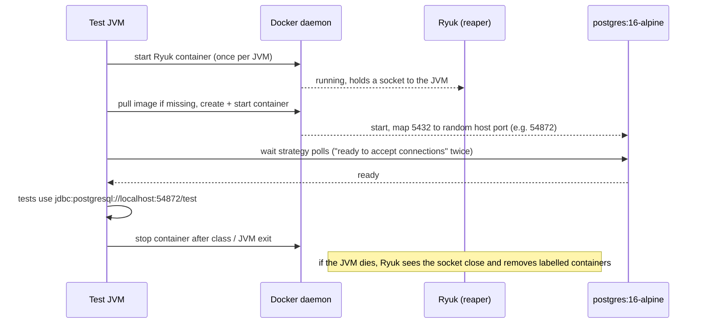
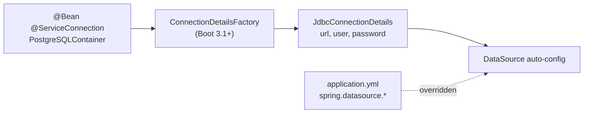

# Testcontainers

!!! abstract "Key takeaways"
    - Testcontainers is a library (Java, Go, .NET, Node, Python...) that **starts real dependencies in Docker containers from test code**, waits until they are ready, exposes them on **random host ports**, and removes them afterwards. It replaces in-memory fakes like H2 and embedded Kafka with the same engine you run in production.
    - Lifecycle choice drives speed: a **`static @Container`** is shared by all tests in a class; the **singleton pattern** (start once in a static initialiser or a shared `@TestConfiguration`) shares it across the whole JVM, so Spring's context cache can also be reused.
    - **Wait strategies** (log message, HTTP health, port listening) prevent "connection refused" flakiness; **Ryuk** (the resource reaper) deletes containers even when the JVM crashes.
    - Spring Boot 3.1+ **`@ServiceConnection`** reads the container's host, port and credentials and creates the connection details beans, so `@DynamicPropertySource` boilerplate goes away. The same containers can back `bootRun`/local dev via `SpringApplication.from(...).with(...)`.
    - Pin image tags to your production versions, keep data isolated per test, and in CI provide a Docker daemon (runner with Docker, DinD, or Testcontainers Cloud). Testcontainers for Java 2.0 renamed modules (`testcontainers-postgresql`) and dropped JUnit 4.

## Why it matters

Before Testcontainers, integration tests had three bad options: an in-memory substitute (H2, embedded Mongo, `@EmbeddedKafka`) that behaves differently from production; a shared test database that everyone's tests fight over; or mocking the repository, which tests nothing about the query. Each hides exactly the bugs integration tests exist to find: dialect-specific SQL, JSONB operators, index-dependent ordering, Mongo aggregation stages, Kafka serialiser and header behaviour, Redis TTL semantics.

Testcontainers made "a real Postgres per test run" cheap: a few seconds to start, isolated, and identical on a laptop and in CI. It is the default answer to "how do you write integration tests for a Spring Boot microservice" in most interviews today, and the base of the honeycomb-shaped strategy from the [test pyramid page](01-test-pyramid-and-testing-strategy-for-microservices.md).

## Core concepts

### What happens when a container starts


*Notice the test never hard-codes a port: the mapped port is only known after start, which is why properties must be supplied dynamically.*

Key pieces:

| Concept | What it does |
|---|---|
| `GenericContainer` / modules | Any image, or typed modules (`PostgreSQLContainer`, `MongoDBContainer`, `KafkaContainer`, `LocalStackContainer`...) with sensible defaults and helpers like `getJdbcUrl()` |
| Port mapping | Container port is mapped to a **random free host port**; read it with `getMappedPort(5432)` / `getHost()` |
| Wait strategies | `Wait.forLogMessage(...)`, `Wait.forHttp("/health")`, `Wait.forListeningPort()`, `Wait.forHealthcheck()`; modules preconfigure the right one |
| Ryuk | A sidecar that removes containers, networks and volumes labelled with the session ID when the test JVM disconnects |
| Networks | `Network.newNetwork()` + `withNetworkAliases("kafka")` for container-to-container traffic |
| Init | `withInitScript`, `withCopyFileToContainer`, `withEnv`, `withCommand` |
| Docker Compose | `ComposeContainer` for a multi-service setup (heavier; prefer individual containers) |

### Lifecycle options

| Style | Starts | Shared by | Trade-off |
|---|---|---|---|
| Instance `@Container` field | Before each test | One test | Fully isolated, slowest |
| `static @Container` field | Once per class | All tests in the class | Common default; a new container per class |
| Singleton (static initialiser or shared config) | Once per JVM | Every test class | Fastest; tests must isolate data themselves |
| Reusable (`withReuse(true)` + `testcontainers.reuse.enable=true`) | Survives across runs | Local dev runs | Very fast locally; never in CI, no Ryuk cleanup |

{ loading=lazy }
*Watch the start-up blocks: per-class containers pay the start cost every class, the singleton pays it once. Timings are illustrative.*

### Spring Boot integration: `@ServiceConnection`

Spring Boot 3.1 added `ConnectionDetails` abstractions (`JdbcConnectionDetails`, `MongoConnectionDetails`, `KafkaConnectionDetails`, `RedisConnectionDetails`...). Annotating a container field or `@Bean` with `@ServiceConnection` makes Boot create those beans from the running container, overriding `spring.datasource.url` and friends. For containers without built-in support, `@DynamicPropertySource` (or, since Boot 3.4, a `DynamicPropertyRegistrar` bean) still works.


*Notice the container becomes the source of truth for connection settings; the YAML values are ignored for that connection in tests.*

The same `@TestConfiguration` can power local development: a `TestApplication` class in `src/test/java` runs `SpringApplication.from(Application::main).with(TestcontainersConfig.class).run(args)`, so `./mvnw spring-boot:test-run` starts the app with Postgres, Kafka and Redis containers and no local installs.

### Data isolation

Sharing a container between tests is fast but means data leaks between them. Options, from simplest:

1. **Unique keys per test** (random member IDs): nothing to clean, works in parallel.
2. **Transactional rollback** in slices (`@DataJpaTest`): automatic but only for same-thread work.
3. **Truncate/delete after each test** (`@Sql`, `mongoTemplate.getDb().drop()`): explicit and reliable.
4. **Database per test class** (create schema/database names dynamically): strong isolation, more setup.

### Kafka, MongoDB, Redis, LocalStack

- **Kafka**: `org.testcontainers.kafka.KafkaContainer` (Apache `apache/kafka` image, KRaft mode, no ZooKeeper) or `ConfluentKafkaContainer` for `confluentinc/cp-kafka`. Use `@ServiceConnection`, produce with `KafkaTemplate`, assert with Awaitility; add a Schema Registry container on a shared network for Avro.
- **MongoDB**: `MongoDBContainer` starts a single-node **replica set**, so multi-document transactions and change streams work (they don't on a standalone).
- **Redis**: `GenericContainer("redis:7-alpine").withExposedPorts(6379)` with `@ServiceConnection(name = "redis")`, or the Redis module.
- **AWS**: `LocalStackContainer` for S3, SQS, SNS, DynamoDB, KMS and Secrets Manager; point the AWS SDK at its endpoint.
- **HTTP upstreams**: the WireMock module, or WireMock in-process; see [contract testing](05-contract-testing.md) for stubs generated from contracts.

### Running in CI

Testcontainers needs a Docker-compatible API. Options: CI runners with Docker installed (GitHub Actions `ubuntu-latest`, GitLab shell or Docker executor), **Docker-in-Docker** service in GitLab CI (`DOCKER_HOST=tcp://docker:2375`, `TESTCONTAINERS_HOST_OVERRIDE=docker`), Podman with its Docker socket, or **Testcontainers Cloud**, which runs containers remotely. Pre-pull or mirror images (Docker Hub rate limits) through an internal registry with `hub.image.name.prefix` or an `ImageNameSubstitutor`.

## In practice: code & configuration

### Shared containers with `@ServiceConnection`

=== "❌ Common mistake"
    ```java
    @SpringBootTest
    @Testcontainers
    class RefillIT {
        @Container   // not static: a new Postgres for every test method
        PostgreSQLContainer<?> pg = new PostgreSQLContainer<>("postgres:latest");   // floating tag

        @DynamicPropertySource   // instance field + new container each time = context can't be cached
        static void props(DynamicPropertyRegistry r) { /* ... */ }

        @Test
        void savesRefill() throws Exception {
            // ...
            Thread.sleep(5000);                    // "wait for the consumer"
            assertThat(repo.count()).isEqualTo(1); // depends on what other tests left behind
        }
    }
    ```

=== "✅ Correct approach"
    ```java
    // One configuration, imported by every integration test: containers start once per JVM.
    @TestConfiguration(proxyBeanMethods = false)
    public class TestcontainersConfig {

        @Bean @ServiceConnection
        PostgreSQLContainer<?> postgres() {
            return new PostgreSQLContainer<>("postgres:16.4-alpine");      // pinned, matches prod major
        }

        @Bean @ServiceConnection
        KafkaContainer kafka() {                                            // org.testcontainers.kafka
            return new KafkaContainer("apache/kafka:3.8.0");                // KRaft, no ZooKeeper
        }

        @Bean @ServiceConnection
        MongoDBContainer mongo() {
            return new MongoDBContainer("mongo:7.0");                       // single-node replica set
        }

        @Bean @ServiceConnection(name = "redis")
        GenericContainer<?> redis() {
            return new GenericContainer<>("redis:7.2-alpine").withExposedPorts(6379);
        }
    }

    @SpringBootTest
    @Import(TestcontainersConfig.class)    // same config everywhere = one cached context
    class RefillIT {
        @Autowired RefillApi api;
        @Autowired RefillRepository repo;

        @Test
        void refillIsPersistedAndEventConsumed() {
            var memberId = "m-" + UUID.randomUUID();                       // data isolation
            api.create(memberId, "rx-1");

            await().atMost(Duration.ofSeconds(10))                          // poll, don't sleep
                   .untilAsserted(() -> assertThat(repo.findByMemberId(memberId))
                           .singleElement()
                           .extracting(Refill::getStatus).isEqualTo(PRICED));
        }
    }
    ```

{ loading=lazy }
*The embedded setup is a different engine wearing the same interface, so it only catches bugs in the parts both engines share.*

### Kafka DLQ test with a real broker

```java
@SpringBootTest(webEnvironment = SpringBootTest.WebEnvironment.NONE)
@Import(TestcontainersConfig.class)
class RefillConsumerDlqIT {
    @Autowired KafkaTemplate<String, String> kafka;
    @Autowired ConsumerFactory<String, String> cf;

    @Test
    void poisonMessageGoesToDlqWithOriginalHeaders() {
        kafka.send("refill-requested", "m1", "{not-json");                  // can't be deserialised

        try (var consumer = cf.createConsumer("dlq-check-" + UUID.randomUUID(), null)) {
            consumer.subscribe(List.of("refill-requested.DLT"));
            var record = KafkaTestUtils.getSingleRecord(consumer, "refill-requested.DLT", Duration.ofSeconds(15));
            assertThat(record.key()).isEqualTo("m1");
            assertThat(record.headers().lastHeader("kafka_dlt-exception-fqcn")).isNotNull();
        }
    }
}
```

### Local dev with the same containers

```java
// src/test/java: run with ./mvnw spring-boot:test-run or ./gradlew bootTestRun
public class TestRefillApplication {
    public static void main(String[] args) {
        SpringApplication.from(RefillApplication::main)
                .with(TestcontainersConfig.class)
                .run(args);
    }
}
```

### GitLab CI with Docker-in-Docker

```yaml
integration-tests:
  image: eclipse-temurin:21-jdk
  services:
    - name: docker:27-dind
      alias: docker
  variables:
    DOCKER_HOST: tcp://docker:2375
    DOCKER_TLS_CERTDIR: ""
    TESTCONTAINERS_HOST_OVERRIDE: docker   # containers are reached via the dind host, not localhost
  script:
    - ./mvnw -B verify                      # Failsafe runs *IT classes
```

## Real-world usage

- **Spring Boot** made Testcontainers first-class (`spring-boot-testcontainers`, `@ServiceConnection`, dev-time services), and Spring Initializr offers it as a dependency. Docker acquired AtomicJar, the company behind Testcontainers, in 2023.
- Teams commonly replace H2, embedded Mongo (Flapdoodle) and `@EmbeddedKafka` with containers after a production bug that the in-memory version couldn't reproduce.
- **LocalStack** + Testcontainers is a common way to test S3/SQS/DynamoDB/KMS code paths without AWS accounts, which matters in regulated environments where test accounts are restricted.
- Failure modes seen in practice: Docker Hub rate limits in CI, slow pulls of large images, port exhaustion when every class starts its own containers, and CI runners without Docker (Kubernetes runners need DinD, a remote Docker host or Testcontainers Cloud).

## Trade-offs & production gotchas

| Option | Pros | Cons | Use when |
|---|---|---|---|
| In-memory (H2, embedded) | No Docker, fast | Different engine; misses dialect, transactions, broker semantics | Throwaway prototypes only |
| Testcontainers per class | Isolated, simple | Repeated start costs | Few test classes |
| Testcontainers singleton | Fast, context reuse | Needs data isolation discipline | Most service suites |
| Reusable containers | Near-instant locally | Not cleaned up; unsafe in CI | Local inner loop |
| Shared remote test DB | No Docker needed | Shared state, flaky, can't run in parallel | Avoid |
| Docker Compose in tests | Mirrors a multi-service setup | Slow, heavy, coupled | Rarely; a few E2E-ish tests |

!!! warning "Gotcha: `latest` tags"
    A floating tag means the test database changes under you. Pin the image (`postgres:16.4-alpine`) to the production major version and update it deliberately, e.g. with Renovate.

!!! warning "Gotcha: `localhost` inside Docker-in-Docker"
    In DinD, mapped ports live on the `docker` service host, not on the job container's localhost. Set `TESTCONTAINERS_HOST_OVERRIDE` (or rely on `getHost()`), and never hard-code `localhost`.

!!! warning "Gotcha: parallel tests on one container"
    Singleton containers plus parallel test execution share one database. Use unique keys or a schema per fork, or tests will see each other's data intermittently.

!!! question "Interview angle"
    "Why not H2?" is the classic opener. Give one concrete query that behaves differently, then explain how you keep containers fast (singleton, `@ServiceConnection`, shared config for context caching) and how they run in CI.

## How this connects to my experience

- **Where I used it:** No direct resume bullet; position as transferable knowledge tied to the stack I used: MongoDB, Redis and Kafka on OptumRx Meteor; RDS/PostgreSQL, DynamoDB, SQS/SNS and Liquibase migrations at Deloitte; GitLab CI/CD at Coriolis.
- **Talking points:**
    - How I'd test the Kafka retry/DLQ workflows from Meteor against a real broker (poison message, retry exhaustion, duplicates). *[confirm: whether the team used Testcontainers, embedded Kafka or a shared environment]*
    - Running Liquibase migrations in a Postgres container in CI so every migration is tested before it reaches RDS. *[confirm]*
    - LocalStack for SQS/SNS/S3 paths in the ConvergeHealth services. *[confirm: whether this was used or code was tested against dev AWS accounts]*
- **Likely follow-up chain:** "How did you test Kafka consumers?" → "Why a real broker?" (serialisers, headers, DLQ routing, offsets) → "How did you keep it fast in CI?" (singleton containers, one context) → "How did CI get a Docker daemon?" (DinD or runner with Docker). If the honest answer is "we used an embedded broker", say so and explain what you'd change.

## Interview questions

### Fundamentals

??? question "Q1. What is Testcontainers and what problem does it solve?"
    **Answer:** A library that starts real dependencies (databases, brokers, caches, cloud emulators) in Docker containers from test code, waits until they're ready, exposes them on random ports and cleans them up. It solves the fidelity gap of in-memory substitutes and the shared-state problem of shared test environments: tests run against the same engine and version as production, isolated per run, on any machine with Docker.

    **Interviewer listens for:** fidelity, isolation, disposability.

    **Common wrong answer:** "It's a way to run the app in Docker for deployment."

??? question "Q2. Why does Testcontainers use random ports, and how does Spring find them?"
    **Answer:** Random host ports avoid clashes between parallel builds and with services already running on the machine. The port is only known after the container starts, so configuration is supplied dynamically: `@ServiceConnection` (Boot 3.1+) creates connection-details beans from the container, or `@DynamicPropertySource` registers properties like `spring.datasource.url` from `getJdbcUrl()`.

    **Interviewer listens for:** dynamic configuration; `@ServiceConnection`.

    **Common wrong answer:** "You configure the port in `application-test.yml`."

??? question "Q3. What is Ryuk?"
    **Answer:** The resource reaper: a small container Testcontainers starts once per session. It keeps a connection to the test JVM and, when that connection closes (including crashes), removes all containers, networks and volumes labelled with that session. It prevents leaked containers on CI agents. It can be disabled (`TESTCONTAINERS_RYUK_DISABLED=true`) in environments that clean up themselves, but then leaks are your problem.

    **Interviewer listens for:** cleanup on crash; session labels.

    **Common wrong answer:** "A Kafka module."

### Intermediate

??? question "Q4. Per-class, singleton or reusable containers: how do you choose?"
    **Answer:** `static @Container` per class is simple and isolated but repeats start-up per class. A singleton (started once per JVM, often via a shared `@TestConfiguration` with `@ServiceConnection` beans) is fastest and lets Spring reuse one cached context; tests must isolate data. Reusable containers survive between runs for a fast local loop but aren't cleaned up, so they're off in CI. Most service suites use singletons plus unique test data.

    **Interviewer listens for:** start cost vs isolation; interaction with context caching.

    **Common wrong answer:** "Always a new container per test for isolation."

??? question "Q5. How do you avoid flaky Testcontainers tests?"
    **Answer:** Use the module's wait strategy (or a proper one: log message, HTTP health, healthcheck) so tests start only when the service is ready; never hard-code ports or `localhost`; poll for async outcomes with Awaitility instead of sleeping; isolate data with unique keys; pin images; size CI runners for the number of containers; and mirror images to avoid registry rate limits.

    **Interviewer listens for:** wait strategies, Awaitility, data isolation, pinned images.

    **Common wrong answer:** "Add retries to the tests."

??? question "Q6. Why does `MongoDBContainer` start a replica set?"
    **Answer:** Multi-document transactions and change streams only work on a replica set (or sharded cluster), not on a standalone `mongod`. The module initialises a single-node replica set so code using `@Transactional` with `MongoTransactionManager` or change streams can be tested as in production.

    **Interviewer listens for:** transactions need replica sets.

    **Common wrong answer:** "For high availability in tests."

### Senior

??? question "Q7. How would you run Testcontainers in a Kubernetes-based CI where pods have no Docker?"
    **Answer:** Options: a Docker-in-Docker sidecar (privileged, `DOCKER_HOST=tcp://localhost:2375`), a remote Docker host shared by the runners, rootless Podman/Kaniko-style daemons where policy allows, or Testcontainers Cloud, which runs containers remotely and needs only an agent. Weigh security (privileged pods), cost and speed; mirror images internally and set `hub.image.name.prefix` so pulls go to your registry.

    **Interviewer listens for:** DinD trade-offs, remote Docker, image mirroring.

    **Common wrong answer:** "You can't, so use H2 in CI."

??? question "Q8. How do Testcontainers and the Spring context cache interact?"
    **Answer:** If each test class declares its own container and registers properties via `@DynamicPropertySource`, each class has different property values (different ports), so the cache key differs and Spring starts a new context per class. Declaring containers once (shared configuration with `@ServiceConnection` beans, or static singletons) gives every class the same configuration, so one context is reused across the suite. That often halves suite time.

    **Interviewer listens for:** dynamic properties as part of the cache key; shared config.

    **Common wrong answer:** "They're unrelated."

### Scenario-based

??? question "Q9. A query works in your H2-based tests but fails in production PostgreSQL. Walk through the fix."
    **Answer:** Reproduce with a Testcontainers PostgreSQL of the production major version, using `@DataJpaTest` with `@AutoConfigureTestDatabase(replace = NONE)` and the real Flyway/Liquibase migrations. Write a failing test for the query, fix it, keep the test. Remove H2 from test dependencies, add the container config to a shared base, and check other native queries for the same issue.

    **Interviewer listens for:** reproduce first; same engine; migrations; prevent recurrence.

    **Common wrong answer:** "Switch H2 to PostgreSQL compatibility mode."

??? question "Q10. Integration tests take 12 minutes, mostly starting containers. What do you do?"
    **Answer:** Measure container and context start counts. Move to singleton containers via one shared configuration so they start once per JVM; make every integration test use the same Spring configuration so the context is cached; drop unused containers per test; use smaller images (alpine variants); pre-pull or cache images in CI; parallelise with forks where each fork has its own containers and isolated data; and enable reuse locally only.

    **Interviewer listens for:** start counts, singletons, context caching, image pulls.

    **Common wrong answer:** "Switch back to embedded databases."

## Cheat sheet

| Concept | Remember |
|---|---|
| What | Real dependencies in disposable Docker containers, from test code |
| Ports | Random host port; `getMappedPort`, `getHost` |
| Readiness | Wait strategies: log, HTTP, port, healthcheck |
| Cleanup | Ryuk removes labelled resources when the JVM disconnects |
| Lifecycle | Instance < static per class < singleton per JVM < reusable (local only) |
| Spring | `@ServiceConnection` (Boot 3.1+); `@DynamicPropertySource` otherwise |
| Dev time | `SpringApplication.from(App::main).with(Config.class)` |
| Kafka | `KafkaContainer` (apache/kafka, KRaft) or `ConfluentKafkaContainer` |
| Mongo | Single-node replica set: transactions work |
| CI | Docker on runner, DinD + `TESTCONTAINERS_HOST_OVERRIDE`, or Testcontainers Cloud |
| Hygiene | Pin images, unique test data, Awaitility not sleep |
| 2.0 | Modules renamed `testcontainers-*`; JUnit 4 support removed |

## Sources
1. [Testcontainers for Java documentation](https://java.testcontainers.org/): containers, wait strategies, networking, lifecycle, Ryuk, reuse.
2. [Testcontainers: Singleton containers](https://java.testcontainers.org/test_framework_integration/manual_lifecycle_control/): sharing containers across classes.
3. [Spring Boot reference: Testcontainers](https://docs.spring.io/spring-boot/reference/testing/testcontainers.html): `@ServiceConnection`, dynamic properties, dev-time services.
4. [Testcontainers Kafka module](https://java.testcontainers.org/modules/kafka/): `KafkaContainer` for apache/kafka and `ConfluentKafkaContainer`.
5. [Testcontainers MongoDB module](https://java.testcontainers.org/modules/databases/mongodb/): replica-set behaviour.
6. [Testcontainers: Continuous integration (Docker-in-Docker, GitLab)](https://java.testcontainers.org/supported_docker_environment/continuous_integration/gitlab_ci/): CI configuration and host override.
7. [OpenRewrite: Migrate to testcontainers-java 2.x](https://docs.openrewrite.org/recipes/java/testing/testcontainers/testcontainers2migration): 2.0 module and package renames.
8. [Docker press release: Docker acquires AtomicJar (2023)](https://www.docker.com/press-release/docker-acquires-atomicjar/): company background.
9. [Spring Kafka reference: Testing](https://docs.spring.io/spring-kafka/reference/testing.html): `KafkaTestUtils`, DLT headers.
