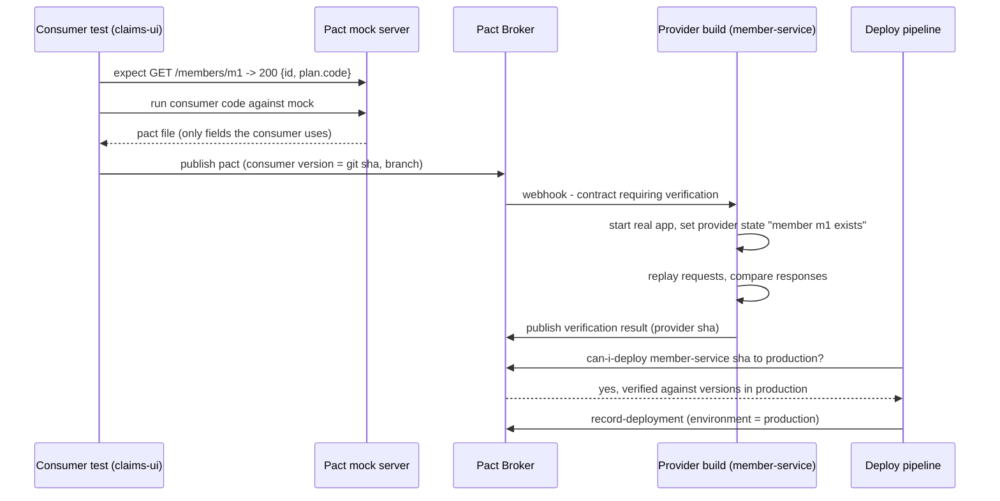
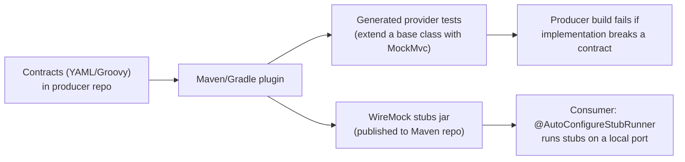
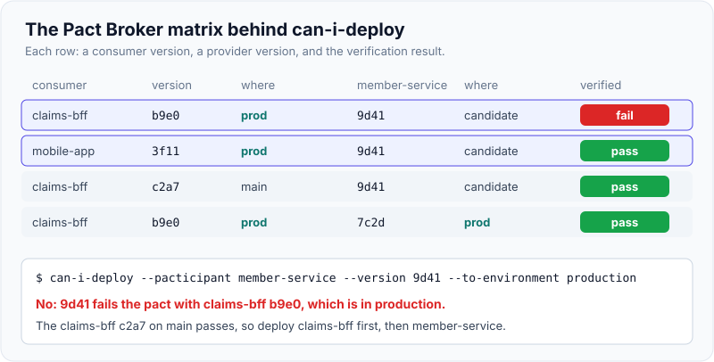

# Contract Testing (Spring Cloud Contract, Pact)

!!! abstract "Key takeaways"
    - A **contract test** checks that a consumer and a provider agree on the **shape of their interactions** (request, response, message), each tested **in isolation** against the contract instead of against each other in a shared environment.
    - **Consumer-driven contracts (CDC)**: each consumer records *only the fields and behaviour it actually uses*; the provider verifies every consumer's contract in its build. The provider can change anything no consumer relies on.
    - **Pact** is consumer-first and language-neutral: consumer tests run against a Pact mock server and produce a pact file; the **Pact Broker / PactFlow** stores it; the provider replays it against the real app using **provider states**; **`can-i-deploy`** checks the compatibility matrix before each deployment.
    - **Spring Cloud Contract** is provider-first and JVM-centred: contracts (Groovy/YAML) live with the producer, which **generates provider tests and WireMock stubs**; consumers run those stubs with the **Stub Runner**.
    - Contracts test **compatibility, not business logic**. Use type matchers, not exact values; keep provider states small; and for event streams, combine message contracts with **schema registry compatibility** rules (Avro/Protobuf).

## Why it matters

In a microservice estate, the classic way to prove that services work together is a shared integration or staging environment with an end-to-end suite. It scales badly: every team's release waits for a green run, one broken service blocks everyone, test data collides, and failures point at "the journey" rather than at the change that broke it. Worse, it finds incompatibilities late, after both sides have merged.

Contract tests move that check **left and apart**: the consumer finds out in its own build what it needs from the provider, and the provider finds out in *its* build, before merging, that a change would break a consumer. Combined with component tests ([Spring Boot slices](03-spring-boot-test-slices-and-integration-tests.md), [Testcontainers](04-testcontainers.md)), they let a team deploy one service without running every other service. Interviewers ask about them because they are the honest answer to "how do you deploy microservices independently?"

## Core concepts

### What a contract is (and isn't)

A contract describes interactions: "when I send `GET /members/m1` with header X, I expect 200 with a JSON body that has `id` (string) and `plan.code` (string)". It is **not**:

- a full API specification (that's OpenAPI or a GraphQL schema),
- a functional test of the provider's logic (that's the provider's own unit and component tests),
- a performance or security test.

The value comes from **Postel's law / the tolerant reader**: consumers only depend on what they use, so the provider is free to add fields and change everything else.

### Consumer-driven vs provider-driven

| | Consumer-driven (Pact) | Provider-driven (Spring Cloud Contract, typically) |
|---|---|---|
| Who writes the contract | Each consumer, from its tests | Provider team (often with consumers via PRs) |
| Where it lives | Pact Broker / PactFlow | Provider repo, stubs published as a jar |
| Captures | Exactly what each consumer uses | What the provider promises |
| Languages | Many (JVM, JS/TS, Go, .NET, Python...) | JVM-first (stubs usable by others via Docker) |
| Main risk | Consumers need to write good tests | Contracts may include fields nobody uses |

### The Pact workflow


*Notice the two services never run together: the broker joins their independent results into a matrix, and `can-i-deploy` reads that matrix before any release.*

Key Pact features:

- **Matchers**: `like()`, `eachLike()`, `term()/regex`, `integerType()` check type and shape, not exact values, so provider data can differ.
- **Provider states**: a named precondition ("member m1 exists with plan GOLD") that the provider test sets up with a `@State` method, usually by seeding a repository or stubbing a downstream.
- **Versions, branches, environments**: each pact and verification is tied to a git SHA and branch; `record-deployment` tells the broker what's in each environment.
- **`can-i-deploy`**: asks "is this version of me compatible with the versions of my integration partners in the target environment?" It's the gate that replaces most of the shared-environment E2E suite.
- **Pending and WIP pacts**: a new consumer expectation doesn't fail the provider's main build until it has been verified once, so consumers can't break providers' pipelines by publishing early.
- **Message pacts**: for async interactions (Kafka, SQS), the consumer declares the message it expects; the provider verifies that the code that *produces* the message builds a matching one. No broker is needed in either test.

{ loading=lazy }
*Watch where the red appears: the contract moves the failure from a shared environment days later to the provider's own pull request.*

### Spring Cloud Contract


*Notice one source file produces both sides: tests that keep the producer honest and stubs the consumer uses, so the stub can't drift from what the producer actually does.*

The producer writes contracts, the plugin generates JUnit tests that call the real controllers (through a base class you write to set up mocks of the service layer), and packages WireMock stub mappings as a `-stubs.jar`. Consumers pull that jar with `@AutoConfigureStubRunner(ids = "com.acme:member-service:+:stubs:8090")` and test their client against it. For messaging, contracts declare `outputMessage` and Stub Runner can trigger messages on Kafka or Spring Cloud Stream. Consumer-driven use is possible by having consumers raise PRs with contracts into the producer repo.

### Contracts vs schema checks

| Technique | Catches | Misses |
|---|---|---|
| OpenAPI diff in CI (`oasdiff`, `openapi-diff`) | Removed or retyped fields, endpoints | Whether a consumer uses them; semantics |
| GraphQL schema checks (field usage from operation registry) | Breaking schema changes vs real client operations | Resolver behaviour |
| Avro/Protobuf + Schema Registry compatibility (BACKWARD, FORWARD, FULL) | Incompatible event schema evolution | Semantics, which topic/key; headers |
| Consumer-driven contracts | Exactly what consumers use, with status codes and examples | Anything outside the recorded interactions |
| Bi-directional (PactFlow) | Consumer pact vs provider's OpenAPI, no provider replay | Implementation not matching its own OpenAPI unless that is tested |

GraphQL is a good fit for schema-usage checks because clients send explicit operations: if no registered operation uses a field, removing it is safe. See the [Kafka schema page](../kafka/10-schema-management-avro-protobuf-schema-registry-compatibilit.md) for event schemas.

## In practice: code & configuration

### Pact consumer test (JUnit 5, Java)

=== "❌ Common mistake"
    ```java
    // Hand-written stub of another team's API: encodes my guess, never checked by them.
    @Test
    void showsPlan() {
        wireMock.stubFor(get("/members/m1").willReturn(okJson("""
            {"id":"m1","planCode":"GOLD"}            // provider actually returns plan.code
            """)));
        assertThat(client.member("m1").planCode()).isEqualTo("GOLD");  // green, and wrong
    }
    ```

=== "✅ Correct approach"
    ```java
    @ExtendWith(PactConsumerTestExt.class)
    @PactTestFor(providerName = "member-service")
    class MemberClientPactTest {

        @Pact(consumer = "claims-bff")
        V4Pact memberWithPlan(PactDslWithProvider builder) {
            return builder
                .given("member m1 exists with plan GOLD")               // provider state
                .uponReceiving("get member m1")
                    .path("/members/m1").method("GET")
                    .headers("Accept", "application/json")
                .willRespondWith()
                    .status(200)
                    .body(newJsonBody(b -> {
                        b.stringType("id", "m1");                         // type match, example value
                        b.object("plan", p -> p.stringMatcher("code", "[A-Z]+", "GOLD"));
                    }).build())                                           // only fields we use
                .toPact(V4Pact.class);
        }

        @Test
        void readsPlanCode(MockServer mock) {
            var client = new MemberClient(RestClient.create(mock.getUrl()));
            assertThat(client.member("m1").planCode()).isEqualTo("GOLD");
        }
    }
    ```

### Pact provider verification (Spring Boot)

```java
@Provider("member-service")
@PactBroker                                     // url and auth from pactbroker.* properties
@SpringBootTest(webEnvironment = RANDOM_PORT)
class MemberServicePactVerificationTest {
    @LocalServerPort int port;
    @MockitoBean MemberRepository members;     // provider states seed this

    @BeforeEach
    void target(PactVerificationContext ctx) { ctx.setTarget(new HttpTestTarget("localhost", port)); }

    @TestTemplate
    @ExtendWith(PactVerificationInvocationContextProvider.class)
    void verify(PactVerificationContext ctx) { ctx.verifyInteraction(); }

    @State("member m1 exists with plan GOLD")
    void memberExists() {
        given(members.findById("m1")).willReturn(Optional.of(new Member("m1", new Plan("GOLD"))));
    }
}
```

### Pipeline gate

```bash
# consumer build: publish the pact tagged with the commit and branch
pact-broker publish target/pacts --consumer-app-version "$GIT_SHA" --branch "$GIT_BRANCH"

# any service, before deploying to an environment
pact-broker can-i-deploy --pacticipant member-service --version "$GIT_SHA" --to-environment production

# after a successful deployment
pact-broker record-deployment --pacticipant member-service --version "$GIT_SHA" --environment production
```

{ loading=lazy }
*`can-i-deploy` only cares about the versions actually deployed: deploy the consumer that already passes first, then the provider.*

### Spring Cloud Contract: one contract, two outputs

```yaml
# producer repo: src/test/resources/contracts/member/shouldReturnMember.yml
request:
  method: GET
  url: /members/m1
  headers: { Accept: application/json }
response:
  status: 200
  headers: { Content-Type: application/json }
  body: { id: "m1", plan: { code: "GOLD" } }
  matchers:
    body:
      - path: $.plan.code
        type: by_regex
        value: "[A-Z]+"
```

```java
// consumer side: run the producer's published stubs on port 8090
@SpringBootTest
@AutoConfigureStubRunner(ids = "com.acme:member-service:+:stubs:8090",
                         stubsMode = StubRunnerProperties.StubsMode.REMOTE)
class MemberClientStubTest { /* client points at http://localhost:8090 */ }
```

## Real-world usage

- **Pact** originated at realestate.com.au (2013) and is widely used where many languages coexist (TypeScript frontends and BFFs, JVM services). PactFlow (SmartBear) offers a hosted broker and bi-directional contracts against OpenAPI.
- **Spring Cloud Contract** is common in all-Spring organisations, notably in banking, where the producer-owned contract fits API governance and stubs are versioned in an artifact repository.
- Teams usually start with the **highest-churn, most-consumed** APIs (for example a member or account service used by web, mobile and partner channels), not with every interaction at once.
- Common failure modes: contracts with exact values that break on harmless data changes; provider states that rebuild half the database; consumers publishing pacts that aren't tied to versions, so `can-i-deploy` can't answer; teams adopting contracts but keeping the slow shared E2E gate anyway.

## Trade-offs & production gotchas

| Option | Pros | Cons | Use when |
|---|---|---|---|
| Pact (CDC) | Captures real usage, polyglot, `can-i-deploy` | Broker to run, consumers must write tests | Many consumers, mixed languages |
| Spring Cloud Contract | One source for tests and stubs, JVM-native | Provider-centric, JVM-first | Spring estate, provider-owned API governance |
| Bi-directional (OpenAPI) | Little provider effort | Trusts that the OpenAPI matches the implementation | Third-party or legacy providers |
| Schema checks only | Cheap, automatic | Don't know who uses what | Baseline for every API and event |
| Shared E2E environment | Realistic | Slow, flaky, couples releases | A few critical journeys only |

!!! warning "Gotcha: contracts that test business logic"
    "When I send amount 100 I get discount 15" belongs in the provider's unit tests. Contracts that encode business rules break on every rule change and make providers hate contract testing.

!!! warning "Gotcha: no `can-i-deploy`"
    Publishing pacts and verifying them without checking the matrix at deploy time leaves the main benefit unused: a provider can still deploy a version that fails a consumer currently in production.

!!! warning "Gotcha: hand-written stubs drift"
    WireMock or Mockito stubs written by the consumer encode a guess. Either generate them from contracts (Spring Cloud Contract stubs) or verify them (Pact).

!!! question "Interview angle"
    "How do you know a change to service A won't break service B?" Answer: contracts verified in A's build, `can-i-deploy` against what's in production, schema compatibility for events, plus a few smoke journeys after deploy.

## How this connects to my experience

- **Where I used it:** No direct resume bullet. The closest context is OptumRx Meteor: the GraphQL Consumer Service is "the integration layer between 5 upstream systems and multiple downstream consumers", which is the exact situation contracts address on both sides; plus the micro-frontend architecture consuming it.
- **Talking points:**
    - Upstream side: how changes in the 5 upstream APIs were detected (contracts, OpenAPI diffs, shared environment, or production incidents). *[confirm]*
    - Downstream side: GraphQL schema evolution with deprecation (`@deprecated`) and checking field usage before removal. *[confirm: whether operation usage was tracked]*
    - Kafka events: schema compatibility rules for events consumed by other teams. *[confirm: whether a schema registry was used]*
    - What I'd introduce: consumer pacts for the highest-churn upstream first, with `can-i-deploy` in the GitLab pipeline. Present this as a proposal, not past work, unless confirmed.
- **Likely follow-up chain:** "How did you test integration with five upstreams?" → "What happened when an upstream changed a field?" → "How would contracts have helped?" → "Pact or Spring Cloud Contract, and why?" (polyglot frontends and BFF point to Pact; all-Spring providers could use SCC).

## Interview questions

### Fundamentals

??? question "Q1. What is a contract test and how is it different from an integration test?"
    **Answer:** A contract test checks that a consumer and provider agree on the format of their interactions, with each side tested in isolation against a shared contract: the consumer against a mock generated from it, the provider by replaying it against the real service. An integration test runs the components together. Contract tests are faster, more stable and point at the side that broke, but they don't prove business behaviour.

    **Interviewer listens for:** isolation of each side; compatibility not functionality.

    **Common wrong answer:** "It's an integration test with a mock server."

??? question "Q2. What does 'consumer-driven' mean?"
    **Answer:** The consumers define the contract from what they actually use. The provider verifies all consumers' contracts and knows exactly which fields and endpoints are in use, so it can change or remove anything else safely. It reverses the usual flow where the provider publishes an API and hopes nobody depends on undocumented details.

    **Interviewer listens for:** only used fields; provider freedom.

    **Common wrong answer:** "The consumer team writes the provider's tests."

??? question "Q3. What are Pact provider states?"
    **Answer:** Named preconditions attached to an interaction, such as "member m1 exists with plan GOLD". During verification the provider runs a matching `@State` method to set up that data (seed a repository, stub a downstream) before replaying the request. They keep contracts independent of whatever data happens to be in a database.

    **Interviewer listens for:** setup per interaction; independence from shared data.

    **Common wrong answer:** "The HTTP status the provider returns."

### Intermediate

??? question "Q4. What does `can-i-deploy` do and why is it important?"
    **Answer:** It queries the Pact Broker's matrix of consumer and provider versions and verification results, and answers whether a given version of an application is compatible with the versions of its integration partners recorded in the target environment (via `record-deployment`). It's the deploy-time gate; without it, verification results exist but nothing stops an incompatible release.

    **Interviewer listens for:** matrix; environments; used in the pipeline.

    **Common wrong answer:** "It runs the provider tests."

??? question "Q5. Pact vs Spring Cloud Contract: how do you choose?"
    **Answer:** Pact is consumer-driven and polyglot, with a broker and `can-i-deploy`; good when consumers are in different languages (a React/TS BFF and Java services) and many consumers exist. Spring Cloud Contract is provider-owned, JVM-centric, generates provider tests and WireMock stubs from one contract; good in all-Spring estates and where providers govern their APIs. Both can be used consumer-driven with process.

    **Interviewer listens for:** ownership, language mix, broker features.

    **Common wrong answer:** "Spring Cloud Contract because we use Spring" without considering consumers.

??? question "Q6. How do you contract-test Kafka events?"
    **Answer:** Use message contracts: the consumer declares the message it expects (Pact message pact or an SCC `outputMessage`), and the provider verifies that its producing code creates a matching message, without a broker. Add schema registry compatibility checks (e.g. BACKWARD) for Avro/Protobuf so incompatible schema changes are rejected at registration. Test the actual Kafka wiring separately with Testcontainers.

    **Interviewer listens for:** message contracts plus schema compatibility; no broker needed.

    **Common wrong answer:** "Start Kafka and both services and check the consumer processes the event."

### Senior

??? question "Q7. How would you introduce contract testing in an organisation with a slow shared E2E environment?"
    **Answer:** Start with one high-churn provider and its most important consumers; set up a broker; write consumer tests with matchers and minimal provider states; add provider verification to the provider's PR build with pending pacts; add `can-i-deploy` and `record-deployment` to pipelines. Once a few integrations are covered, retire the E2E tests that only checked those interactions and keep a handful of journeys. Measure lead time and escaped integration bugs to justify expansion.

    **Interviewer listens for:** incremental adoption, pipeline gates, removing redundant E2E.

    **Common wrong answer:** "Mandate contracts for every API next sprint."

??? question "Q8. What are the limits of contract testing?"
    **Answer:** It only covers the interactions recorded; it doesn't test business logic, performance, security, or semantics (a field with the right type but wrong meaning); and it depends on consumers writing good tests. Over-specified contracts become brittle. You still need provider component tests, a few E2E journeys and production monitoring.

    **Interviewer listens for:** honesty about gaps; layered strategy.

    **Common wrong answer:** "Contracts replace all integration and E2E tests."

### Scenario-based

??? question "Q9. A provider wants to rename a field that three consumers use. How do contracts help, and what's the process?"
    **Answer:** Provider verification shows which consumers use the field. Do an expand-and-contract change: add the new field alongside the old, deploy; consumers switch to the new field and publish new pacts; once the broker shows no consumer version in production uses the old field (`can-i-deploy` passes without it), remove it. For GraphQL, mark the old field `@deprecated` and track operation usage.

    **Interviewer listens for:** expand and contract; broker data to decide removal.

    **Common wrong answer:** "Rename it and tell the consumers to update."

??? question "Q10. Your GraphQL service sits between 5 upstreams and several frontends. Where would you put contracts?"
    **Answer:** Upstream: the service is a consumer, so write consumer pacts (or verify against the upstreams' OpenAPI with bi-directional contracts if those teams won't run verification). Downstream: GraphQL schema checks against registered client operations, deprecation for removals, and possibly consumer pacts from BFF/micro-frontend tests for critical queries. Gate deployment on `can-i-deploy` and schema checks; keep one or two E2E journeys.

    **Interviewer listens for:** both directions; GraphQL operation-based checks; practicality with other teams.

    **Common wrong answer:** "GraphQL is typed so it doesn't need contract tests."

## Cheat sheet

| Concept | Remember |
|---|---|
| Purpose | Prove compatibility of each side in isolation; deploy independently |
| CDC | Consumers record what they use; provider verifies all |
| Pact flow | Consumer test → pact → broker → provider verify → `can-i-deploy` → `record-deployment` |
| Matchers | Type and regex, not exact values |
| Provider states | Named setup per interaction (`@State`) |
| Pending / WIP pacts | New expectations don't break provider main builds |
| SCC | Contracts in producer repo → generated tests + WireMock stubs jar → Stub Runner |
| Events | Message contracts + schema registry compatibility |
| Not for | Business logic, performance, security |
| Changes | Expand and contract; remove when no deployed consumer uses it |

## Sources
1. [Pact documentation](https://docs.pact.io/): consumer tests, matchers, provider states, broker.
2. [Pact: can-i-deploy](https://docs.pact.io/pact_broker/can_i_deploy) and [Recording deployments and releases](https://docs.pact.io/pact_broker/recording_deployments_and_releases): deployment gate and environments.
3. [Pact: Pending pacts](https://docs.pact.io/pact_broker/advanced_topics/pending_pacts) and [WIP pacts](https://docs.pact.io/pact_broker/advanced_topics/wip_pacts): protecting provider builds.
4. [Pact JVM: JUnit 5 consumer and provider](https://docs.pact.io/implementation_guides/jvm): Java DSL and Spring provider verification.
5. [Spring Cloud Contract reference](https://docs.spring.io/spring-cloud-contract/reference/): contract DSL, generated tests, stub runner, messaging.
6. [Martin Fowler: Consumer-Driven Contracts (Ian Robinson)](https://martinfowler.com/articles/consumerDrivenContracts.html): the pattern and tolerant reader.
7. [Martin Fowler: Contract Test](https://martinfowler.com/bliki/ContractTest.html): definition and role.
8. [PactFlow: Bi-directional contract testing](https://docs.pactflow.io/docs/bi-directional-contract-testing/): pacts vs OpenAPI.
9. [Confluent: Schema evolution and compatibility](https://docs.confluent.io/platform/current/schema-registry/fundamentals/schema-evolution.html): BACKWARD, FORWARD, FULL.
