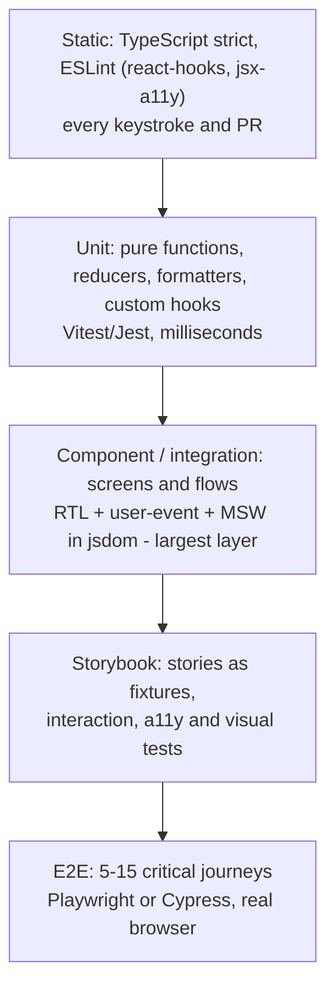
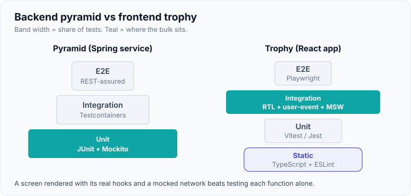
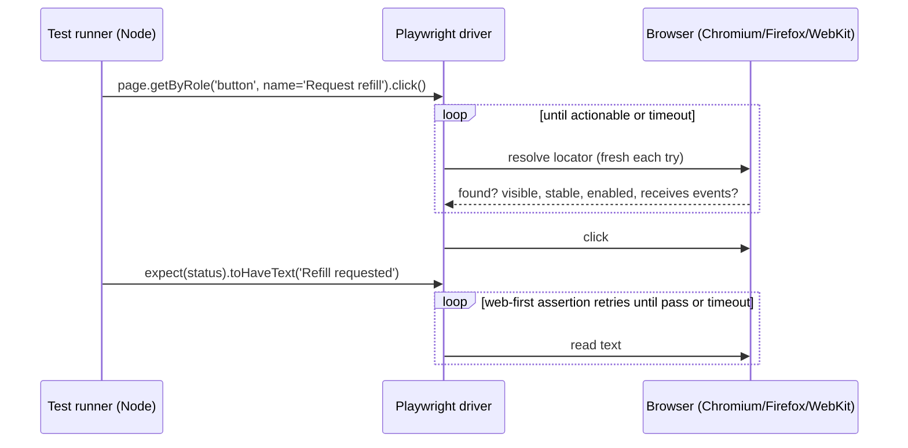

# Frontend Testing: Jest, React Testing Library, E2E (Playwright/Cypress)

!!! abstract "Key takeaways"
    - Frontend suites follow the **testing trophy**: static checks (TypeScript, ESLint) at the base, some unit tests, **mostly integration-style component tests** with React Testing Library (RTL), and a **few E2E** journeys. "The more your tests resemble the way your software is used, the more confidence they can give you."
    - **Jest or Vitest** run component tests in **jsdom** (a simulated DOM in Node): fast, but no layout, no real network, no real browser APIs. **RTL** queries by role and label and drives the UI with **`user-event`**; **MSW** mocks the network at the request level so the real fetch/GraphQL client code runs.
    - **Playwright** drives real Chromium, Firefox and WebKit over a protocol from outside the browser, with **auto-waiting locators**, **web-first assertions**, isolated **browser contexts**, parallel workers and a **trace viewer**. **Cypress** runs inside the browser with a command queue, great time-travel debugging, `cy.intercept` and component testing.
    - Flaky E2E tests usually come from **timing** (fixed sleeps), **shared test data**, and **real third-party dependencies**. Fix with auto-waiting, data per test, API-based setup, saved auth state and network control.
    - In a **micro-frontend** architecture, each micro-frontend owns its unit, component and Storybook tests and is deployable alone; contracts cover shared events and props; the shell has a small set of cross-app journeys.

## Why it matters

Frontend bugs are the ones users see first: a disabled button that never enables, a form that loses data, a screen-reader user who can't find the submit button, a page that works in Chrome and breaks in Safari. Frontend tests also have a bad reputation for being brittle (snapshot floods, Enzyme tests of internal state) and flaky (E2E suites that fail one run in ten). Interviewers ask about frontend testing to see whether you can build a suite the team trusts: tests that survive refactors, run fast in CI, and catch real regressions.

The [React testing page](../react/10-testing-react.md) goes deep into RTL queries, hooks and async UI. This page is about the **strategy across layers** and the **E2E tools**.

## Core concepts

### Layers for a React application


*Notice the bulk sits in component tests, which run in milliseconds to a few hundred ms each but still exercise real rendering, state and data-fetching code; E2E proves the deployed pieces fit.*

{ loading=lazy }
*The trophy moves the bulk up one layer: for UI code, rendering a screen with its real hooks gives far more confidence than testing each function alone.*

### Jest vs Vitest

| | Jest | Vitest |
|---|---|---|
| Transform | Babel / ts-jest / SWC | Vite (esbuild/Rollup pipeline), native ESM |
| API | `describe/it/expect`, `jest.fn`, `jest.mock` | Jest-compatible (`vi.fn`, `vi.mock`) |
| Speed | Good; ESM support still awkward | Fast startup and watch mode in Vite projects |
| Environments | jsdom, node | jsdom, happy-dom, node, **browser mode** (real browser via Playwright) |
| Typical in | CRA-era apps, Next.js, React Native | Vite apps, new projects |

Both use `@testing-library/jest-dom` matchers (`toBeInTheDocument`, `toBeDisabled`, `toHaveAccessibleName`). The choice is mostly about the build tool; the tests look almost identical.

### React Testing Library in five rules

1. **Query like a user**: `getByRole('button', { name: /request refill/i })`, then `getByLabelText`, then text; `getByTestId` last.
2. **`getBy` throws, `queryBy` returns null** (for asserting absence), **`findBy` waits** (async appearance).
3. **Interact with `user-event`** (`const user = userEvent.setup(); await user.click(...)`), which fires the full event sequence (pointer, focus, keyboard) rather than one synthetic event.
4. **Assert visible outcomes** (text, role states, navigation), not component state or hook calls.
5. **Wrap with real providers** (QueryClient with `retry: false`, router, theme, store) in a custom `render` helper, fresh per test.

### Mocking the network with MSW

Mock Service Worker intercepts requests at the network layer: a Service Worker in the browser and Storybook, a request interceptor in Node for Vitest/Jest. Your real `fetch`, Apollo or React Query code runs; only the response is fake. Handlers are shared between tests, Storybook and local development, and tests override them per case (`server.use(...)`) for errors and edge cases. MSW 2.x uses the standard Fetch API `Response` (`HttpResponse.json(...)`) and supports GraphQL operations by name (`graphql.query('Member', ...)`).

### E2E: how Playwright and Cypress differ


*Notice there is no sleep anywhere: both the action and the assertion retry against the live page until the condition holds, which is what removes most timing flakiness.*

| | Playwright | Cypress |
|---|---|---|
| Architecture | Out-of-process; drives browsers over CDP / patched protocols | Runs inside the browser alongside the app |
| Browsers | Chromium, Firefox, WebKit (Safari engine), mobile emulation | Chromium-family, Firefox, WebKit (experimental) |
| Waiting | Auto-waiting actions + web-first `expect` | Retry-ability of queries and assertions in the command queue |
| Multi-tab, multi-origin, iframes | Native | Limited (`cy.origin` for cross-origin) |
| Parallelism | Built-in workers and sharding, free | Parallel via CI machines; Cypress Cloud for orchestration |
| Isolation | New browser context per test (fresh cookies/storage) | Test isolation clears state between tests |
| Debugging | Trace viewer (DOM snapshots, network, console per step), UI mode, codegen | Time-travel command log, very good interactive runner |
| Network control | `page.route`, HAR replay | `cy.intercept` |
| Component testing | Experimental | Mature |
| Languages | TS/JS, Java, Python, .NET | JS/TS |

{ loading=lazy }
*Watch the two clocks: the sleep guesses a duration and loses when the API is slow; the locator waits for the condition, not for time.*

### Authentication and data in E2E

- **Log in once**: a setup project logs in through the real identity provider (or a test IdP) and saves `storageState` (cookies, local storage); tests reuse it. Don't log in through the UI in every test.
- **Set up data through APIs**, not the UI: create the member and prescription via a test API or seed script, then test the one journey that matters.
- **Unique data per test** so parallel workers don't collide.
- **Control third parties**: stub payment, address lookup, analytics with `page.route`; keep a separate smoke test against the real integration.

### Micro-frontends

Each micro-frontend (MFE) is built and deployed independently, so its tests must run independently too:

- **Inside an MFE**: unit + RTL component tests + Storybook stories, with MSW for its APIs. This is where nearly all behaviour is tested.
- **At the seams**: shared contracts are props of exposed components, custom events or a shared event bus, routes and shared libraries (design system, auth). Test them with typed interfaces, contract-style tests on event payloads, and Storybook for the design system.
- **Shell / composition**: a few E2E journeys that cross MFEs (log in in the shell, request a refill in the prescriptions MFE, see it in the orders MFE), and a smoke test that each remote loads in each environment (version skew, Module Federation `remoteEntry` failures).

### Accessibility and visual testing

Role-based RTL queries already fail when a control has no accessible name. Add `jest-axe` / `vitest-axe` for component checks and `@axe-core/playwright` for full pages; they find roughly a third to a half of WCAG issues automatically, the rest needs manual and screen-reader testing. Visual regression (Playwright `toHaveScreenshot`, Chromatic for Storybook) catches CSS changes but needs stable fonts, data and animation, and owners for baseline updates.

## In practice: code & configuration

### Component test with MSW and React Query

=== "❌ Common mistake"
    ```tsx
    // Mocks the hook, so the data-fetching code, loading state and error path never run.
    vi.mock("../api/useRefills", () => ({ useRefills: () => ({ data: [refill], isLoading: false }) }));

    it("renders", () => {
      const { container } = render(<RefillsPage />);
      expect(container.querySelector(".refill-row")).toBeTruthy();   // CSS class: implementation detail
      expect(container).toMatchSnapshot();                           // 400-line snapshot nobody reads
    });
    ```

=== "✅ Correct approach"
    ```tsx
    // test/server.ts: shared MSW handlers (also used by Storybook)
    export const server = setupServer(
      graphql.query("Refills", () =>
        HttpResponse.json({ data: { refills: [{ id: "r1", drug: "Atorvastatin 10 mg", status: "READY" }] } })),
    );

    // test/render.tsx: fresh providers per test
    export function renderWithProviders(ui: React.ReactElement) {
      const client = new QueryClient({ defaultOptions: { queries: { retry: false } } }); // no retry delays
      return { user: userEvent.setup(), ...render(<QueryClientProvider client={client}>{ui}</QueryClientProvider>) };
    }

    // RefillsPage.test.tsx
    it("lets a member request a refill for a ready prescription", async () => {
      const { user } = renderWithProviders(<RefillsPage />);

      const row = await screen.findByRole("row", { name: /atorvastatin/i });          // waits for data
      await user.click(within(row).getByRole("button", { name: /request refill/i }));

      expect(await screen.findByRole("status")).toHaveTextContent(/refill requested/i);
    });

    it("shows a retry option when the service fails", async () => {
      server.use(graphql.query("Refills", () =>
        HttpResponse.json({ errors: [{ message: "upstream unavailable" }] })));         // per-test override
      renderWithProviders(<RefillsPage />);
      expect(await screen.findByRole("alert")).toHaveTextContent(/couldn't load/i);
      expect(screen.getByRole("button", { name: /try again/i })).toBeEnabled();
    });
    ```

```ts
// vitest.config.ts
export default defineConfig({
  plugins: [react()],
  test: {
    environment: "jsdom",
    setupFiles: ["./test/setup.ts"],      // jest-dom matchers, MSW server.listen/resetHandlers/close
    coverage: { provider: "v8", reporter: ["text", "lcov"] },  // lcov for SonarQube
  },
});
```

### Playwright: auth once, data via API, no sleeps

=== "❌ Common mistake"
    ```ts
    test("refill", async ({ page }) => {
      await page.goto("/login");                                   // UI login in every test
      await page.fill("#user", "shared.tester@example.com");       // one shared account for all workers
      await page.fill("#pass", process.env.PW!);
      await page.click("text=Sign in");
      await page.waitForTimeout(3000);                             // guess
      await page.click(".MuiButton-root >> nth=2");                 // brittle CSS + index
      expect(await page.locator(".toast").isVisible()).toBe(true);  // checks once, no retry
    });
    ```

=== "✅ Correct approach"
    ```ts
    // auth.setup.ts: runs once, saves the session
    setup("authenticate", async ({ page }) => {
      await page.goto("/");
      await page.getByLabel("Username").fill(process.env.E2E_USER!);
      await page.getByLabel("Password").fill(process.env.E2E_PASSWORD!);
      await page.getByRole("button", { name: "Sign in" }).click();
      await expect(page.getByRole("heading", { name: /my prescriptions/i })).toBeVisible();
      await page.context().storageState({ path: "playwright/.auth/member.json" });
    });

    // refill.spec.ts
    test.use({ storageState: "playwright/.auth/member.json" });

    test("member requests a refill", async ({ page, request }) => {
      const rx = await (await request.post("/test-api/prescriptions", {   // data via API, unique per test
        data: { drug: "Atorvastatin 10 mg", refillsLeft: 2 } })).json();

      await page.goto("/prescriptions");
      const row = page.getByRole("row", { name: new RegExp(rx.drug, "i") });
      await row.getByRole("button", { name: /request refill/i }).click();   // auto-waits until enabled
      await expect(page.getByRole("status")).toHaveText(/refill requested/i); // retries until true
    });
    ```

```ts
// playwright.config.ts
export default defineConfig({
  retries: process.env.CI ? 1 : 0,           // one retry to classify flakes; report them, don't hide them
  workers: process.env.CI ? 4 : undefined,
  use: { baseURL: process.env.BASE_URL, trace: "on-first-retry", screenshot: "only-on-failure" },
  projects: [
    { name: "setup", testMatch: /.*\.setup\.ts/ },
    { name: "chromium", use: { ...devices["Desktop Chrome"] }, dependencies: ["setup"] },
    { name: "webkit", use: { ...devices["Desktop Safari"] }, dependencies: ["setup"] },
  ],
});
```

### Cypress equivalent

```ts
it("member requests a refill", () => {
  cy.intercept("POST", "/graphql", (req) => {
    if (req.body.operationName === "RequestRefill") req.alias = "requestRefill";
  });
  cy.session("member", () => cy.loginViaApi());           // cached session, like storageState
  cy.visit("/prescriptions");
  cy.findByRole("row", { name: /atorvastatin/i })         // @testing-library/cypress
    .findByRole("button", { name: /request refill/i }).click();
  cy.wait("@requestRefill").its("response.statusCode").should("eq", 200);
  cy.findByRole("status").should("contain.text", "Refill requested");
});
```

## Real-world usage

- **RTL** replaced Enzyme as the default for React; React's docs point to it. **Playwright** (Microsoft, 2020) has become the most common choice for new E2E suites, especially where Safari/WebKit coverage matters; **Cypress** remains widespread and popular for its developer experience and component testing.
- **Storybook** stories double as test fixtures: interaction tests (`play` functions), accessibility checks and visual snapshots (Chromatic) for design systems shared across micro-frontends.
- **Healthcare**: synthetic members only (no PHI in fixtures, screenshots, traces or videos, which CI stores as artifacts); WCAG 2.1 AA accessibility checks for member-facing apps; E2E coverage for login, refill and payment against a test IdP.
- Common failure modes: E2E suites that grow to hundreds of tests and an hour of runtime; snapshot tests approved without reading; tests that depend on the order of records from a shared test environment; traces and videos uploaded with real tokens.

## Trade-offs & production gotchas

| Option | Pros | Cons | Use when |
|---|---|---|---|
| RTL + MSW in jsdom | Fast, realistic behaviour, refactor-safe | No layout, no real browser quirks | Most UI behaviour |
| Vitest browser mode / Playwright CT | Real browser rendering | Slower, newer tooling | Layout-dependent components, canvas, complex browser APIs |
| Snapshot tests | Cheap | Brittle, rubber-stamped | Small, stable serialised output only |
| Playwright E2E | Cross-browser, parallel, traces | Needs environment and data | Critical journeys, Safari coverage |
| Cypress E2E | Great debugging, component testing | In-browser limits (tabs, origins), paid parallel orchestration | Teams already invested, Chromium-centric |
| Visual regression | Catches CSS regressions | Baseline churn, needs stable rendering | Design systems |

!!! warning "Gotcha: `waitForTimeout` / `cy.wait(3000)`"
    Fixed waits are both slow (when the app is fast) and flaky (when it's slow). Wait for a condition: a locator, a web-first assertion, or an aliased network request.

!!! warning "Gotcha: retries that hide flakiness"
    `retries: 2` turns a flaky test green without anyone noticing. Keep retries low, report "flaky" results (Playwright marks them), and quarantine with an owner.

!!! warning "Gotcha: jsdom isn't a browser"
    No layout (`getBoundingClientRect` returns zeros), no `IntersectionObserver` or `matchMedia` by default, no real navigation. Polyfill in setup, or move that test to browser mode or E2E.

!!! question "Interview angle"
    "Playwright or Cypress?" Give criteria, not loyalty: browser coverage (WebKit), multi-tab/origin needs, parallelism cost, language, existing investment, and debugging workflow.

## How this connects to my experience

- **Where I used it:** OptumRx Meteor: "Built the ReactJS application from the ground up and established a micro-frontend architecture" and "Established engineering standards around testing, CI/CD, code quality, and deployment practices". Skills list: ReactJS, Redux, React Query, Material UI, Storybook, TypeScript.
- **Talking points:**
    - The frontend testing standard: RTL by role, MSW (or another approach) for GraphQL responses from the GraphQL Consumer Service, fresh React Query client per test. *[confirm: Jest or Vitest; MSW or mocked hooks]*
    - Storybook for MUI-based shared components across micro-frontends, possibly with interaction or visual tests. *[confirm what Storybook was used for]*
    - E2E tool and scope: which journeys (login via PingFederate, refill) and how auth was handled in tests. *[confirm: Playwright, Cypress, Selenium or QA-owned]*
    - How micro-frontends were tested independently and how cross-MFE integration was checked. *[confirm]*
    - QA in the team ("backend, frontend, and QA functions"): split between automated E2E and manual exploratory testing. *[confirm]*
- **Likely follow-up chain:** "How did you test the React app?" → "How did you mock GraphQL?" → "How did you test across micro-frontends?" → "Which E2E tool and why?" → "How did you deal with flaky E2E tests and SSO login?" Answer with the layers above and be explicit about what you owned versus what QA owned.

## Interview questions

### Fundamentals

??? question "Q1. What is the testing trophy and why does it suit frontends?"
    **Answer:** Kent C. Dodds' model: static analysis at the base, a thin unit layer, the largest layer of integration tests, and a few E2E tests. In UI code, most bugs are in how components, hooks, state and data fetching work together, and rendering a screen with RTL in jsdom is cheap, so integration-style component tests give the best confidence per cost. Static types and lint catch a whole class of errors for free.

    **Interviewer listens for:** confidence vs cost; integration as the bulk; static checks.

    **Common wrong answer:** "It's the pyramid upside down, with more E2E tests."

??? question "Q2. `getBy`, `queryBy`, `findBy`: when do you use each?"
    **Answer:** `getBy` returns the element or throws, for things that should be present now. `queryBy` returns null when absent, for asserting something is not there. `findBy` returns a promise and retries until the element appears or times out, for async UI. The `All` variants return arrays.

    **Interviewer listens for:** absence with `queryBy`; async with `findBy`.

    **Common wrong answer:** "`findBy` is for finding by test ID."

??? question "Q3. Why mock the network with MSW instead of mocking the fetch hook or axios?"
    **Answer:** MSW intercepts at the request level, so the real client code (React Query hooks, Apollo, serialisation, error handling, loading states) runs. Mocking the hook skips all of that and couples the test to implementation. MSW handlers are reusable in Storybook and local dev, and overriding a handler per test makes error paths easy to cover.

    **Interviewer listens for:** real code path; reuse; error cases.

    **Common wrong answer:** "Because `jest.mock` is slow."

### Intermediate

??? question "Q4. How does Playwright avoid timing flakiness?"
    **Answer:** Actions on locators auto-wait for actionability checks (attached, visible, stable, enabled, receives events) and re-resolve the locator on each attempt; `expect` assertions on locators are web-first and retry until they pass or time out. Combined with browser-context isolation per test, this removes most sleeps and stale-element problems. You still need deterministic data and controlled third parties.

    **Interviewer listens for:** actionability checks; retrying assertions; isolation.

    **Common wrong answer:** "It has a longer default timeout."

??? question "Q5. Playwright vs Cypress: how would you choose?"
    **Answer:** Playwright: real WebKit, Firefox and Chromium; multi-tab, multi-origin and iframes; free built-in parallelism and sharding; trace viewer; several languages. Cypress: runs inside the browser with excellent interactive debugging and mature component testing, but cross-origin and multi-tab are limited and parallel orchestration is commonly via its paid cloud. For a new healthcare portal needing Safari coverage and SSO redirects, I'd pick Playwright; with an existing healthy Cypress suite, I'd keep it.

    **Interviewer listens for:** criteria-based choice; architecture difference.

    **Common wrong answer:** "Cypress is for unit tests, Playwright for E2E."

??? question "Q6. How do you handle login in E2E tests with SSO?"
    **Answer:** Authenticate once per worker or run in a setup project, against a test IdP or test tenant, and save the session (`storageState` in Playwright, `cy.session` in Cypress). Use dedicated test accounts per role and per worker; never real users. Keep one explicit test of the real login flow, and get tokens via API where the IdP allows it. Don't store secrets or traces with tokens in CI artifacts.

    **Interviewer listens for:** login once, reuse state; test accounts; one real login test.

    **Common wrong answer:** "Turn auth off in the test environment."

### Senior

??? question "Q7. How would you test a micro-frontend architecture?"
    **Answer:** Each MFE owns unit, component (RTL + MSW) and Storybook tests and must pass its own pipeline to deploy, so teams don't wait on each other. The seams get explicit contracts: typed props for exposed components, schema'd custom events or shared state, versioned shared libraries, and contract-style tests on event payloads. The shell has a few cross-MFE journeys and a smoke test that every remote loads in each environment, catching version skew and `remoteEntry` loading failures.

    **Interviewer listens for:** independent pipelines; contracts at the seams; small cross-app E2E.

    **Common wrong answer:** "Run the whole composed app E2E for every change in any MFE."

??? question "Q8. Your E2E suite takes 50 minutes and is red 20% of the time. What's your plan?"
    **Answer:** Measure: per-test duration, flake rate and failure causes from traces. Quarantine the flakiest tests with owners. Fix root causes: replace sleeps with locators and assertions, set up data via API with unique records, reuse auth state, stub third parties. Push coverage down: many E2E checks belong in RTL component tests. Keep 5-15 critical journeys; shard the rest across workers; run the full set post-merge and a smoke subset on PRs.

    **Interviewer listens for:** measurement, quarantine, push-down, sharding.

    **Common wrong answer:** "Increase retries to 3."

### Scenario-based

??? question "Q9. A component test passes but the same feature is broken in Safari. What went wrong and how do you prevent it?"
    **Answer:** jsdom isn't a browser and doesn't reproduce engine-specific behaviour (date input parsing, CSS layout, `Intl` differences, storage partitioning). Add a WebKit project to the Playwright suite for critical journeys, consider Vitest browser mode or Playwright component tests for the affected component, and add the bug as a regression test at the lowest layer that reproduces it.

    **Interviewer listens for:** jsdom limits; WebKit coverage; regression test.

    **Common wrong answer:** "Write more unit tests."

??? question "Q10. How do you test a form that submits via a React 19 Action and shows a pending state?"
    **Answer:** In RTL, render the form with MSW handling the request; use `user.type` and `user.click` on the submit button; assert the pending UI (`button` disabled or "Saving..." from `useFormStatus`/`useActionState`) with `findByRole`, then the success or error message after the handler responds. Use a delayed MSW response (`await delay(200)`) to make the pending state observable. In E2E, assert the final outcome only.

    **Interviewer listens for:** user-level interactions; controllable network delay; assert outcomes.

    **Common wrong answer:** "Spy on `useActionState` and check it was called."

??? question "Q11. What would your frontend quality gate in CI contain?"
    **Answer:** On every PR: type check, ESLint (including hooks and a11y rules), unit and component tests with coverage on new code reported to SonarQube, Storybook build with interaction and a11y checks, and a bundle-size budget. After merge or deploy to a test environment: Playwright smoke journeys across Chromium and WebKit, and visual regression for the design system. Fail fast, keep the PR stage under about 10 minutes.

    **Interviewer listens for:** layered gates; time budget; a11y and coverage on new code.

    **Common wrong answer:** "Run the full E2E suite on every commit."

## Cheat sheet

| Concept | Remember |
|---|---|
| Shape | Trophy: static, some unit, mostly integration, few E2E |
| Runner | Jest or Vitest (Vite projects); jsdom is not a browser |
| RTL | Role > label > text > test ID; `user-event` with `setup()` and `await` |
| Queries | `getBy` now, `queryBy` absence, `findBy` async |
| Network | MSW handlers shared by tests, Storybook, dev; override per test |
| React Query | Fresh `QueryClient` per test, `retry: false` |
| Playwright | Auto-wait, web-first `expect`, contexts, workers, trace viewer, WebKit |
| Cypress | In-browser, command queue, `cy.intercept`, `cy.session`, component testing |
| Auth | Log in once, reuse `storageState` / `cy.session`; test accounts |
| Data | Via API, unique per test, no PHI in fixtures or traces |
| MFEs | Own tests per MFE, contracts at seams, few cross-app journeys |
| Flaky | No fixed waits, low retries, quarantine with owner |

## Sources
1. [Testing Library: Guiding principles and queries](https://testing-library.com/docs/queries/about/): query priority, `getBy/queryBy/findBy`.
2. [Testing Library: user-event](https://testing-library.com/docs/user-event/intro): `setup()` and full event sequences.
3. [Kent C. Dodds: The Testing Trophy and Testing Classifications](https://kentcdodds.com/blog/the-testing-trophy-and-testing-classifications): trophy shape and rationale.
4. [Vitest documentation](https://vitest.dev/guide/): Jest compatibility, environments, browser mode, coverage.
5. [Mock Service Worker documentation](https://mswjs.io/docs/): request interception, GraphQL handlers, `HttpResponse`.
6. [Playwright: Auto-waiting / actionability](https://playwright.dev/docs/actionability), [Assertions](https://playwright.dev/docs/test-assertions) and [Authentication](https://playwright.dev/docs/auth): locators, web-first assertions, `storageState`.
7. [Playwright: Trace viewer](https://playwright.dev/docs/trace-viewer) and [Retries](https://playwright.dev/docs/test-retries): debugging and flaky classification.
8. [Cypress documentation: Retry-ability, cy.intercept, cy.session](https://docs.cypress.io/app/core-concepts/retry-ability): command queue and network control.
9. [Cypress: Trade-offs](https://docs.cypress.io/app/references/trade-offs): in-browser architecture limits.
10. [Deque axe-core](https://github.com/dequelabs/axe-core) and [@axe-core/playwright](https://playwright.dev/docs/accessibility-testing): automated accessibility checks.
11. [Storybook: Testing](https://storybook.js.org/docs/writing-tests): interaction, accessibility and visual tests.
