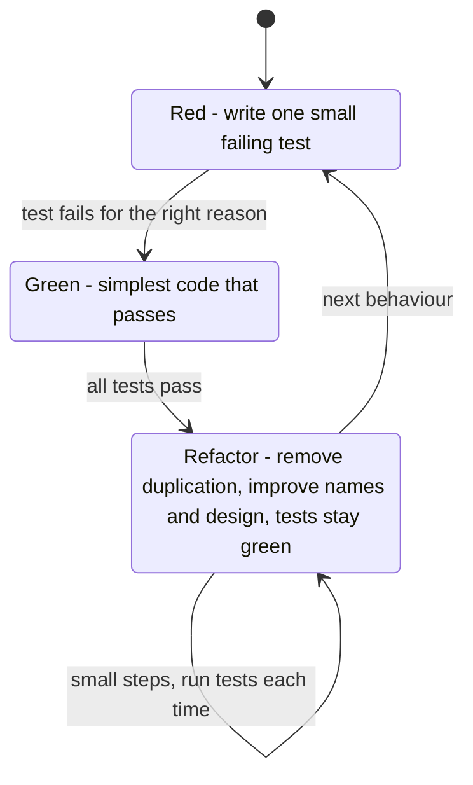
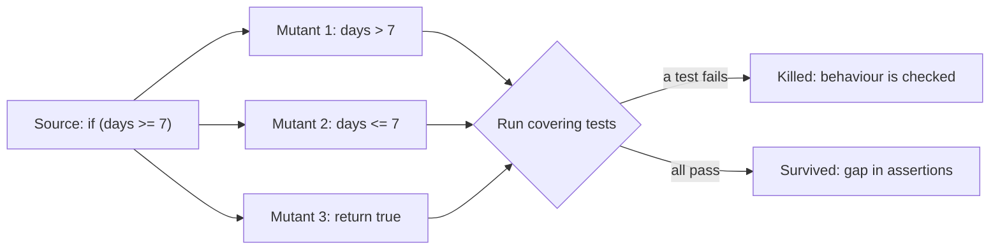
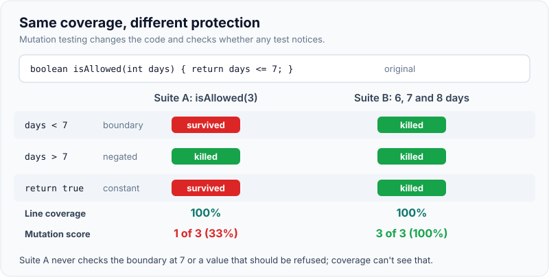
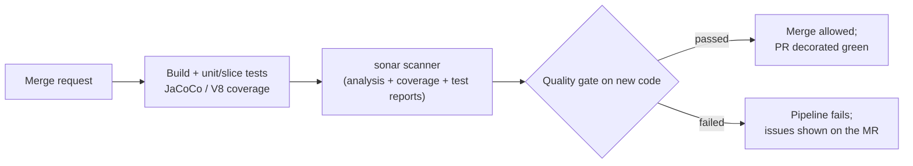

# TDD, Coverage & Quality Gates (SonarQube)

!!! abstract "Key takeaways"
    - **TDD** is a design loop: write a **failing test** (red), the **simplest code** to pass it (green), then **refactor** with the test as a safety net. Its main payoff is testable, decoupled design and a regression suite you trust, not the tests alone.
    - **Coverage measures what ran, not what was checked.** A test without assertions can give 100% line coverage. Use **branch coverage** over line coverage, and **mutation testing** (PIT for Java, Stryker for JS/TS) to measure whether tests actually detect faults.
    - **JaCoCo** (Java) and **V8/Istanbul** (JS/TS) produce coverage reports; **SonarQube** imports them alongside static analysis (bugs, vulnerabilities, code smells, security hotspots, duplication).
    - A **quality gate** is a pass/fail set of conditions. The default **Sonar way** gate applies to **new code**: no new issues, all new security hotspots reviewed, **coverage on new code ≥ 80%**, **duplication on new code ≤ 3%**. This "Clean as You Code" approach improves legacy code without demanding a rewrite.
    - Wire the gate into CI so a failed gate **blocks the merge** (`sonar.qualitygate.wait=true`, PR decoration). Watch for Goodhart's law: once coverage is a target, people write assertion-free tests, so review *what* is tested.

## Why it matters

"We have 80% coverage" is one of the most common, least informative statements in engineering. Interviewers for lead roles want to know if you can set **standards that improve quality without slowing the team**: when TDD helps and when it doesn't, why a coverage number can lie, and how to configure gates that stop regressions on new code without blocking every PR on legacy debt. The [test pyramid page](01-test-pyramid-and-testing-strategy-for-microservices.md) covers which tests to write; this page covers how to write them first and how to measure and enforce quality.

## Core concepts

### The TDD cycle


*Notice refactoring is a separate step with all tests green: the cycle never changes behaviour and structure at the same time.*

Kent Beck's *Test-Driven Development: By Example* (2002) describes the loop; Robert C. Martin's "three laws" make it strict (no production code without a failing test; only enough test to fail; only enough code to pass). In practice:

- **Start from a test list**: the behaviours and edge cases you expect, picked off one at a time.
- **Watch it fail** for the right reason: a test that never failed may not be testing anything.
- **Fake it, then triangulate**: return a constant to pass, then add a second example that forces the real logic.
- **Refactor both** production and test code.

{ loading=lazy }
*Watch the indicator move red, green, refactor: each turn adds exactly one behaviour, and refactoring always starts and ends green.*

### Schools: London (mockist) vs Detroit (classic)

| | Detroit / Chicago (classic) | London (mockist, outside-in) |
|---|---|---|
| Starts from | Domain core, inside-out | Acceptance test at the edge, outside-in |
| Collaborators | Real objects; doubles for I/O only | Mocks for collaborators to discover interfaces |
| Verifies | State (results) | Interactions (messages sent) |
| Strength | Refactor-safe tests | Drives role-based design across layers |
| Risk | Can miss interface design until later | Brittle tests coupled to call structure |

*Growing Object-Oriented Software, Guided by Tests* (Freeman and Pryce) is the London reference. Most teams mix: an outside-in acceptance test (double loop TDD), sociable unit tests inside. See [JUnit 5 & Mockito](02-junit-5-and-mockito.md) for the mocking side.

### When TDD helps and when it doesn't

TDD pays off for **business rules, algorithms, parsers, validators, state machines, bug fixes** (write the failing reproduction first) and for code you'll change often. It helps less for **spikes and UI layout exploration** (prototype, then throw away or test after), **thin glue code** better covered by integration tests, and when the design is unknown at the edges (a new third-party API). Evidence from studies is mixed on productivity and modest-positive on defect density; present TDD as a tool you choose, not a religion.

### Coverage metrics

| Metric | Counts | Weakness |
|---|---|---|
| Line / statement | Lines executed | One test through an `if` covers the line, not the `else` |
| Branch (decision) | Each branch of `if`, `switch`, `?:` taken | Doesn't check combinations of conditions |
| Condition | Each boolean sub-expression true and false | Can be met without covering all outcomes |
| MC/DC | Each condition shown to independently affect the outcome | Expensive; used in avionics (DO-178C) |
| Mutation score | % of injected faults (mutants) that tests detect | Slow; needs tuning |

**JaCoCo** instruments bytecode with a Java agent during tests and reports instructions, branches, lines, methods and complexity; it can enforce minimums with the `check` goal and merge unit and integration test data. Java records, Lombok-generated code (`lombok.addLombokGeneratedAnnotation=true`) and generated sources are typically excluded. **V8** coverage (Vitest, Jest `coverageProvider: "v8"`) and **Istanbul** do the same for JS/TS and emit `lcov` for SonarQube.

### Mutation testing

A mutation tool makes small changes to your code (flip `>` to `>=`, replace a return value with null, remove a method call) and runs the tests against each **mutant**. If a test fails, the mutant is **killed**; if all pass, it **survived**, meaning no test checks that behaviour. **PIT (Pitest)** for Java uses coverage data to run only the relevant tests per mutant and supports incremental analysis; **Stryker** does the same for JS/TS and .NET. Run it on core domain modules or changed code (PIT's `scmMutationCoverage`, Stryker `--since`), not the whole monolith on every PR.


*Notice mutant 1 only dies if some test uses exactly 7 days: mutation testing is a precise way to find missing boundary tests that coverage reports as "covered".*

{ loading=lazy }
*Same coverage number, very different protection: only the mutation score shows that suite A never checks the boundary.*

### SonarQube concepts

| Concept | Meaning |
|---|---|
| **Analysis** | Scanner (Maven/Gradle plugin, CLI, CI integration) sends code, coverage (JaCoCo XML, lcov) and test reports to the server |
| **Issues** | Rule violations, classified by software quality (reliability, security, maintainability) and severity; older versions: bugs, vulnerabilities, code smells |
| **Security hotspots** | Security-sensitive code that needs a human review (marked safe or fixed), not automatically a vulnerability |
| **Quality profile** | Which rules are active per language ("Sonar way" by default; extend it, don't fork it blindly) |
| **Quality gate** | Pass/fail conditions on metrics, usually on new code |
| **New code definition** | Since previous version, a number of days, a reference branch, or a specific analysis |
| **Clean as You Code** | Hold new and changed code to the standard; legacy debt is fixed as it's touched |
| **PR decoration** | Gate status and issues posted on the GitLab/GitHub/Bitbucket/Azure DevOps merge request |

The default **Sonar way** gate (SonarQube Server 2025.x) has four conditions on new code: **no new issues**, **all new security hotspots reviewed**, **coverage ≥ 80.0%**, **duplicated lines ≤ 3.0%**. Older versions and SonarQube Cloud phrase the first as reliability, security and maintainability ratings of A. Coverage and duplication conditions are ignored when there are fewer than 20 new lines (the "fudge factor"), so tiny PRs aren't blocked by rounding. Duplication and security issues aren't measured on test code.


*Notice the gate judges the merge request's new code, so a legacy module with 30% coverage doesn't block a well-tested change to it.*

## In practice: code & configuration

### TDD on a business rule

```java
// 1. RED: first behaviour from the test list
@Test
void refillAllowedWhenSevenOrFewerDaysOfSupplyRemain() {
    assertThat(new RefillPolicy().isAllowed(7)).isTrue();
}
// 2. GREEN: simplest thing that passes -> return true;
// 3. RED again: triangulate with a second example
@Test
void refillNotAllowedWithMoreThanSevenDaysRemaining() {
    assertThat(new RefillPolicy().isAllowed(8)).isFalse();
}
// 4. GREEN: real rule -> return daysRemaining <= 7;
// 5. REFACTOR: extract the window as a named constant / config, tests stay green
public final class RefillPolicy {
    static final int REFILL_WINDOW_DAYS = 7;
    public boolean isAllowed(int daysRemaining) {
        if (daysRemaining < 0) throw new IllegalArgumentException("daysRemaining < 0"); // next test-list item
        return daysRemaining <= REFILL_WINDOW_DAYS;
    }
}
```

### Coverage that lies vs tests that check

=== "❌ Common mistake"
    ```java
    // 100% line coverage of RefillPolicy and RefillService, zero assertions.
    @Test
    void coverage() {
        new RefillPolicy().isAllowed(3);
        new RefillPolicy().isAllowed(30);
        service.refill("m1", "rx-1");   // runs every line; would pass even if the logic were inverted
    }
    ```

=== "✅ Correct approach"
    ```java
    @ParameterizedTest
    @CsvSource({"0,true", "6,true", "7,true", "8,false", "30,false"})   // both sides of the boundary
    void refillWindow(int days, boolean expected) {
        assertThat(new RefillPolicy().isAllowed(days)).isEqualTo(expected);
    }

    @Test
    void negativeDaysAreRejected() {
        assertThatThrownBy(() -> new RefillPolicy().isAllowed(-1))
            .isInstanceOf(IllegalArgumentException.class);
    }
    // PIT now kills ">= / > / <" boundary mutants and the "return true" mutant.
    ```

### Maven: JaCoCo, PIT and the Sonar scanner

```xml
<plugin>
  <groupId>org.jacoco</groupId>
  <artifactId>jacoco-maven-plugin</artifactId>
  <executions>
    <execution><id>agent</id><goals><goal>prepare-agent</goal></goals></execution>      <!-- sets argLine -->
    <execution><id>report</id><phase>verify</phase><goals><goal>report</goal></goals></execution> <!-- XML for Sonar -->
  </executions>
</plugin>
<plugin>
  <groupId>org.pitest</groupId>
  <artifactId>pitest-maven</artifactId>
  <configuration>
    <targetClasses><param>com.acme.refill.domain.*</param></targetClasses>   <!-- core domain only -->
    <mutationThreshold>70</mutationThreshold>
  </configuration>
  <dependencies>
    <dependency><groupId>org.pitest</groupId><artifactId>pitest-junit5-plugin</artifactId><version>1.2.1</version></dependency>
  </dependencies>
</plugin>
```

```properties
# sonar-project.properties (or -D flags / pom properties)
sonar.projectKey=refill-service
sonar.coverage.jacoco.xmlReportPaths=target/site/jacoco/jacoco.xml
sonar.coverage.exclusions=**/config/**,**/*Application.java,**/dto/**
sonar.qualitygate.wait=true          # scanner waits for the gate result and fails the job if it fails
```

### GitLab CI stage

```yaml
sonarqube:
  stage: quality
  image: maven:3.9-eclipse-temurin-21
  variables:
    SONAR_USER_HOME: "${CI_PROJECT_DIR}/.sonar"
    GIT_DEPTH: "0"                   # full history for blame and new-code detection
  script:
    - mvn -B verify sonar:sonar -Dsonar.host.url=$SONAR_HOST_URL -Dsonar.token=$SONAR_TOKEN
  rules:
    - if: $CI_PIPELINE_SOURCE == "merge_request_event"
    - if: $CI_COMMIT_BRANCH == $CI_DEFAULT_BRANCH
```

## Real-world usage

- **Clean as You Code** is SonarSource's recommended approach and the reason the default gate targets new code: teams with large legacy codebases improve steadily because every touched file must meet the bar.
- **Google** reports (*Code Coverage Best Practices*, Google Testing Blog, 2020) that it treats coverage as a signal, not a goal, with rough guidelines of 60% acceptable, 75% commendable and 90% exemplary, and emphasises coverage of changed lines in code review. Google also runs mutation testing in code review at scale (Petrović and Ivanković, ICSE-SEIP 2018).
- **Regulated domains**: banks and healthcare companies often require quality gate evidence for audit (static analysis, SAST, coverage on new code, reviewed hotspots) as part of change management, and SonarQube's security rules map to OWASP Top 10 and CWE.
- Failure modes: gates on **overall** coverage that block every PR on legacy code until someone lowers the threshold; exclusions that grow until the metric is meaningless; teams marking hotspots "safe" without review; long-lived branches with stale new-code baselines.

## Trade-offs & production gotchas

| Option | Pros | Cons | Use when |
|---|---|---|---|
| Strict TDD | Testable design, trusted suite, fewer regressions | Slower start, hard for exploratory work | Business rules, bug fixes, long-lived code |
| Test-after with review | Flexible | Tests may mirror code, gaps | Spikes, UI layout, thin glue |
| Gate on overall coverage | Simple | Blocks on legacy debt, encourages gaming | Greenfield only |
| Gate on new-code coverage | Improves as code is touched | Legacy untouched code stays as is | Most existing codebases |
| Mutation testing | Measures test strength | Slow, needs scoping | Core domain, critical calculations |
| No gate, dashboards only | No friction | Quality drifts | Rarely; maybe early prototypes |

!!! warning "Gotcha: Goodhart's law"
    "When a measure becomes a target, it ceases to be a good measure." Assertion-free tests, tests of getters, and broad exclusions all raise coverage while lowering signal. Review test quality in code review and spot-check with mutation testing.

!!! warning "Gotcha: coverage from integration tests not counted"
    By default JaCoCo's agent only records Surefire runs. Add `prepare-agent-integration` and `report-integration` (or merge `.exec` files) if Failsafe integration tests should count, and point Sonar at the aggregated XML.

!!! warning "Gotcha: shallow clones"
    CI jobs with `GIT_DEPTH` of 20 or 50 can make SonarQube misidentify new code and blame. Fetch full history for analysis.

!!! question "Interview angle"
    "What coverage target do you set?" Strong answer: 80% on **new code** as a floor in the gate, branch over line, mutation testing on critical modules, and the real measure is escaped defects and change failure rate.

## How this connects to my experience

- **Where I used it:** OptumRx Meteor: "Established engineering standards around testing, CI/CD, code quality, and deployment practices" while leading 8–10 engineers; "Mentored 5+ engineers through code reviews, design reviews, and technical coaching". GitLab CI/CD at Coriolis and GitLab CI/CD and Jenkins in the skills list.
- **Talking points:**
    - The code-quality standard: SonarQube (or another tool) with a quality gate on merge requests, coverage on new code, and PR decoration in GitLab. *[confirm: tool, gate conditions, threshold values]*
    - How coverage was produced for both Java (JaCoCo) and the React app (Jest/Vitest lcov) and fed into one dashboard. *[confirm]*
    - Using code review to coach engineers on test quality (assertions, boundaries, naming), not just coverage numbers. *[confirm: one specific example]*
    - Whether TDD was practised, encouraged for bug fixes, or not used; answer honestly. *[confirm]*
    - Any measurable result: coverage trend, fewer escaped defects, fewer production incidents after the standard. *[confirm: numbers]*
- **Likely follow-up chain:** "What did your quality standard include?" → "What coverage threshold and why?" (80% on new code; legacy via Clean as You Code) → "How do you stop people gaming it?" (review, mutation testing, outcome metrics) → "Do you do TDD?" (where it helps, with an example) → "What happened when the gate blocked an urgent hotfix?" (the gate applies; exceptions need an owner and a follow-up ticket). *[confirm: real example of a gate exception]*

## Interview questions

### Fundamentals

??? question "Q1. Explain the TDD cycle and why refactoring is a separate step."
    **Answer:** Red: write a small test for the next behaviour and see it fail. Green: write the simplest code that makes it pass. Refactor: improve structure (names, duplication, design) while all tests stay green. Separating behaviour change (red/green) from structure change (refactor) keeps each step small and safe; if a test breaks during refactoring, you know the refactor caused it.

    **Interviewer listens for:** see it fail; simplest code; behaviour vs structure.

    **Common wrong answer:** "Write all the tests first, then all the code."

??? question "Q2. What's the difference between line and branch coverage?"
    **Answer:** Line coverage counts lines executed; branch coverage counts whether each outcome of every decision (`if/else`, `switch` cases, ternaries, short-circuit operators) was taken. One test through `if (x) doA();` executes every line but never the false branch. Branch coverage is the more meaningful default.

    **Interviewer listens for:** an example where line coverage is 100% with a missed branch.

    **Common wrong answer:** "They're the same thing measured differently."

??? question "Q3. What is a SonarQube quality gate and what's in the default one?"
    **Answer:** A set of pass/fail conditions evaluated on each analysis; a failed gate fails the pipeline or blocks the merge. The default Sonar way gate checks new code: no new issues, all new security hotspots reviewed, coverage at least 80%, duplication at most 3%. Quality profiles are different: they choose which rules raise issues.

    **Interviewer listens for:** new code focus; gate vs profile.

    **Common wrong answer:** "It's the list of rules SonarQube checks."

### Intermediate

??? question "Q4. Why does 100% coverage not mean the code is well tested?"
    **Answer:** Coverage only says code was executed, not that results were checked. A test with no assertions, or with weak ones, covers everything and catches nothing. Coverage also ignores missing code (an unhandled case) and input combinations. Mutation testing measures whether tests detect injected faults; outcome metrics (escaped defects) measure whether testing works.

    **Interviewer listens for:** executed vs verified; mutation testing.

    **Common wrong answer:** "It does, if it's branch coverage."

??? question "Q5. What is mutation testing and how do you use it without slowing CI?"
    **Answer:** The tool injects small faults (mutants) into the code and reruns the relevant tests; a killed mutant means a test noticed, a surviving one shows an assertion gap. Score = killed / total. It's expensive, so scope it: core domain packages, changed files only (PIT `scmMutationCoverage`, incremental history, Stryker `--since`), nightly for full runs, and a threshold on critical modules.

    **Interviewer listens for:** killed vs survived; scoping strategies.

    **Common wrong answer:** "Randomly changing tests to see if they still pass."

??? question "Q6. London vs Detroit TDD: which do you use?"
    **Answer:** Detroit/classic tests behaviour through real objects and verifies state; London/mockist works outside-in with mocks to design collaborator interfaces and verifies interactions. I mostly use classic, sociable tests inside a service for refactor safety, with an outside-in acceptance or component test to drive the feature (double-loop TDD), and mocks at I/O boundaries.

    **Interviewer listens for:** trade-off (design discovery vs brittleness); mixing.

    **Common wrong answer:** "London is for UI, Detroit for backend."

### Senior

??? question "Q7. You're asked to add a SonarQube gate to a 10-year-old codebase with 25% coverage. How do you configure it?"
    **Answer:** Gate on new code, not overall: define new code as relative to the main branch (or previous version), use Sonar way conditions (no new issues, hotspots reviewed, 80% coverage and ≤3% duplication on new code). Make it blocking on merge requests with PR decoration. Legacy is improved as it's touched (Clean as You Code), plus targeted characterisation tests before risky refactors. Report trends, not a single overall number.

    **Interviewer listens for:** new-code gating; blocking on MRs; incremental improvement.

    **Common wrong answer:** "Set the gate to 80% overall and give the team a sprint to fix it."

??? question "Q8. How do you stop teams gaming coverage?"
    **Answer:** Make coverage a floor, not a target, and only on new code. Review tests in code review (assertions, boundaries, names). Run mutation testing on critical modules and look at surviving mutants. Keep exclusions small and reviewed. Track outcome metrics (escaped defects, change failure rate) and discuss them in retros, so the team optimises for the result instead of the number.

    **Interviewer listens for:** Goodhart's law; review; mutation testing; outcome metrics.

    **Common wrong answer:** "Raise the threshold to 95%."

### Scenario-based

??? question "Q9. A production hotfix fails the quality gate on coverage. What do you do?"
    **Answer:** First check whether the gate is right: is the fix covered by a test that reproduces the bug? Ideally the fix includes that regression test (TDD for bug fixes) and passes. If time truly doesn't allow, follow the agreed exception process: an authorised override, an owner and a ticket to add the test immediately after. Don't lower the gate globally or add exclusions to pass.

    **Interviewer listens for:** regression test first; controlled exception; no permanent weakening.

    **Common wrong answer:** "Disable the gate for the release branch."

??? question "Q10. A bug slipped through code with 90% coverage. How do you use it to improve the process?"
    **Answer:** Write a failing test that reproduces it at the lowest layer that can catch it, then fix. Ask why existing tests missed it: no assertion on that output, missing boundary, wrong layer (an integration issue tested only with mocks). Run mutation testing on the module to find similar gaps. If it's a pattern, update the testing standard or review checklist, and track it as an escaped defect.

    **Interviewer listens for:** regression test; root cause in the test suite; systemic fix.

    **Common wrong answer:** "Raise the coverage threshold to 95%."

??? question "Q11. How do you introduce TDD to a team that has never done it?"
    **Answer:** Start where the value is obvious: bug fixes (a failing test first) and new business rules. Pair or mob on a few katas and then on real stories; show the refactor step and how it changes design. Make it a team agreement rather than a mandate, keep CI fast so the loop stays quick, and celebrate tests that catch regressions. Measure escaped defects and lead time, not the percentage of "TDD-compliant" commits.

    **Interviewer listens for:** practical adoption path; coaching; no dogma.

    **Common wrong answer:** "Require every PR to show the test commit before the code commit."

## Cheat sheet

| Concept | Remember |
|---|---|
| TDD | Red → green → refactor; see it fail; simplest code; refactor on green |
| Schools | Detroit: real objects, state. London: mocks, interactions, outside-in |
| Good for | Business rules, bug fixes, parsers, state machines |
| Coverage | Executed, not verified; branch > line |
| Mutation | Killed vs survived; PIT (Java), Stryker (JS/TS); scope to core or changed code |
| Tools | JaCoCo XML, V8/Istanbul lcov → SonarQube |
| Sonar way gate | New code: no new issues, hotspots reviewed, ≥80% coverage, ≤3% duplication |
| Fudge factor | Coverage/duplication ignored under 20 new lines |
| Clean as You Code | Gate new code; legacy improves as touched |
| CI | `sonar.qualitygate.wait=true`, PR decoration, full git history |
| Goodhart | A target metric gets gamed; review tests, watch outcomes |

## Sources
1. Kent Beck, *Test-Driven Development: By Example* (Addison-Wesley, 2002): the red-green-refactor cycle.
2. [Martin Fowler: Test Driven Development](https://martinfowler.com/bliki/TestDrivenDevelopment.html) and [Mocks Aren't Stubs](https://martinfowler.com/articles/mocksArentStubs.html): TDD loop, classic vs mockist.
3. Steve Freeman and Nat Pryce, *Growing Object-Oriented Software, Guided by Tests* (2009): outside-in, London-school TDD.
4. [Martin Fowler: Test Coverage](https://martinfowler.com/bliki/TestCoverage.html): coverage as a tool to find untested code, not a target.
5. [JaCoCo documentation](https://www.jacoco.org/jacoco/trunk/doc/): counters, Maven goals, check rules.
6. [PIT mutation testing](https://pitest.org/) and [Stryker Mutator](https://stryker-mutator.io/): mutation operators, incremental analysis.
7. [SonarQube docs: Introduction to quality gates](https://docs.sonarsource.com/sonarqube-server/2025.4/quality-standards-administration/managing-quality-gates/introduction-to-quality-gates): Sonar way conditions, fudge factor, new code.
8. [SonarQube docs: Clean as You Code / new code definition](https://docs.sonarsource.com/sonarqube-server/latest/core-concepts/clean-as-you-code/introduction/): new-code approach.
9. [SonarQube docs: Java test coverage](https://docs.sonarsource.com/sonarqube-server/latest/analyzing-source-code/test-coverage/java-test-coverage/): JaCoCo XML import.
10. [Google Testing Blog: Code Coverage Best Practices (2020)](https://testing.googleblog.com/2020/08/code-coverage-best-practices.html): 60/75/90 guidance, coverage as a signal.
11. [Petrović and Ivanković: State of Mutation Testing at Google (ICSE-SEIP 2018)](https://research.google/pubs/state-of-mutation-testing-at-google/): mutation testing in code review.
