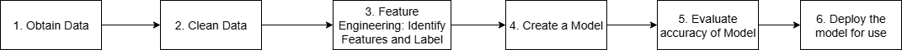

# Artificial Intellegence
The theory and development of computer systems able to perform tasks normally requiring human intelligencesuch as visual perception, speech recognioyion, decision making and translation between languages

# Types of AI

## Strong AI (or General AI)
- Intellignet of machine = Intelligence of human
- A machine that can solve problems, learn and plan for the future
- An expert at everything
- Learns like child, building on it's own experiences
- We are far away from this !!

## Narrow AI (or weak AI)
- Focuses on specific task
- Ex. self driving car

## AI vs ML vs Gen AI
### AI - 
- Goal of AI is to create machines that can simulate human like intelligence and behaviour.

### ML vs Traditional Programming
#### Traditional Programming
- Based on Rules
- IF this DO that

### Machine Learning
- Give millions of examples
- Created a model
- Use the model to predict the outcome

### ML Goal - Make a good prediction
- Give inputs to a model
- Model return the prediction
- Inputs are called features
- Prediction is called label

- Example: House Price Prediction
  - Features:
    - Size of the house
    - Number of bedrooms
    - Location
    - Age of the house
    - Is furnished
  - Label:
    - Price of the house

- Example: Car price prediction
  - Features:
    - Make of the car
    - Model of the car
    - Year of manufacture
    - Mileage
    - Condition (new/used)
  - Label:
    - Price of the car
- Example: Spam Email Detection
  - Features:
    - Presence of certain keywords
    - Length of the email
    - Number of links
    - Sender's email address
  - Label:
    - Spam or Not Spam

### Prediction posiibilities
- Numeric value: Label is numeric value with a range of possiblities -> Regression
   - Example: House price prediction, car price prediction
- Limited possibilities:  YES or NO, 0 or 1, True or False -> Classification
    - Example: Spam email detection, disease diagnosis, sentiment analysis

## ML model creation steps:
 

## ML Process
1. Trainig: 
   - Use training data to create a model
   - Model learns patterns from the data
2. Evaluation:
   - Use validation data to evaluate the model
   - Check how well the model performs on unseen data
3. Inference:
   - Use the model to make predictions on new data
   - Model applies learned patterns to new inputs

## Generative AI
- A subset of AI that focuses on creating new content, such as text, images, music, and more.

## Generative AI Models
Statistical models that learn to generate new data by analyzing exuisting data.
GenAI uses self supervised learning to train models on large datasets, allowing them to understand patterns and relationships within the data.
### Datasets used:
    - Wikipedia
    - Books
    - Open source code
    - Artworks

## Self Supervised Learning
Model learns from unlabeled data by predicting parts of the data from other parts.
- Example: Predicting the next word in a sentence based on the previous words.
How does it work?
- The model is trained to predict missing parts of the data.
- Example sentence: "The cat sat on the ___"
- The model learns to predict the missing word "mat" based on the context provided by the other words in the sentence.
- This process helps the model understand language structure and context without needing explicit labels for every piece of data.

## Predicting next word
- A key step in generative AI is predicting the next word in a sequence.
- During training, text based generative AI models learn thge probability that a word might occur in specific context.
- Context: "The cat sat on the ___"
- Example of probability for next word:
  - "mat" - 0.7
  - "roof" - 0.2
  - "floor" - 0.1
- Model might choose "mat" as the next word based on the highest probability.
- However, you can control which of the words is chosen by adjusting a few parameters
  - temperature, top_p, top_k

## Uses token instead of words
TOKEN is a unit  of text might be a word, part of a word, or even a character.
- Example: "The cat sat on the mat" might be tokenized as ["The", "cat", "sat", "on", "the", "mat"].
- why tokens? Tokens are more consistent than words, especially in languages with complex grammar or multiple forms of a word.
- Example: "running" and "ran" might be treated as different tokens, allowing the model to understand their relationship better.
- Example: "bank" could be a token for both a financial institution and the side of a river, depending on the context.
- Tokens are smaller and more manageable
- Because tokens are consistent, it is easy for models to learn relationships and things like parts of speech.
- Every text model has token limit, which is the maximum number of tokens it can process at once.

## Predictive ML vs Generative AI
| Feature                | Predictive ML                          | Generative AI                          |
|------------------------|----------------------------------------|----------------------------------------|  
| Goal                   | Predict outcomes based on input data   | Create new content (text, images, etc.)|
| Input                  | Features                               | Prompts                                |
| Output                 | Labels (predictions)                   | Generated content                      |
| Use Cases              | House price prediction, spam detection | Text generation, image synthesis       |
| Volume of Training Data | Requires substancial labeled data      | Requires large amounts of unlabeled data |
| Time needed to train | Can be faster with smaller datasets    | Typically requires more time due to complexity |

# ML in Google Cloud - Traditional Landscape
This is the ML landscape in Google Cloud before Gen AI
- Machine Learning based API
  - Natural Language API - Derive insights from unstructured text (https://cloud.google.com/natural-language)
  - Vision API - Derive insights from images (https://cloud.google.com/vision)
  - Speech to Text API - Convert audio to text (https://cloud.google.com/speech-to-text)
  - Text to Speech API - Convert text to audio (https://cloud.google.com/text-to-speech)
  - Video Intelligence API - Content moderation for video, Object detection, Face detection, OCR (https://cloud.google.com/video-intelligence)

- Custom ML Models without ML expertise
  - Vertex AI => AutoML
  - AutoML supports following types of models:
    - Image - Build custom models based on images
      - Example: Identify the specific type of cloud
      - Provide: Images of different types of clouds
      - AutoML will create a model that can identify the type of cloud in new images
    - Text - Build custom models based on text
      - Example: Classify customer reviews as positive or negative
      - Provide: Labeled text data with customer reviews
      - AutoML will create a model that can classify new reviews
    - Video - Build custom models based on videos
      - Example: Detect specific objects in videos
      - Provide: Labeled video data with objects of interest
      - AutoML will create a model that can detect those objects in new videos
    - Tabular - Build custom models based on structured data
      - Example: Predict customer churn
      - Provide: Historical customer data with churn labels
      - AutoML will create a model that can predict churn for new customers

- Custom ML Models with ML expertise
  - Vertex AI => Custom Training
  - You want to use your own ML framework (TensorFlow, PyTorch, etc.)
  - You want to use your own ML algorithms

## Auto ML
- Go to vetext AI
- Create dataset with following config
  - Image
  - Single label classification
- Upload images
- Label images

## Gen AI models
- text bison: Helps in summarizing, generating, and understanding text.

## Prompt Design
### Prompt: 
A set of initial instructions provided to foundation models as input.
### Prompt Design
The process of creating effective and precise prompts to achieve desired outputs from language models.
### Why prompt design is important?
- Optimizing Model Performance: Well-designed prompts can significantly impact the quality and relevance of the model's responses.
- Getting the response right: Leverge the full potential of foundation models, ensuring reliable, accurate, and contextually appropriate outputs.
### Prompt Design Best Practices
- Clear instructions: Avoid ambiguity or vagueness
   - Example: Explain docker in 100 words. Write the explanation so that non technical person can understand it.
- Give examples: (Zero shot, one shot, few shot)
   - Zero shot: No examples provided
   - One shot: Provide one example
   - Few shot: Provide multiple examples
- Experiment to find the right prompt
- Consider using frameworks (RTF, CTF, RASCEF etc.)

### Prompt Example
- Context: You are a DevOps and cloud expert with 30 years of experience. You are interviewing an expert for the position of Cloud and DevOps Architect.
- Task: What interview questions would you ask the candidate?
- Example:
  1. Introduce yourself.

### Zero Shot, One Shot, Few Shot
- Zero Shot: No examples provided
   - Example: Please choose the right answer:
     Question: Which of these is a programming language?
     Options: A) Apple B) Banana C) Python D) Orange
- One Shot: Provide one example
    - Example: Please choose the right answer:
      Question: Which of these is a container orchestration tool?
      Options: A) Docker B) Kubernetes C) Git D) Jenkins
      Answer: B is correct
      Question: Which of these is a programming language?
      Options: A) Apple B) Banana C) Python D) Orange
      Answer: 
- Few Shot: Provide multiple examples
    - Example: For given order, return a JSON object
       - Order: A pizza and a pepsi
         Output: {"pizza": 1, "pepsi": 1}
       - Order: A burger and a coke
         Output: {"burger": 1, "coke": 1}
       - Order: A sandwich and a water
         Output: 

## RTF, CTF, RASCEF
### RTF (Role, Task, Format)
- Role: Define persona of the user
- Task: Clearly state the specific task or question
- Format: Provide instructions on the desired output format

Basic prompt without RTF: Explain the causes and impacts of climate change

Example:
Role: You are a climate scientist
Task: Explain the causes and impacts of climate change
Format: Provide a concise summary of key factors driving climate change and its consequences.

### CTF (Context, Task, Format)
- Context: Set the background or context
- Task: Clearly state the specific task or question
- Format: Provide instructions on the desired output format

Basic prompt without CTF: Explain the benefits and challenges of electric cars

Example:
- Context: In a world transitioning to sustainable energy
- Task: Explain the benefits and challenges of electric cars
- Format: Provide a balanced analysis, discussing environmental impact, technology, and adoption barriers.

### RASCEF (Role, Audience, Style, Context, Examples, Format)
Role: Define persona of the user
Action: Clearly state the action or the problem
Steps: Outline the sequential or logical steps
Context: Provide background information or context
Examples: Offer illustrative examples if possible
Format: Specify the desired output format

Basic prompt without RASCEF: Compare different types of renewable energy

Example:
- Role: You are an environmental researcher
- Action: Compare different types of renewable energy
- Steps: Analyze solar, wind, hydro, and geothermal energy
- Context: In a study on sustainable energy options
- Examples: Mention efficiency variations and geographic suitability
- Task: Develop a comprehensive chart showcasing strengths and limitations of various renewable energy sources.

### Paramereters
- Max tokens: Maximum number of tokens in the response. A token is approximately 4 characters of English text.
- Temperature: Controls randomness in the response. Lower values (e.g., 0.2) make the output more focused and deterministic, while higher values (e.g., 0.8) introduce more randomness and creativity.
- Top_p: Controls diversity in the response. It limits the model to consider only the top p% of probable next tokens, ensuring a balance between creativity and coherence.
- Top_k: Limits the model to consider only the top k most probable next tokens, enhancing response quality and relevance.