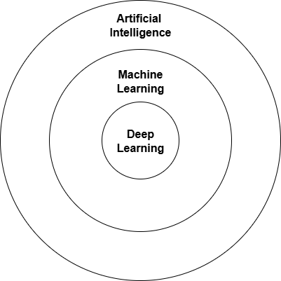

## Machine Learning
Discipline within Artificial Intelligence that teaches computers how to make predictions or decisions based on data.

[Machine Learning Playbook](../../../Downloads/Playbook-Executive-Briefing-Artificial-Intelligence.pdf)

## Regression
- Branch of machine learning focused on predicting continuous outcomes.

## Classification
- Branch of machine learning focused on predicting categorical outcomes.

## Clustering
- Branch of machine learning focused on grouping similar data points together without predefined labels.

## Association Rule Learning
- Branch of machine learning focused on discovering interesting relationships between variables in large datasets.

## Deep Learning
- Subset of machine learning that uses neural networks with many layers to analyze various factors of data.
- Complex Algorithms
- More computing resources required

## Shallow Learning
- Refers to traditional machine learning techniques that do not involve deep neural networks.