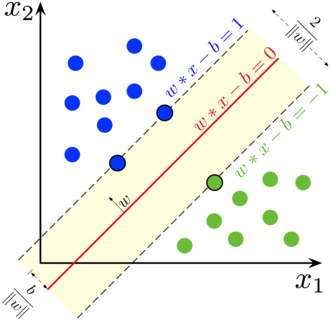
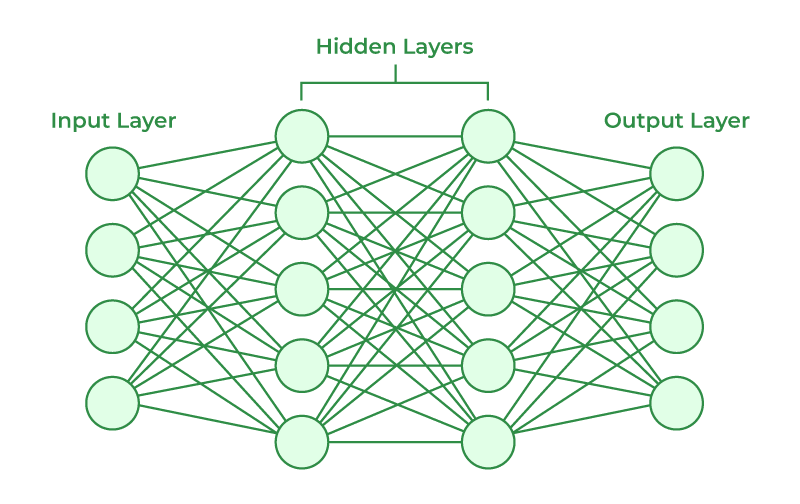

## Machine Learning
Discipline within Artificial Intelligence that teaches computers how to make predictions or decisions based on data.

[Machine Learning Playbook](../../../Downloads/Playbook-Executive-Briefing-Artificial-Intelligence.pdf)

# Supervised Learning
- Type of machine learning where the model is trained on labeled data.
- The model learns to map inputs to outputs based on the provided labels.
- Y = f(X) + ε where: Y is the output, X is the input, f is the function learned by the model, and ε is the error term.
- Input is called "features" and output is called "label".
    ## Regression
    - Branch of machine learning focused on predicting continuous outcomes.

    ## Classification
    - Branch of machine learning focused on predicting categorical outcomes.
    - Binary Classification - Classifying data into two distinct categories.
    - Multi-class Classification - Classifying data into more than two categories.
    - Support Vector Machines (SVM) - A supervised learning model that finds the hyperplane that best separates different classes in the feature space.
    

# Unsupervised Learning
- Type of machine learning where the model is trained on unlabeled data.
    ## Clustering
    - Branch of machine learning focused on grouping similar data points together without predefined labels.
    - Use cases include customer segmentation, anomaly detection, and image compression.

    ## Dimensionality Reduction
    - Branch of machine learning focused on reducing the number of features in a dataset while preserving its essential structure.
    - In supervised l;earning, one BIG challenge is to handle the number of features that the algorithm has to deal with.

# Reinforcement Learning
- Type of machine learning where an agent learns to make decisions by taking actions in an environment to maximize a reward signal.
- Perform complex objectives while performing multiple sequence of actions.

## Association Rule Learning
- Branch of machine learning focused on discovering interesting relationships between variables in large datasets.

## Deep Learning
- Subset of machine learning that uses neural networks with many layers to analyze various factors of data.
- Complex Algorithms
- More computing resources required

## Shallow Learning
- Refers to traditional machine learning techniques that do not involve deep neural networks.

## Artificial Neural Networks (ANN)

- Input data is divided into features.
- Each feature is assigned a weight.
- The weighted sum of the features is passed through an activation function to produce an output.
- The model is trained by adjusting the weights based on the error between the predicted output and the actual output.

## Deep Learning Architectures
### Recurrent Neural Networks (RNN)
- Type of neural network designed to handle sequential data.
- Processes input data sequentially, meaning it takes into account the order of the data points. Slowly adjusting the internal state based on the input sequence.

### Convolutional Neural Networks (CNN)
- Type of neural network designed to process grid-like data, such as images.

### Transformer
- Process input data in parallel rather than sequentially.
- Leverage GPUs for faster training and inference.
- Attention Mechanism - Allows the model to focus on different parts of the input sequence when making predictions.