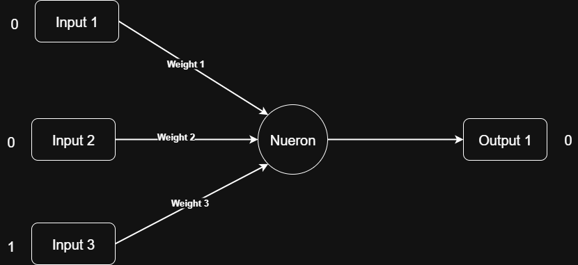
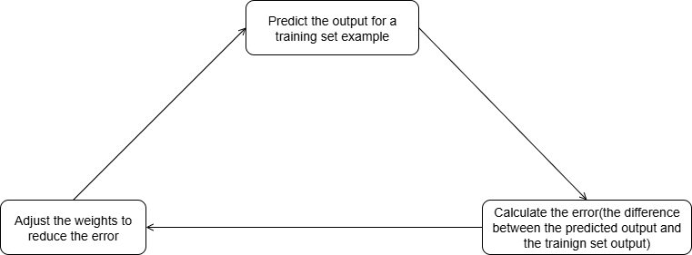

# Neural Network

The human brain contains hundreds of billions of neurons, which are connected to each other by synapses. These synapses are used to transmit signals between neurons.

Artificial Neural Networks (ANNs) are inspired by the structure and function of the human brain. They consist of interconnected nodes (neurons) that process information in a way similar to biological neural networks.

---

## Problem

| Example   | Input       | Output |
|-----------|-------------|--------|
| Example 1 | 0, 0, 1     | 0      |
| Example 2 | 1, 1, 1     | 1      |
| Example 3 | 1, 0, 1     | 1      |
| Example 4 | 0, 1, 1     | 0      |
|           |             |        |
| New Situation | 1, 0, 0 | ?      |

---

## Designing Our Architecture

We have **3 inputs** and **1 output**.  
Although we could use a single neuron to solve this problem, we will instead use a neural network with 3 inputs and 1 output to demonstrate the concept.



---

## Weights

In a neural network, we assign **weights** to each connection going into a neuron.

- If the weight is **greater than 1**, it magnifies the strength of the signal.  
- If the weight is **between 0 and 1**, it reduces the strength of the signal.  
- If the weight is **negative**, it inverts the signal, which inhibits the neuron from firing.

**Formula:**

```
Incoming Signal = (Input1 * Weight1) + (Input2 * Weight2) + (Input3 * Weight3)
```

It can also be represented as:  
  
or  


---

## Activation Function

The activation function takes the incoming signal and produces an output signal.  
It determines whether a neuron should be activated. The output is passed to the next layer of neurons.

### 1. Sigmoid Function
Euler's number (*e*) is approximately **2.71828**. The sigmoid function is defined as:

```
Sigmoid(x) = 1 / (1 + e^(-x))
```

Where **x** is the incoming signal.

It looks like this:  


The sigmoid function squashes the input to a value between **0** and **1**.  
It is often used in the **output layer** of a neural network for **binary classification** problems.

**Neuron Output Formula:**
```
Neuron Output = 1 / (1 + e^(-Neuron Input))
```

---

## Training Process

Initially, we assign random values to our weights.

**Example:**
```
weight1 = 0.3
weight2 = 0.8
weight3 = -0.6
```

Random initialization is important because if all weights are zero, the network will fail to learn.



**Steps in the Training Process:**

1. **Predict Output** – Using the current weights, calculate the network’s output for a given input.  
2. **Calculate Error** – Compare the predicted output with the actual output and compute the error:  
   ```
   Error = Actual Output - Predicted Output
   ```
3. **Adjust Weights** – Use the **backpropagation algorithm** to update weights. Backpropagation computes the gradient of the error with respect to each weight and adjusts weights in the opposite direction of the gradient.

---

## Error Cost Function

A common way to calculate error is:

```math
    \text{Error Cost Function} = \sum\left(\frac{1}{2} \times (CorrectOutput - PredictedOutput)^2\right)
```

This measures the total prediction error. The goal is to minimize this difference.

---

## Adjusting Weights

The most common way to adjust weights is **Gradient Descent**.

- **Gradient** = slope of the error cost function.
- In mathematics, **differentiation** finds the slope at a given point.
- In neural networks, differentiation gives the slope of the error cost function with respect to each weight.

**Formula:**
```
Weight Adjustment = - Input × ErrorInOutput × SigmoidGradient
```

Where:  
```
SigmoidGradient = NeuronOutput × (1 - NeuronOutput)
```

---

## CNN - Convolutional Nueral Networks
## RNN - Recurrent Nueral Networks


## References

- [Google Colab Notebook](https://colab.research.google.com/drive/1-lbGiUqYh43GlXt0-WlFOgVqIMouah9L?usp=sharing)  
- [MLPClassifier Documentation](https://scikit-learn.org/stable/modules/generated/sklearn.neural_network.MLPClassifier.html)

---

## Multilayer Perceptron Classifier (MLPClassifier)

### Activation Functions
- **Identity** – `f(x) = x` (no transformation)  
- **Logistic (Sigmoid)** – `f(x) = 1 / (1 + exp(-x))` (for binary classification)  
- **Hyperbolic Tangent** – `f(x) = tanh(x)`  
- **ReLU (Rectified Linear Unit)** – `f(x) = max(0, x)`  
- **Softmax** – Converts outputs to probabilities for **multi-class classification**.

### Solvers (Optimization Algorithms)
- **Adam** – Stochastic gradient descent with adaptive estimation of first & second-order moments.  
- **SGD** – Stochastic Gradient Descent with a fixed learning rate.  
- **LBFGS** – Optimization algorithm using Hessian approximation.

### Learning Rate Options
- **Constant** – Fixed learning rate.  
- **Invscaling** – Decreases learning rate at each iteration using inverse scaling.  
- **Adaptive** – Adjusts learning rate based on training progress.

### Batch Size
Number of samples per batch in stochastic optimization (default: **200**).

### Hidden Layer Sizes
A tuple defining the number of neurons per hidden layer:  
- `(100,)` → One hidden layer with 100 neurons.  
- `(100, 50)` → Two hidden layers with 100 and 50 neurons.
